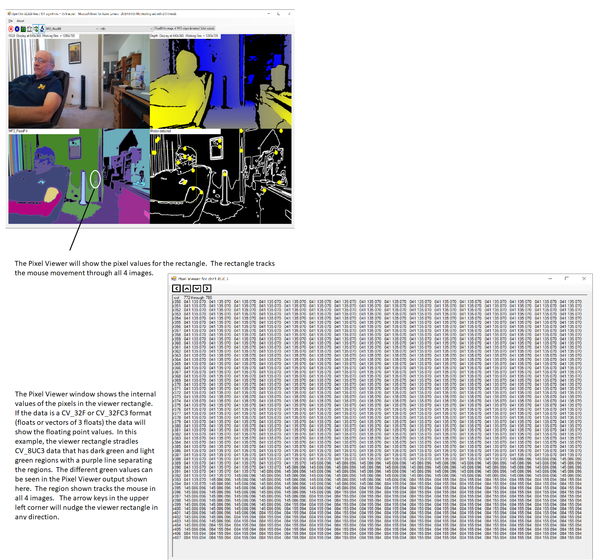

\-----------------------------------------------------------------------------------------------

NOTE: OpenCVB has evolved away from implementing algorithms in multiple languages because AI has made it convenient to translate the algorithms into any language. While C\#, C++, and Python examples were included in earlier versions of OpenCVB, new algorithms are now exclusively written in VB.Net. It is the most convenient to type in and the simplest to read. Translate to any language using any available ChatBot.

\-----------------------------------------------------------------------------------------------

# Introduction to OpenCVB

There is no better documentation of an algorithm than a working example, especially in computer vision where the output is often self-explanatory. Imagine having 1000’s of OpenCV examples in a single app, where each algorithm is less than a page of code and written in a familiar language. Each algorithm is designed to be reused in other algorithms, so variations can be easily built. Moreover, each algorithm is free of any baggage from a user interface or environment.

A full installation can take about 30-50 minutes using the 1-step “Update_All.bat” file discussed in the “Installation” section below. But there is no obligation to install needed libraries just to read the code for an algorithm. Open the OpenCVB.sln file after downloading and inspect the code. Each algorithm is presented a standardized input of all the data from any of the RGBD cameras listed below.

However, a full installation is recommended. An algorithm may fit in one page of code and reading is one way to review the code but understanding the algorithms is a lot faster and easier when the output is visualized by running it. The output is often self-documenting or a natural representation of the algorithm’s intent.

The basic layout of OpenCVB is shown below. Any of the algorithms can be selected from the first combo box at the top of the form. The second combo box is used to select an algorithm group. The default grouping is “\< All \>”. There is a group for each algorithm. Select any group and the first combo box will contain all the algorithms that call that algorithm.

# OpenCVB Layout

**OpenCVB Layout:** *A typical layout of the OpenCVB application is shown above. The upper left contains the RGB camera output with lines for gravity and the horizon. The upper right contains several different displays of the depth information – see “Global Options”. Here, left/right correlation coefficients are shown – the brighter the red, the higher the correlation. The algorithm outputs are in the bottom left and right. This algorithm (Segmented Linear Regression or SLR_Trends) has only one output in the lower left. Labels above all images are controlled by the algorithm.*

**OpenCVB ToolBar:** *The first combo box selects the algorithm – here “SLR_Trends” while the second combo box selects the group of algorithms – here “(1832) \< All \>” which controls what algorithms are available in the first combo box. The “(1832) \< All \>” group includes all algorithms. The number in the group describes how many algorithms are in that group.*

**Run and Pause:** *The button will pause the algorithm. Algorithms start automatically but may be restarted if paused.*

**OpenCVB Settings:** *The button will open the settings for the OpenCVB app.*

**Regression Testing:** *The  button will start and stop the overnight testing of each algorithm at various resolutions.*

**Magnify:** *The  button will magnify the selected portion of the image. To select a portion of an image just click anywhere in the image and hold while dragging the mouse to create the “DrawRect”. Then click the magnify button to open a window with the 5X magnification of the drawn rectangle.*

**Pixel Viewer:** *The  button will display a separate form showing the integer or float values for each pixel. Any of the 4 images may be selected. The pixel viewer is aware of the image type so if the image is 32-bit float, it will show the floating point values.*

**Recently Used Algorithms:** *The button is a pulldown that displays the last 50 algorithms that were run. The “Test All” button (“Regression Testing”) does NOT update the recent list. The “Recent” list is updated only when there is a change in the algorithm combo box.*

**A-Z Button:** *The button displays a list of all the algorithm groups. Click on any entry to open the first algorithm in that category. Using “A-Z” is faster than using the combo box with the complete list of algorithms.*

**Algorithm Description:** *Every algorithm provides a simple description of the algorithm. It is always at the right edge of the main form and may be multiple lines.*

**OpenCVB Main Form Caption:** *The caption for the main OpenCVB form requires some further explanation. The number of lines of code in OpenCVB is shown along with the number of algorithms. The average number of lines per algorithm is computed from the count. Also, the name of the current camera is shown next to the frame rate for the camera and the frame rate for the algorithm. The camera is in its own thread so its frame rate may be higher than the rate at which the frames are processed in the algorithm thread.*

# The Objective

The objective is to solve many small vision problems and do so in a way that enables any of the solutions to be reused. The result is a toolkit for solving incrementally bigger problems. The hypothesis behind this approach is that human vision is not computationally intensive but is built on many, usually trivial algorithms working together. Computer vision problems are not huge; there are just an unmanageable number of them. A single app that allows algorithms to be easily created and combined is the primary motivation for the OpenCVB application.

OpenCVB is targeted only for RGBD cameras that produce depth and color and have an IMU to detect gravity and motion. These newer cameras have prompted a review of existing vision algorithms to see how they can be improved if depth and gravity are known. To enable revisiting existing algorithms, this software provides a single application that can run OpenCV algorithms on any of the cameras listed below.

Supporting multiple cameras with the same application adds a further level of generalization. Plus, adding more cameras is a multiplier. If there are over 2000 algorithms and 6 supported cameras, testing all of them requires 12,000 tests which is the reason for the integrated regression testing. If the different resolutions are added, the multiplier and the need for regression testing is even greater.

There are many computer vision examples on the web but too often something is missing, or setup is difficult. OpenCVB is designed to collect algorithms into a single application and guarantee that each will build and run. In addition, software automation and aids simplify the process of adding variants and experiments. OpenCVB is more work to install than a typical application but it has been reduced to a few steps using standard (and free) packages.

The languages used are those often found in OpenCV projects - C++, C\#, and Python - but also include VB.Net, hence the name OpenCVB. OpenCVB also provides access to multiple libraries - OpenCV, OpenCVSharp, OpenGL, Open3D, MatPlotLib, Dlib, NumPy, NAudio, and OpenMP. And OpenCVB enables many possible image representations - 3D, bitmaps, “ply” format, plots, bar charts, spreadsheets, and text. Examples of all these representations are included in OpenCVB.

Making these languages and libraries available while using the same infrastructure shaped a standardized class for OpenCVB algorithms. Implementing hundreds of examples with the same reusable class structure has confirmed the approach is useful. The result is a starting point to add depth and explore its usage with OpenCV.

There are other objectives. Convolutions combined with neural nets (CNN’s) are a successful approach to computer vision. CNN’s detect differences within a set of images and identify content surprisingly well. OpenCVB is a pathway to search for more and better features than convolutions, features that are measured, objective, and essential. Depth, infrared, gravity, and camera motion are the kind of objective features that can enhance almost any imaging algorithm.

# What If?

And what if all cameras had depth and an IMU? Making this assumption explains why only a few cameras from StereoLabs, Intel, Orbbec, Luxonis, and others are currently supported. The data from each camera – color, depth, point cloud, and IMU data - is presented to all the algorithms in the same standardized format. More cameras with depth are expected to arrive and integration with OpenCVB is likely to follow. OpenCVB is an opportunity to experiment with the features of these cameras and apply the same algorithm to all of them.

The algorithms are notably short, almost always less than a page of code, labelled reasonably well, easily searched, and easily combined, while often providing links in the code to online documentation and versions for other platforms. Many existing algorithms on the web have environmental considerations that can obscure the meaning or context of an algorithm and complicate downloading. All the algorithms here contain just the algorithm separate from any camera dependencies and will work with each of the supported cameras. Isolating just the algorithm functionality enables easy adaptation to other environments or platforms.

# Before You Start

Here are the pre-install requirements:

-   Windows 10 or Windows 11
-   Visual Studio Community Edition (free)
-   Any one of the following RGBD cameras:
    -   StereoLabs ZED2
    -   Intel RealSense D435i
    -   Intel RealSense D455 – the latest in the series of Intel RealSense cameras
    -   Luxonis Oak-D Pro or Oak-D Series 2. (Oak-D Lite will work but has no IMU.)
    -   Orbbec Gemini 335L and Gemini 335

All of the above cameras have an IMU (Inertial Measurement Unit) and all the cameras use USB-C to provide data to the host platform.

Download and install the following software. Each is free and easily downloaded for Windows 10:

-   Microsoft Visual Studio Community Edition
    -   Download: <https://visualstudio.microsoft.com/downloads/>
-   CMAKE 3.3 or later
    -   <https://cmake.org/download/>
-   Git and TortoiseGit
    -   <https://git-scm.com/downloads>
    -   <https://tortoisegit.org/> (Optional but convenient)

# Installation

Installation is not as simple as opening the OpenCVB.sln file but it is not much more than that.

-   Run the “Update_All.bat” script that comes with OpenCVB. It will download and run CMake for the needed libraries.
    -   The OpenCVB tree will occupy about 25Gb of disk space – plan accordingly. The process can take 30-50 minutes.
-   Download and install the OrbbecSDK proprietary binaries.
    -   https://github.com/orbbec/OrbbecSDK/releases
-   Open the OpenCVB.sln.
-   The “Update_All.bat” script can be used to update each component downloaded by OpenCVB:
    -   Remove **“\<OpenCVB Dir\>/OakD/Build”** to update the Oak-D camera support
    -   Remove **“\<OpenCVB Dir\>/librealsense”** to update the Realsense camera support
    -   Remove **“\<OpenCVB Dir\>/opencv”** to update both OpenCV and OpenCV contributions.
    -   Remove **“\<OpenCVB Dir\>/OrbbecSDK”** to update the latest Orbbec code.
    -   Use Visual Studio’s NuGet Package Manager for any other updates.

Why are there no official releases of OpenCVB? The repository is the release. The infrastructure is solid at this point (the exceptions are rare and transitory.) Any problems that arise are easily avoided because they will be confined to an algorithm. OpenCVB regression tests are continuously running so even individual algorithm problems will be apparent shortly. If any problem is encountered, download the latest and if it is still there, submit a pull request.

# Optionally Install Additional Cameras

Support for some optional cameras can be added.

-   For the StereoLabs ZED 2 and 2i cameras, install the StereoLabs SDK from
    -   [ZED SDK 4.1 with CUDA 12.0 - Download \| Stereolabs](https://download.stereolabs.com/zedsdk/4.1/cu121/win)
    -   NOTE: StereoLabs requires an NVIDIA card with CUDA.
-   For the Mynt Eye D 1000 camera, download the SDK from:
    -   <https://mynt-eye-d-sdk.readthedocs.io/en/latest/sdk/install_win_exe.html>
-   For the Orbbec 335L camera, the Update_All.bat file has downloaded and prepared the SDK but it is also necessary to download the proprietary binaries from here:
    -   https://github.com/orbbec/OrbbecSDK/releases

Edit “Cameras/CameraDefines.hpp” file to add OpenCVB’s support for StereoLabs Zed 2 or Mynt Eye D 1000 or Orbbec 335L support.

# Trouble-Shooting a New Install

Some typical problems with new installations:

-   If OpenCVB installation fails, there are simple ways to determine what needs to be changed.
    -   Each “Build” directory will have a .sln file. If any of the files below are missing, run CMake-gui to find out why:
        -   \<OpenCVB Dir\>/librealsense/Build/librealsense2.sln
        -   \<OpenCVB Dir\>/opencv/Build/opencv.sln
        -   \<OpenCVB Dir\>/OrbbecSDK/Build/ OrbbecSDK.sln
    -   Review the “Path” – both global and user values – and remove older or possibly unused Visual Studio installations.
    -   Figure out which component is failing:
        -   Review the output of the “Update_All.bat” run. Which component didn’t complete?
    -   Post any problems encountered. Install problems have the highest priority.
-   Camera Failure: check the camera installation by testing the examples provided by the camera vendor. Post if some configuration problems prevent the camera from working in OpenCVB.
-   Link problems: the C++ code in OpenCVB relies on PragmaLibs.h which is automatically created as part of the build process. “PragmaLibs.h” defines the names of the OpenCV libraries. It should be updated automatically with the current OpenCV version that is in use. If not, run the “VersionUpdates” application included in the OpenCVB tree. “VersionUpdates” will update the names of the files from OpenCV to be linked into the OpenCVB interfaces. Open the “PragmaLibs.h” file to see the current version of OpenCV that is expected to be present.

# Building New Experiments with Snippets

OpenCVB is a WinForms application and most of the algorithms were written using Microsoft's managed code, but C++ and Python examples are provided as well. New algorithms can be added using code snippets or the “Blue Plus” button ** in the user interface.

Code snippets are installed using the Tools/Code Snippets Manager menu entry. For both “Basic” and “CSharp” use the “Add” button to point to:

\<OpenCVB HomeDir\>/OpenCVB.snippets \>

To install OpenCVB’s snippets in Visual Studio:

-   Click the menu “Tools/Code Snippets Manager”.
-   Select “Basic” or “CSharp” as the Language.
-   Add the “\<OpenCVB Dir\>/OpenCVB.snippets” directory.
-   Access the code snippets with a right-click in the VB.Net or C\# code, select “Snippet/Insert Snippet” and select “OpenCVB.snippets”.

An alternate way to add projects is also available in OpenCVB. To see the complete list of algorithm types that can be added to OpenCVB, click on the “Blue Plus” button** in OpenCVB’s main toolbar. A dialog box will guide the selection of the type of algorithm to be added.

# Algorithm Groups

The complete list of algorithms may be grouped into smaller subsets to study some shared API. Algorithm subsets are selected by selecting an algorithm group through the Group ComboBox in the toolbar (indicated below.) The list of subsets is built from all the OpenCVB algorithm names and the OpenCV API’s. For instance, selecting “Threshold” in the Group ComboBox, will update the Algorithm ComboBox with all the algorithms that use the OpenCV “Threshold” API.

*In the image above, the Group ComboBox selects all algorithms in the “\<All but Python\> group. The Algorithm Combo Box shows the “SLR_Trends” algorithm, one of the algorithms in that group. When the Group ComboBox is set to “\<All\>”, the Algorithm Combo Box will contain all the algorithms in OpenCVB.*

The ability to create subsets from the hundreds of algorithms makes it easier to study examples of an OpenCV API or OpenCVB algorithm usage. In addition, the Group ComboBox has several higher-level groupings. For example, “\<Python\>” selects all Python algorithms. Or “\<OpenGL\>” selects only the OpenGL algorithms. The “\<All\>” entry in the Group ComboBox will restore the complete list of algorithms.

# Regression Testing All Experiments

Testing is integrated into OpenCVB. Clicking the  button runs all the algorithms on all the attached depth cameras on the system at all the supported resolutions. The duration of each test can be selected in the OpenCVB Options dialog – use the  button.

When using a subset of the algorithms, the “Test All” button will test only the algorithms in the subset. This can be useful when changing an algorithm that is reused by other OpenCVB algorithms. For instance, if the Edges_Sobel algorithm is changed, select “Edges_Sobel” in the Group ComboBox, then click the regression test button to visually review each algorithm using the updated Edges_Sobel.

One side benefit of the “Test All” feature is that it provides a way to visually review all the algorithms. When you can’t remember the name of an algorithm, use the subset feature to search for it. Any OpenCV API or OpenCVB algorithm name can be selected in the Group ComboBox.

# Why VB.Net?

VB.Net is not a language typically associated with computer vision algorithms. But the abundance of examples in OpenCVB suggests this may be an oversight. Even the seasoned developer should recognize what is obvious to the beginner: VB.Net is convenient to write and simple to read. Papers and articles on software often use pseudo-code to present an algorithm. In many respects, VB.Net code resembles pseudo-code except it is an actual working implementation of the algorithm.

VB.Net provides a full-featured language just like C\# with lambda functions and multi-threading except VB.Net uses only a subset of the special keys available on the keyboard. Contrasted with Python or C++, VB.Net need make no apologies for using real words instead of the keyboard hieroglyphics defined in Python or C++. VB.Net syntax is easier to recall and much easier to type in – the IntelliSense is better than any other language. VB.Net includes user interface tools that are flexible and complete (check boxes, radio buttons, sliders, TrueType fonts, and much more) - options missing from OpenCV's popular HighGUI library. (All existing HighGUI interfaces are still supported in OpenCVB.)

The main caution in using VB.Net is to treat it as a scripting language like Python. Most of the algorithms avoid pixel-by-pixel details – VB.Net can be detailed but it will be slower than optimized C++ and the VB.Net code in OpenCVB is in debug mode and not optimized. Usually, the VB.Net algorithm is doing most of the real work in optimized C++ through the OpenCVSharp interface. Most algorithms run reasonably fast even in Debug mode because the release version of OpenCVSharp is active when OpenCVB is in Debug mode.

Review Visual Studio’s “Build/Configuration Manager” see what portions of OpenCVB are optimized and which are in Debug mode. OpenCVB’s Debug version is the only version that is really used but the Release version is there as well.

Critics will point out that a Windows 10/11 app using VB.Net is not easily portable to other platforms. The entire OpenCVB application does not need to be ported to other platforms. Only individual algorithms are likely to be ported after they are debugged and polished. Most OpenCVB algorithms consist almost entirely of OpenCV APIs which are available everywhere. OpenCVB’s value lies in the ability to experiment and test an OpenCV algorithm. After the prototype is complete the algorithm can be transferred to a different platform or a different language using any of the AI translators.

# Camera Interface

All the camera code is organized with the “camera” class – see any of the Camera\<type\>.vb modules. There are no references to camera interfaces anywhere in the code except for the main user interface form –MainUI.vb. Isolating the camera support from the algorithms strips the algorithm code to just the essential OpenCV API’s needed.

# OpenGL Interface

There have been several attempts to provide OpenGL interfaces into managed code, but none is used here. OpenGL is simply run in a separate process. To accommodate running separately, a named-pipe moves the image data to the separate process and a memory-mapped file provides a control interface. The result is both robust and economical while making the OpenGL code independent of camera hardware specifics. The VB.Net code for the OpenGL interface is less than a page and does not require much memory or CPU usage.

# Visual Studio C++ Debugging

The Visual Studio projects can be configured to simultaneously debug both managed and unmanaged code seamlessly. The property “Enable Native Code Debugging” for the managed projects controls whether C\# or VB.Net code will step into C++ code while debugging.

However, leaving that property enabled all the time means that the OpenCVB will take a few seconds longer to start. The default is to leave the “Enable Native Code Debugging” property uncheckedso OpenCVB will load faster. Of course, if there is a problem in the C++ code that is best handled with a debug session, turn on the “Enable Native Code Debugging” property in the OpenCVB VB.Net project and invoke the algorithm requiring C++ debugging.

# StereoLabs Zed 2 and 2i Support

The StereoLabs Zed 2 cameras are now installed by default. To install the support manually:

-   Download the StereoLabs SDK from <https://www.stereolabs.com/developers/release/>
    -   Be sure you have an NVIDIA card – StereoLabs requires one for CUDA.
-   Edit the CameraDefines.hpp file to turn off Zed 2 camera support.
    -   Comment out the line that references Stereolabs.

The Zed 2 camera support is always installed in C:\\Program Files (x86)\\ZED SDK (regardless of the version) so no additional changes are required to the supporting C++ project.

# Mynt Eye D 1000 Support

The Mynt Eye D 1000 camera is supported but the support is turned off by default to simplify installation. To enable this support:

-   Download the Mynt SDK:
    -   <https://mynt-eye-d-sdk.readthedocs.io/en/latest/sdk/install_win_exe.html>
-   Edit the CameraDefines.hpp file to turn on the interface to the Zed 2 camera.

The Mynt D SDK creates a system environmental variable MYNTEYED_SDK_ROOT that allows the OpenCVB build to locate the Mynt D camera support no matter where it was installed. The Mynt cameras are no longer manufactured but are still available.

# TreeView

The TreeView shows the different layers of the algorithm and how it was built from other OpenCVB algorithms. Here is a simple algorithm tree view that shows how the “KNN_TrackEach” algorithm was built:

**Brick_FeatureLess:** *The tree above describes what algorithms are used by Brick_Featureless. Many of the existing entries are for “Task Algorithms” which are always run on every frame. Clicking on any of the entries will show the output of the selected algorithm in OpenCVB’s output window. This is extremely useful for understanding the various steps needed to build the output.*

*Play with this when running OpenCVB. It is a fun feature and helps increase understanding of the composition of increasingly complex algorithms.*

# Pixel Viewer

The Pixel Viewer allows detailed inspection of any of the 4 OpenCVB images. The dimensions of the rectangle depend on the window that the user has sized for the Pixel Viewer output – the larger the window, the larger the rectangle. Supported formats include CV_8U, CV_8UC3, CV_32F, and CV_32FC3 but more could be added if needed.

# How to Contribute

Adding more examples is the goal and that is the best way to contribute to this effort. There are plenty of examples to use as a model but there are also snippets that assist in the process of adding new examples (See “Building New Experiments with Snippets” above.) Any pull request that adds an algorithm will be welcome and quickly reviewed. Changing OpenCVB’s infrastructure – not the algorithms – is discouraged but always welcome. It is much more difficult to test infrastructure that can cripple all the algorithms. Adding support for a new camera is a notable exception. New cameras should have depth, point cloud support, and an IMU.

# Future Work

The plan is to continue adding more algorithms. There are numerous published algorithms on the web but there is also the task of combining different algorithms in OpenCVB. The current edition of the code contains examples of compound algorithms, and more will arrive in future releases. The code almost enforces reuse because any algorithm with sliders or check boxes encourages reuse rather than duplicate a similar set of sliders and check boxes. The options for combined algorithms are automatically cascaded for easy selection.

# Acknowledgements

The list of people who have made OpenCVB possible is long but starts with the OpenCV contributors – particularly Intel employees Gary Bradski, Victor Erukhimov, and Vadim Pisarevsky - and Intel’s decision to contribute the code to the open source community. Also, this code would not exist without OpenCVSharp’s managed code interface to OpenCV provided by user “shimat”. There is a further Intel contribution to this software in the form of RealSense cameras – low-cost 3D cameras for the maker community as well as robotics developers and others. RealSense developers Sterling Orsten and Leo Keselman were exceptionally helpful in educating this author. While others may disagree, there is no better platform for developing computer vision software than the one provided by Microsoft Visual Studio and VB.Net. And Microsoft’s Kinect for Azure camera is (was?) a valuable addition to the 3D camera effort as is CodeConverter.ai that has enabled improving the code through translating it to other languages. And lastly, Google’s contribution to this effort was invaluable. Thanks to all the computer vision developers who posted algorithms where Google could find them. From this author’s perspective, the work of all these individuals and organizations is like catnip and feathers to a kitten.

# MIT License

<https://opensource.org/licenses/mit-license.php> - explicit license statement
