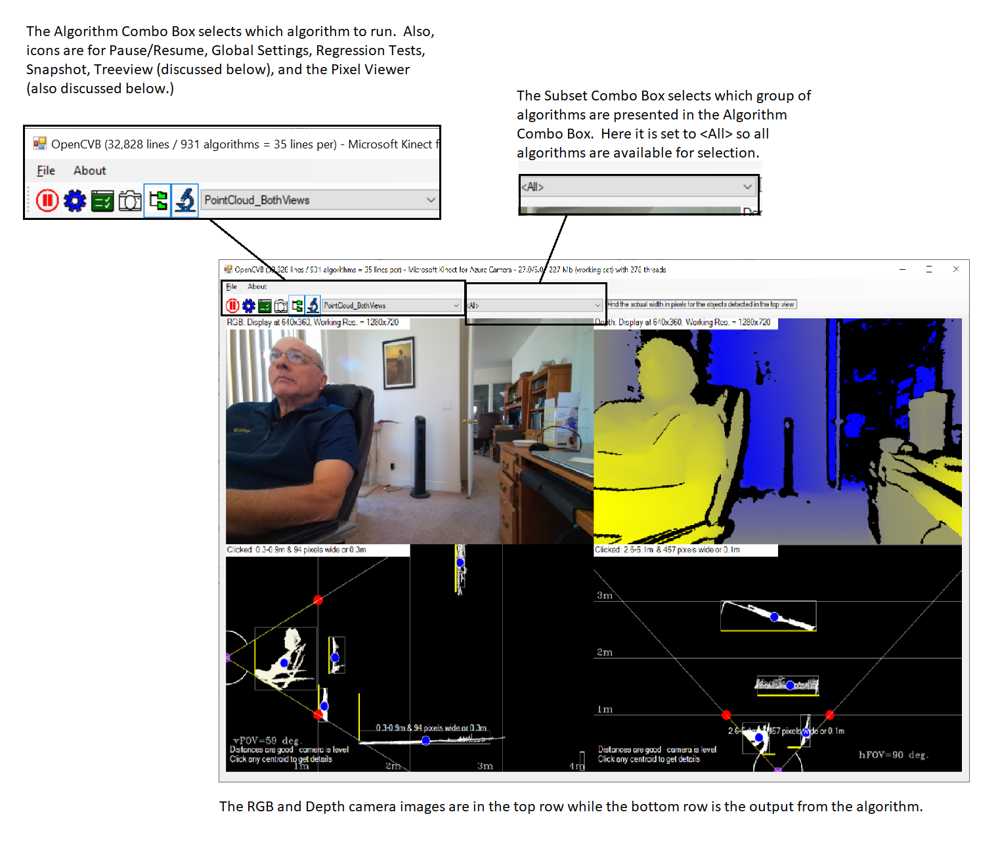
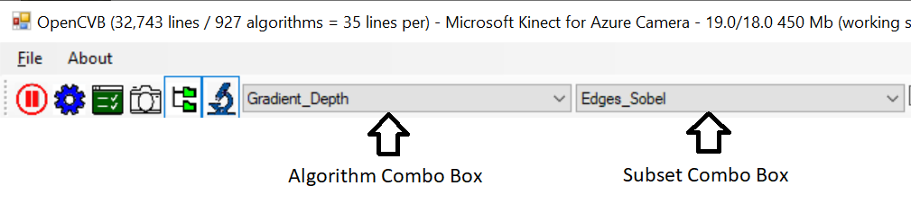
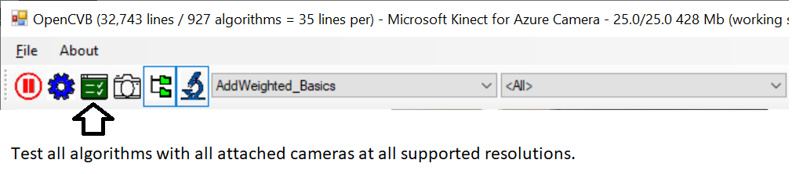
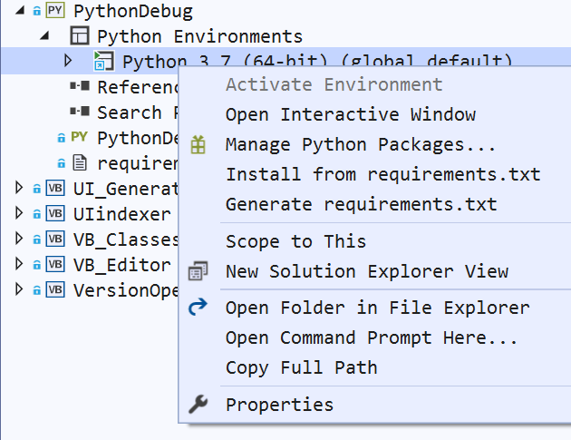
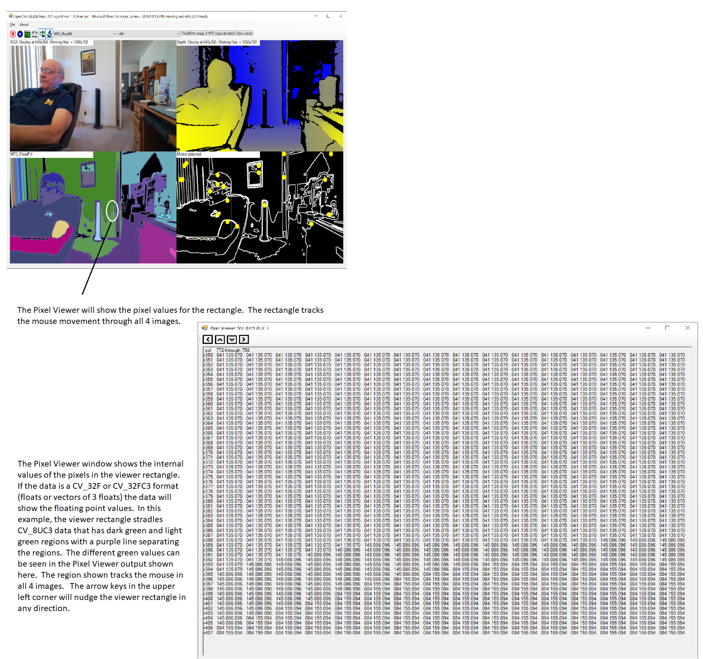

Recent Changes – May 2021
=========================

-   980 algorithms – almost all less than a page of code

-   Global variables introduced – settings that apply to all algorithms, line
    width, max depth, font size.

    -   Global variables are remembered across runs and can be reset to known
        working values

-   Fewer lines of code. Code size dropped about 4000 lines with more
    algorithms. Average algorithm: 31 lines.

-   Algorithms are now ranked by usage (“Reuse Rank”) and “Value Rank”, a graded
    estimate of algorithm value.

    -   Rankings are part of the group combo pulldown.

-   New Survey function to build images of all algorithm output to allow visual
    searches for desired algorithm.

-   Global setting for palette control

-   Improved regression testing – all algorithms are tested with each attached
    camera at all supported resolutions.

-   Navigation aids now available – back to previous algorithm, forward to next,
    and full history.

-   Image microscope works even when stream is paused, allowing more detailed
    image analysis.

-   Improved tree view to study how algorithm was constructed from other
    algorithms.

Introduction
============

There is no better documentation of an algorithm than a working example –
especially if the output is visual and self-explanatory. Now imagine over 900
OpenCV examples in a single app where each algorithm is less than a page of code
and in a familiar language. And each algorithm is *just the algorithm* without
baggage from a user interface or environment. Each algorithm is designed to be
reused in other algorithms so variations can be easily built.

A full installation can take about 30-50 minutes using the 1-step
“PrepareTree.bat” file discussed below. But there is no obligation to install
needed libraries just to read the code for an algorithm. Open the OpenCVB.sln
file after download and inspect the code in the C++, C\#, VB.Net or Python. Each
algorithm gets a standardized presentation of all the data from any of the RGBZ
cameras listed below.

However, a full installation is recommended. The algorithms may fit in one page
of code and reading the code is one way to review them but understanding the
algorithms is a lot faster and easier when the output is visualized by running
it. The output is often self-documenting or a natural representation of the
algorithm’s intent.

The basic layout of OpenCVB is shown below. Any of the algorithms can be
selected from the first combo box at the top of the form. The second combo box
is used to select an algorithm group. The default grouping is “\<All\>”. There
are a variety of other special groupings that select, for example, all Python or
all C++ algorithms.

The “Sample Results” section below provides numerous additional examples with
explanations.

Pre-Install Requirements
========================

Here are the requirements:

-   Windows 10

-   Visual Studio 2019 Community Edition (be sure to include Python support)

-   Any of the following RGBZ cameras:

    -   Microsoft Kinect for Azure

    -   Intel RealSense D435i

    -   StereoLabs ZED2

    -   Mynt Eye D 1000

    -   Intel RealSense D455 – the latest in the series of Intel RealSense
        cameras

    -   OpenCV Oak-D camera (still to come: IMU and point cloud support)

All of the above cameras have an IMU (Inertial Measurement Unit.) The Microsoft
Kinect for Azure has the best depth accuracy but requires more power and is not
as portable as the Intel cameras. All the cameras use USB-C to provide data to
the host platform. A brief comparison of each camera is provided in Addendum 1.

The Objective
=============

The objective is to solve many small computer vision problems and do so in a way
that enables any of the solutions to be reused. The result is a toolkit for
solving incrementally bigger problems. The philosophy behind this approach is
that human vision is not computationally intensive but is built on many almost
trivial algorithms working together. Computer vision problems are not huge;
there are just an unmanageable number of them. Combining many reusable
algorithms into a single app is the motivation for OpenCVB’s organization.

OpenCVB is targeting only cameras that produce depth and color and have an IMU
to detect gravity and motion. These newer cameras have prompted a review of
existing vision algorithms to see how they can be improved if depth and gravity
are known. To enable revisiting existing algorithms, this software provides a
single application that can run OpenCV algorithms on any of the cameras listed
above. Adding more cameras is a multiplier. If there are 1000 algorithms and 6
cameras, testing all of them requires 6000 tests which is the reason for the
integrated regression testing.

There are many computer vision examples on the web but too often something is
missing, or setup is difficult. OpenCVB is designed to collect algorithms into a
single application and guarantee that each will build and run. In addition,
software automation and aids simplify the process of adding variants and
experiments. OpenCVB is more work to install than a typical app but it has been
reduced to a few steps using standard (and free) packages.

The languages used are those often found in OpenCV projects - C++, C\#, and
Python - but also include VB.Net, hence the name OpenCVB. OpenCVB also provides
access to multiple libraries - OpenCV, OpenCVSharp, OpenGL, Open3D, MatPlotLib,
Dlib, NumPy, NAudio, and OpenMP. And OpenCVB enables all possible image
representations - 3D, bitmaps, ply format, plots, bar charts, spreadsheets, and
text. Examples of all of these representations are included in OpenCVB.

Making these languages and libraries available while using the same
infrastructure shaped a standardized class for OpenCVB algorithms. Implementing
hundreds of examples with the same reusable class structure has confirmed the
approach is useful. The result is a starting point to add depth and explore its
usage with OpenCV.

There are other objectives. Convolutions combined with neural nets (CNN’s) are a
successful approach to computer vision. CNN’s detect differences within a set of
images and identify content surprisingly well. OpenCVB is a pathway to search
for more and better features than convolutions, features that are measured,
objective, and essential. Depth, infrared, gravity, and camera motion are the
kind of objective features that can enhance almost any imaging algorithm.

And what if all cameras had depth and an IMU? Making this assumption explains
why only a few cameras from Intel, Microsoft, and others are currently
supported. The data from each camera – color, depth, point cloud, and IMU data -
is presented to all the algorithms in the same standardized format. More cameras
with depth are expected to arrive and integration with OpenCVB is likely to
follow. OpenCVB is an opportunity to experiment with the features of these
cameras and apply the same algorithm to all cameras.

The algorithms are notably short, almost always less than a page of code,
labelled reasonably well, easily searched, and easily combined, while often
providing links in the code to online documentation and versions for other
platforms. Many downloadable algorithms are encumbered by environmental
considerations that can obscure the meaning or context of an algorithm. All the
algorithms here contain just the algorithm separate from any camera dependencies
and will work with each of the supported cameras. Isolating just the algorithm
functionality enables easy adaptation to other environments or platforms.

Before You Start
================

You should be familiar with the following software. Each is free and easily
downloaded for Windows 10:

-   Microsoft Visual Studio 2019 Community Edition

    -   Download: <https://visualstudio.microsoft.com/downloads/>

    -   Be sure to install the latest Python that comes with Visual Studio

    -   Check that MSBuild is in the path. It is needed for the 1-step
        “PrepareTree.bat” install.

-   CMAKE 3.0 or later

    -   <https://cmake.org/download/>

-   TortoiseGit and Git

    -   <https://tortoisegit.org/>

    -   <https://git-scm.com/downloads>

Installation
============

Installation is not as simple as cloning the GitHub repository and then opening
the OpenCVB.sln file but it is not much more than just “PrepareTree.bat” and
then open and run the OpenCVB.sln file.

-   Run the “PrepareTree.bat” script that comes with OpenCVB. It will download
    and run CMake for needed libraries. After building it will occupy about 18Gb
    of disk space – plan accordingly. The process can take 30-50 minutes to
    download/configure/build on some systems.

-   Download the Kinect4Azure proprietary binaries:

    -   <https://github.com/microsoft/Azure-Kinect-Sensor-SDK/blob/develop/docs/usage.md>

-   Build and run OpenCVB.sln – set OpenCVB as the “Startup Project” (GitHub
    seems to forget the startup project.)

Optionally Install Additional Cameras
=====================================

Support for some optional cameras can be added.

-   For the StereoLabs ZED 2 camera (released Q1 2020), install the StereoLabs
    SDK from

    -   <https://www.stereolabs.com/>

-   For the Mynt Eye D 1000 camera, download the SDK from:

    -   <https://mynt-eye-d-sdk.readthedocs.io/en/latest/sdk/install_win_exe.html>

-   For OpenCV’s Oak-D camera, download the SDK from:

    -   [Python API — DepthAI Docs 0.3.0.0 documentation
        (luxonis.com)](https://docs.luxonis.com/en/latest/pages/api/#python-api)

Edit “Cameras/CameraDefines.hpp” file to add OpenCVB’s support for StereoLabs
Zed 2 or Mynt Eye D 1000 support. No changes are required for Oak-D but Oak-D
support is turned off because it is missing the IMU support from the vendor.

Trouble-Shooting New Install
============================

Some typical problems with new installations:

-   Camera Failure: check the camera installation by testing the examples
    provided by the camera vendor. Did the Kinect4Azure support get upgraded
    recently? Post if some configuration problems prevent the camera from
    working in OpenCVB.

-   Python Scripts Fail: Python setup has 2 parts – telling OpenCVB which Python
    to use and running the requirements.txt. There is a description below on how
    to set those up.

-   Link problems: the C++ code in OpenCVB relies on PragmaLibs.h which is
    automatically created as part of the build process. PragmaLibs.h defines the
    names of the OpenCV libraries. It should automatically be updated with the
    current OpenCV version that is in use. If not, run the “VersionOpenCV”
    application included in the OpenCVB.sln file.

-   If the installation of Visual Studio has not put MSBuild into the path, then
    it should be added. The usual location for it is:

    -   C:\\Program Files (x86)\\Microsoft Visual
        Studio\\2019\\Community\\MSBuild\\Current\\Bin

-   OpenCV, OpenCV-Contrib, LibRealSense2, Kinect4Azure libraries are all
    downloaded, configured, and built automatically as part of
    “PrepareTree.bat”. If the libraries are missing, open the .sln file in the
    respective Build directory for each and investigate further. The solution
    files are:

    -   \<OpenCVB Dir\>/Azure-Kinect-Sensor-SDK/Build/K4A.sln

    -   \<OpenCVB Dir\>/librealsense/Build/librealsense2.sln

    -   \<OpenCVB Dir\>/opencv/Build/opencv.sln

Building New Experiments With Snippets
======================================

OpenCVB is a WinForms application and most of the algorithms were written using
Microsoft's managed code but C++ and Python examples are provided as well.
Python examples don’t require a VB.Net wrapper. There are several VB.Net
examples that demonstrate how to move images to Python and get results back into
the OpenCVB user interface (see AddWeighted_PS.py as an example that is only a
few lines of code.)

For C++, C\#, and VB.Net writing a new experiment requires a new class to be
added in the “VB_Classes” project. OpenCVB will automatically detect the new
class and present it in the user interface. The code is self-aware in this
regard – the UI_Generator project is invoked in a pre-compile step for the
VB_Classes project.

Code “snippets” are provided to accelerate development of new VB.Net, OpenGL,
and C++ algorithms. To use any snippets, first install them in Visual Studio:

-   Click the menu “Tools/Code Snippets Manager”

-   Select “Basic” as the Language.

-   Add the “\<OpenCVB Home Directory\>/OpenCVB.snippets” directory.

-   Access the code snippets with a right-click in the VB.Net code, select
    “Snippet/Insert Snippet” and select “OpenCVB.snippets”.

-   Even C++ algorithms can use snippets, but each C++ algorithm has a VB.Net
    entry that includes both the C++ and the VB.Net code in the snippet. The C++
    portion is to be cut and pasted anywhere in OpenCVB’s “CPP_Classes” Visual
    Studio project.

Experimental Subsets
====================

The complete list of algorithms may be grouped into smaller subsets to study
some shared API. Algorithm subsets are selected through the Subset Combo Box in
the toolbar (indicated below.) The list of subsets is built from all the OpenCVB
algorithm names and all the OpenCV API’s referenced. For instance, selecting
“Threshold” in the Subset Combo Box, will update the Algorithm Combo Box with
all the algorithms that use the OpenCV “Threshold” API.

*In the image above, the Subset Combo Box selects all algorithms using the
“Edges_Sobel” algorithm. The Algorithm Combo Box shows the “Gradient_Depth”
algorithm, one of the algorithms that uses “Edges_Sobel”. When the Subset Combo
Box is set to “\<All\>”, the Algorithm Combo Box will contain all the algorithms
in OpenCVB.*

The ability to create subsets from the hundreds of algorithms makes it easier to
study examples of an OpenCV API or OpenCVB algorithm usage. In addition, the
Subset Combo Box has several higher-level groupings. For example, “\<Python\>”
selects all Python algorithms. Or “\<OpenGL\>” selects only the OpenGL
algorithms. The “\<All\>” entry in the Subset Combo Box will restore the
complete list of algorithms.

Regression Testing All Experiments
==================================

Testing is integrated into OpenCVB. Clicking the icon below runs through a
checklist of all the algorithms on all the attached depth cameras attached to
the system at all the supported resolutions. The duration of each test can be
selected in the Global Options dialog.

When using a subset of the algorithms, the “Test All” button will test only the
algorithms in the subset. This can be useful when changing an algorithm that is
reused frequently by other algorithms. For instance, if the Edges_Sobel
algorithm is changed, select “Edges_Sobel” in the Subset Combo Box, then click
the regression test button to visually review each algorithm using the updated
Edges_Sobel.

One side benefit of the “Test All” feature is that is provides a way to visually
review all the algorithms. When used in combination with the subset feature, it
can make it easier to search for a desired effect.

Why VB.Net?
===========

VB.Net is not a language associated with computer vision algorithms. But the
abundance of examples in OpenCVB suggests this may be an oversight. Even the
seasoned developer should recognize what is obvious to the beginner: VB.Net can
keep the code simple to read and write. Papers and articles on software often
use pseudo-code to present an algorithm. In many respects, VB.Net code resembles
pseudo-code except it is an actual working implementation of the algorithm.

VB.Net provides a full-featured language just like C\# with lambda functions and
multi-threading except VB.Net uses only a small subset of the keys available on
the keyboard. Contrasted with Python or C++, VB.Net need make no apologies for
using real words instead of the keyboard hieroglyphics defined in Python or C++.
VB.Net includes user interface tools that are flexible and complete (check
boxes, radio buttons, sliders, TrueType fonts, and much more) - options missing
from OpenCV's popular HighGUI library. (All existing HighGUI interfaces are
still supported in OpenCVB.)

The main caution in using VB.Net is to treat it as a scripting language like
Python. Most of the algorithms avoid pixel-by-pixel details – VB.Net can be
detailed but it will be slower than optimized C++. Usually, OpenCVB is doing
most of the real work in optimized C++ through the OpenCVSharp interface. Most
algorithms run reasonably fast even in Debug mode because the release version of
OpenCVSharp is active even when the solution is in Debug mode.

Critics will point out that a Windows 10 app using VB.Net is not easily portable
to other platforms but the entire OpenCVB application does not need to be ported
to other platforms. Only individual algorithms will need to be ported after they
are debugged and polished, Most OpenCVB algorithms consist almost entirely of
OpenCV APIs which are available everywhere. OpenCVB’s value lies in the ability
to experiment and finish an OpenCV algorithm before even starting a port to a
different platform.

Camera Interface
================

All the camera code is isolated in the “camera” class – see cameraRS2.vb,
cameraKinect.vb, cameraMynt.vb, cameraOakD, or cameraZed2.vb. There are no
references to camera interfaces anywhere else in the code. Isolating the camera
support from the algorithms strips the algorithm code to just the essential
OpenCV API’s needed.

For example, the Kinect for Azure camera support is isolated to the
cameraKinect.vb class and a supporting Kinect4Azure DLL that provides the
interface code to the Kinect for Azure libraries. Since there is likely to be
little interest in debugging the Kinect4Azure DLL, the Release version is used
even in the Debug configuration. If it is necessary to debug the camera
interface, set any Build Configuration entries to the Debug version. Using
Release versions naturally enables a higher framerate. As a result, the VB.Net
code – which is usually run in Debug mode - is almost as fast as the Release
configuration.

OpenGL Interface
================

There have been several attempts to provide OpenGL interfaces into managed code,
but none is used here. OpenGL is simply run in a separate process. To
accommodate running separately, a named-pipe moves the image data to the
separate process and a memory-mapped file provides a control interface. The
result is both robust and economical leaving the OpenGL C++ code independent of
camera hardware specifics. The VB.Net code for the OpenGL interface is less than
a page and does not require much memory or CPU usage. The OpenGL C++ code
provided with OpenCVB is customized for specific applications in a format that
should be familiar to OpenGL developers. There are several examples – displaying
RGB and Depth, 3D histograms, 3D drawing, and IMU usage. A code snippet (See
‘Building New Experiments With Snippets’ above) provides everything needed to
add a new OpenGL algorithm that will consume RGB and a point cloud.

NOTE: it is easy to forget to include any new OpenGL project in the Project
Dependencies. This can be confusing because the new project will not build
automatically when restarting. The OpenCVB Project Dependencies need to be
updated whenever a new OpenGL application is added to the OpenCVB solution. To
update dependencies, select “Project/Dependencies” from the Visual Studio menu
and make sure that the “OpenCVB” project depends on any new OpenGL projects.
This ensures that the new project will always be rebuilt when OpenCVB is
restarted.

Python Interface
================

OpenCV has numerous examples of Python scripts and Python is often used for
computer vision experiments. To add a new Python script for use with OpenCVB,
add a script in the Python directory of the VB_Classes project. It is convenient
for edits to add any script to the VB_Classes project but, more importantly, any
changes to a Python script will automatically show the new or renamed Python
files in the user interface. Python scripts don’t require a VB.Net wrapper –
just add them to the VB_Classes Project – and it will appear in the user
interface.

Python scripts can get a stream of images from the camera and return resulting
images. There are numerous examples of how to do this: see AddWeighted_PS.py or
Camshift_PS.py. The “_PS” suffix is an OpenCVB convention that indicates it is a
Python Streaming script that expects a stream of RGB and Depth images and will
return images. NOTE: The Python script name MUST end with “_PS.py” to stream
images to and from Python code. To see the list of all the Python Streaming
scripts, select the pre-defined subset group called “\<PyStream\>”.

Some care is required when first using an OpenCVB “PyStream” script. The
algorithm thread is writing to a pipe received by the Python script. However, if
the right version of Python is not set in OpenCVB or some of the packages are
missing, it will appear to hang the algorithm thread in OpenCVB. See the section
below on setting up Python packages.

Python Packages
===============

There are 2 parts to getting all the Python scripts to run: 1) set which
Python.exe to use in OpenCVB’s Global Settings; 2) installing all the needed
libraries in the “requirements.txt” file. Use the OpenCVB.sln project
“PythonDebug” to accomplish both of these efforts.

*In the “PythonDebug” project of OpenCVB, right-click on the Python version in
use and use the “Install from requirements.txt” and “Copy Full Path” to
respectively install libraries and set the active Python in OpenCVB*

Click on “Copy Full Path” above to paste the name of the Python.exe to use in
OpenCVB’s Global Settings. Next, use the “Install from requirements.txt” option
to install all the libraries imported by the Python scripts that come with
OpenCVB. Use the “Generate requirements.txt” to install libraries for new Python
scripts that are added. It may be necessary to restart Visual Studio for the
changes to come into effect.

Python Debugging
================

Python scripts are run in a separate address space when invoked by OpenCVB just
like the OpenGL. Visual Studio’s Python debugging environment is not available
directly when running OpenCVB. When a Python script fails in OpenCVB, it will
just disappear but it may be debugged in the OpenCVB solution by setting the
PythonDebug project as the Startup Project in Visual Studio. Here are the steps
to debug Python:

-   In OpenCVB, set the startup project as “PythonDebug”

-   Paste the failing Python script into PythonDebug.py

-   Run and debug the Python script

When tested in the PythonDebug project, the Python script will run in the same
environment as if it were invoked from OpenCVB except the Python debugger will
be active and single-stepping through the script and reading the error messages
will be possible.

All OpenCVB Python scripts can be debugged with the PythonDebug project
including those that stream data from OpenCVB. For Python scripts using
“PyStream”, the startup process of OpenCVB is reversed and the OpenCVB
executable is invoked automatically from Python and run in a separate address
space. Camera images from OpenCVB are then be streamed to the Python script
running in the Python debugger.

Visual Studio C++ Debugging
===========================

The Visual Studio projects can be configured to simultaneously debug both
managed and unmanaged code seamlessly. The property “Enable Native Code
Debugging” for the managed projects controls whether C\# or VB.Net code will
step into C++ code while debugging. However, leaving that property enabled all
the time means that the OpenCVB will take longer to start – approximately 5
seconds vs. 3 seconds on a higher-end system. The default is to leave the
“Enable Native Code Debugging” property off so OpenCVB will load faster. Of
course, if there is a problem in the C++ code that is best handled with a debug
session, turn on the “Enable Native Code Debugging” property in the OpenCVB
VB.Net project and invoke the algorithm requiring C++ debugging.

Record and Playback
===================

The ability to record and playback is provided with OpenCVB – see the algorithms
labeled “Replay_Record” and “Replay_Play”. RGB, Depth, point cloud, and IMU data
are written to the recording file. Any algorithm that normally runs with the
live camera input and IMU data can be run with recorded data. Use the “Subset
Combo Box” to select the option: “\<All using recorded data\>”. Running the
regression tests with that setting will run all the algorithms with recorded
data instead of a live camera feed.

StereoLabs Zed 2 Support
========================

The StereoLabs Zed 2 camera is supported but the support is turned off by
default to simplify installation. To enable this support:

-   Download the StereoLabs SDK from
    <https://www.stereolabs.com/developers/release/>

-   Edit the CameraDefines.hpp file to turn on the interface to the Zed 2
    camera.

The Zed 2 camera support is always installed in C:\\Program Files (x86)\\ZED SDK
(regardless of the version) so no additional changes are required to the
supporting C++ project.

Mynt Eye D 1000 Support
=======================

The Mynt Eye D 1000 camera is supported but the support is turned off by default
to simplify installation. To enable this support:

-   Download the Mynt SDK from
    <https://mynt-eye-d-sdk.readthedocs.io/en/latest/sdk/install_win_exe.html>

-   Edit the CameraDefines.hpp file to turn on the interface to the Zed 2
    camera.

The Mynt D SDK creates a system environmental variable MYNTEYED_SDK_ROOT that
allows the OpenCVB build to locate the Mynt D camera support no matter where it
was installed.

Tree View
=========

The tree view shows how an algorithm was built using the other OpenCVB
algorithms. Here is a simple algorithm tree view that shows how the Benford_JPEG
algorithm was built:

The Benford_JPEG algorithm applies the “Benford_Basics” algorithm to a JPEG
image data. The “Benford_Basics” algorithm builds a histogram. The histogram is
then displayed using OpenCV’s “AddWeighted_Basics” API and a histogram plot
algorithm called “Plot_Histogram”.

Note the pair of radio buttons below the tree view. The tree view is “live” in
the sense that clicking on any entry in the view will show one of 2 different
outputs in the main OpenCVB form: 1) the output of the clicked algorithm’s
“standalone” run; or 2) the output of the currently running algorithm. The
objective is to show and understand the intermediate stages of compound
algorithms while running. All output will show up in OpenCVB’s main form in the
bottom 2 images. Play with this when running OpenCVB. It is a fun feature and
helps understand the composition of the increasingly complex algorithms.

Pixel Viewer
============

The Pixel Viewer allows detailed inspection of any of the 4 OpenCVB images. The
dimensions of the rectangle depend on the window that the user has sized for the
Pixel Viewer output – the larger the window, the larger the rectangle. Supported
formats include CV_8U, CV_8UC3, CV_32F, and CV_32FC3 but more could be added if
needed.

Continuous Release
==================

Evolution would have been easier for Darwin to discover if nature had provided
versioning. Software applications always have a version identifier and OpenCVB
is no different. Every effort is made to make sure that the released version is
working but if not, the repository version is the one getting all the testing.
Test with the repository version before posting with an issue. OpenCVB is a
small project and only repository version is really maintained. If there is a
problem with a released version, it is a good idea to just download the latest
repository and test again.

How to Contribute
=================

Adding more examples is the goal and that is the best way to contribute to this
effort. There are plenty of examples to use as a model but there are also
snippets that assist in the process of adding new examples (See “Building New
Experiments with Snippets” above.) Any pull request that adds an algorithm will
be welcome and quickly reviewed. Changing OpenCVB’s infrastructure – not the
algorithms – is discouraged but always welcome. It is much more difficult to
test infrastructure that can cripple all the algorithms. Adding support for a
new camera is a notable exception. New cameras should have depth, point cloud
support, and an IMU.

Sample Results
==============

The following images are a preview of some algorithms’ output.

In the OpenCVB user interface, the top left image is the RGB and top right is
depth. Algorithm results are in the bottom left and right or additional OpenGL,
Python, or HighGUI windows.

*The MSER (Maximally Stable Extremal Regions) algorithm identifies regions which
look like objects. The lower right image shows all the objects identified – with
all the duplicates and small regions. The lower left image shows the objects
identified after consolidating the overlapping rectangles and filtering for the
smaller regions.*

*The bottom left is a side-view of the depth data that has been rotated using
the IMU gravity vector. The rotation facilitates finding the 2 horizontal yellow
lines in the bottom left image that identify the floor and ceiling in the image.
If the floor or ceiling is not visible, the yellow lines are not shown. The
bottom right image is the same side-view of the depth data before it was rotated
with the IMU gravity vector.*

*The bottom left highlights the floor that has been determined from the depth.
The bottom right image shows side view with the line detector output in red. The
yellow bar is the consolidation of all the lines that outline the floor. The
white in the bottom left is the plane the yellow bar depicts projected into the
image coordinates.*

*The bottom left is a top-down view of the point cloud data for an Intel D455
camera while the bottom right is a side view of the same point cloud. The red
lines indicate where walls were detected. A slider controls the expected minimum
length of a detected wall. The images are actually histograms of point cloud
data after aligning the point cloud with gravity from the IMU on the D455
camera.*

*OpenGL has an infinite number of ways to view a point cloud but visualizing top
down and side views are the most satisfying complements to the image view. The
“PointCloud_Backproject” algorithm uses the IMU to produced both a top down view
and a side view. Clicking on an object will back project that object into the
color image in the lower left corner. A mask for the object is also shown. The
aspect ratio of both top and side views is 1:1 to provide realistic dimensions
and linear edges. The camera is identified with a red dot.*

*Benford’s Law is an interesting empirical hypothesis. The plot above is
actually 2 plots – a count of the leading digits pulled from a compressed image
combined with a plot of the expected distribution of those leading digits
derived from Benford’s Law. The values are so close that you cannot see the
difference. The code contains some links explaining Benford’s Law and examples
of when it works and when it does not.*

*The top down view – after thresholding - is a slice through the vertical
objects in the field of view. Each object can be isolated with a floodfill to
find size and distance.*

*A genetic drawing experiment that translates any image or camera screen grab
into a painting. The algorithm randomly alters DNA sequences describing brush
strokes.*

*Histogram Valleys are used to create clusters in depth data. The bottom left is
the histogram showing the different clusters. The bottom right is the
back-projection of the different clusters into the depth image using the same
colors as the histogram.*

*Using the histogram to create clusters (see previous example ‘Histogram
Valleys’) allows an algorithm to segment an entire image (see lower right
image), creating blobs that can be measured and tracked. The black segments have
no depth. The number of blobs can be controlled with a lower limit on the size
of the blob.*

*The IMU timestamp provides clues to the relationship between the IMU capture
and the image capture (the devices are on different clocks.) The image capture
triggers an interrupt but how long ago did the IMU capture the pose data or
Gyro/Acceleration? The plot in the lower right shows the actual frame durations
for the IMU and host interrupts following an image capture. The IMU and host
interrupt frame times are used to estimate the delay from the IMU capture to the
image capture. The blue dots are the actual IMU capture frame times, the green
is the host image capture frame time, and the red is the estimated delay from
the IMU capture to the image capture. The white row shows the IMU frame time
with the highest occurrence and is used as a boundary between lost IMU captures
(below the white line) and correctly sequenced IMU captures (at or above the
white line).*

*Here the MeanShift algorithm is used to track the 4 largest blobs in the image.
The lower left image shows the objects tracked by the algorithm while the lower
right shows the different histograms used to identify the object to track. The
histogram is for the hue portion of the HSV format of the image.*

*KAZE feature detection algorithm matching points on the left and right infrared
images from the Intel RealSense 3D camera.*

*The features detected by the FAST (Features from Accelerated Segment Test)
algorithm are shown with 2 different FAST options.*

*This is a combination of 4 variations of binarization and their corresponding
histograms. It demonstrates the use of the Mat_4to1 class to get 4 images in
each of the result images.*

*A Kalman filter is used here to follow the mouse. The actual mouse movement is
in red while the output of the Kalman filter is in white.*

*Compare the original color and depth images with the image right below it to
see the impact of an edge-preserving filter applied to both.*

*The bottom images are the output of a multi-threaded Hough lines algorithm that
identifies featureless RGB surfaces (shown as white in the lower right image).
The blue color in the lower right image is meant to highlight depth shadow where
no depth data is available.*

*The MeanShift algorithm output (lower left) is used here to find what is likely
to be the face – the highest point of the nearest depth fields (shown in a box
in the lower right.)*

*Algorithms may optionally work on only a selected region. Here the oil paint
effect is applied only to the region selected by drawing a rectangle on the
output image (lower left.) The lower right image is an intermediate stage with
only edges. All algorithms may review the pixel details at any location with the
pixel viewer icon in the toolbar (the Microscope icon.)*

*The OpenGL window is controlled from the VB.Net user interface but is run in a
separate address space. The OpenGL axes are represented in this image as well.
In the lower left background are some of the sliders used to control the OpenGL
interface – Point Size, FOV, yaw, pitch, roll.*

*This dnn Caffe example in VB.Net is a reinterpretation of the C++ sample
program distributed with the Intel librealsense library. The application is
meant to detect and highlight different objects shown in the yellow box (lower
right). The algorithm requires square input (shown centered in the lower left
image.)*

*This example of a compound class shows an image that has been motion-blurred
(lower left) and then de-blurred in the lower right. The options for the motion
blur and de-blur are also shown.*

*The Expectation Maximization algorithm learns the different clusters and then
predicts the boundaries of those clusters. The lower left image defines the
different clusters (each with a different color) and the lower right fills in
the maximized regions for each cluster. The RGB and Depth images are not used in
this example.*

*In this example of multi-threaded simulated annealing, the lower right image
shows 4 annealing solutions - the 2 best solutions with 2 worst solutions. The
log in the bottom left shows each thread getting different energy levels,
confirming that each is independently searching the solution space. The example
was taken directly from the OpenCV examples but was multi-threaded on an Intel
Core i9 18-core (36 thread) processor here*.

*First, two estimated triangles are created to surround two sets of random
points. Then an affine transform is computed that converts one triangle to the
other. The matrix of the computed affine transform is shown of the lower right
image. The RGB and depth images are not used for this algorithm.*

*First, a randomly oriented rectangle is created. Then a transformation matrix
is computed to change the shape and orientation of the color image to the new
perspective. The matrix of the computed affine transformation is shown in the
lower right image.*

*The histograms displayed in OpenCVB have an option to use Kalman filtering to
smooth the presentation of the bar graph (lower right.) A check box (below the
bar graph) allows alternating between a Kalman-smoothed and real-time bar graph.
The bar colors show a progression of dark to light to link the color of the
underlying grayscale pixel into the bar graph. There is also an option to use
different transition matrices in the Kalman filter.*

*This example shows the Plot_Basics class which will plot XY values. The bottom
left image shows the mean values for red, green, and blue in the color image
smoothed using Kalman prediction while the bottom right shows the real-time
values.*

*In the OpenCV distribution there is a bio-inspired model of the human retina.
The objective is to enhance the range of colors present in an image. In this
example the “useLogSampling” is enabled and emphasizes colors (bottom left) and
motion (bottom right).*

*Applying the bio-inspired enhancements, the high-dynamic range image is shown
in the bottom left while the motion-enhanced image is shown in the bottom right.
The monitor on the desk that appears black in the image in the top left has much
more detail in the bottom left image which shows the reflection that would
likely be visible to the human retina.*

*In this Python example taken from the OpenCV distribution, the various
positions of an etalon (not shown) are visualized in a 3D matplotlib control.
See the “Camera_calibration_show_extrinsics.py” algorithm.*

*In this multi-threaded version of the Gabor filter, the bottom left image is
the Gabor result while the bottom right figure shows the 32 Gabor kernels used
to produce the result on the bottom left.*

*Emgu applications are supported as well. Here the planar subdivision of the
image is shown for a random set of points with Voronoi facets and Delauney
triangles. Emgu interfaces, while based on OpenCV, are significantly different
from OpenCVSharp. For instance, the Emgu Mat is not the same as the OpenCVSharp
Mat. Nonetheless, there is considerable ongoing investment in the Emgu APIs’ and
they are fully supported.*

*The Aruco markers are found in an image allowing the image to be transformed
using OpenCV’s WarpPerspective transform. This example is from the OpenCVSharp
Sample programs.*

*OpenCV can be used to display audio data using the NAudio package from NuGet.
The interface can play any available audio data or generate synthetic sound in a
variety of patterns – pink/white noise, square waves, sawtooth waves, etc. The
black vertical bar shows tracks the currently playing sound.*

*This synthetic problem demonstrates how to use the Python SciKit package to
perform a gradient descent problem.*

*A voxel-style view of the depth data in OpenGL is available – see top window.
The bottom left shows the thread grid used to compute the median depth in each
voxel while the bottom right shows the voxels colored with their median depth
(using the typical colors for depth – yellow for close, blue for distant.) The
options used in each of the contributing algorithms are present below the main
OpenCVB window (not shown.)*

*Support for Intel’s T265 is rudimentary – it is not meant to capture depth and
the camera is grayscale. The upper left image is the undistorted and remapped
Left View. The upper right color section shows depth (computed on the host)
while the rest of the image is the Left View. The bottom views are the left and
right raw camera views (cropped to accommodate the frame size.) While none of
the algorithms fail when running the T265, not all of them produce anything
useful as depth is not provided by the camera.*

*OpenCV’s InitUndistortRectifyMat and Remap API’s can be used to manipulate the
image arbitrarily. Here one of the sliders in the interface has introduced
barrel distortion in the lower left image. This is a useful exercise to get an
more intuitive understanding of the parameters needed to rectify and undistort
an image.*

*The 100 year-old photos of Prokudin-Gorskii were made with red, green, and blue
filters. Combining the 3 images is a useful application of the OpenCV
findTransformECC API that can align the images. One of the transformation
matrices is displayed as well. The option to use gradients for alignment
(instead of RGB values) is available. There are 4 possible OpenCV parameters to
define the extent of the search for alignment in the user interface.*

Future Work
===========

The plan is to continue adding more algorithms. There are numerous published
algorithms on the web but there is also the task to combine the different
algorithms in OpenCVB. The current edition of the code contains examples of
compound algorithms and more will arrive in future releases. The code almost
enforces reuse because any algorithm with sliders or check boxes encourages
reuse rather than duplicate a similar set of sliders and check boxes. The
options for combined algorithms are automatically cascaded for easy selection.

Acknowledgements
================

The list of people who have made OpenCVB possible is long but starts with the
OpenCV contributors – particularly, Gary Bradski, Victor Erukhimov, and Vadim
Pisarevsky - and Intel’s decision to contribute the code to the open source
community. Also, this code would not exist without OpenCVSharp’s managed code
interface to OpenCV provided by user “shimat”. There is a further Intel
contribution to this software in the form of RealSense cameras – low-cost 3D
cameras for the maker community as well as robotics developers and others.
RealSense developers Sterling Orsten and Leo Keselman were helpful in educating
this author. While others may disagree, there is no better platform than the one
provided by Microsoft Visual Studio and VB.Net. And Microsoft’s Kinect for Azure
camera is a valuable addition to the 3D camera effort. And lastly, it should be
obvious that Google’s contribution to this effort was invaluable. Thanks to all
the computer vision developers who posted algorithms where Google could find
them. From this author’s perspective, the work of all these organizations is
like catnip and feathers to a kitten.

MIT License
===========

<https://opensource.org/licenses/mit-license.php> - explicit license statement

Fremont, California

Fall 2020

Addendum 1: Comparing Cameras
=============================

There are 5 supported cameras that generate a point cloud – Intel RealSense
D435i, Intel RealSense L515, Microsoft Kinect4Azure, StereoLabs Zed 2, and Mynt
Eye D1000. The cameras are setup to measure the distance to the same wall in the
same environment. Here is a look at how the cameras were setup:

The cast of characters – (left to right) Intel D435i, Intel L515, StereoLabs Zed
2, Mynt Eye D1000, and Microsoft Kinect 4 Azure. Using the
“PointCloud_GVector_TopView”, all the above cameras were used to measure the
distance to the wall approximately 2.5 meters from the cameras. The results are
below. Not shown above is the latest Intel RealSense camera – the D455. The
output is shown below and looks good.

Microsoft Kinect 4 Azure results – these were the best results.

Intel Realsense L515 Lidar camera

Intel RealSense D435i camera. (Distance to the wall looks incorrect.)

StereoLabs Zed 2 camera. FOV looks a little skewed to the right. The problem
could be specific to this camera but there was no available second camera to
test (the camera is a little expensive.)

Mynt Eye D 1000 camera.

Intel RealSense D455 camera.

Addendum 2: Some Thoughts
=========================

1.  The user interface is the documentation. The user interface should make it
    clear how the algorithm works and what parameters will tweak it. Not all
    algorithms live up to this standard but many do.

2.  There are few comments in the code. Documenting code is a second, parallel
    explanation of the algorithm and too often it is not managed. All algorithms
    are short and can be stepped through with a debugger. There are rare
    comments but they explain settings or assumptions not explicitly in the
    code. In common practice elsewhere, code comments are padded with spaces and
    too often out-of-date. Automated comments are a waste of screen space. Room
    for improvement: allow images in the code. An algorithm’s output can go a
    long way toward explaining the algorithm.

3.  Sliders and checkboxes are located by the text for the slider or checkbox,
    not by the name of some variable. The user interface is the documentation –
    see Thought \#1. If the text in the user interface changes and the slider or
    checkbox is not found, an error will appear in the regression tests
    describing the missing label and the name of the failing algorithm.

4.  All algorithms are run through a regression test with a single click.
    Algorithms can still fail when sliders or settings are changed but every
    effort is made to test with abrupt and reckless changes to the settings.
    Room for improvement: test combinations of settings automatically.

5.  Each algorithm is short. The caption of the user interface (at the top)
    contains the average number of lines – currently around 35 lines per
    algorithm. Short algorithms are easier to write and test. Short algorithms
    may be easily rewritten in another language.

6.  Algorithms should run standalone. This enables testing and isolates
    problems. The “standalone” variable is available to all algorithms to
    control behavior when running by itself or as a companion to another
    algorithm.

7.  Every algorithm is designed for reuse by other algorithms. Each algorithm
    has at least one source (labeled src) and 2 default destinations (labeled
    dst1 and dst2). Any additional inputs or outputs are made available with
    public variables in the algorithm’s object.

8.  Camera interfaces are run in their own task and are always running and
    presented in the user interface whether the data is consumed or not. Without
    the camera updates to the screen, a long-running algorithm looks like a hung
    system.

9.  Cameras are run at 1280x720 or 640x480. Room for improvement: support a full
    camera interface with different resolutions and settings (a lot of work
    given the number of supported cameras.)

10. The user interface is the main task. The camera task is independent of the
    user interface. The algorithm is run in its own task as well.

11. All threads are labeled so they are visible in the debugger in the “Threads”
    display. The algorithm will wait on camera data if camera frame rate does
    not keep up but most often, the next camera buffers are ready as soon as the
    algorithm finishes the current set of buffers.

12. Algorithm groupings are subsets organized by specific OpenCV and OpenCVB
    API’s or objects. Changes made to an OpenCVB algorithm can be easily
    validated by selecting the group of algorithms that use the OpenCVB
    algorithm and running the regression test on that subset. That was the
    motivation behind grouping algorithms although other uses are interesting
    (such as searching for examples of OpenCV API’s – see next Thought)

13. OpenCV API’s can always be found with an editor but selecting an OpenCV API
    group will show how each algorithm uses the OpenCV API.

14. Every time that OpenCVB is compiled, the groupings are reset just like the
    list of algorithms (see next Thought.)

15. Every time OpenCVB is compiled, the list of all algorithms is created and
    provided to the user interface. The user interface is aware of the code used
    to create the user interface.

16. The last algorithm to execute is automatically run when starting OpenCVB.
    There is only a “Pause” button, no “Stop” button. When developing,
    commenting out code or renaming the algorithm will allow work to continue
    and OpenCVB to come back up. When the last algorithm is not found, the first
    algorithm in the algorithm list is run.

17. Regression tests run every algorithm with each available camera at all
    supported resolutions. Setting the algorithm group to “\<All\>” can
    repeatedly run the entire list of algorithms dozens of times without
    incident.

18. Some algorithms can run for long durations. Not a problem normally but it
    was a problem for the regression tests when algorithm B is started before
    algorithm A is finished. This was fixed with Synclock around the algorithm
    thread – only one algorithm can run at a time. Algorithm B waits until
    algorithm A completes and relinquishes the lock. However, in extreme cases,
    the queue of tasks waiting for the synclock may grow and lag the displayed
    algorithm.

19. Options for each algorithm are presented in the Multiple-Document Interface
    form called OptionsCommon.vb. The OptionsCommon.vb window shows all the
    options in a single window as cascading windows. The sliders (or trackbars)
    are on the left side of the MDI window while checkboxes and radio buttons
    are on the right.

20. With multiple tasks for camera, user interface, and algorithm, there is no
    guarantee that all 4 images are for the same instant. However, the left and
    right destination images are for the same iteration. Room for improvement:
    sync the presentation of the RGB and RGB Depth images like the dst1 and dst2
    images.

21. Programming Tip: when you find that you can delete code and everything runs
    better, you are getting closer to the solution.

Addendum 3: Change Log
======================

Recent Changes 9/15/2020:
=========================

-   Dropped support for Intel T265 camera (no point cloud) and the Intel
    RealSense L515 (no IMU). All supported cameras have a point cloud and IMU.

-   Tree view – some of the algorithms are a combination of several other
    algorithms. A tree view was built to display the hierarchy.

-   There are now over 750 algorithms implemented.

Recent Changes - 12/12/2020
===========================

-   Over 800 algorithms – almost all less than a page of code.

-   Depth updates are guided by motion – produces more stable 3D images. See
    Depth_SmoothMin algorithm.

-   Recently used algorithms are listed in the menus.

-   More snippets to help adding options to existing algorithms.

-   Algorithm options are now collected in a single form – easier usage on
    laptops or smaller screens.

-   Intel Realsense cameras are supported in native 640x480 modes (as well as
    1280x720.)

Recent Changes - 1/12/2021
==========================

-   Over 870 algorithms – almost all less than a page of code.

-   The new “Best Of” module contains the best example of common techniques.
    Need an example of contours, look in the BestOf.vb first.

-   OpenCV’s new Oak-D camera has arrived. Some python scripts were added for
    users that have installed it.

    -   <https://docs.luxonis.com/en/latest/pages/api/> - to get the official
        support.

-   Motion detection is easier to use with an “AllRect” cv.rect that encompass
    all RGB changes.

-   Image segmentation is more stable and consistent from frame to frame. See
    ImageSeg.vb.

-   OptionsCommon.vb defines options common to all algorithms.

-   StructuredDepth shows promise as a path to exploiting structured light
    technology.

-   PythonDebug project is now integrated into the OpenCVB.sln. Python debugging
    is easier.

Recent Changes – 2/15/2021
==========================

-   Over 900 algorithms – almost all less than a page of code

-   New pixel viewer to inspect image pixels in 8UC1, 8UC3, 32F, and 32FC3
    formats

-   Versioning policy set - The Repository IS The Release - TRISTR

-   Improved threading support for switching between camera interfaces

-   Oak-D camera support is working – still missing IMU and point cloud support

-   VTK support was improved – still optional (it is a lot to install)

-   Upgraded to the latest RealSense2, OpenCVSharp, and Kinect4Azure software

-   Motion Filtered Data series of algorithms – an attempt at reducing data
    analysis at input

Recent Changes – March 2021
===========================

-   Almost 940 algorithms – almost all less than a page of code

-   Stream-lined install: no environmental variable, library builds are
    automated.

-   Latest version of the OpenCV library - 4.5.2

-   Improved Python support – now using “requirements.txt”

-   An experimental Python interface to the LibRealSense2 cameras has been added

-   VTK support is being dropped – it is too big and cumbersome. Recommended:
    Python Pyglet

-   Oak-D camera Python interface is present but turned off pending IMU support
    from the vendor

-   “PyStream” support is now a 2-way pipeline. Output can appear in the OpenCVB
    interface

-   Tensorflow database downloads are automated with algorithm
    “Download_Database”

-   Emgu examples removed. LineDetector library removed – it was redundant

-   Version 1.0.0 defined and released
