**June 13, 2026 – Open3D, Oak 3D Support, FeatureLess, AndAlso.**

-   Over 1700 algorithms are included, averaging 36 lines of code per algorithm.
    -   Over 400 additional obsolete algorithms compiled for reference use.
    -   Over 15 algorithms generated by Cursor.ai (“Cursor.ai” in description.)
-   Open3D is now downloaded and built in the OpenCVB’s directories.
-   The Luxonis Oak 3D camera support is restored and working.
    -   My Oak 4D camera was unavailable so work on Oak 4D will happen soon.
-   FeatureLess_Basics was reworked to remove rects without depth data.
    -   A minimum size removes the single rect regions.
-   The value of “AndAlso” in VB.Net has become clear.
    -   “If x IsNot Nothing And x.part_of_x \> 0” will fail if x is nothing.
    -   Change “And” to “AndAlso” and it will NOT fail if x is nothing.
    -   All “And” usage with nothing is now “AndAlso” (only 1 place.)
    -   Using it everywhere is overkill, “AndAlso” will get used more.

**June 3, 2026 – Lines, Logical Lines, RedCloud**

-   Over 1700 algorithms are included, averaging 36 lines of code per algorithm.
    -   Over 400 additional obsolete algorithms compiled for reference use.
    -   Over 15 algorithms generated by Cursor.ai (“Cursor.ai” in description.)
-   The Line algorithms were reviewed and many were moved to the “NR” list
-   Lines in the RGB data are drawn as logical 3D lines in OpenGL.
    -   Logical lines can be drawn directly in OpenGL (see below.)
    -   Lines in RGB should be linear in 3D as well as 2D.
    -   The nearest points with depth to each end of the line are found.
    -   Depth and 3D direction look correct but ambiguities can happen.
    -   More testing will be needed to confirm that ambiguities are handled.
-   To simplify selecting RedCloud cells, a default cell is always present.
    -   The default cell is just the whole image.
    -   Every RedCloud algorithm always produces at least one cell.
    -   It is no longer necessary to check if the rcList is empty.

**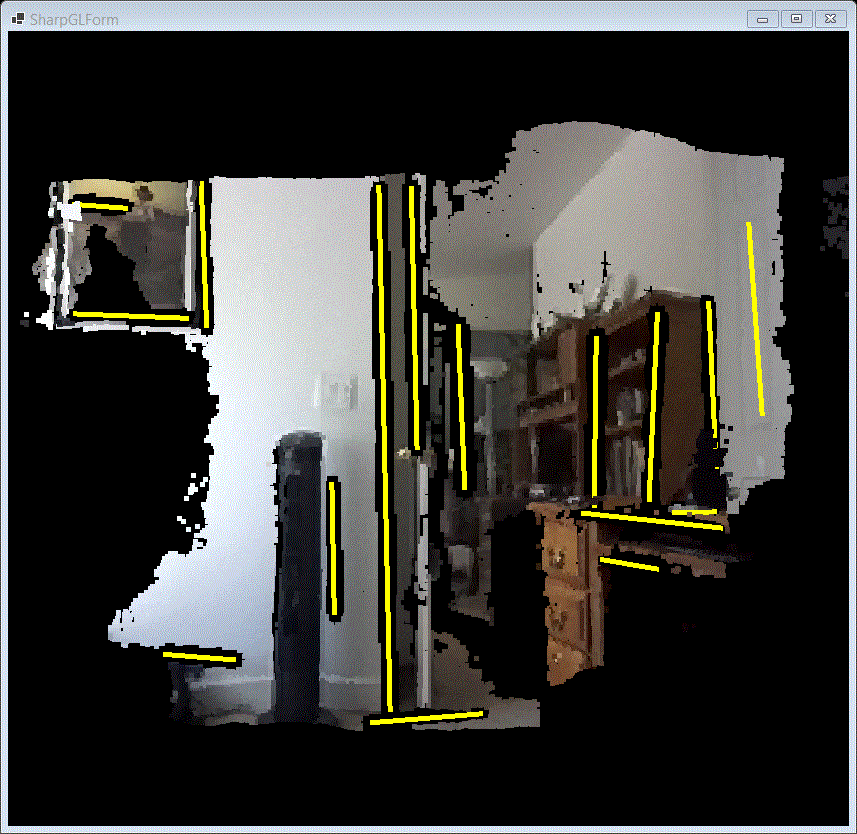**

**GL_DrawLineDepth:** *Lines found in RGB are drawn logically in the OpenGL output. The depth data surrounding the line is removed to highlight that the lines are correctly drawn.*

**May 31, 2026 – ModNet.Onnx, RedColor, Depth Tiers, SharpGL, KNN, Testing, Lines, ZED SDK, FLD vs. LSD**

-   Over 1700 algorithms are included, averaging 36 lines of code per algorithm.
    -   Over 400 additional obsolete algorithms compiled for reference use.
    -   Over 15 algorithms generated by Cursor.ai (“Cursor.ai” in description.)
-   The algorithm “MLMatting_Basics” isolates the image subject regardless of depth.
    -   The “ModNet.onnx” model is included in OpenCVB distribution.
    -   “ModNet.onnx” is an ML algorithm is used to identify the image subject.
-   RedColor_Basics was enhanced using the output of the depth tiers.
    -   Depth tiers are found on every frame with a task algorithm.
    -   The tiers are used to further segregate colors in RedColor_Basics.
-   SharpGL algorithms were retested with depth stabilization.
    -   Stabilizing depth with minimum values impacted all SharpGL output.
    -   There is much less blowback – edge pixels between 3D objects.
    -   Depth is not stable near edges so stabilizing depth removed them.
    -   The depth edges are trimmed because the minimum goes to zero.
    -   Global option “Stabilize Depth/RGB using Motion” toggles depth stabilization.
    -   Also, SharpGL is now activated when OpenCVB images were clicked.
-   KNN algorithms without normalization were updated to use normalization.
    -   KNN is sensitive to distance and normalizing gives variables equal weight.
    -   If all dimensions use the same scale, unnormalized KNN can work properly.
-   Overnight testing of all the algorithms at different resolutions is key to OpenCVB.
    -   Overnight testing was enhanced by simply pointing the camera to the table.
    -   All images are black – no lines, no depth, no features.
    -   Algorithms need to avoid failure when lines, depth, or features are absent.
-   Each line is now identified in the last frame (when possible.)
    -   A line’s age is defined as the number of frames the line has been present.
    -   If no lines are present, the gravity vector is the only line in the list of lines.
    -   Algorithms dependent on lines will still work with just gravity.
-   OpenCVB is now updated to the latest version of the StereoLabs ZED SDK.
    -   The C\# interface is updated to the 5.3.0 version.
-   Both “Fast Line Detector” and “Line Segment Detector” are available and used.
    -   Line_Basics_TA is a task algorithm that runs on every frame.
    -   Line_Basics_TA uses the LSD by default.
    -   Changing one line allows comparison the FLD.

**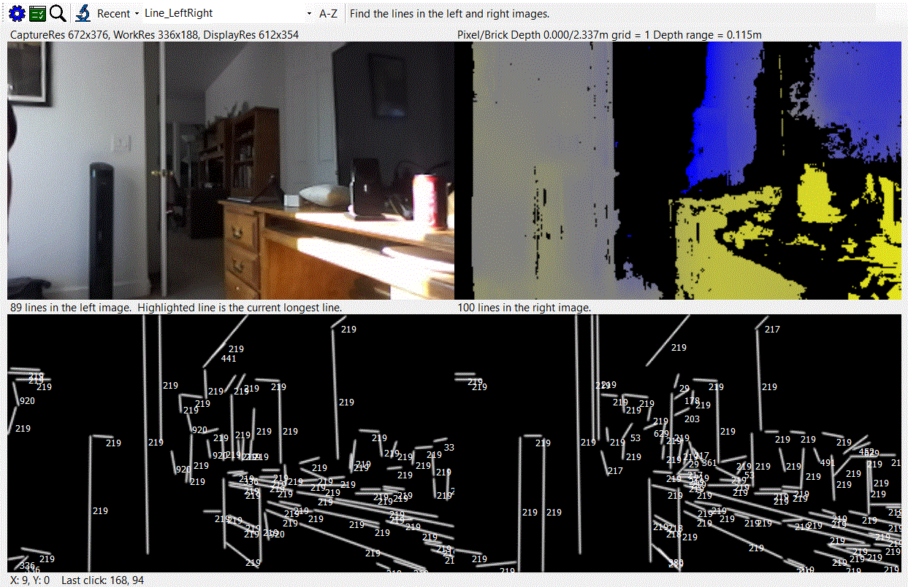**

**Line_LeftRight:** *Lines are found in both the left and right images. The values in the bottom images are the age of each line (in frames.) Each line is matched to the previous image in both the left and right images.*

**May 1, 2026 – Heartbeat, ChatBots, OpenCVSharp Version, HashSet,**

**Depth Tiers, LineTrack**

-   Over 1700 algorithms are included, averaging 36 lines of code per algorithm.
    -   Over 400 additional obsolete algorithms compiled for reference use.
-   The flag that triggers an event right after a long-term heartbeat is now working.
    -   The “afterHeartBeatLT” is true during the frame after “heartbeatLT”.
-   AI-generated algorithms will have the vendor name in the description.
    -   For example, if cursor.ai was used, “Cursor.ai” will be in the description.
    -   Each algorithm is manually improved (often significantly) but largely intact.
-   The StereoLabs package fails when OpenCVB is updated to the 4/27 OpenCVSharp.
    -   Other cameras work fine but StereoLabs needs to update their library.
    -   For the time being, use the 3/30 version of OpenCVSharp.
-   There is better performance with “HashSet” when using the “Contains” method.
    -   All lists using the “contains” method are defined as hashsets.
-   Depth_Tiers_TA is a task algorithm that creates 10 depth tiers (default).
    -   It assigns a color to every pixel that reflects the depth value at that pixel.
    -   A depth tier image is produced after each heartbeat.
    -   In the TreeView, click on “Depth_Tiers_TA” to see the current image.
    -   Note that colors are consistently appearing in the same region.
-   The task algorithm “LineTrack_Basics_TA” finds and tracks the longest line.
    -   If the tracked line is lost, the longest line for the current image is tracked.
    -   LineTrack_Basics_TA is a task algorithm that runs on every frame.
    -   Accuracy and reliability will be subjected to further testing and review.

**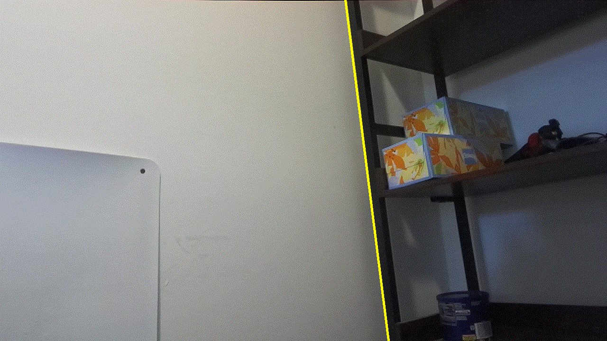**

**LineTrack_Basics_TA:** *The longest line detected is tracked on every frame. If the tracking detects that the line is not present, a flag is set and the current longest line becomes the line to be tracked in future frames. The algorithm is a task algorithm that runs on every frame. The line is always extended to the edge of the image.*

**April 23, 2026 – Delaunay Map, Stable Depth, Foreground**

-   Over 1700 algorithms are included, averaging 36 lines of code per algorithm.
    -   Over 400 additional obsolete algorithms compiled for reference use.
-   RedCloud algorithms have gaps where there is no depth data.
    -   Delaunay can create facets using each cell’s center (maxDist).
    -   This guarantees that clicking on the image will find the nearest cell.
-   What is lost when depth is stabilized using minimums and motion?
    -   The demo below shows that some non-zero depth data can be lost.
    -   The lost data is restored at the next heartbeat.
    -   The pixels that are lost are always zero – not false depth data.
    -   Foreground objects create shadows that linger until a heartbeat.
    -   The options for depth stabilization can be removed for all algorithms.
        -   See the global option ‘Stabilize Depth/RGB using Motion’.
        -   The value of stable depth data outweighs the lost data.
-   Foreground is defined as the first 25% of the depth data.
    -   The foreground in the depth data is found for every frame.
    -   The variable task.foregroundMat contains depth data for the foreground.

**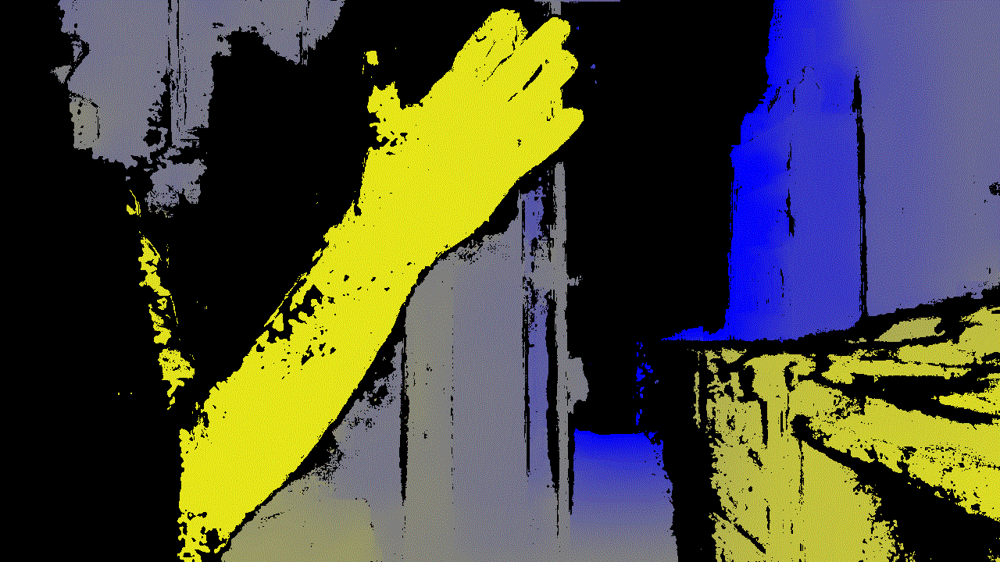**

**All Algorithms:** *Depth is typically shown in OpenCVB’s upper right image. Depth stabilization accumulates the depth minimum when there is no RGB motion. Where there is RGB motion, it accumulates the latest depth. The depth shadow is often far from the RGB motion and does not always reflect that motion.*

**April 14, 2026 – Visual Studio Version, TreeView, Pixel Min/Max,**

-   Over 1600 algorithms are included, averaging 36 lines of code per algorithm.
    -   Over 400 additional obsolete algorithms compiled for reference use.
-   Visual Studio Community Edition (free) made changes to callback tracing.
    -   Be sure to upgrade Visual Studio to the “March 2026 Feature Update”.
    -   This version is also labeled 18.4.3.
    -   The symptom will likely be problems with the “TreeView” in OpenCVB.
    -   TreeView is an essential component of OpenCVB.
        -   Click on any entry to show the intermediate results.
        -   Clicking will also display intermediate true text and labels.
-   A long-standing problem in computer vision is the unreliability of color.
    -   The color varies slightly with the number of photons that hit the sensor.
    -   To stabilize the color, OpenCVB takes the min or max value at each pixel.
    -   Detecting motion is a required input to the min/max calculation.
    -   Motion pixels are updated immediately while changed pixels are accumulated.
    -   The GIF below shows the presence of both motion and stable colors.
-   The min/max test at each grayscale pixel is similar to depth min/max tests.
    -   But depth has shadow and shadow updates are lost in Depth_StableMin.
    -   Unlike color, lost depth data needs to be updated at each heartbeat.
-   The current motion detection (Motion_Basics_TA) finds motion where there is none.
    -   A simple measure of whether there is motion is in StableGray_Measure.
    -   StableGray_Measure finds the absolute difference between each gray pixel.
    -   If there is more than a threshold, motion pixels need to be identified.
-   Featureless regions are almost always present in an image.
    -   FeatureLess_Basics finds those regions which have no features.
    -   Their size allows them to be more easily tracked than other features.

**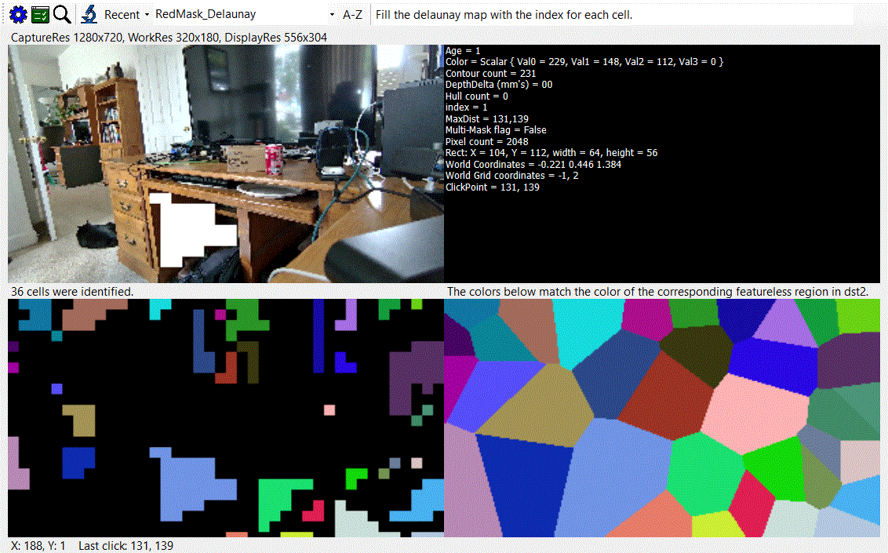**

**RedMask_Delaunay :** *In this example, all the featureless regions in the image are tracked. The lower left image shows the identified featureless regions, and the selected region is highlighted (white) in the upper left image. The details describing the selected cell are in the upper right image. The lower right image is a map of the featureless regions. Delaunay translates the center of each featureless region into a “facet” that defines an area surrounding that center. A mouse click in the facet selects the featureless region associated with that facet. Note that the colors of the facets in the lower right match the color of the corresponding featureless region in the lower left. The smaller featureless regions will come and go and will change color as a result.*

**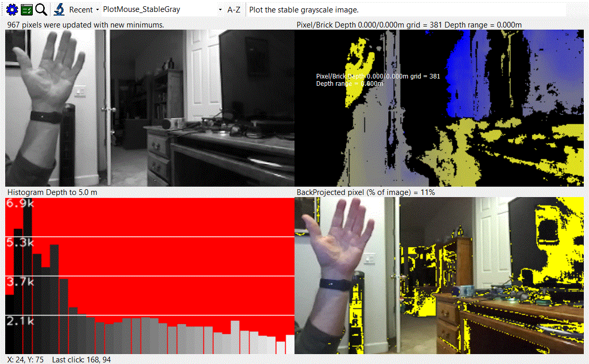**

**PlotMouse_StableGray:** *The image below right highlights both motion and stable pixels. The hand is clearly moving and the highlighted pixels below the hand are changing. The highlighted pixels in the rest of the image are stable. The grayscale image in the upper left is the accumulated minimum or maximum values at each pixel. The bar chart in the lower left allows the mouse to control the backprojection of the pixels into the lower right image. In this example the mouse cursor (not visible) hovers over the tallest bar in the plot. The pixels highlighted in the lower right image are among the darkest in the image but moving the mouse in the bar chart can highlight any pixels and confirm that all the pixels are stable where there is no motion.*

**April 5, 2026 – FeatureLess, Cloud Motion, DrawRect, Plots, Stable Depth and Point Clouds.**

-   Over 1600 algorithms are included, averaging 36 lines of code per algorithm.
    -   Over 400 additional obsolete algorithms compiled for reference use.
-   The featureless mask is more stable when using motion mask updates.
    -   If there is no motion, the featureless mask does not change.
-   Point cloud motion is highlighted using the disparity error.
    -   Distance error for your camera is estimated in Disparity_PlotError.
    -   When distance varies more than the expected error, it is point cloud motion.
        -   RGB motion will also trigger point cloud motion.
-   Point cloud motion can also be defined using pixel-by-pixel error values.
    -   Motion_CloudPixel will build a mask of motion in the point cloud.
    -   Motion_CloudGrid builds a mask in grid rects for point cloud motion.
-   The “drawRect” now uses color and is set with the “highlight” color.
    -   The drawRect appears in all 4 images when drawn on any image.
    -   Using the highlight color guarantees the drawRect will always be visible.
-   Plots can be interactive – mousing over bar charts backprojects the bar values.
    -   Plot_Histogram creates bar charts for use with PlotInteractive_Basics.
-   Depth and point cloud now reflect the minimum values for each location.
    -   Depth will now pulse with heartbeat as intermittent depth disappears.
    -   The purpose for this “pulsing” is to stabilize depth.
    -   Depth is retained if it is the minimum value at that pixel.
    -   Stabilization is apparent in the DepthRGB image in each frame.
    -   Stabilization updates X, Y, and Z as well when depth is at a minimum.
    -   Zero depth values cover some lost valid data – see image below.
        -   Missing depth is accumulated until the next heartbeat.
    -   To double-check the impact, toggle ‘Stabilize Depth’ flag in global options.

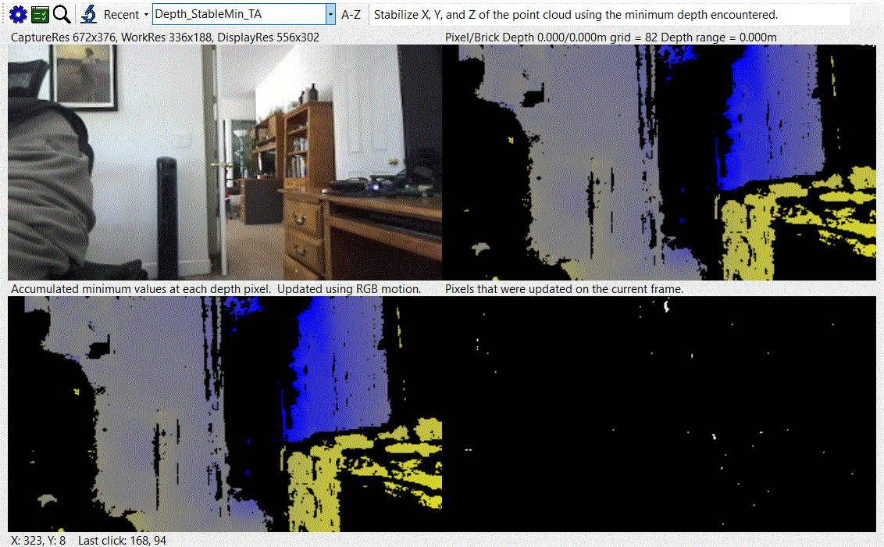

**Depth_StableMin_TA:** *The task algorithm Depth_StableMin_TA is run on every frame to stabilize depth and remove transient depth values. The point cloud is also updated when depth is at a minimum. This ensures that the X, Y, and Z values in the point cloud will be consistent and accurate. The GIF shows the depth shadow behind the arm is present longer than it should be – until the next heartbeat restores it. Some valid depth data is lost but it is replaced with zeros. If this is a problem, turn off the ‘Stabilize Depth’ global option. The lower right image shows the pixels removed to stabilize and clean up the current image. A companion algorithm “Depth_StableMax_TA” may also be used. The difference between the 2 algorithms is that the minimum values are accumulated (the default) instead of the maximum. The maximum values may be accumulated as well. The point cloud and depth are updated immediately where there is RGB motion.*

**March 29, 2026 – FeatureLess, Segmentation, KeyColor, Task Algorithms, and Motion.**

-   Over 1600 algorithms are included, averaging 36 lines of code per algorithm.
    -   Over 400 additional obsolete algorithms compiled for reference use.
-   Featureless regions are detected with correlation as in the previous release.
    -   An alternative method uses just the grid’s range values in grayscale.
    -   Both methods are available but the range values is faster and the default.
    -   The higher resolutions need to use correlation rather than threshold.
-   OpenCVB’s depth segmentation algorithms fall into 3 categories.
    -   RedCloud algorithms segment using depth input to track cells.
    -   RedColor algorithms segment using color input to track cells.
    -   RedMask algorithms segment using contours but without tracking.
-   A long-term challenge is the integration of color and depth.
    -   Depth and color are used in RedCloud_Basics (second image below.)
    -   The KeyColor algorithm colors the cells at minimal cost.
    -   Previously, RedCloud_Basics assigned unique colors to each cell.
-   Task algorithms are now identified in the TreeView with a suffix “_TA”.
    -   Task algorithms run with every algorithm on every frame.
    -   Task algorithm output is available to all through the task variable.
-   Algorithms generated by Cursor.ai will have “Cursor: …” in the description.
-   There were improvements to motion detection.
    -   The motion mask adds “link4” grid rects to the mask.
    -   But the list of grid rects only includes the center of the link4.
        -   The center grid rect is removed in FeatureLess algorithms.
        -   A grid rect in motion is not included in the featureless rects.

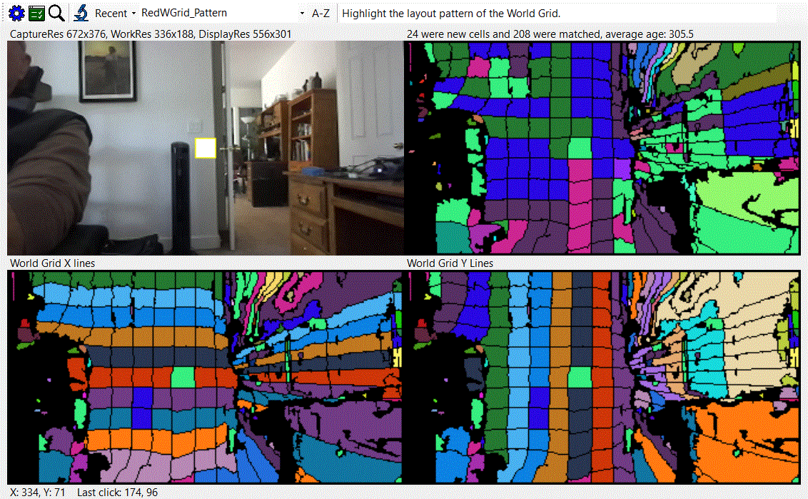

**RedWGrid_Pattern:** *The RedCloud cells are displayed in the upper right using the colors from the KeyColor_Basics as shown below. The lower left image contains the same RedCloud data but using the World Grid X values to color the cells. The lower right image contains the same RedCloud data but using the World Grid Y values to color the cells. The selected cell is shown in white in the upper left RGB image and the details for that cell are toggled for display in the upper right.*

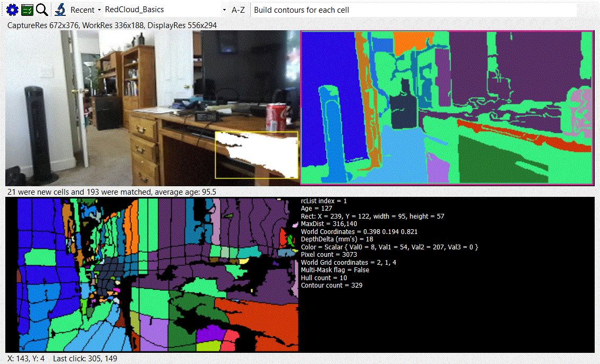

**RedCloud_Basics:** *The RedCloud cells are displayed in the lower left using the colors from the KeyColor_Basics algorithm shown in the upper right. The lower right image contains the details of the currently selected cell. The selected cell is shown in white in the upper left RGB image.*

**March 15, 2026 – World Grid, RedUtil, Correlation, Grid Squares.**

-   Over 1600 algorithms are included, averaging 36 lines of code per algorithm.
    -   Over 400 additional obsolete algorithms compiled for reference use.
-   Improvements to “world grid” consolidate related RedCloud cells.
    -   Cells with the same world grid coordinates appear as a single RedCloud cell.
    -   Cells with poor depth data are merged into a single RedCloud cell.
    -   Poor depth cells may be highlighted with the debug check box (see below.)
-   RedUtil.vb added to provide some common shared functions for RedCloud.
-   Correlation measures similarity but identical images can produce unexpected results.
    -   Each square’s correlation is computed for the current and previous image.
    -   When there is no motion, correlations are expected to be high.
    -   But as much as 50% of the image can have correlations below expectations.
    -   Correlation measures the relative relationships of pixels.
        -   But when pixels are in a narrow range, relationships can flip.
    -   Pixels flipping in a narrow range can cause correlations to deteriorate.
-   In the first image below, the value of this deterioration is clear.
    -   Grid squares with a narrow range of values are identified
    -   Each grid square with deteriorated correlation is **featureless**.

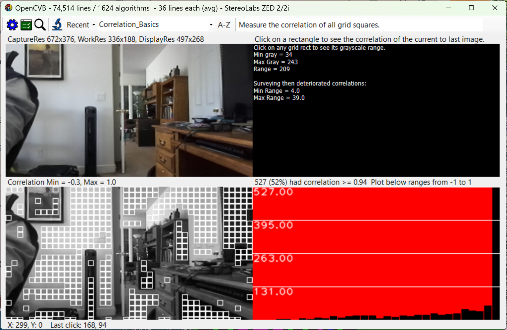

**Correlation_Basics:** *The plot of the histogram in the lower right image shows that 50% of the grid rectangles have a correlation \> 0.94 (see label.) There is no motion in the image so every square should be near perfect correlation. The lower left image highlights the rectangles with \< 0.94 correlation, decidedly less than perfect correlation. Why? The image sensor generates approximately the same values for featureless regions but the relative values within a square can have a high impact on correlation when all the pixels are about the same. Random variations in the number of photons striking the sensor can occur and flip the relative value relationships. When all the pixels are in a narrow range, the changes in the relative values will cause correlation to deteriorate. The resulting sets of squares with less than 0.94 correlation define* **featureless** regions*.*

**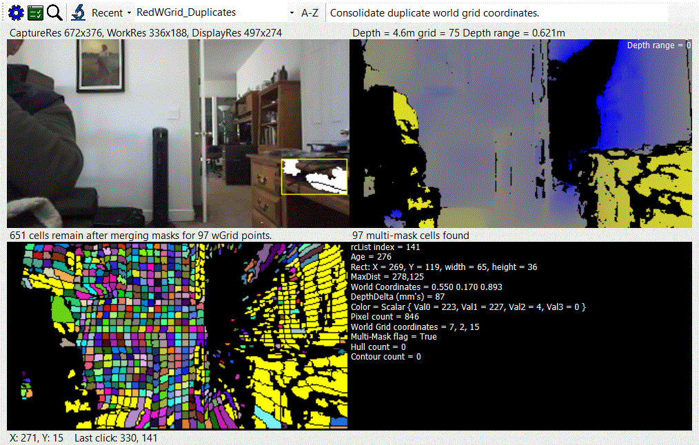RedWGrid_Basics:** *Cells with the same world grid coordinates are merged into a single RedCloud cell. The selected RedCloud cell contains multiple masks and is highlighted in the top left image in white. Poor depth creates gaps in the depth that prevent RedCloud from finding all the pixels in a cell. The depth data is in the upper right image. The lower right image contains the cell description with world grid coordinates of 7, 2. The yellow highlights in the lower left image represent the cells that have multiple masks. The cells are largely at the periphery of the image where the depth data is less reliable.*

**March 1, 2026 – World Grid, Json, Defaults, UI_Generator, RedCloud Cells.**

-   Over 1600 algorithms are included, averaging 36 lines of code per algorithm.
    -   Over 400 additional obsolete algorithms compiled for reference use.
-   The “world grid” identifier is used to match RedCloud cells to earlier frames.
    -   If “world grid” fails, the previous maxDist approach is used.
-   When the json settings are deleted, there were some poor choices for defaults.
    -   Default is to capture at 1280x720 with working resolution of 320x180.
    -   Paint frequency defaults to 30 frames per second (not zero!)
-   The UI_Generator pre-build event now builds and runs UI_Generator.
    -   Previously, the event used the .exe which may not been built yet.
    -   This only affects the first build after cleaning the entire solution.
-   For RedCloud algorithms, the exaggerated separation was removed.
    -   Floodfill was targeting zeros with edges at 255.
    -   Floodfill now targets nonzero values right to boundary.
    -   There are no longer any gaps between cells.
-   The lower limit on the size of RedCloud cells is removed.
    -   Tiny cells are not consistently identified – depth data is too volatile.
    -   The example below demonstrates reducing the cell size.
    -   Large capture resolutions did not create world grid coordinates.
    -   Now large capture resolutions work properly (if slowly.)

**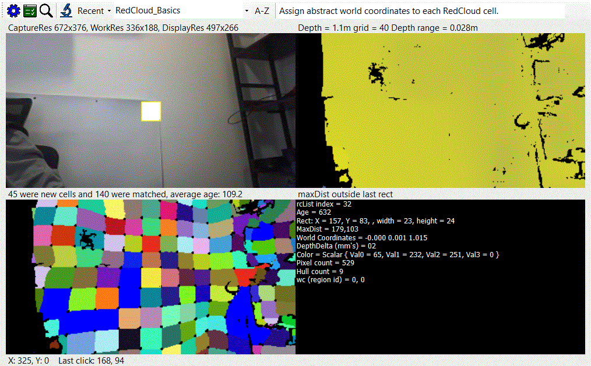RedCloud_Basics:** *The cell size is reduced significantly in this demo of how RedCloud cells are detected. At the largest cell size, holes are inserted to restrain the floodfill that would normally leak. At extremely small cell sizes, the corner holes predominate and cells may not appear. At the largest cell size, it is easy to confirm that cells retain their color. At the lower cell sizes, the small cell size limits the ability of the algorithm to identify the cell in the previous generation. The identified cell in the upper left image is the default cell at the center of the image. Clicking on any cell will track that cell in the color image. The details of the cell are listed in the lower right image.*

**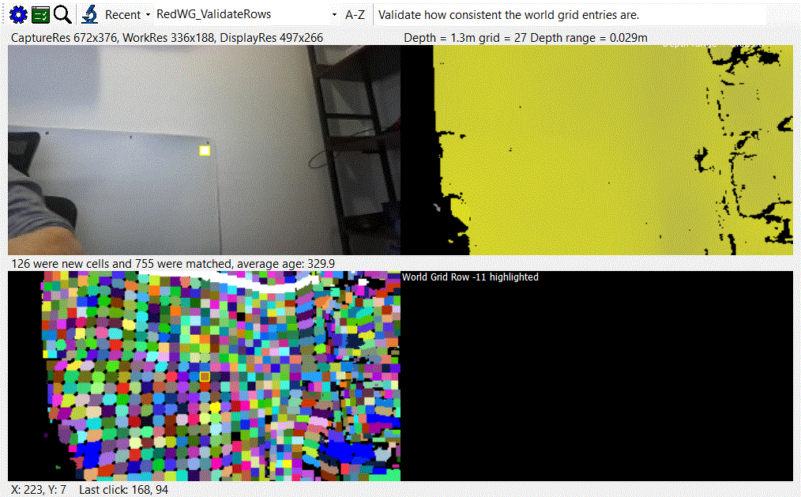RedWG_ValidateRows** *The “world grid” coordinates are consistent at the smaller cell sizes. Each cell in a world grid row is highlighted in white in the lower left image. The cells will shift slightly because of the volatility of the depth but consistent cell color indicates that the cell was identified in the current and previous frame. Using a wall as a target produces results that are almost too good but the algorithm will work regardless of context. The shelving at the right side of the image shows how gaps will appear on uneven surfaces.*

**February 26, 2026 – Task Variable, Brick_Basics, RedCloud Maps, Paint Frequency, “World Grid”, and PixelViewer.**

-   Over 1600 algorithms are included, averaging 36 lines of code per algorithm.
    -   Over 400 additional obsolete algorithms compiled for reference use.
-   The name of the main structure in the algorithm task is “task” (as before.)
    -   Task is a reserved word in VB.Net but has been used all along.
    -   The only conflict was when debugging the MainUI task.
    -   Most of the debugging is in the VBClasses project where it worked fine.
    -   Solution: when debugging MainUI, refer to the task variable as “vbc.task”.
-   Brick_Basics is a task algorithm that is run on every frame when requested.
    -   To request the brick data, call the constructor for “task.bricks”.
-   All the RedCloud cell maps are now 32-bit integers (previously byte)
    -   This allows RedCloud to manage more than 255 cells.
    -   An example output of the expanded RedCloud coverage is below.
-   OpenCVB’s global options “Target Display FPS” controls how often paint runs.
    -   The time spent painting images is displayed in the TreeView output.
    -   The paint overhead can vary from 0 to 150 ms (Core i9 desktop.)
    -   Updating too fast makes interpretation difficult.
    -   Updating slowly reduces the need for heartbeat testing.
    -   Paint Frequency = 0 – stop updating the images.
    -   Paint Frequency = -1 - Update images after long-term heartbeats.
    -   Paint Frequency = -2 - Update images after heartbeats.
-   OpenCVB was upgraded to use the latest version of OpenCVSharp.
-   This version introduces the “world grid” identifier for RedCloud cells.
    -   The identifier allows building groups of cells that are related.
    -   The exaggerated separation of cells is to increase consistency.
    -   The world grid element at (0, 0) is in the center of the image (highlighted.)
    -   World grid elements at the left side of the image are negative.
    -   World grid elements in the top half of the image are also negative.
    -   World grid elements correspond to world coordinates – just reduced.
-   Support for the Pixel Viewer in the main form () has been restored.

**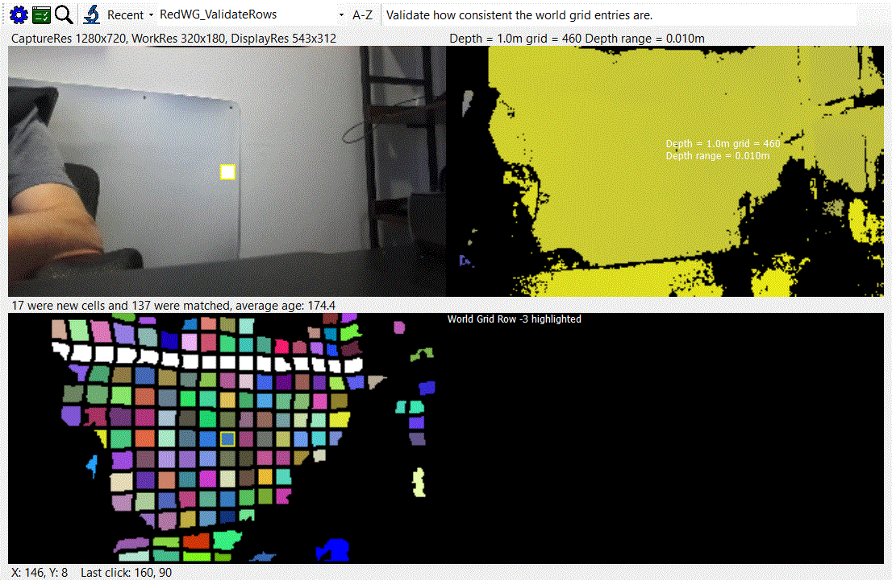**

**RedWG_ValidateCols and RedWG_Validate_Rows :** *These 2 algorithms are used to validate the assignment of the “world grid” identifiers. Each cell is now part of a row or column. The world grid id’s are the reduced X and Y values of the point cloud and can be used to identify cells. Cell size is controlled with the “Reduction Factor” in the global feature options.  There is a limit to how small the cells may be due to the exaggerated separation when constructing the cells. All RedCloud algorithms now produce the world grid id’s.*

**February 5, 2026 – Oak 3D, Enhanced Left/Right Views, Left/Right Motion, Left/Right Lines, TreeView, Gravity, Depth Lines**

-   Over 1500 algorithms are included, averaging 36 lines of code per algorithm.
    -   Over 300 additional obsolete algorithms compiled for reference use.
-   OpenCVB is *temporarily* dropping support for the Oak-3D cameras.
    -   There are some subtle differences in Oak 4D support vs Oak 3D.
    -   The Oak 3D camera is a USB only device. Oak 4D is a network device.
    -   The depthai function getDefaultDevice is the way to get images.
    -   Cursor.ai was recycling methods and unable to access Oak 3D.
-   Left and right images are transformed for enhanced brightness and contrast.
-   Changes in the left and right images are detected the same as for the RGB image.
    -   The left and right cameras are of lower quality.
    -   Harmless defects in left/right motion masks appear in featureless regions.
-   Lines are detected in the motion enhanced left and right image.
-   TreeView selections are now properly handling duplicate names in the tree.
    -   Algorithms are growing in complexity and the tree view updates were needed.
-   The list of lines produced by Line_Basics eliminates any lines that overlap.
    -   The longer lines are preferred when there is overlap.
-   Gravity and Horizon vectors were not updated since the UI rewrite.
    -   Cursor.ai was used to build the gravity and horizon vectors.
-   Lines can be found in the reduced depth data. Example below.
-   The Magnifier button in the main is now working properly.

**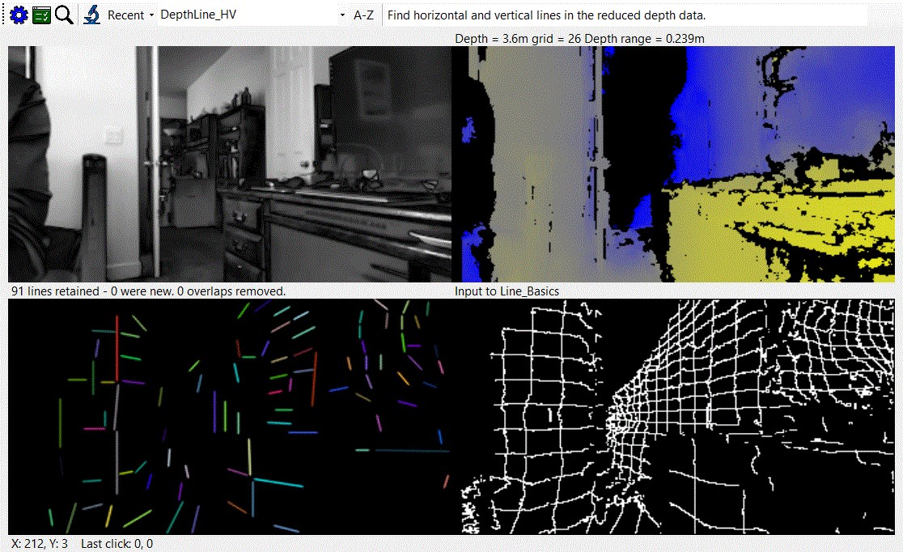**

**DepthLine_HV :** *The horizontal and vertical lines are obtained from the reduced depth data. The lower right image contains the input lines found in the reduced depth data. The lower left shows the lines that reasonably match the input. The upper left image is the left camera view because it aligns to the depth data. The changes in the lower right image are from adjusting the “Reduction Target” which determines how much the depth data is reduced. More lines are found with the lower amount of reduction, fewer when reduction is higher.*

**January 20, 2026 – Splash Screen, Oak 4D, Align Left to RGB, Disparity, IR Emitters, “NR_” Prefix, and Motion Detection**

-   Over 1500 algorithms are included, averaging 36 lines of code per algorithm.
    -   Over 300 additional obsolete algorithms compiled for reference use.
-   Showing the splash screen is now optional and default is true.
-   Oak3 D camera correctly stops when changing cameras or resolution.
-   The Oak 4D camera is now recognized and supported.
-   Updated snippets with Namespace. Also unused snippets removed.
-   Improved splash screen shows camera and current algorithm.
    -   Splash screen is now optional.
-   Text markups are removed from “Test All” runs to reduce object usage.
    -   This only happens during overnight test runs, not normal usage.
    -   Extensive use on some algorithms can exceed User/GDI objects.
-   All supported cameras now can align the left view and depth.
    -   All previous solutions aligned depth to color.
-   Oak 3D and Oak 4D cameras collect disparity as well as depth.
    -   Whether this is useful has yet to be determined.
-   A small piece of electrical tape can turn off the IR emitter on any camera.
    -   This allows some interesting tests to be done with left/right images.
    -   The featureless regions will have degraded depth when tape is present.
-   The “NR_” category of algorithms are all the algorithms that are not reused.
    -   The algorithms are in the same VB.Net file as before but prefixed “NR_”.
    -   They are still tested in the overnight runs and will still work.
    -   Benefit: the algorithm combo box is much more readable.
    -   To reactivate an algorithm, just remove the “NR_” prefix.
-   An alternative motion detector was added to OpenCVB.
    -   A pixel is “changed” if all 3 colors are different from the accumulated frame.
    -   About 20% fewer pixels pass threshold tests for motion.
    -   This is an experiment and will be reviewed over time.
-   Another alternative for motion detection is to use the left infrared image.
    -   The experimental code for detecting left image motion is in Motion_Left.
    -   This is an experiment and will be reviewed over time.
-   The Orbbec SDK distribution is currently unavailable.
    -   The installer .exe is missing from their download page.
    -   The Github source code uses and old CMake version that is unsupported.
    -   I will try again in a week or so to see if they have updated their install.

**January 10, 2026 – Play/Pause, Oak Support, Test All, Exceptions.**

-   Over 1500 algorithms are included, averaging 36 lines of code per algorithm.
    -   Over 300 additional obsolete algorithms compiled for reference use.
-   The play/pause button has been removed – it was not used or needed.
-   Code Review: cursor.ai inspected the code and made recommendations.
-   Switching between cameras had some inconsistencies, now removed.
-   The Oak3-D Pro support now installs examples to allow comparisons.
    -   The Oak3 left image is now the RGB image (grayscale only.)
    -   The Oak3 point cloud is computed in OpenCVB.
    -   Advantage: the depth is aligned to the left image automatically.
-   The Oak4-D Pro support is stalled awaiting a signed USB driver for installation.
-   The “Test All” overnight testing has been improved.
-   Error handling in the camera callback provides 2 ways to handle exceptions:
    -   Default: use Try/Catch to log the error and keep running.
    -   Turn on VS Menu “Debug-\>Windows-\>Exception Settings” to stop run.
-   For “Test All” runs using the Try/Catch Default above may be preferred.
    -   For debugging a new algorithm, the VS Menu solution is preferred.
-   SharpGL algorithms now remember their size and location.

**January 5, 2026 – Oak-D Pro, More Install Fixes.**

-   NOTE: OpenCVB requires VS 2026 and will install OpenCV 4.14.
    -   Install script uses the “.slnx” designation for solutions.
-   Oak D support is restored using the latest release.
    -   The original Oak D cameras are supported and working.
    -   My Oak 4 D Pro camera doesn’t work. USB-C connection failed.
    -   A POE switch has been ordered – arrives tomorrow.
    -   At almost \$1k, the camera is too expensive to order a second.
-   The overnight testing was improved and runs without restarting camera.
-   Splash screen was added and camera startup messages were removed.
-   OpenCVB’s icon now appears in the taskbar.
-   OpenCVB’s SharpGL interface is working.
-   RedColor color management was improved – no repeated colors.
-   

**January 1, 2026 – Oak-D Pro, Install Fixes.**

-   This version of OpenCVB requires VS 2026 and OpenCV 4.14.
    -   Install script uses the “.slnx” designation for solutions.
-   The latest version of CMake is recommended with this version.
-   The installation scripts have been more thoroughly tested.
-   GIFBuilder and UI_Generator are built with the rest of OpenCVB.
    -   They were previously build with the Update_All script.
-   There were some improvements in camera buffer management.
    -   Using locks reduced the number of copies.

**December 30, 2025 – Oak-D Pro Camera Support under construction.**

-   The Oak-D Pro camera .Net interface in OpenCVB used R2 depthai-core.
-   The support for Oak-D is no being restarted with R3 depthai-core.
-   The R2 OpenCVB support needs to be rewritten = different interfaces.
-   The infrastructure for R3 is now in place with this release.

# December 23, 2025 – Install Fixes and Testing.

-   This version of OpenCVB requires VS 2026 and OpenCV 4.14.
    -   Install script uses the “.slnx” designation for solutions.
    -   Start with a clean directory to avoid version confusion.
-   The latest version of CMake is recommended with this version.
-   The installation scripts have been more thoroughly tested.
-   GIFBuilder and UI_Generator are built with the rest of OpenCVB.
    -   They were previously built with the Update_All script.
-   There were some improvements in camera buffer management.
    -   Using locks reduced the number of copies.

# December 23, 2025 – Oak-D Pro Camera support under construction.

-   The Oak-D Pro camera .Net interface in OpenCVB used R2 depthai-core.
-   The support for Oak-D is no being restarted with R3 depthai-core.
-   The R2 OpenCVB support needs to be rewritten = different interfaces.
-   The infrastructure for R3 is now in place with this release.

# December 23, 2025 – Installation and Build Issues.

-   The previous release did not properly install.
-   Most of the issues were related to the switch to Visual Studio 2026
-   VCVarsAll.bat would not be found on systems without VS 2026.
-   The Build configuration was not properly set for X64.
-   Visual Studio 2026 is required for OpenCVB. VS 2022 support is dropped.
-   Visual Studio 2026 Community Edition is free so this is not onerous.

# December 17, 2025 – VS2026, Infrastructure, Reduced Threading, Display FPS, Error-Handling, JSON, Image Sizing.

-   Over 1500 algorithms are included, averaging 36 lines of code per algorithm.
    -   Over 300 additional obsolete algorithms compiled for reference use.
-   OpenCVB is now updated to use Visual Studio Community Edition 2026 (free.)
    -   OpenCVB Python infrastructure was removed – no longer needed.
    -   OpenCVB OpenGL interface replaced with SharpGL package.
-   New tools were used to rebuild OpenCVB and improve the application.
    -   Cursor.ai was used to rebuild the infrastructure for algorithm testing.
    -   The algorithms are unchanged from the previous OpenCVB version.
    -   Better infrastructure means easier debugging and fewer bugs.
-   One key simplification of OpenCVB was *reduced* threading.
    -   There are now just 2 threads in OpenCVB – UI and the camera task.
    -   Threading added complexity to understanding the code.
    -   The algorithm thread UI is the same thread as the UI.
-   The motive for the earlier multi-threading was to remove the cost of display.
    -   Single threading means display will interrupt or hold back processing.
    -   A global option “Display FPS” now limits the cost of displaying images.
        -   It may not be a useful enhancement, but it is worth more study.
-   Cautious error-handling (Try/Catch) is limited in its use in OpenCVB.
    -   OpenCVB is always running in Debug mode with source so “let it fail”.
    -   Check all Windows Debugging Exceptions to stop the code at the error.
    -   The intent is to get as close to the error as possible.
    -   The code is simpler to read with limited impact on debugging.
-   OpenCVB options are now exclusively maintained in JSON.
    -   No GetSetting or SaveSetting calls remain.
    -   JSON settings are available to algorithms through a shared library.
-   The image size of all 4 OpenCVB outputs is completely customizable.
    -   Clicking or drawing on the image uses work resolution coordinates.
-   Algorithm count in the main form caption only reflects active algorithms.
    -   The algorithm count was over 2000 but is now close to 1500.

# November 24, 2025 – Line Matching, Right View Motion

-   Over 2000 algorithms are included, averaging 36 lines of code per algorithm.
    -   Over 400 algorithms are obsolete and are compiled for reference use.
-   OpenCVB is now updated to use Visual Studio Community Edition 2026 (free.)
-   Like many other applications, OpenCVB is being rewritten using modern tools.
    -   Cursor’s tool is assisting in the current rewrite.
    -   The Main.vb is still the default startup project while conversion progresses.
    -   The CVB project can be set to the startup project for testing.
-   LineMatch_Basics algorithm finds the matching line in the previous image.
    -   The algorithm finds the longest lines and their earlier location.
    -   Line angle is used to confirm that the match is the same line.
    -   Further confirmation is needed with many parallel lines.
-   Motion is also found in the right camera image.
    -   Motion_Basics is reused to find motion in the right image.
        -   Not a lot of work was involved in getting this working.
    -   Potential uses for finding motion in the right image are not yet clear.

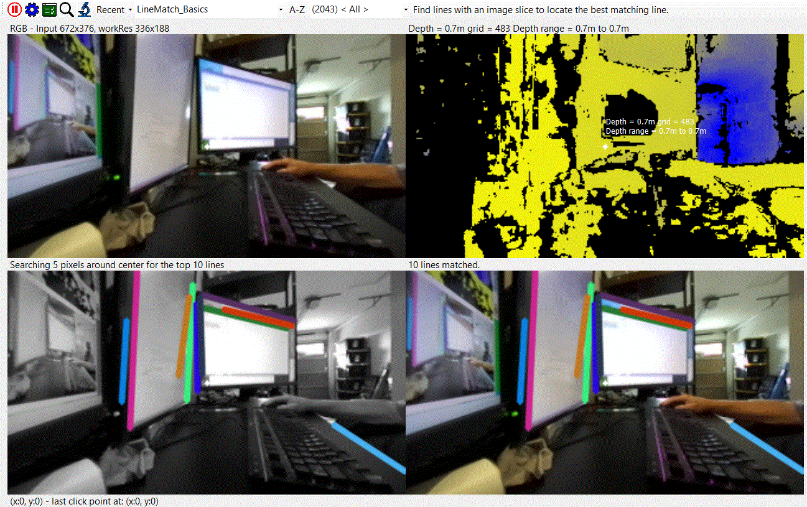**LineMatch_Basics :** *Lines are identified for each image - Line_Basics is a ‘task’ algorithm that runs on every frame. Using the center of each line, the match candidates are located within X pixels around the line center. The list of candidate lines is reviewed and the one with an angle within Y degrees of the original is designated the matching line. The bottom left image contains the longest lines for the current frame and the bottom right image shows the lines that match from the previous frame. When the camera is not moving, this algorithm is not challenging but when the camera is moving, this algorithm still works quite well. A toggle shows the matches alone and in the context of the current and previous image.*

# November 13, 2025 – Motion.

-   Over 2000 algorithms are included, averaging 36 lines of code per algorithm.
    -   Over 400 algorithms are obsolete and are compiled for reference use.
-   The Motion_Basics algorithm was reworked to use link 1, link 4, and link 8.
-   Which cells are replaced when a grid rect shows motion?
    -   There are 3 choices – cell, cell + link 4 cells, cell + link 8 cells.
    -   The choice “cell + link 4 cells” works but more testing needed.
-   Motion detection is validated with Motion_Validate (shown below.)
-   Motion detection improves several other algorithms.
    -   Unchanged lines are detected in Line_Basics when using motion detection.
    -   Unchanged edges and lines are detected exactly in EdgeLine_Basics.
    -   RedCloud and RedColor are improved with a motion-updated point cloud.
        -   More testing is required to manage regions with no depth.
-   These improvements are possible by removing slight pixel differences.
    -   Using a motion-updated image allows results to be matched exactly.
-   Motion detection relies on options specified in “Options_Diff”.
    -   There is an option for the size of differences in individual pixel values.
    -   There is also an option for pixel differences in a grid rect.
    -   Motion in the image is confined by the grid rectangles.
-   Motion detection can be turned off (global option “Use Motion Mask”.)
-   The stable gray image (grayStable) contains the motion-updated image.
    -   A motion-updated point cloud is now the default for all algorithms.

****

**Motion_Validate:** *This algorithm compares the motion-updated image with the camera image. The differences are highlighted in the lower right image. The lower left image is the motion-updated image while the upper right image is the original image from the camera. In the upper left image, the motion mask is shown on the RGB image. The text in the lower right image contains a count of the number of pixels that differ and the number of grid rectangles that contain motion. Note that there are plenty of differences between the current image and the motion-updated image but that these differences are small even where there is motion. The option for “cell + link 4 cells” is visible in the motion mask (upper left.)*

# November 2, 2025 – Global Options, Motion, Coherence.

-   Over 2000 algorithms are included, averaging 36 lines of code per algorithm.
    -   Over 350 obsolete algorithms are compiled just for reference use.
-   The Global Options were reviewed and simplified.
    -   Color and depth difference thresholds will appear only when needed.
    -   Depth colorizer options to show correlations was removed.
        -   Use Brick_CorrelationMap to see the left/right correlations.
    -   RedCloud display to show mean color was removed – not useful.
    -   The option to use Kalman filtering is now shown only when applicable.
-   The motion mask is not typically used for maintaining an RGB image.
    -   Flaws in the motion mask are visible in the accumulated grayscale image.
    -   Line detection can use the motion mask to limit what lines changed.
    -   Similarly, RedCloud algorithms use the motion mask to limit cell changes.
    -   RGB motion may not detect all changes to depth shadow.
        -   Cells in depth shadow are still valid because there was no motion.
        -   Cells exposed by depth shadow changes may be missed.
        -   Further experimentation will resolve this potential problem.
-   RedCC_Basics runs both RedCloud and RedColor on the same image set.
    -   Each cell in RedCC_Basics is coherent in both depth and color.
    -   Use RedCC_CellHistogram to confirm the depth range is singular.
-   RedCC_CellHistogram is used below to confirm each cell’s depth range.
    -   Each histogram has a depth range that is contiguous.
    -   Further experimentation is needed to validate the depth results.
    -   Color can be confirmed using the RGB image in the upper left.

**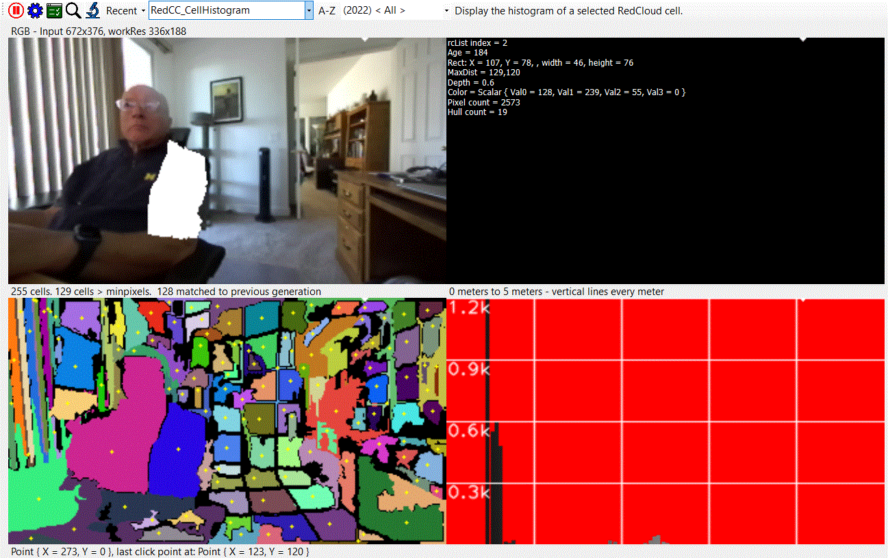**

**RedCC_CellHistogram:**  *RedCC_CellHistogram displays the results of RedCC_Basics in the lower left. Each RedCC cell is coherent in both depth and color meaning that the cell depth data is in a singular spike in the histogram and the color data is a single class in the reduced color image. The histogram in the lower right is for the selected cell. The selected cell is highlighted in the upper left RGB image. The cell details are in the upper right.*

# October 27, 2025 – OpenCVB Docs, Depth Colorizer, Edge_Line, RedCloud, RedColor, OpenGL updates.

-   Over 2000 algorithms are included, averaging 36 lines of code per algorithm.
    -   350 algorithms were moved to XO.vb – the ‘obsolete’ algorithms.
    -   Obsolete algorithms will compile but are no longer tested.
    -   Obsolete algorithms are for reference and possible reactivation.
-   The OpenCVB documentation has been split into 2 parts:
    -   OpenCVB_Desc: the OpenCVB description and installation instructions.
    -   ReadMe: a log of updates to the OpenCVB source code.
-   The depth colorizer is only run when it is visible in the upper right image.
    -   This saves the cycles needed to prepare the DepthRGB image.
-   The EdgeLine_Basics algorithm is now a “shared” algorithm in the task structure.
    -   Algorithms using edges invoke the constructor to trigger running it.
    -   EdgeLine_Basics results are available to all if one algorithm needs it.
-   The RedCloud (reduced point cloud) algorithm has significantly changed.
    -   The X, Y, and Z channels of the point cloud are reduced separately.
    -   Previously, the product of X and Y channels was reduced.
    -   The new method produces more consistent cells.
    -   “Reduction Target” is dynamically adjusted to maximize use of depth data.
        -   If the reduction target is too low, too many cells are generated.
        -   If it is too high, the larger cells become to unpredictable.
-   The RedColor (reduced color) algorithms were reorganized as well.
    -   Most of the algorithms were moved to the XO.vb – obsolete.
    -   The few that remain contain the essential portions of the algorithm.
    -   RedColor and RedCloud algorithms share the same cell description.
-   An OpenGL presentation of RedCloud cells is available with this version.
    -   The full image is presented as an OpenGL texture.

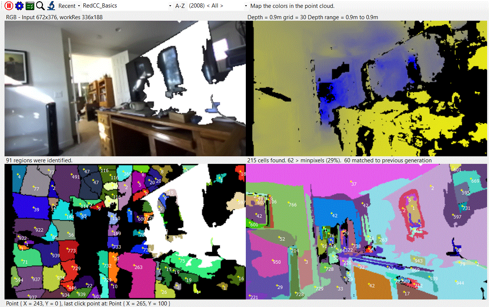

**RedCC_Basics:**  *RedCC_Basics displays both the segmented depth data and the segmented color data. The camera is moving left and right in this demonstration. The image in the lower left is the output of the RedCloud_Basics while the lower right is the output of the RedColor_Basics. RedCloud is short-hand for reduced point cloud while RedColor is short-hand for reduced color. Clicking a color segment in the lower right will display the RedColor segment in the lower left while clicking in the lower left will display the RedCloud segment in the lower right. This technique allows studying the overlap of RedColor segments in depth data and the overlap of RedCloud segments in color data.*

# 

# 2025 September 23 – Logical Lines, OpenCVB icon, Better Defaults.

-   Over 1900 algorithms are included, averaging 36 lines of code per algorithm.
-   Logical Lines are RGB lines that are translated into 3D lines.
    -   The assertion is that RGB lines will also have linear depth.
        -   Not always true but often enough to be worth implementing.
        -   Exceptions need to be detected and understood.
    -   The depth for each pixel in a line is linearly connected to its neighbors.
    -   Gaps in depth data are filled in with a computed linear depth.
    -   Depth is the average of available depth pixels in the line.
    -   The line center will be set to have average depth.
    -   Linear increment is the average increment of neighboring depth pixels.
    -   The end points are computed using the linear increment.
    -   Line color is assigned using the grid index of the first point.
-   The generic icon for OpenCVB was corrected (bug in .Net 8.0?)
-   The default value for SharpGL is to use non-linear mode – more realistic.
    -   If SharpGL’s ReadPointCloud is used, linear mode is recommended.
-   It is no longer the default to transform the point cloud using the gravity vector.

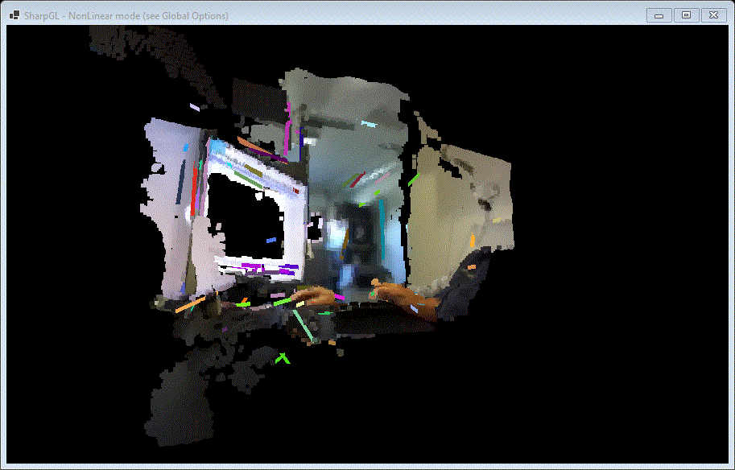

**GL_LogicalCloud:**  *The point cloud above is enhanced with logical lines.*

# 2025 September 11 – SharpGL, Memory, FPS.

-   Over 1900 algorithms are included, averaging 36 lines of code per algorithm.
-   SharpGL may be run as one of the 4 windows in the main form for OpenCVB.
    -   GL_MainForm demonstrates how to do this and what it costs (see below.)
    -   The cost is the work to move the data in the task thread back to the main form.
    -   There may be an opportunity for improved UI and performance.
    -   Mouse control is the same for both Task and MainForm SharpGL.
-   There are better diagnostics in the OpenCVB log – memory usage and threads.
    -   This change permits finding which algorithm pushed the memory limits.
    -   The change will also flag those algorithms which perform poorly.
-   Main project source tree was reorganized to separate functionality.
    -   GLHandler.vb contains all the code to handle the SharpGL.
    -   The jsonClass.vb file now contains all the code related to json.
    -   The NameSpace “OpenCVB” is now extant throughout the main modules.
-   The mechanism to create “shared” algorithms was implemented in this version.
    -   Shared algorithms improve performance when multiple algorithms need them.
    -   The task structure contains the object – see task.contours or task.features.
    -   Shared algorithms are run once for all algorithms using them.
    -   Prior releases had to make sure algorithms were run once per frame.
-   SharpGL can be rendered while preserving the point cloud coordinate values.
    -   Normally SharpGL uses non-linear coordinates to improve presentation.
    -   With linear mode geometries can be rendered in SharpGL.
-   The default value – linear vs. non-linear mode – is still TBD.

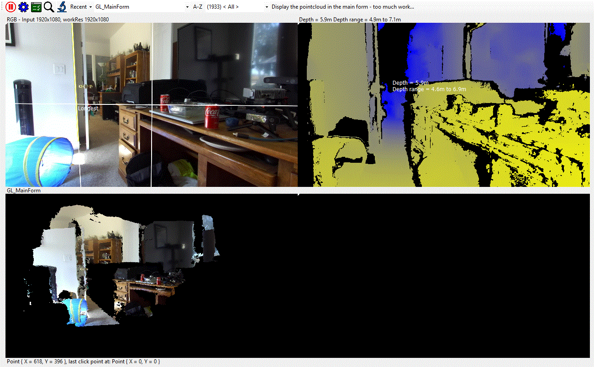

**GL_MainForm:**  *The image rendered in the main OpenCVB form is pretty small but the real problem with using the main form for SharpGL is that the data that resides in the algorithm task needs to be moved to main form which is in a separate thread.*

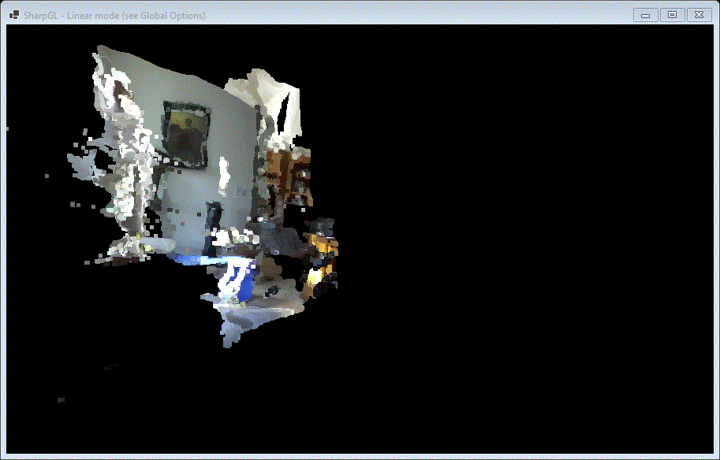

**GL_Basics:** *This shows the SharpGL output in non-linear mode. Non-linear mode is more realistic and allows better panning and zoom than linear mode but linear mode point clouds are more easily processed with ReadPointCloud.*

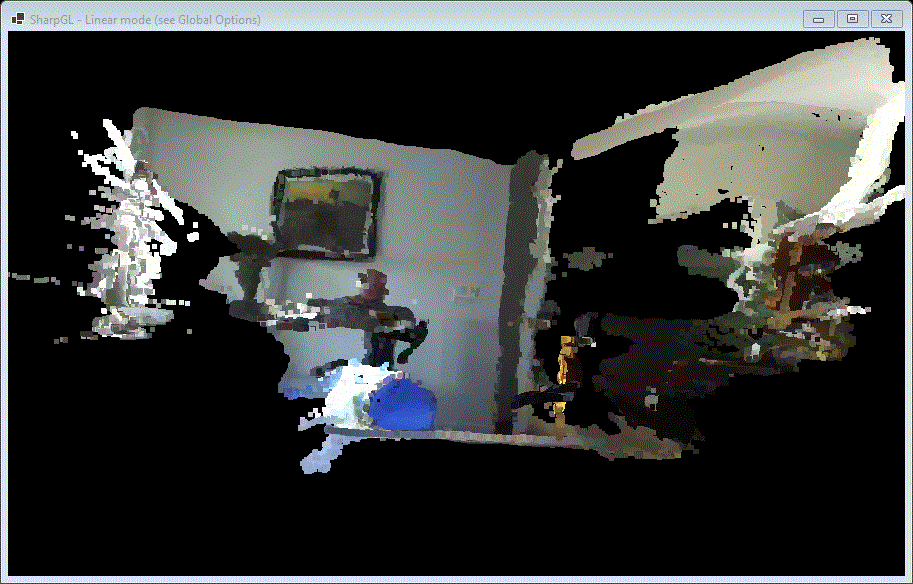

**GL_Basics:** *This shows the SharpGL output in linear mode. The dimensions are not the same as non-linear mode where the Z dimension is laid in a non-linear fashion to help render to a 2D surface.*

# 2025 August 20th – SharpGL Testing, Memory Usage, SharpGL GIFs.

-   Over 1900 algorithms are included, averaging 36 lines of code per algorithm.
-   More SharpGL testing and improvements.
    -   GL_Lines algorithm displays only the lines found in the RGB image.
    -   See below image for example usage.
-   Memory usage on overnight runs was spinning out of control at larger resolutions.
    -   SharpGL was created for each algorithm.
    -   Neglected to remove the SharpGL form after each algorithm.
    -   Now SharpGL form is only created for “GL_” algorithms.
-   GIF create process now supports the SharpGL output (instead of OpenGL output.)
    -   It is simpler to create a GIF from a VB.Net form than an external window.

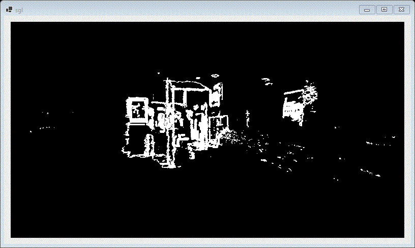

**GL_Lines:** *The SharpGL point cloud output for just the lines found in the RGB, ignoring the featureless regions where depth data fluctuates.*

# 2025 August 17th – Solution Changes,

-   Over 1900 algorithms are included, averaging 36 lines of code per algorithm.
-   The OpenCVB solution is simplified. The projects included are:
    -   C\# interface for StereoLabs Gemini cameras - CamZed.
    -   C++ algorithms running native C++ - CPP_Native.
    -   Main project for the user interface (includes the camera task.)
    -   VBClasses project containing all the VB.Net algorithms.
-   Projects removed from the OpenCVB solution:
    -   OpenGL, Orbbec SDK, C++ camera interfaces for OakD, StereoLabs, Orbbec.
    -   OakD project will return soon – Oak-D Pro 4 (pre-order) not yet working.
-   SharpGL interface to OpenGL is now available and working.
    -   SharpGL is a C\# interface to OpenGL included as NuGet package.
    -   SharpGL replaces the existing interface OpenGL C++ project.
    -   OpenGL C++ project has been removed but the project is still preserved.
    -   The OpenGL algorithms are all still present but now reside in XO.vb (obsolete.)
    -   SharpGL algorithm added to read the point cloud.
-   Orbbec C\# interface memory overflow is now fixed with a garbage collection

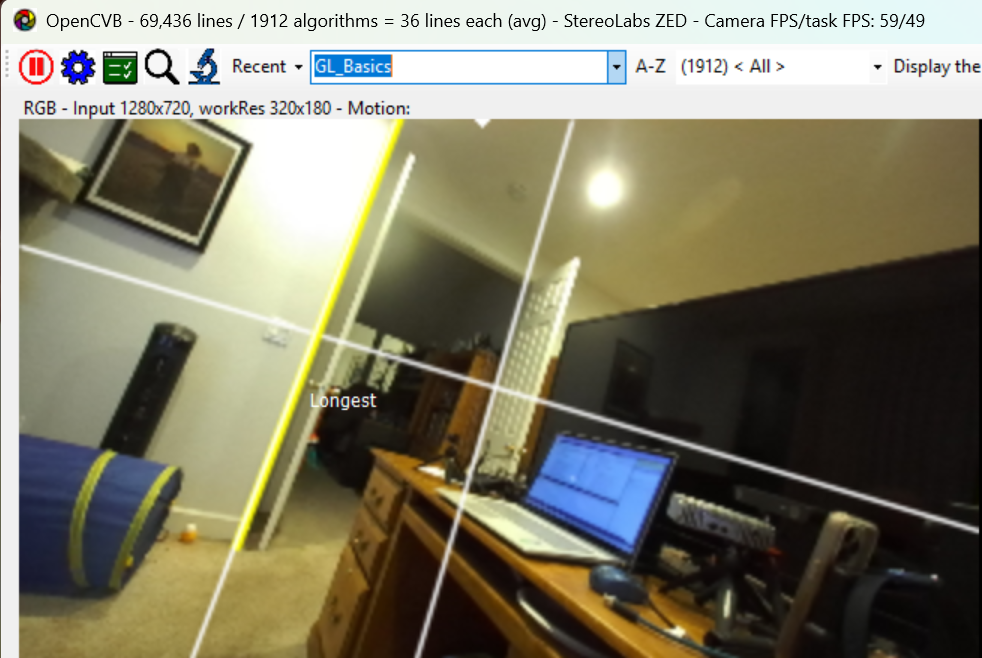

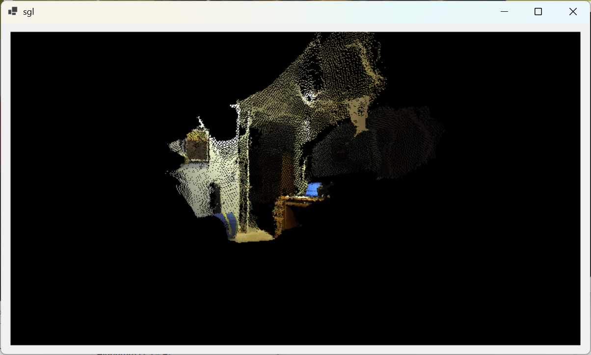

**GL_Basics:** *The top image is the RGB image while the bottom image is the SharpGL output.*

# 2025 August 10th – Python support, HomeDir, Brick Points.

-   Over 1900 algorithms are included, averaging 36 lines of code per algorithm.
-   Python support retired to the XO.vb module – obsolete.
-   Home directory now passed in from Visual Studio.
    -   It means that support for standalone execution is removed.
    -   This change was prompted by the Runtime-Identifier change with Net8.0.
    -   OpenCVB’s binary is never invoked by itself – it is always part of Visual Studio.
-   Brick points are now a possible Feature source – see Feature_Basics example below.

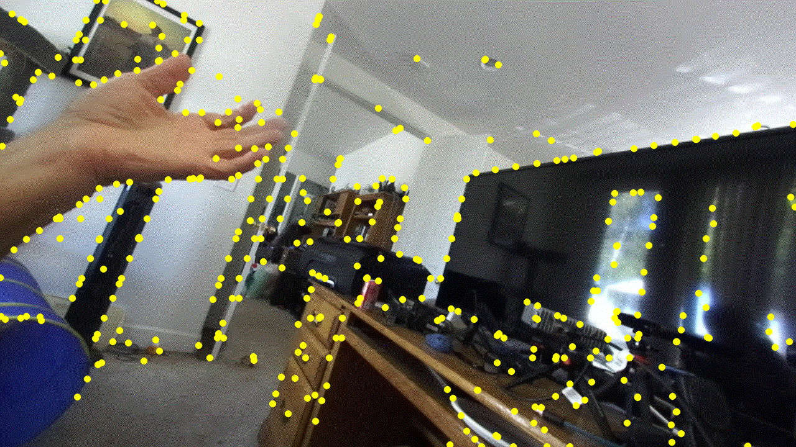

**Feature_Basics:** *Essentially this is just Sobel output but on a “brick” basis where the bricks define a grid covering the entire image. The highlighted points are the location that has the highest intensity in the Sobel output for that brick.*

# 2025 August 2nd – Camera Lineup, Parallel Lines, Angle Property.

-   Over 1800 algorithms are included, averaging 36 lines of code per algorithm.
-   OpenCVB supports the following cameras:
    -   Intel RealSense cameras – D435i and D455.
    -   StereoLabs ZED 2/2i cameras
    -   Orbbec Gemini series – Gemini 335 and Gemini 336L
-   Support is dropped for the following cameras:
    -   Kinect for Azure – no left/right images and Microsoft stopped production.
    -   Orbbec’s Femto series because they lack left and right images.
    -   Mynt cameras – went out of production and SDK is no longer working.
    -   Intel produced several other cameras that lack an IMU.
-   Luxonis Oak D cameras are in development and should be supported again soon.
-   The TreeView would update rapidly when options changed. The correction is in place.
-   Detecting whether a line is parallel to others in the image is a useful property.
    -   Finding lines which are not parallel to any other is also potentially useful.
    -   The value of such “unparallel” lines is different from those that are.
    -   See “Line_Parallel” for more on how to group lines based on their parallelism.
-   The “angle” property of lines varies from -90 degrees to 90 degrees.
    -   All lines can be mapped into a linear spectrum based on their angle.
    -   Negative angles correspond to negative slopes and positive to positive slopes.
    -   Slope is quite useful but non-linear as a classifier in comparison.

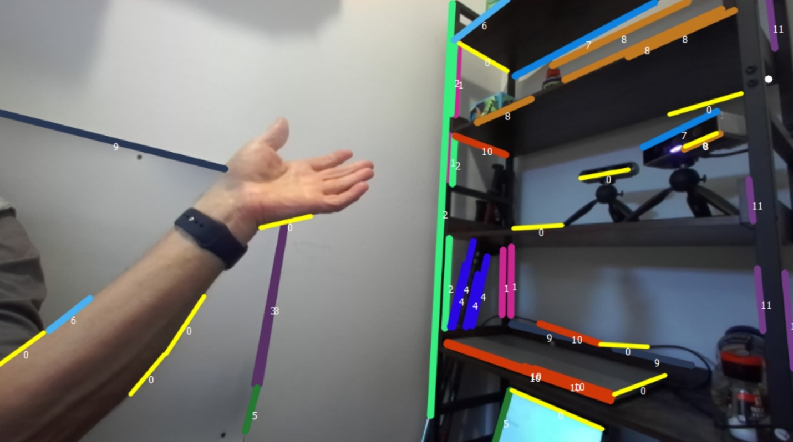

**Line_Parallel:** *Each group of parallel lines has the same color and group ID (the text at the center of the line.) The “0” group designation is for “unparallel” lines that are of different value because no other lines are parallel to them. Lines that are close together and parallel may have more value. The group 4 lines in blue above are one such example but there are several other examples in the image as well.*

# 2025 July 26th – Longest Line, 100 FPS

-   Over 1800 algorithms are included, averaging 38 lines of code per algorithm.
-   The algorithm for the gravity vector, horizon vector, and longest vector changed.
    -   Longest vector is found for every frame (more work still needed.)
    -   If the longest vector changes, the gravity and horizon vectors change as well.
    -   Otherwise, the gravity and horizon vectors are unchanged, eliminating wobble.
    -   Only the IMU controls the gravity vector.
    -   Tracking the longest line is visualized below.
        -   But running Line_Basics provides a more realistic demonstration.
-   GIF image creation was reviewed and improved for single “dst” image captures.
-   Support for 100 fps on the StereoLabs cameras was restored.
-   Camera intrinsics were overlooked with the Net8.0 conversion – now corrected.
    -   Missing intrinsics data doesn’t impact overnight testing. Zeros work too.
-   Switching cameras during a run is simpler and faster and hopefully bug-free.
-   Oak 4D Pro camera (released June 2025) is not working for me – device not found.
    -   Any suggestions would be gratefully received. Even better: a pull request.

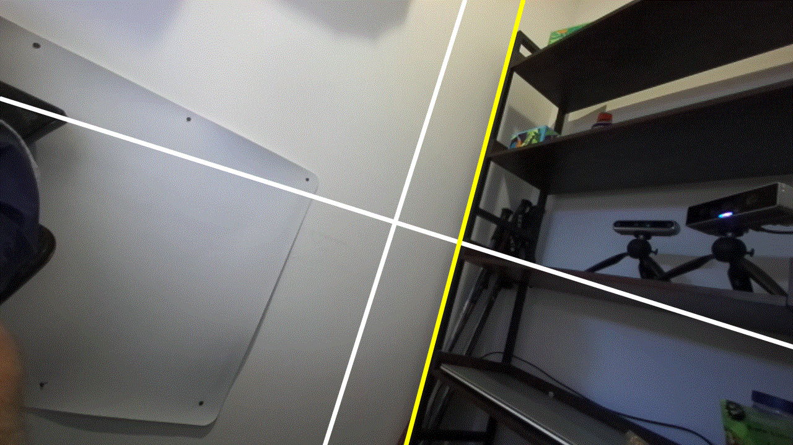

**Line_Basics:** *The longest line in each frame is presented whenever the crosshairs are requested. The result is shown in the upper left image (dst0 or task.color.) If the longest line is unchanged, the gravity and horizon vectors are also unchanged.*

# 2025 July 20th – Gravity Vector, Net8.0 changes, CamZed, Update_All.bat, and Menus.

-   Over 1800 algorithms are included, averaging 37 lines of code per algorithm.
-   The gravity RGB vector is always shown full-length to allow accurate comparisons.
-   The main form for OpenCVB was rebuilt using .Net 8.0.
    -   All the libraries and interfaces were rebuilt as well
    -   This change required a complete review of the OpenCVB’s infrastructure.
-   GIFBuilder has been converted to a .Net 8.0 console application. Update_All.bat fixed.
-   UI_Generator converted to .Net 8.0 console application. VBClasses project updated.
-   The ZED camera support is using the NuGet package instead of a custom VB interface.
    -   The new CamZed C\# class library was able to use NuGet but VB.Net could not.
-   Install script (Update_All.bat) is a one-page file for the SDK and OpenCV downloads.
    -   No more complicated .Net Framework or StereoLabs requirements.
-   GIF algorithms are skipped during overnight testing – only leaf code for visualization.
-   Better default setting for Histogram Bins with an override mechanism if needed.
-   The main form will no longer have menus – they were never being used.
-   For that first build after a download, build the UI_Generate project by itself.
    -   The VBClasses build process uses UI_Generate in a pre-build event.
    -   Alternatively, just build that first build again and UI_Generate will work.

# 2025 July 11th – RGB Line Tracking, Options Close, EdgeLine, DepthRGB, Hull Lines, OpenGL Testing, and Options Changes.

-   Over 1800 algorithms are included, averaging 37 lines of code per algorithm.
-   The “Gravity RGB Vector” is identified and tracked in the RGB image
    -   The line is parallel to the gravity vector if one is available.
    -   The gravity RGB vector is also used to stabilize the gravity IMU vector.
    -   With door or picture frames, nearly identical lines may show instability.
-   OpenCVB will close the app if the algorithm options container is closed.
    -   This was just a convenience feature that felt correct.
-   EdgeLine was reworked to keep track of individual lines and edges.
    -   Lines and edges are identified and loosely tracked.
-   Improved DepthRGB display in dst1 – Depth is shown for the grid rect.
    -   Mouse over DepthRGB (dst1) to see the benefit.
    -   DepthRGB may be displayed as “Colorized Depth” and “Depth Correlations”.
-   Hull lines are lines defined by the edges of a hull.
    -   Simple way to get more feature lines for testing.
-   OpenGL algorithms are exempted from the overnight testing.
    -   Every OpenGL algorithm is a leaf – no algorithms depend on its output.
    -   The goal of the algorithm is simply to visualize the data involved.
    -   Other interactive applications can run during testing runs.
-   RedCloud options are no longer always visible in the algorithm options
    -   The same options appear in algorithm specific forms (typically offset.)
-   StereoLabs support was always present by default but needn’t be.
    -   Use CameraDefines.h to enable support for StereoLabs cameras.
-   Support for Orbbec Gemini 335L is present but Gemini 335 needed an update.
-   OpenCV 4.13 (the current version) was added (PragmaLibs.h updated.)
-   Kinect 4 Azure camera interface dropped – no longer needed.

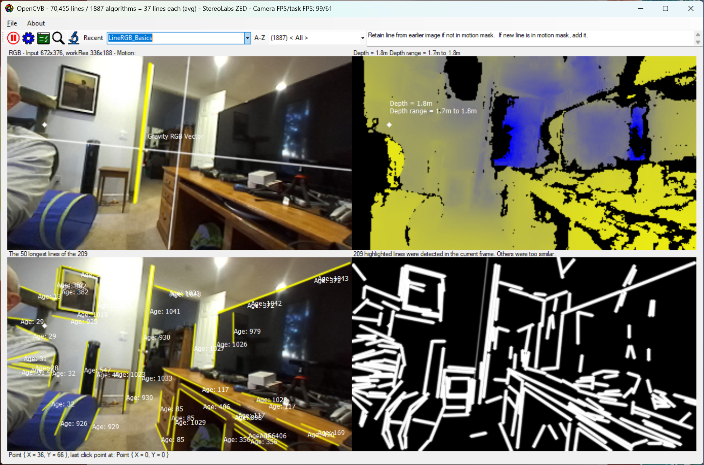

**Line_Basics:** *The presentation of the gravity vector has been updated. In the upper left image, the longest RGB line - the “Gravity RGB Vector” - is shown in yellow. The longest line parallel to gravity is preferred if available. The lower right image shows all the lines detected in the image while the lower left image shows the longest RGB lines and their age in frames. The upper right image shows the DepthRGB with the depth and depth range under the mouse.*

# 2025 June (1) – FindContours, ReadMe.md, RedCloud Review, Gravity Vector, and Improved Line_Info.

-   Over 1800 algorithms are included, averaging 37 lines of code per algorithm.
-   Each retrieval mode in FindContours now has its own algorithm.
    -   The default retrieval mode is “List” since it has stable results and is fast.
    -   A general purpose Contour_Basics allows selecting all retrieval modes.
-   The “OpenCVB Layout” section of this document was completely rewritten.
    -   Accumulated changes to the user interface were updated and explained.
    -   There are fewer icons in the main toolbar – only the high-use icons remain.
    -   The ‘Recent’ button in the toolbar makes it easy to switch between algorithms.
    -   The ‘A-Z’ button is faster than navigating a combo box with so many entries.
-   Backprojection algorithms were reviewed and updated.
    -   BackProject_Basics_Depth shows each of the depth levels in the histogram.
-   The “RedCloud” algorithms segment an image using a reduced point cloud.
    -   “RedColor” algorithms segment an image using the RGB data.
    -   RedCloud algorithms define segments that have cohesive XY values.
-   The gravity vector from the IMU acceleration vector is slightly unstable.
    -   The first attempt at stabilizing was to use a Kalman filter. Results: not bad.
    -   The second attempt uses the longest RGB line as a proxy for gravity.
        -   If the RGB line end points are not stable, capture the IMU gravity vector.
        -   If the RGB line end points are stable, the gravity vector is unchanged.
    -   The second attempt is currently the active method on each frame.
-   The lpMap (line pointer map) was removed – lines are not easily clickable.
    -   Instead, use the global option debug slider to identify a line for display.
    -   See the “Line_Info” algorithm to display the characteristics of a line.

**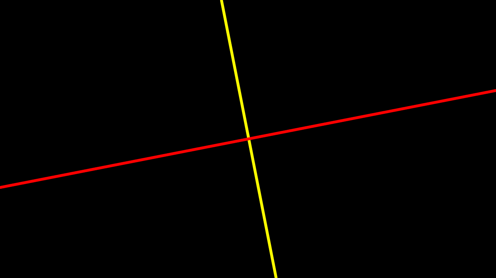Gravity Vector:** *This output shows the typical subtle jitter for the gravity vector. The camera was not moving during this test and shows that the IMU captures the gravity vector but with slight variations from frame to frame. The new Gravity_Basics algorithm in OpenCVB uses the longest line in the RGB image to remove this variability. If the RGB line shows motion, the IMU gravity values are used.*

# 2025 May (1) – Experimental Inputs, Logical Depth in OpenGL, Bricks, Periphery, and RealSense Support.

-   Over 1800 algorithms are included, averaging 38 lines of code per algorithm.
-   A variety of alternative inputs were added for grayscale and color.
    -   Any algorithm can be tested with different input using one click.
    -   Working on edge detection? Prep the input as a sharpened image.
    -   Working on RGB images? Test the algorithm again with HSV data.
    -   Successful experiments would implement the alternative by default.
    -   “Feature Options” (behind the global options) has the complete list.
-   The option for a random palette for all OpenCVB algorithms was removed.
    -   The fixed palette is always preferred and simplifies that user interface.
-   Logical depth is now visualized in OpenGL for comparison with raw data.
    -   Currently, the logical depth is not as good as the original data.
    -   But the potential is there for improvement.
    -   Gradient_Line smoothly applies a linear function to depth data.
-   Overnight testing could fail when image jumped in size – now corrected.
-   Removed the ‘Advice’ scheme – not needed when source is available.
    -   Also, it was too much work to keep up to date.
-   OpenCVB’s matrix of squares (bricks) covers the entire image.
    -   Depth, left/right correlation, features can categorize bricks into groups.
    -   Any problem can be made more manageable when working with bricks.
-   Features of Delaunay polygons that extend beyond the image define a periphery.
    -   The complementary interior defines a fully connected and visible region.
    -   The Feature Coordinate System (FCS) also labels undefined regions.
-   Intel RealSense support now handles the mapping of RGB to left/right images.
    -   Support for multiple Intel cameras broke (name change?). Now fixed.
        -   Multiple cameras can be attached but only one camera will be used.
    -   The Oak-D camera support is still TBD – Oak-D Pro 4 camera not here yet.

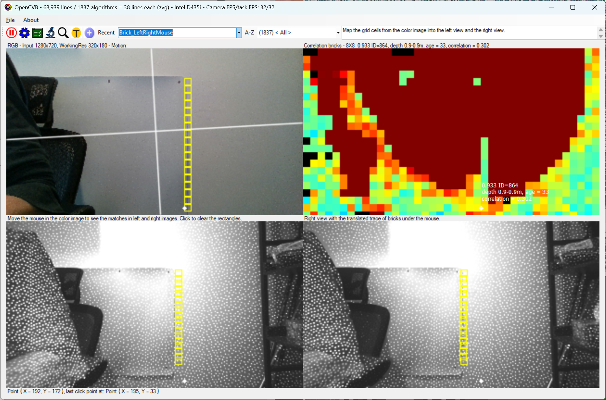

**Brick_LeftRightMouse:** *This algorithm translates path of the mouse movement in the color image to the left camera image (below left.) The bricks in the lower left are then translated to the right image (below right.) The reason this was difficult is that the RealSense cameras don’t align the left image with the color image automatically. Only the RealSense cameras require this 2-step translation.*

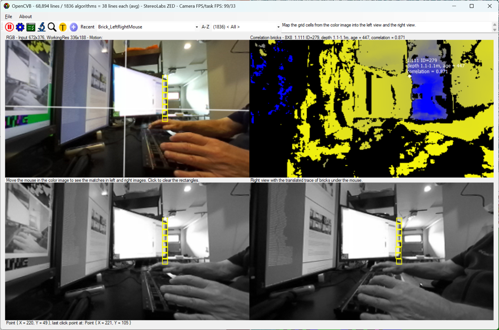

**Brick_LeftRightMouse:** *This algorithm is the same as the one above but uses the StereoLabs ZED 2 camera. Here the color image is aligned with the left image while the RealSense example shows that the left camera is not aligned with the color image. For both sample outputs, the lower right image shows the selected cells that match those in the lower left confirming that the translation between left and right cameras is working properly. There are other considerations though but that is TBD.*

# 2025 April (2) – Camera Support, Feature Options, FCS, Logical Depth, and RGB Lines.

-   Over 1800 algorithms are included, averaging 38 lines of code per algorithm.
-   Support added for some new cameras: Orbbec Gemini 335, Orbbec Gemini 336L
-   UPDATE: Camera support for color and left aligned images:
    -   StereoLabs ZED – working – camera aligns color and left view.
    -   Orbbec Gemini 335L – working – camera aligns color and left view.
    -   Orbbec Gemini 336L – working – camera aligns color and left view.
    -   Orbbec Gemini 335 – working - camera aligns color and left view.
    -   Intel RealSense – not working – camera does not align left and color views.
        -   Manual alternative is not working either.
        -   Translation and rotation parameters from the camera look incorrect.
    -   Oak-D Pro 4 – new camera coming – status is TBD.
-   Important feature options are presented the same way as Global and RedCloud.
    -   Feature options also include some options for edges and lines.
-   Feature coordinate system (FCS) interface was reworked with better colors and aging.
-   Included in this version of OpenCVB is the notion of “LogicalDepth”.
    -   LogicalDepth.vb code shows how lines in depth can enhance depth data.
    -   Lines in depth indicate depth that is logically connected and linear.
    -   How to get lines in depth? Structured.vb algorithms have long provided it.
    -   Similar to structured light, structured.vb finds lines in X and Y directions.
    -   Below is an example of showing how lines are found in structured depth.
-   RGB lines can be used in a similar manner to depth lines but with a difference.
    -   RGB lines will not have consistent depth on both sides of the line.
    -   However, an edge in RGB suggests a disparity in depth.
        -   Lines on a wall and painting frame will have similar depth values.
    -   Lines in depth should have coherent depth for the length of the line.
    -   Optical illusions are examples of when lines are not coherent, hopefully rare.

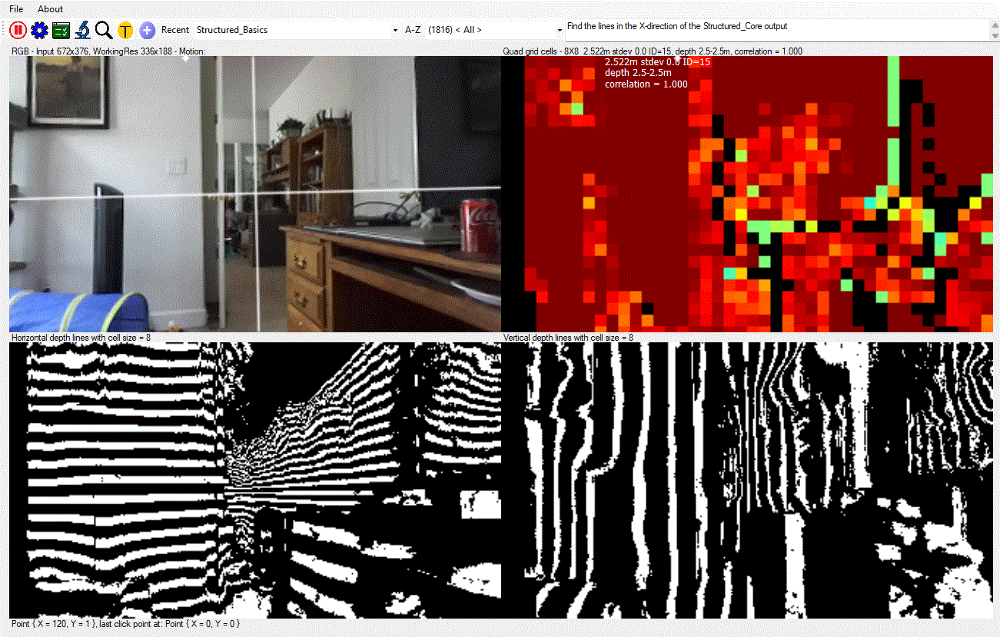

**Structured_Core:** *The Structured_Core algorithm is similar in concept to structured light without additional hardware. All RGBD cameras can produce depth lines. By slicing through the point cloud with various increments, this example produces edges which line detection can use to find lines. Note how lines change from one depth image to the next. Depth data is fairly chaotic pixel by pixel. Depth lines should be coherent and will form the basis of ‘Logical Depth’.*

# 2025 April (1) – Camera Support, Depth Edges, FitLine, LineTrack, Gravity/Horizon, TreeView.

-   Over 1800 algorithms are included, averaging 38 lines of code per algorithm.
-   Camera support for color and left aligned images is still under development.
    -   StereoLabs ZED – working – camera aligns color and left view.
    -   Orbbec Gemini 335L – working – camera aligns color and left view.
    -   Intel RealSense – not working – camera does not align left and color views.
        -   Manual alternative is not working either.
        -   Translation and rotation parameters from the camera look incorrect.
    -   Oak-D Pro 4 – new camera coming – status is TBD.
-   Depth data is filtered with HighVis_Basics to produce higher quality values.
    -   Grid cells can’t be neighbors if disparities are significantly different.
    -   Disparity differences can define coarse edges in depth data.
    -   Grid cells with a large range of depth values also define depth edges.
    -   GIF below demonstrates that poor depth data is trimmed carefully.
-   Disparity differences can also be too close – left and right can’t be the same.
    -   If the change is less than 1 pixel, the depth data is not reliable.
    -   Left and right images are unlikely to have identical locations.
-   FitLine_Basics was redone and is now more accurate.
    -   Fit the points with an ellipse and use the ellipse center line.
    -   The result is better than either FitLine or Eigen functions.
-   Line tracking algorithms were reworked and simplified.
    -   RedColor is used to identify the lines and track their movement.
-   Gravity and Horizon were incorrect at the highest resolution.
    -   FindNonZero found plenty of pixels but all in row zero. Problem fixed.
-   The TreeView output was updated to show detail of algorithms \< 1% utilization.

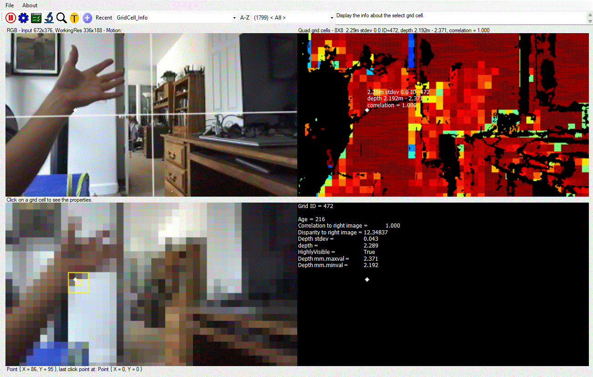

**GridCell_Info :** *This algorithm displays the contents of the grid cell under the mouse cursor but the goal here is to show the impact of removing cells that have a high difference from the disparity in the cell’s neighbor. Essentially, this is edge detection in depth and removes the cells with unreliable depth data – visible in the upper right image..*

# 2025 March (4) – Azure Support, FitLine, Eigen, Feature, XO, Depth Correlation Updates.

-   Over 1700 algorithms are included, averaging 38 lines of code per algorithm.
-   Support for the Azure Kinect 4K is present but \#ifdef’d out
    -   With no left/right image, the support required too much special handling.
    -   Look for the “AZURE_SUPPORT” \#define to reenable support.
    -   “Update_All.bat” install script has commented the Azure-related commands.
    -   The camera order has changed in the OpenCVB options.
        -   Stereolabs’ camera is the preferred camera at the top of the list.
        -   Orbbec Gemini 335L next best.
        -   Then Oak-D because Intel cameras are no longer available.
        -   Mynt is still there in case anyone still has their camera.
-   The FitLine and Eigen algorithms were reviewed and updated.
    -   There are 2 ways to fit a line to raw data but FitLine looks a little better.
-   All the Feature methods use the motion mask to manage the features.
    -   Feature points are stable across frames if there is no motion nearby.
-   Algorithms starting with “XO_” are obsolete and not included in overnight testing.
    -   The obsolete examples should still run when selected manually.
    -   The obsolete examples can be useful for exploring OpenCV API’s.
-   The “Depth Correlation” view includes the depth shadow – see below.
    -   This change is motivated by the difficulty of tracking motion in depth.
        -   There is simply too much volatility in regions with zero depth.
        -   Grid cells impacted by RGB motion get a full update.
        -   And so do grid cells with low depth correlation (unreliable depth.)
    -   RGB motion cannot cover changes in depth shadow from foreground objects.

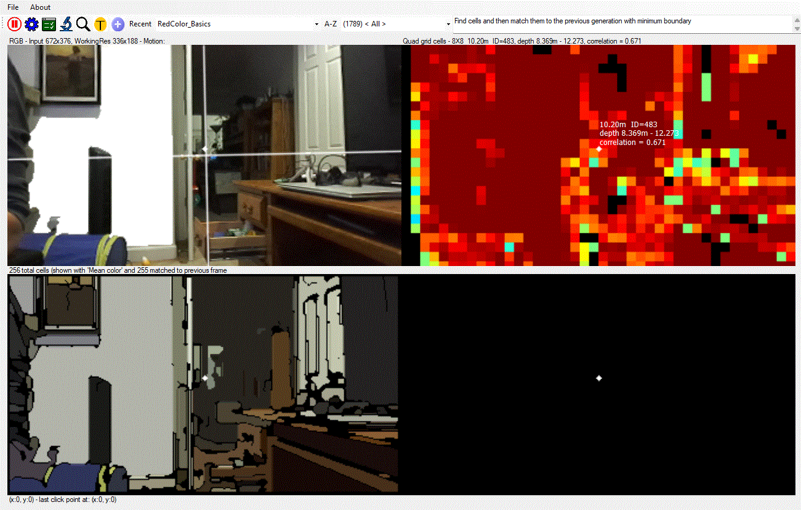

**RedColor_Basics :** *The same algorithm as the previous update but with the improved representation of the “Depth Correlation”. The upper right image is switching between the previous view of the depth and the current one that includes the regions with zero depth.*

# 2025 March (3) – RedColor, Color8U, Left/Right Mean Subtraction, Gravity/Horizon, and the XO algorithms.

-   Over 1700 algorithms are included, averaging 38 lines of code per algorithm.
-   For RedCloud output, a coloring scheme may be selected in the RedCloud options.
    -   Color a cell with its mean color, tracking color, or depth color.
    -   The different color schemes are explained in the first GIF below.
    -   Background cells are unchanged even with hand motion.
    -   Only cells within the motion mask need to be updated.
-   This image stability is visible in all of the Color8U algorithms input to RedColor.
-   All the Color8U algorithms (currently 10) use motion to increase image stability.
    -   BackProject_Full – a histogram setting determines the classifications.
    -   Bin4Way_Regions – 4 color categories based on brightness.
    -   Binarize_DepthTiers – 1-meter categories of depth.
    -   EdgeLine_Basics – (default) uses lines and edges to segment the image.
    -   Hist3DColor_Basics – categorize color pixels with a 3D histogram.
    -   KMeans_Basics – a standard K-Means approach to segmentation.
    -   LUT_Basics – use a look-up-table (LUT) to categorize each pixel.
    -   Reduction_Basics – reduce each pixel mechanically to group similar pixels.
    -   PCA_NColor_CPP – principal component analysis on the entire image.
    -   MeanSubtraction_Gray – grayscale separation into 2 classes.
-   Mean subtraction of the left and right images may show depth correlation better.
    -   The first GIF shows the previous version with no mean subtraction.
    -   The second GIF below alternates with and without mean subtraction.
    -   Check global option ‘Mean Subtraction on Left/Right Images’ to see the impact.
    -   Mean subtraction of left and right images finds better correlation values.
    -   Much more testing is needed to confirm the value of using this approach.
-   The gravity algorithms were reworked to use OpenCV’s FindNonZero.
    -   The gravity vector is defined in image coordinates to help find vertical lines.
    -   Similarly, the horizon vector is used to find horizontal lines algebraically.
    -   The gravity vector can be smoothed with Kalman. See Gravity_Basics.
        -   But it is too slow on some configurations with a moving camera.
-   The XO algorithms are experimental or obsolete algorithms that are not active.
    -   Separating inactive code is simpler and preserves the possibility of later use.
    -   Obsolete gravity and horizon algorithms prompted XO’s creation.
    -   More and more algorithms will migrate there to simplify the source tree.

**RedColor_Basics :** *The different display options for RedCloud output are shown above. The radio button insert shows the current selection. The 3 options are to display the mean color of the cell, a tracking color, and the depth color. The tracking color is a highly visible color that is randomly assigned to a cell so that it may be visually tracked from frame to frame.*

*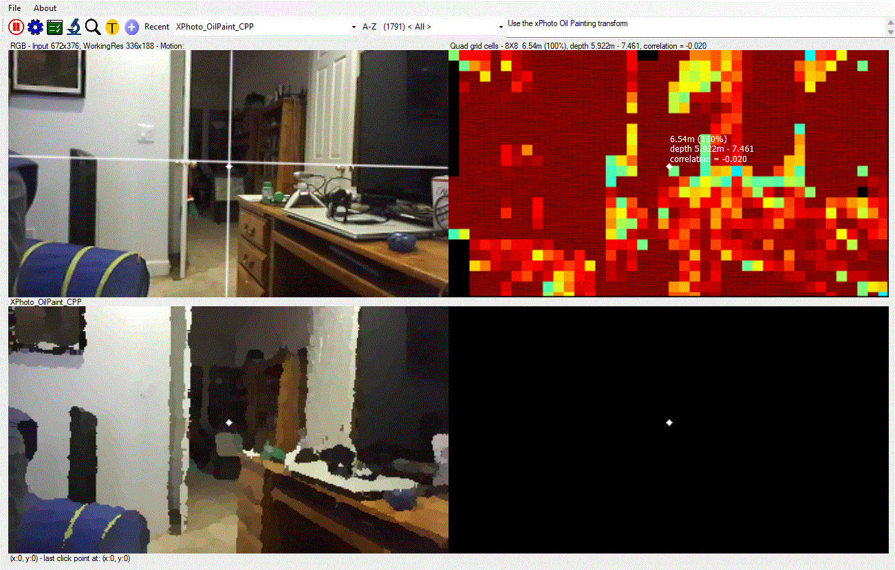*

**Mean Subtraction :** *An OpenCVB global option enables using mean subtraction of the left and right images as input to the depth correlation. The featureless regions are highlighted in the output with solid red regions. The improved output is available to all algorithms in the DepthRGB Mat. More testing is needed to confirm the value of mean subtraction.*

# 2025 March (2) – GridCell and EdgeLine Updates.

-   Over 1700 algorithms are included, averaging 38 lines of code per algorithm.
-   GridCell_Regions expands the horizontal and vertical rectangles.
    -   Grid cells with consistent depth are combined to build contours.
    -   The contours define and track the objects in the image – see below.
-   EdgeLine algorithms: combine edge and line detection to form ‘edgelines’.
    -   Previously labeled EdgeDraw after OpenCV’s EdgeDrawing API’s.
    -   EdgeDrawing names are used to access OpenCV C++ code.
    -   EdgeLine may be a better name to encapsulate how it works.
-   EdgeLine algorithms update the edgeline output only where motion occurs.
    -   Algorithms using EdgeLine_Basics see more consistent output.
    -   Motion-filtered RGB input to EdgeDrawing API’s are not consistent.
    -   Motion-filtering the edgeline output solves the problem.
    -   Motion-filtering EdgeLine output impacts many other algorithms.
-   RedColor_Basics updates only cells that intersect with the motion mask.
    -   Result for all ‘RedC’ algorithms appears much more stable.
    -   ‘RedC’ algorithms are the first to benefit from EdgeLine improvements.
-   Selecting ‘Display Cell Stats’ RedCloud option can be toggled on and off.
-   OpenCVB option to use a fixed or random palette is available.
    -   A fixed palette produces consistent colors across different runs.
    -   Random palettes will be consistently used with all algorithms in a run.
-   Feature_Agast options improve the quality of feature points found.
-   ShowPalette no longer requires normalizing – saves a matrix multiply.
-   Emax_Basics example builds a special set of grid rectangles for its use. 

**Connected_Contours :** *Each region contains grid cells and neighbors which are at approximately the same depth. For instance, the green cell in the lower left consistently defines and tracks the person seated at the desk (our humble programmer.) The wall and painting are tracked as well. The lower right image confirms this by showing the color image and the contours using OpenCV’s AddWeighted method. The tracking color of the wall changes because it is shrinking in size as the contours are colored by order of size in this version.*

# 2025 March (1) – GridCell Updates and Task Algorithms.

-   Over 1700 algorithms are included, averaging 38 lines of code per algorithm.
-   The GridCell algorithms continue to grow with this version of OpenCVB.
    -   GridCell_Basics is run on every frame – it is a “task algorithm”.
    -   Grid cells are available to all algorithms with the task.iddList variable.
    -   The depth between neighboring grid cells defines a connection.
    -   Connections are made both vertically and horizontally = see below.
    -   The depth difference option is available in the global algorithm options.
        -   “Depth Difference Threshold” is specified in centimeters.
-   The complete list of task algorithms:
    -   Depth_Colorizer – to build the depth RGB image.
    -   Gravity_Horizon – to provide the gravity and horizon lines.
    -   Grid_Basics – to define the current grid cells and size.
    -   GridCell_Basics – to get depth correlations for grid cells.
    -   IMU_Basics – to gather the current IMU data.
    -   IMU_GMatrix – define gravity conversion matrix for the point cloud.
    -   Motion_Basics – to build the motion mask for the current frame.
-   The PixelViewer form can be closed by both the caption box and button.
-   The AddWeighted_Basics algorithm was moved into a function – reduced code.

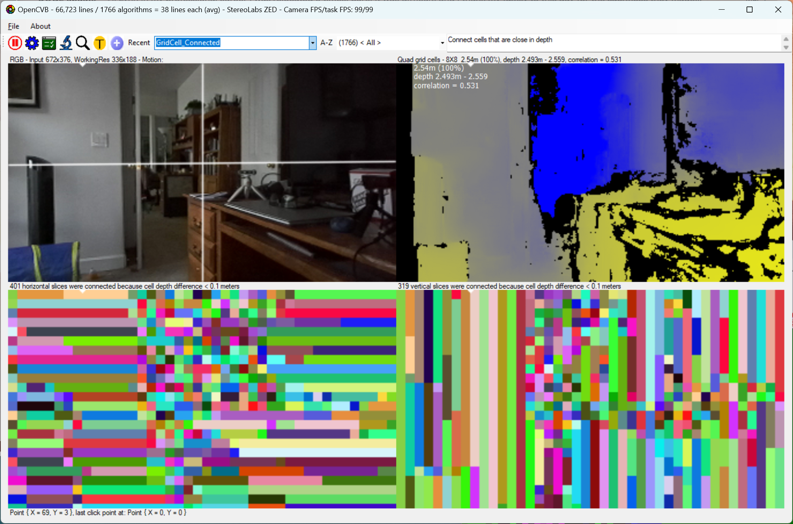

**GridCell_Connected:** *Grid cells in the lower left image are combined horizontally if their depth is within X centimeters. The same grid cells are combined vertically in the lower right image. Note that many grid cells are not combined vertically or horizontally. Their depth is not close to any of their neighbors. Cells with no depth can still be combined. An example is the entire vertical column at the left of the image where there are no depth values.*

# 2025 February (3) – Azure Kinect Support, Depth Views, Grid Cells, and Motion Detection Compromise.

-   Over 1700 algorithms are included, averaging 38 lines of code per algorithm.
-   The Azure Kinect camera updated with access to extrinsics but it is limited.
    -   K4A is a TOF (time of flight) camera and does not use disparity to get distance.
    -   Confirming depth with correlation is not possible with RGB/Left images.
-   For all other cameras correlations are possible with left and right images.
    -   Grid cells define a region which is used to confirm depth quality.
    -   Correlations measure the quality of the depth data in each grid cell.
    -   Some cameras provide left images already aligned with the RGB image.
    -   But some need calibration parameters to connect RGB and left grid cells.
        -   See below where the Intel D435i RGB is mapped into the left image.
    -   The mouse cursor displays the correlation coefficient and depth pixel density.
    -   Oak-D correlations are under development – new camera coming.
-   A reworked Motion_Basics uses grid cells to manage the motion rectangles.
    -   Motion detection is a compromise that successfully removes artifacts.
        -   Motion_BasicsValidate shows the small size of any differences.
    -   The default setting is to update pixels only where motion is detected.
        -   Motion-filtered RGB means no heartbeat update to the RGB image.
    -   Pixels undisturbed by motion provide algorithm results that are more stable.
    -   The “Depth Correlation” view is a good example of motion detection usage.
        -   The upper right image (below) shows the red grid cells are stable.
    -   Motion detection is a compromise that preserves grid cell color.

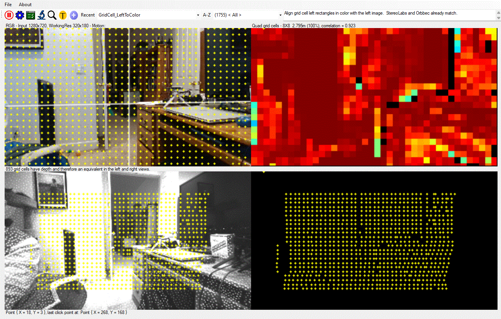

**GridCell_LeftToColor :** *The upper right image rotates between the 3 different representations of the depth data. The correlation coefficients are highlighted in red for grid cells that have 90%+ correlation between the left and right images, indicating that the grid cell is highly visible to both the left and right and is likely to have excellent depth data. The lower left image shows the corresponding points for the RGB data (upper left.) The camera is the Intel RealSense D435i and the left image is grayscale. The lower right image has the same pixels highlighted as the lower left image but is more readable. Use the mouse cursor to display the correlation coefficient and pixel count percentage for the grid cell under the cursor.*

# 2025 February (2) – More ‘QuadDepth’ improvements, OpenGL display changes, Extrinsics/Intrinsics, and Connected Depth Cells

-   Over 1700 algorithms are included, averaging 38 lines of code per algorithm.
-   The ‘QuadDepth’ display was configured to show OpenGL quad’s or rectangles.
    -   Neighboring quads are now connected if they are close in depth.
    -   The depth difference between cells is controlled with a global option.
    -   Neighboring cells are connected both vertically and horizontally.
    -   Cursor movements display the depth of any cell under the cursor.
    -   Debug feature: cell depth is displayed even when the algorithm is paused.
    -   NOTE: right-click the mouse to avoid updating the mouse move value.
        -   Move off the screen while holding the right-click to debug.
-   OpenGL algorithms typically display raw point cloud data.
    -   OpenGL_QuadCompare algorithm displays multiple views.
    -   Options include raw point cloud, flat or connected depth cells.
    -   Connected depth cells remove many artifacts or floating points.
    -   Horizontal and vertical connections build a solid OpenGL ‘weave’.
-   The fx, fy, ppx, and ppy intrinsics were reviewed and tested.
    -   More testing is needed to handle cameras without RGB=Left View.
    -   All camera parameters are adjusted using the ratio of working to capture size.
-   DepthCell.vb has a correlation map showing a cell’s left to right image correlation.
    -   A mask of the heat map can be thresholded to isolate high quality cells.
    -   The correlation relies on intrinsics and extrinsics for the left and RGB.
        -   And the corresponding values for the left and right images.
        -   For the StereoLabs Zed 2/2i cameras, the RGB equals the left image.
-   The MYNT EYE camera support is not working. Rebuilding the SDK doesn’t work.
    -   This camera is highly desirable because the RGB and left cameras are the same.
    -   Any MYNT developer’s pull request would be gratefully received.
-   The upper right image (DepthRGB) shows the % depth pixels that are present.

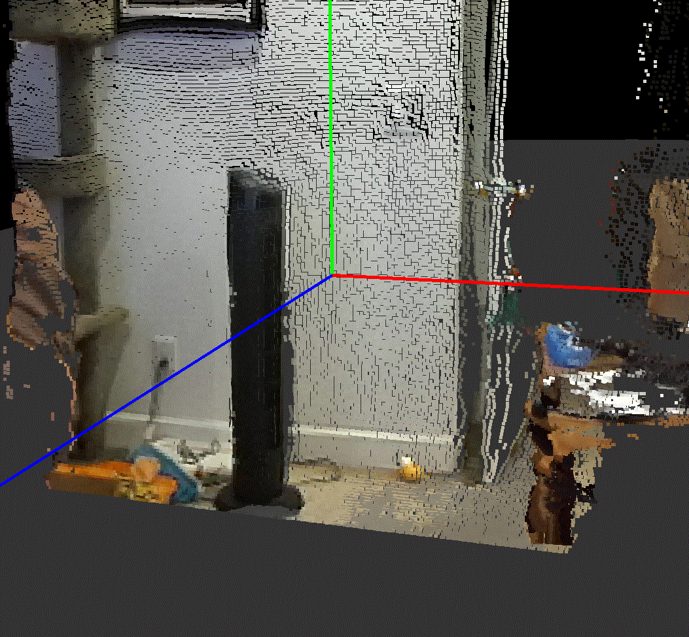

**OpenGL_QuadCompare :** *The 3 different OpenGL display formats are shown above – raw point cloud, flat depth cells, and connected depth cells. The flat and connected depth cells are OpenGL quads, not points. Note that the connected depth cells remove some of the floating artifacts. A cell is connected to its neighbors if their depths are within X centimeters (controlled with an option.) The depth cells are then connected in vertical and horizontal directions to produce a solid appearance.*

# 2025 February (2) – Improved Depth Display, QuadDepth OpenGL display, and Left/Right Cameras.

-   Over 1700 algorithms are included, averaging 38 lines of code per algorithm.
-   The least used OpenCVB image is the “DepthRGB” in the upper right.
    -   The option to use an alternative “QuadDepth” view is now the default.
    -   The QuadDepth image is built using the motion mask in OpenCVB.
        -   Depth data does not change unless there is motion in that cell.
    -   The conventional display of the depth is still optionally available.
    -   Mouse movement in the OpenCVB app will display a location’s depth.
    -   The first GIF image below shows what the output looks like.
        -   The depth histogram also shown is for the selected cell.
        -   See the “Ideal_CellPlot” algorithm for more information.
-   OpenCVB’s OpenGL interface uses ‘quads’ to display rectangles for the scene.
    -   Each quad has depth and color and the size is controlled with an option.
    -   See the second GIF display below to understand this further.
-   The left and right camera images are now always provided in grayscale.
    -   Some cameras could not provide color left and right images.
    -   The limited use of left/right images didn’t require color values.
        -   Future uses may require color so some cameras may be limited.
    -   Using grayscale images is more efficient for now.

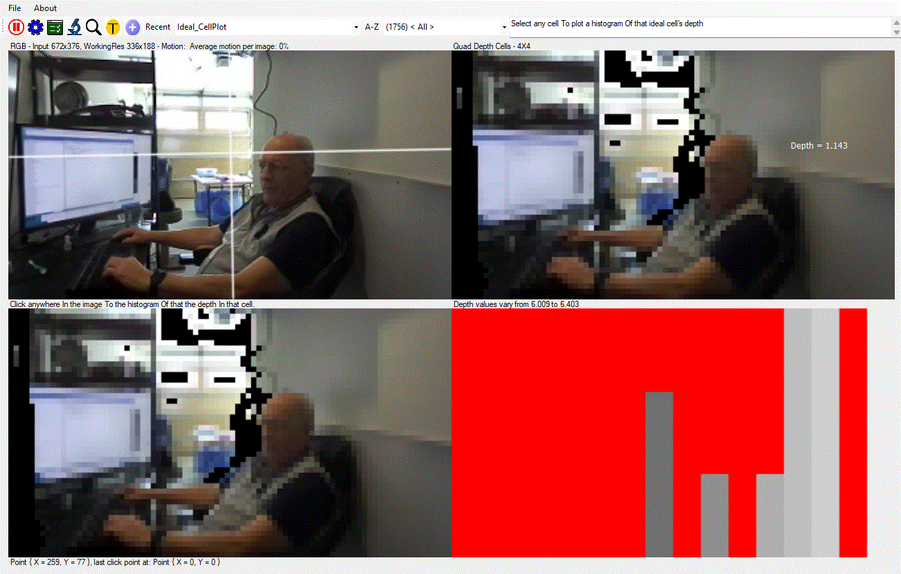

**Depth Display:** *The option to use the “QuadDepth” display is shown in the upper right image. In this example, the “Ideal_CellPlot” algorithm shows the histogram of the cell’s depth data at the selected location while the mean depth for the cell is shown in the upper right image. The mouse controls which histogram and mean depth are shown. Mouse movements in all algorithms will show the mean depth in the upper right image for the cell under the mouse.*

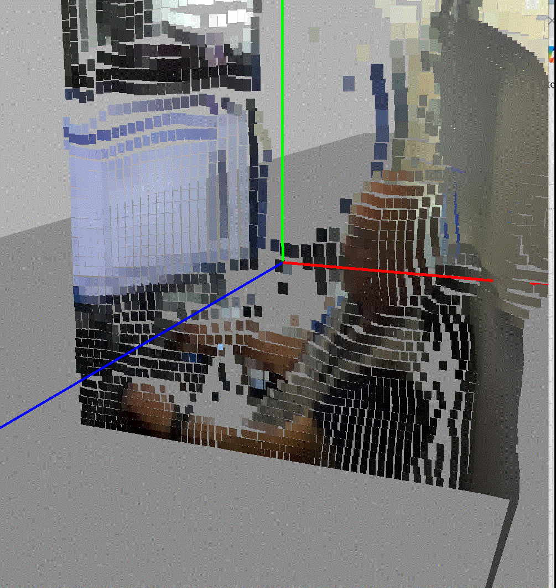

**OpenGL_QuadDepth:** *The “QuadDepth” data that is displayed in the upper right image of the output for all the algorithms can also be displayed in OpenGL. Each cell is provided to OpenGL as a quad that is always filled with the mean color for the cell. In the sequence above the last image is zoomed sufficiently to show that each cell is a rectangle, not a set of points.*

# 2025 February (1) – Ideal Depth, OpenGL Triangles and Quads.

-   Over 1700 algorithms are included, averaging 38 lines of code per algorithm.
-   Ideal depth is a grid of cells that each contain a healthy amount of depth data.
    -   The cell’s pixels are clearly visible in both left and right camera views.
    -   The cell contents enable the census algorithm to match pixels.
    -   The more pixels that are matched the better the estimate of depth.
    -   Ideal_Basics matches left and right cells converting depth to disparity.
        -   disparity = baseLine \* (focal length) / depth.
-   The OpenGL interface to OpenCVB has improved triangle and quad support.
    -   Triangles used in OpenGL can be shaped – see OpenGL_IdealShapes.
    -   OpenGL Quads can better represent the depth data – OpenGL_QuadIdeal.
-   OpenCVB’s OpenGL interface is improved with multiple point cloud buffers.
    -   3D cameras produce point clouds that are always slightly different.
    -   Combining them produces a more solid appearance to the 3D model.
    -   Below is an example showing the cosmetic difference.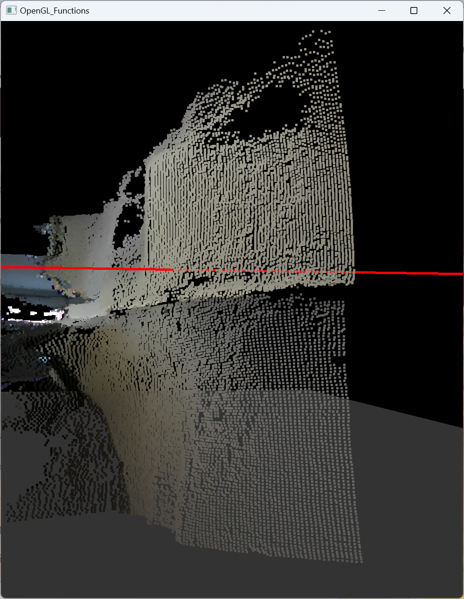  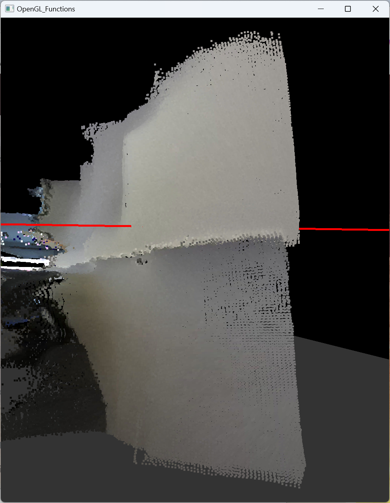 **OpenGL Multiple Buffers:** *Since the point cloud is different on every frame (depth is only an approximation), using multiple buffers allows a cosmetic improvement to the appearance of the point cloud. The first point cloud is what one buffer looks like while the next uses the last 10 frames. The frame rate for this example was 60 fps at 320x240 with significant magnification (approximately 4X.)*

# 2025 January (2) – GifBuilder updates, RGBFilter, Ideal Depth.

-   Over 1700 algorithms are included, averaging 38 lines of code per algorithm.
-   GifBuilder was reworked to capture the screen and use AnimatedGif.
-   RGBFilter available once again – filter the RGB input with any of the following:
    -   Blur, Brightness, Contrast, Dilate, Erode, Laplacian,
    -   Mean Subtraction, Sharpen, or White Balance.
    -   RGBFilter is another task algorithm – run without explicit invocation.
-   Cells with “ideal” depth are those filled with depth pixels.
    -   Ideal depth is clearly visible from both the left and right cameras.
    -   See example output below showing cells covering the depth image.
-   TreeView form was moved into the VBClasses where the data is produced.
    -   Allowed code to be simpler in the Main form.
    -   TreeView button is no longer needed in Main

**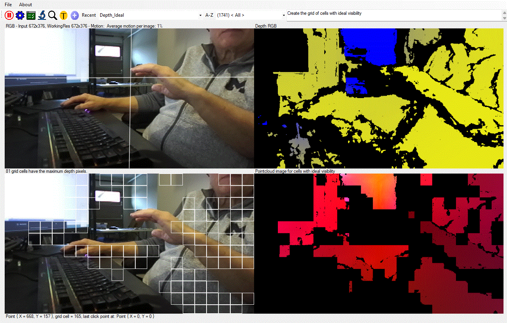Depth_Ideal :** *The cells marked in the lower left image have ideal depth data with a high percentage of the cell’s pixels containing a depth value. By definition, they are the cells which are fully visible in both the left and right cameras. The lower right image is the point cloud containing only the cells that have ideal depth. The lower right image is filtered by motion – only the cells in the motion mask are updated on each frame.*

# 2025 January (1) – Task Algorithms, Upgraded Toolbar, and Translation Changes

-   Over 1700 algorithms are included, averaging 38 lines of code per algorithm.
-   ‘Task algorithms’ are algorithms that are present on every run.
    -   Task algorithms provide IMU, motion, horizon, lines or grid elements.
    -   Task algorithms appear in the TreeView output (previously hidden.)
    -   Click on any TreeView element to see the algorithm’s contribution.
        -   See the GIF image below to see how this works.
    -   Overhead for each algorithm is also shown along with wait times.
    -   Inactive algorithms, when selected, display the ‘inactive’ message.
    -   Selecting a TreeView entry shows algorithm’s images, labels, and TrueText.
-   OpenCVB now uses OpenCV 4.120, the latest version of OpenCV.
    -   Delete the opencv directory and run ‘Update_All.bat’ to upgrade.
    -   To remain on an older version, update the ‘PragmaLibs.h’.
-   OpenCVB’s focus is VB.Net as translation to C\# and C++ has been demonstrated.
    -   If a C\# or C++ version is needed, use the CodeConvert.ai to translate.
    -   OpenCVB’s interface to CodeConvert.ai has been removed.
        -   CodeConvert.ai reworked their website and it stopped working.
    -   Drop in algorithm count is due to removing translations.
-   Options derive from ‘OptionParent’ and no longer count as algorithms.
    -   Options previously derived from TaskParent and added to the count.
    -   Moving to OptionParent means options do not add to the algorithm count.
-   The Line.vb algorithms were reviewed and improved.
    -   Lines, once computed, are available to all algorithms in task.lpList.
    -   Lines are now collected across frames using the motion mask.
        -   Existing lines in regions with motion are tossed.
        -   New lines in the motion mask are all added.
-   Lines are built from the left and right images with binocular cameras.
    -   Lines provide the ability to confirm distance with uniform depth patterns.
-   Main form toolbar is simplified – low use buttons removed or hidden.

    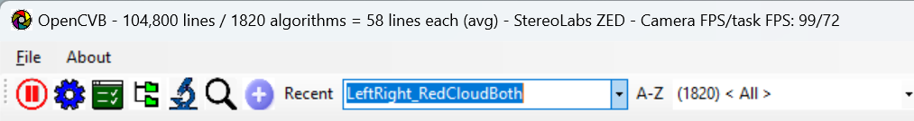

-   The “Blue +” button to create new algorithms is limited to VB.Net, C++, and OpenGL.
-   Left and Right camera images are now always grayscale (some were color.)

**RedColor_Basics:** *OpenCVB’s TreeView (at right above) shows all the algorithms that contribute to the output of the requested algorithm – in this case RedColor_Basics. As each algorithm in the tree is selected, it is highlighted (albeit faintly here) and the algorithm’s output is shown (now including labels and TrueText.) This capability enables a further understanding of how the algorithm was constructed. Task algorithms are run on every frame and are included in the TreeView even though they are not explicitly called by the algorithm. The frame rate of 99 fps is not a mistake. The Stereolabs Gemini camera runs at that rate when capturing 640x480 images.*

# 2024 December - Recent Changes

-   Over 3800 algorithms are included, averaging 33 lines of code per algorithm.
-   RedCloud algorithm default is the featureless option (see below.)
    -   RedCloud results are validated using the tracking color and age.
-   The OpenCVSharp NuGet packages updated to November 2024 release.
-   Install batch file was updated to accommodate .Net 3.5 optional install.
    -   The prompt to confirm reading the instructions now works.
    -   Any install problems are high priority given these recent changes.
-   Features are widely used and are prepared for each frame automatically.
    -   Feature points are provided in both floating point and integer form.
-   Added a new version of KNN that normalizes the input data – KNNorm.vb.
-   Motion mask is used in more algorithms.
    -   Every frame is optionally updated only where motion occurred.
    -   Motion-filtered images for depth and RGB are provided by default.
    -   Motion-filtered depth is not robust but RGB images are.
-   Switching to the C++ versions of the camera interfaces is simplified.
    -   Toggle which camera interface is active using comments in getCamera.
-   A global option determines if the depth is truncated at ‘maxDepth’.
    -   The default is to use all data but it can optionally truncate at X meters.
-   The ‘A-Z’ group selection button is moved next to the algorithm combo box.
    -   See the toolbar in the latest screen shot below for RedCloud_Basics.
-   Managed C++ code is disabled for now – not much value there for now.

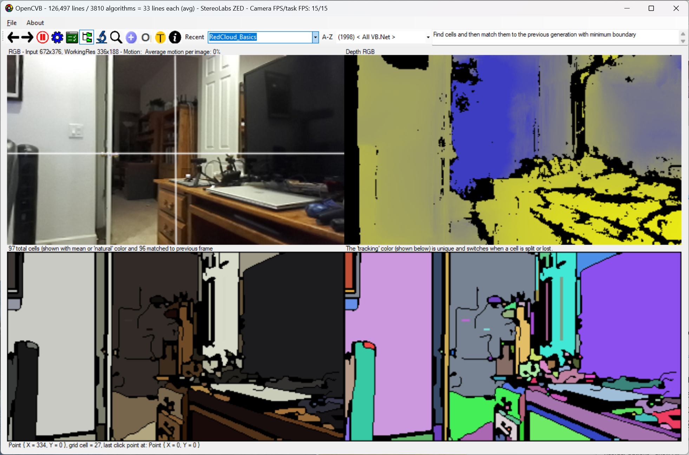

**RedCloud_Basics:** *All the RedCloud algorithms were reviewed and updated with the best segmentation approach – featureless regions built with Edge_Draw. Edge_Draw is an OpenCV user-contribution and is better suited to detect edges than conventional alternatives like Canny or Sobel. The lower left image uses the mean color of the pixels to paint the entire cell while the lower right image uses a random ‘tracking’ color which changes whenever the cell is split or lost.*

# 2024 November - Recent Changes

-   Over 3800 algorithms are included, averaging 33 lines of code per algorithm.
-   The “A-Z” toolbar button in the main OpenCVB form allows speedy group access.

    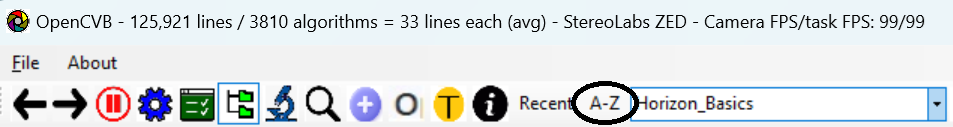

    -   There are almost 250 algorithm groups in OpenCVB – now one click away.
    -   Clicking in the grid will land at the first algorithm in that group.
    -   Faster than scrolling through the entire list of available algorithms.
-   **Line_VerticalHorizontal** identifies gravity and the horizon in the color image.
    -   Combined with scene motion, identified lines are retained across images.
-   Camera Motion can be identified in the color, left image, and right image.
    -   With 3 votes, camera motion can be verified.
-   Horizon can move below the plane causing pointcloud Y-values above/below zero.
    -   Horizon is now also computed as the perpendicular of the gravity vector.
-   This update includes the Feature Coordinate System – see FCS_Basics.
    -   A Delaunay map is created using the features or lines.
    -   The map allows tracking the area even as the features come and go.

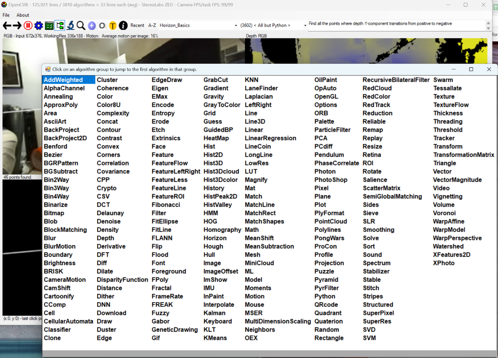

**“A-Z” Toolbar Button:** *There are almost 250 algorithm groups in OpenCVB, and the “A-Z” toolbar button allows speedy access to any of the groups. Clicking on any of grid entries will land the user at the first algorithm in the group in one click. Accessing a specific algorithm in that group is a click away in the pulldown of the list of available algorithms.*

# 2024 October - Recent Changes

-   Over 3800 algorithms are included, averaging 33 lines of code per algorithm.
-   Motion_Basics was replaced with another motion detection algorithm.
    -   The mean color of each cell in the grid is compared to previous values.
        -   A 3D distance in color value is used to compare cells.
    -   If color distance is more than a fixed value, the grid cell has motion.
        -   Computation is low-cost and could have been done decades ago.
    -   Rather than more resolution, low resolution proved beneficial.
    -   Often just individual pixels are different – Motion_Basics output below.
    -   Depth, color, and left may be constructed using motion (not right image.)
    -   Motion_Basics works well across all cameras at all resolutions.
        -   Grid cell size is approximately the same in all cases by default.
    -   A motion mask allows other algorithms to simplify their actions.
-   An OpenCVB global option determines using raw or motion-constructed images.
-   The C++ camera interface for StereoLabs ZED 2i cameras was restored.
    -   The VB.Net interface was not getting 100 FPS initially.
    -   After the restored C++ interface got 100 FPS, the VB.Net interface did too.
    -   Both interfaces are available in the OpenCVB options list of cameras.
-   VB.Net version for Kinect 4 Azure camera support is under development.
    -   Existing Kinect 4 Azure camera support is still available (UI updated).
-   A long-term heartbeat is now available in the task structure.
    -   Images can now be refreshed on a heartbeat or heartbeatLT (long term).
    -   The current heartbeat is 1 second while heartbeatLT is X seconds.

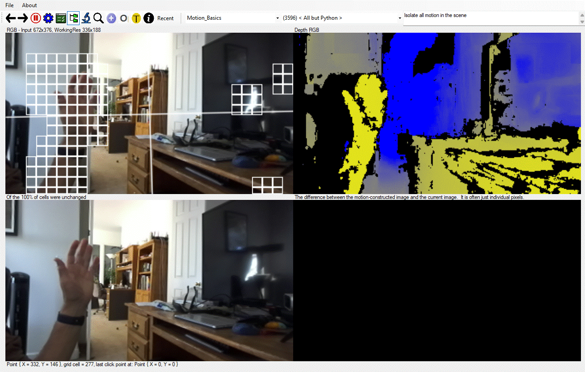

**Motion_Basics:** *This motion detection algorithm uses low resolution mean values to find areas that contain motion. The top left image is the original color image (optionally overlaid with cells where motion was detected) while the image below left was constructed from an earlier image (often seconds earlier) updated with cells containing motion. The depth data in the upper right is also a composite of an earlier image and the latest depth where motion was found. The image in the lower right is the difference between the current color image and the image in the lower left. The implication is that almost all motion has been detected and no artifacts have been generated in the color image. Depth data has visible artifacts and will require more work because of shadow.*

# 2024 October - Recent Changes

-   Over 3700 algorithms are included, averaging 33 lines of code per algorithm.
-   A magnifying glass button was added to the OpenCVB toolbar.
    -   It can provide more detailed images of specific areas.
    -   The detailed image is dynamic – it will update with each frame.
    -   Mouse movement can provide additional flexibility while drawing.
    -   Magnifying glass works with static images while OpenCVB is paused.
    -   All 4 images show the rectangle being drawn.
    -   See the image below to help find the new button and see sample output
-   Contrast: the “Microscope” button (next button to the left) provides more detail.
    -   The “Microscope” button produces hex values.
-   OpenCV’s machine learning algorithms are all available in a single algorithm.
    -   See the second sample image below; image segmented by features.
    -   ML_Basics mimics the functionality of OpenCV’s Points Classifier example.
    -   Feature detected is the output of the Laplacian 2nd derivative.
        -   Laplacian was more accurate in finding the edge pixels for use with ML.
-   C\# algorithms are now always configured in Release mode.
    -   Makes it easier to determine the value of optimizing any VB.Net algorithm.
-   Orbbec Gemini 335L is now working at 30 FPS.
    -   Care must be taken to make sure it is on a USB-C port.

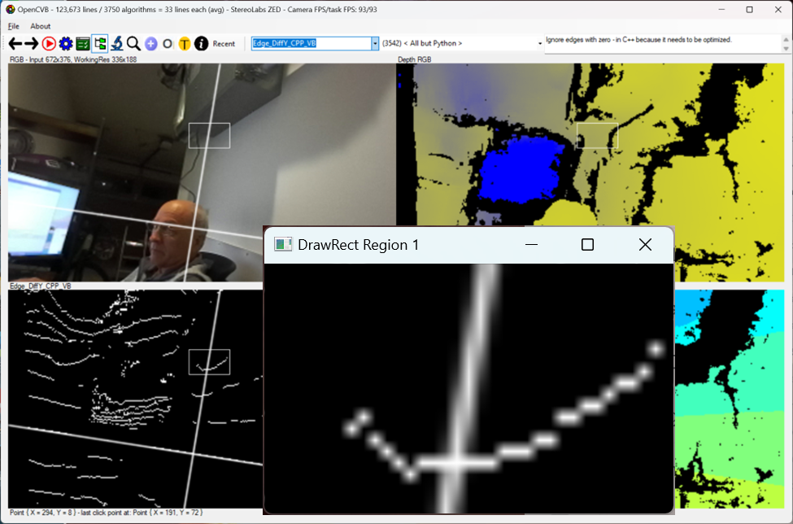

**Magnifying Button on Toolbar:** *First draw a rectangle in any of the 4 images then click the magnifying button to see a 5X copy of the region. The magnified image will reflect the image*
