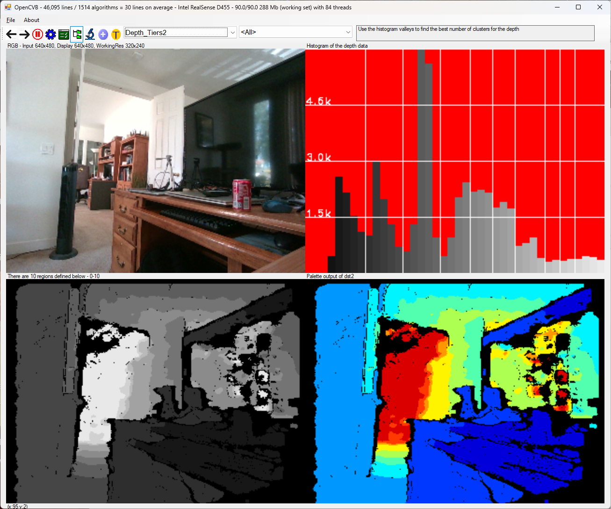
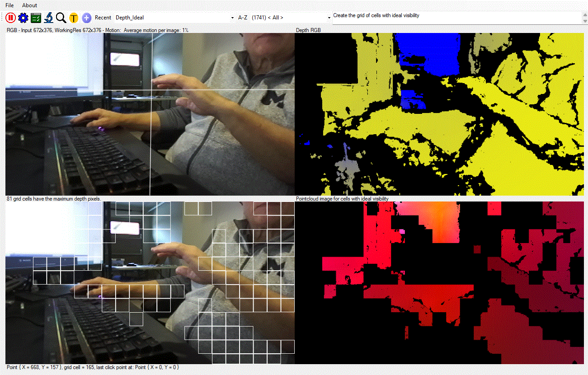

# March 2025 (Part 2) – GridCell and EdgeLine Updates.

-   Over 1700 algorithms are included, averaging 38 lines of code per algorithm.
-   GridCell_Regions expands the horizontal and vertical rectangles.
    -   Grid cells with consistent depth are combined to build contours.
    -   The contours define and track the objects in the image – see below.
-   EdgeLine algorithms: combine edge and line detection to form ‘edgelines’.
    -   Previously labeled EdgeDraw after OpenCV’s EdgeDrawing API’s.
    -   EdgeDrawing names are used to access OpenCV C++ code.
    -   EdgeLine may be a better name to encapsulate how it works.
-   EdgeLine algorithms update the edgeline output only where motion occurs.
    -   Algorithms using EdgeLine_Basics see more consistent output.
    -   Motion-filtered RGB input to EdgeDrawing API’s are not consistent.
    -   Motion-filtering the edgeline output solves the problem.
    -   Motion-filtering EdgeLine output impacts many other algorithms.
-   RedColor_Basics updates only cells that intersect with the motion mask.
    -   Result for all ‘RedC’ algorithms appears much more stable.
    -   ‘RedC’ algorithms are the first to benefit from EdgeLine improvements.
-   Selecting ‘Display Cell Stats’ RedCloud option can be toggled on and off.
-   OpenCVB option to use a fixed or random palette is available.
    -   A fixed palette produces consistent colors across different runs.
    -   Random palettes will be consistently used with all algorithms in a run.
-   Feature_Agast options improve the quality of feature points found.
-   ShowPalette no longer requires normalizing – saves a matrix multiply.
-   Emax_Basics example builds a special set of grid rectangles for its use.
-   A log of previous changes is included at the bottom of this document.

**Connected_Contours :** *Each region contains grid cells and neighbors which are at approximately the same depth. For instance, the green cell in the lower left consistently defines and tracks the person seated at the desk (our humble programmer.) The wall and painting are tracked as well. The lower right image confirms this by showing the color image and the contours using OpenCV’s AddWeighted method. The tracking color of the wall changes because it is shrinking in size as the contours are colored by order of size in this version.*

# Introduction

There is no better documentation of an algorithm than a working example, especially in computer vision where the output is often self-explanatory. Imagine having 1000’s of OpenCV examples in a single app, where each algorithm is less than a page of code and written in a familiar language. Each algorithm is designed to be reused in other algorithms, so variations can be easily built. Moreover, each algorithm is free from any baggage from a user interface or environment.

A full installation can take about 30-50 minutes using the 1-step “Update_All.bat” file discussed in the “Installation” section below. But there is no obligation to install needed libraries just to read the code for an algorithm. Open the OpenCVB.sln file after downloading and inspect the code in the C++, C\#, VB.Net or Python. Each algorithm gets a standardized presentation of all the data from any of the RGBZ cameras listed below.

However, a full installation is recommended. An algorithm may fit in one page of code and reading is one way to review the code but understanding the algorithms is a lot faster and easier when the output is visualized. The output is often self-documenting or a natural representation of the algorithm’s in tent.

The basic layout of OpenCVB is shown below. Any of the algorithms can be selected from the first combo box at the top of the form. The second combo box is used to select an algorithm group. The default grouping is “\<All but Python\>”. There are a variety of other special groupings that select, for example, all Python or all C++ algorithms.

# OpenCVB Layout

**OpenCVB Layout:** *The layout of the OpenCVB application shows the RGB camera output in the upper left, the colorized depth data in the upper right, and the algorithm outputs in the bottom left and right. This algorithm (Segmented Linear Regression or SLR_Trends) has only one output in the lower left.*

**OpenCVB ToolBar:** *The first combo box selects the algorithm – here “SLR_Trends” while the second combo box selects the group of algorithms – here “\<All but Python\>” which controls what algorithms are available in the first combo box. The “\<All but Python\>” group includes all the C\#, C++, and VB.Net algorithms and excludes the Python algorithms.  It includes a count of algorithms in that group as well.*

**Navigation Buttons:** *The buttons navigate between algorithms. Use these arrows to jump between algorithms. The “Recent” button will present a list of previous algorithms to allow jumping to algorithms other than the previous or next.*

**Run and Pause:** *The button will start and pause the algorithm.*

**OpenCVB Settings:** *The button will start and pause the algorithm.*

**Regression Testing:** *The  button will start and stop the overnight testing of each algorithm at various resolutions.*

**Tree View:** *The  button shows the tree view of the current algorithm. Since many algorithms create a stack of inputs and outputs the tree view shows all them and allows any entry in the stack to be selected. Selecting an entry will show the output of that algorithm. Also shown in the Tree View is the percent utilization of each contributing algorithm.*

**Pixel Viewer:** *The  button will display a separate form showing the pixel values for any of the 4 images. The pixel viewer is aware of the image type so if the image is 32 bit, it will show the floating point values.*

**Create Algorithm:** *The  button will open a dialog box that guides the user to create a new algorithm. The different types of algorithms that may be created are VB.Net, C++, OpenGL, C\#, or Python.*

**Complexity Evaluation:** *The  button will run the current algorithm across a variety of resolutions to evaluate the complexity of the algorithm. Complexity if often designated as O(n), hence the  icon.*

**Algorithm Translation:** *The  button invokes the Touchup.exe application that guides the translation of VB.Net algorithms to C\#.*

**Advice/Info Button:** *The  button will display any advice about how to use the algorithm. With so many global and local options, this advice will highlight which sliders or check boxes are most relevant to impacting the current algorithm.*

**OpenCVB Main Form Caption:** *The caption at the top requires some further explanation. The number of lines of code in OpenCVB and algorithms are shown. Using these, the average number of lines per algorithm is computed. Also, the name of the current camera is shown next to the frame rate for the camera and the frame rate for the algorithm. The camera is in its own thread so its frame rate may be higher than the rate at which the frames are processed in the algorithm thread.*

# The Objective

The objective is to solve many small computer vision problems and do so in a way that enables any of the solutions to be reused. The result is a toolkit for solving incrementally bigger problems. The hypothesis behind this approach is that human vision is not computationally intensive but is built on many, usually trivial algorithms working together. Computer vision problems are not huge; there are just an unmanageable number of them. A single app that allows algorithms to be easily created and combined is the primary motivation for the OpenCVB application.

OpenCVB is targeting only RGBZ cameras that produce depth and color and have an IMU to detect gravity and motion. These newer cameras have prompted a review of existing vision algorithms to see how they can be improved if depth and gravity are known. To enable revisiting existing algorithms, this software provides a single application that can run OpenCV algorithms on any of the cameras listed below.

Supporting multiple cameras with the same application adds a further level of generalization. Plus, adding more cameras is a multiplier. If there are over 2000 algorithms and 6 supported cameras, testing all of them requires 12,000 tests which is the reason for the integrated regression testing. If the different resolutions are added, the multiplier and the need for regression testing is even greater.

There are many computer vision examples on the web but too often something is missing, or setup is difficult. OpenCVB is designed to collect algorithms into a single application and guarantee that each will build and run. In addition, software automation and aids simplify the process of adding variants and experiments. OpenCVB is more work to install than a typical application but it has been reduced to a few steps using standard (and free) packages.

The languages used are those often found in OpenCV projects - C++, C\#, and Python - but also include VB.Net, hence the name OpenCVB. OpenCVB also provides access to multiple libraries - OpenCV, OpenCVSharp, OpenGL, Open3D, MatPlotLib, Dlib, NumPy, NAudio, and OpenMP. And OpenCVB enables many possible image representations - 3D, bitmaps, “ply” format, plots, bar charts, spreadsheets, and text. Examples of all these representations are included in OpenCVB.

Making these languages and libraries available while using the same infrastructure shaped a standardized class for OpenCVB algorithms. Implementing hundreds of examples with the same reusable class structure has confirmed the approach is useful. The result is a starting point to add depth and explore its usage with OpenCV.

There are other objectives. Convolutions combined with neural nets (CNN’s) are a successful approach to computer vision. CNN’s detect differences within a set of images and identify content surprisingly well. OpenCVB is a pathway to search for more and better features than convolutions, features that are measured, objective, and essential. Depth, infrared, gravity, and camera motion are the kind of objective features that can enhance almost any imaging algorithm.

# What If?

And what if all cameras had depth and an IMU? Making this assumption explains why only a few cameras from StereoLabs, Intel, Microsoft, and others are currently supported. The data from each camera – color, depth, point cloud, and IMU data - is presented to all the algorithms in the same standardized format. More cameras with depth are expected to arrive and integration with OpenCVB is likely to follow. OpenCVB is an opportunity to experiment with the features of these cameras and apply the same algorithm to all of them.

The algorithms are notably short, almost always less than a page of code, labelled reasonably well, easily searched, and easily combined, while often providing links in the code to online documentation and versions for other platforms. Many existing algorithms on the web have environmental considerations that can obscure the meaning or context of an algorithm and complicate downloading. All the algorithms here contain just the algorithm separate from any camera dependencies and will work with each of the supported cameras. Isolating just the algorithm functionality enables easy adaptation to other environments or platforms.

# Before You Start

Here are the pre-install requirements:

-   Windows 10 or Windows 11
-   Visual Studio Community Edition (free)
-   Install Python from <https://www.python.org/downloads/>
    -   Be sure to click the option to add Python to the path.
-   Any one of the following RGBZ cameras:
    -   Microsoft Kinect for Azure
    -   Intel RealSense D435i
    -   StereoLabs ZED2
    -   Mynt Eye D 1000
    -   Intel RealSense D455 – the latest in the series of Intel RealSense cameras
    -   Luxonis Oak-D Pro or Oak-D Series 2. (Oak-D Lite will work but has no IMU.)
    -   Orbbec Gemini 335L

All of the above cameras have an IMU (Inertial Measurement Unit.) The Microsoft Kinect for Azure has the best depth accuracy but requires more power and is not as portable as StereoLabs or Intel cameras. All the cameras use USB-C to provide data to the host platform.

Download and install the following software. Each is free and easily downloaded for Windows 10:

-   Microsoft Visual Studio Community Edition
    -   Download: <https://visualstudio.microsoft.com/downloads/>
-   CMAKE 3.3 or later
    -   <https://cmake.org/download/>
-   Git and TortoiseGit
    -   <https://git-scm.com/downloads>
    -   <https://tortoisegit.org/> (Optional but convenient)

# Installation

Installation is not as simple as opening the OpenCVB.sln file but it is not much more than that.

-   Run the “Update_All.bat” script that comes with OpenCVB. It will download and run CMake for the needed libraries.
    -   The OpenCVB tree will occupy about 25Gb of disk space – plan accordingly. The process can take 30-50 minutes.
-   Download the Kinect4Azure proprietary binaries (needed even if you don’t have the Microsoft camera):
    -   <https://github.com/microsoft/Azure-Kinect-Sensor-SDK/blob/develop/docs/usage.md>
-   Download and install the OrbbecSDK proprietary binaries.
    -   https://github.com/orbbec/OrbbecSDK/releases
-   Open the OpenCVB.sln.
-   The “Update_All.bat” script can be used to update each component downloaded by OpenCVB:
    -   Remove **“\<OpenCVB Dir\>/OakD/Build”** to update the Oak-D camera support
    -   Remove **“\<OpenCVB Dir\>/librealsense”** to update the Realsense camera support
    -   Remove **“\<OpenCVB Dir\>/Azure-Kinect-Sensor-SDK”** to update Microsoft Kinect for Azure support
    -   Remove **“\<OpenCVB Dir\>/opencv”** to update both OpenCV and OpenCV contributions.
    -   Remove **“\<OpenCVB Dir\>/OrbbecSDK”** to update the latest Orbbec code.
    -   Use Visual Studio’s NuGet Package Manager for any other updates.

Why are there no official releases of OpenCVB? The repository is the release. The infrastructure is solid at this point (the exceptions are rare and transitory.) Any problems that arise are easily avoided because they will be confined to an algorithm. OpenCVB regression tests are continuously running so even individual algorithm problems will be apparent shortly. If any problem is encountered, download the latest and if it is still there, submit a pull request.

# Optionally Install Additional Cameras

Support for some optional cameras can be added.

-   For the StereoLabs ZED 2 and 2i cameras, install the StereoLabs SDK from
    -   [ZED SDK 4.1 with CUDA 12.0 - Download \| Stereolabs](https://download.stereolabs.com/zedsdk/4.1/cu121/win)
    -   NOTE: StereoLabs requires an NVIDIA card with CUDA.
-   For the Mynt Eye D 1000 camera, download the SDK from:
    -   <https://mynt-eye-d-sdk.readthedocs.io/en/latest/sdk/install_win_exe.html>
-   For the Orbbec 335L camera, the Update_All.bat file has downloaded and prepared the SDK but it is also necessary to download the proprietary binaries from here:
    -   https://github.com/orbbec/OrbbecSDK/releases

Edit “Cameras/CameraDefines.hpp” file to add OpenCVB’s support for StereoLabs Zed 2 or Mynt Eye D 1000 or Orbbec 335L support.

# Trouble-Shooting a New Install

Some typical problems with new installations:

-   If OpenCVB installation fails, there are simple ways to determine what needs to be changed.
    -   Each “Build” directory will have a .sln file. If any of the files below are missing, run CMake-gui to find out why:
        -   \<OpenCVB Dir\>/Azure-Kinect-Sensor-SDK/Build/K4A.sln
        -   \<OpenCVB Dir\>/librealsense/Build/librealsense2.sln
        -   \<OpenCVB Dir\>/opencv/Build/opencv.sln
        -   \<OpenCVB Dir\>/OrbbecSDK/Build/ OrbbecSDK.sln
    -   Review the “Path” – both global and user values – and remove older or possibly unused Visual Studio installations.
    -   Figure out which component is failing:
        -   Review the output of the “Update_All.bat” run. Which component didn’t complete?
    -   Post any problems encountered. Install problems have the highest priority.
-   Camera Failure: check the camera installation by testing the examples provided by the camera vendor. Did the Kinect4Azure support get upgraded recently? Post if some configuration problems prevent the camera from working in OpenCVB.
-   Python Scripts Fail: if any Python scripts fail, open a command line window and run the script. The error messages will indicate which package is missing from your Python installation. Any Python script problem is likely to be a missing package. But the challenge is identifying which package.
-   Link problems: the C++ code in OpenCVB relies on PragmaLibs.h which is automatically created as part of the build process. “PragmaLibs.h” defines the names of the OpenCV libraries. It should be updated automatically with the current OpenCV version that is in use. If not, run the “VersionUpdates” application included in the OpenCVB tree. “VersionUpdates” will update the names of the files from OpenCV to be linked into the OpenCVB interfaces. Open the “PragmaLibs.h” file to see the current version of OpenCV that is expected to be present.

# Building New Experiments with Snippets

OpenCVB is a WinForms application and most of the algorithms were written using Microsoft's managed code, but C++ and Python examples are provided as well. New algorithms can be added using code snippets or the “Blue Plus” button ** in the user interface.

Code snippets are installed using the Tools/Code Snippets Manager menu entry. For both “Basic” and “CSharp” use the “Add” button to point to:

\<OpenCVB HomeDir\>/OpenCVB.snippets \>

For C++ and VB.Net writing a new experiment requires a new class to be added in the “VB_Classes” project. OpenCVB will automatically detect the new class and present it in the user interface. The UI_Generator project is invoked in a pre-compile step for the VB_Classes project and the CS_Classes project. Just add code for a new algorithm and it will automatically appear in the user interface. Similarly, for C\# algorithms, add a code snippet to the “Non_AI.cs” file and the recompile will add the algorithm to the user interface. If you are using CodeConvert.ai to translate a VB.Net algorithm to C\#, place the translated C\# version in “CS_AI_Generated.cs”.

Python examples don’t even require a VB.Net wrapper. But they do need to be added to the Python_Classes Project. Python algorithms, once added to the Python_Classes project, will appear in the user interface.

There are several VB.Net examples that demonstrate how to move images to Python and get results back into the OpenCVB user interface (see “AddWeighted_PS.py” as an example that is only a few lines of code.)

To install OpenCVB’s snippets in Visual Studio:

-   Click the menu “Tools/Code Snippets Manager”.
-   Select “Basic” or “CSharp” as the Language.
-   Add the “\<OpenCVB Dir\>/OpenCVB.snippets” directory.
-   Access the code snippets with a right-click in the VB.Net or C\# code, select “Snippet/Insert Snippet” and select “OpenCVB.snippets”.
-   Even C++ algorithms can use snippets, but each C++ algorithm has a VB.Net entry that includes both the C++ and the VB.Net code in the snippet. The C++ portion can be cut and pasted anywhere in OpenCVB’s “CPP_Managed” Visual Studio project.

An alternate way to add projects is also available in OpenCVB. To see the complete list of algorithm types that can be added to OpenCVB, click on the “Blue Plus” button** in OpenCVB’s main toolbar. A dialog box will guide the selection of the type of algorithm to be added.

# Algorithm Groups

The complete list of algorithms may be grouped into smaller subsets to study some shared API. Algorithm subsets are selected by selecting an algorithm group through the Group ComboBox in the toolbar (indicated below.) The list of subsets is built from all the OpenCVB algorithm names and the OpenCV API’s. For instance, selecting “Threshold” in the Group ComboBox, will update the Algorithm ComboBox with all the algorithms that use the OpenCV “Threshold” API.

*In the image above, the Group ComboBox selects all algorithms in the “\<All but Python\> group. The Algorithm Combo Box shows the “SLR_Trends” algorithm, one of the algorithms in that group. When the Group ComboBox is set to “\<All\>”, the Algorithm Combo Box will contain all the algorithms in OpenCVB.*

The ability to create subsets from the hundreds of algorithms makes it easier to study examples of an OpenCV API or OpenCVB algorithm usage. In addition, the Group ComboBox has several higher-level groupings. For example, “\<Python\>” selects all Python algorithms. Or “\<OpenGL\>” selects only the OpenGL algorithms. The “\<All\>” entry in the Group ComboBox will restore the complete list of algorithms.

# Regression Testing All Experiments

Testing is integrated into OpenCVB. Clicking the  button runs all the algorithms on all the attached depth cameras on the system at all the supported resolutions. The duration of each test can be selected in the OpenCVB Options dialog – use the  button.

When using a subset of the algorithms, the “Test All” button will test only the algorithms in the subset. This can be useful when changing an algorithm that is reused by other OpenCVB algorithms. For instance, if the Edges_Sobel algorithm is changed, select “Edges_Sobel” in the Group ComboBox, then click the regression test button to visually review each algorithm using the updated Edges_Sobel.

One side benefit of the “Test All” feature is that it provides a way to visually review all the algorithms. When you can’t remember the name of an algorithm, use the subset feature to search for it. Any OpenCV API or OpenCVB algorithm name can be selected in the Group ComboBox.

# Why VB.Net?

VB.Net is not a language typically associated with computer vision algorithms. But the abundance of examples in OpenCVB suggests this may be an oversight. Even the seasoned developer should recognize what is obvious to the beginner: VB.Net can keep the code simple to read and write. Papers and articles on software often use pseudo-code to present an algorithm. In many respects, VB.Net code resembles pseudo-code except it is an actual working implementation of the algorithm.

VB.Net provides a full-featured language just like C\# with lambda functions and multi-threading except VB.Net uses only a subset of the special keys available on the keyboard. Contrasted with Python or C++, VB.Net need make no apologies for using real words instead of the keyboard hieroglyphics defined in Python or C++. VB.Net syntax is easier to recall and much easier to type in – the Intellisense is better than any other language. VB.Net includes user interface tools that are flexible and complete (check boxes, radio buttons, sliders, TrueType fonts, and much more) - options missing from OpenCV's popular HighGUI library. (All existing HighGUI interfaces are still supported in OpenCVB.)

The main caution in using VB.Net is to treat it as a scripting language like Python. Most of the algorithms avoid pixel-by-pixel details – VB.Net can be detailed but it will be slower than optimized C++. Usually, the VB.Net algorithm is doing most of the real work in optimized C++ through the OpenCVSharp interface. Most algorithms run reasonably fast even in Debug mode because the release version of OpenCVSharp is active when OpenCVB is in Debug mode. Review the OpenCVB setup using Visual Studio’s “Build/Configuration Manager”.

Critics will point out that a Windows 10/11 app using VB.Net is not easily portable to other platforms. The entire OpenCVB application does not need to be ported to other platforms. Only individual algorithms are likely to be ported after they are debugged and polished. Most OpenCVB algorithms consist almost entirely of OpenCV APIs which are available everywhere. OpenCVB’s value lies in the ability to experiment and test an OpenCV algorithm. After the prototype is complete the algorithm can be transferred to a different platform.

OpenCVB also includes the ability to translate VB.Net algorithms to C\#. A new icon is present in the OpenCVB user interface. The translation is a 98% translation where the user must manually replace some VB.Net names. The small app “Touchup.exe” provides almost all that is needed after translation with AI.

# Camera Interface

All the camera code is organized with the “camera” class – see cameraRS2.vb, cameraKinect.vb, cameraMynt.vb, cameraOakD.vb, or cameraZed2.vb. There are no references to camera interfaces anywhere in the code except for the main user interface form – OpenCVB.vb. Isolating the camera support from the algorithms strips the algorithm code to just the essential OpenCV API’s needed.

For example, the Kinect for Azure camera support is in the cameraKinect.vb class. The C++ interface to the Kinect for Azure camera is in a supporting Kinect4Azure DLL. Since there is likely to be little interest in debugging the Kinect4Azure DLL, the Release version is used even in the Debug configuration. If it is necessary to debug the camera interface, open the Build/Configuration Manager menu and modify the desired camera entry to use the Debug version. Using Release versions naturally enables a higher framerate and as a result, the VB.Net code – which is usually in Debug mode - is almost as fast as the Release configuration.

# OpenGL Interface

There have been several attempts to provide OpenGL interfaces into managed code, but none is used here. OpenGL is simply run in a separate process. To accommodate running separately, a named-pipe moves the image data to the separate process and a memory-mapped file provides a control interface. The result is both robust and economical while making the OpenGL code independent of camera hardware specifics. The VB.Net code for the OpenGL interface is less than a page and does not require much memory or CPU usage.

To accommodate building new OpenGL experiments, OpenCVB includes an interface shown below in the section on creating new algorithms. The interface is triggered with one of the  button in the OpenCVB toolbar. The interface can add a variety of algorithms as indicated below.

# Python Interface

OpenCV has numerous examples of Python scripts and Python is often used for computer vision experiments. To add a new Python script for use with OpenCVB, add the Python script to the Python_Classes project so any changes to a Python script will automatically show the new or renamed Python files in the user interface. Python scripts don’t require a VB.Net wrapper – just add a new script to the VB_Classes Project – and it will appear in the user interface.

Python scripts can get a stream of images from the camera and return resulting images. There are numerous examples of how to do this: see AddWeighted_PS.py or Camshift_PS.py for the simplest examples. The “_PS” suffix is an OpenCVB convention that indicates it is a Python Streaming script that expects a stream of RGB and Depth images and will return images. NOTE: The Python Streaming scripts MUST end with “_PS.py” to stream images to and from Python code. Other Python scripts don’t require anything from OpenCVB and can use any name. To see the list of all the Python Streaming scripts, select the pre-defined subset group called “\<PyStream\>”.

Some care is required when first using an OpenCVB “PyStream” script. The algorithm thread is writing to a pipe received by the Python script. However, if the right version of Python is not set in OpenCVB or some of the packages are missing, it will appear to hang the algorithm thread in OpenCVB. The problem is almost always a missing Python package.

# Python Installation

If any of the Python scripts fail, open a command line window and run the script. The error messages will indicate what is wrong. The most likely problem is a missing package. Use Visual Studio’s “Tools/Python” menu to manage your Python packages.

Python scripts are run in a separate address space when invoked by OpenCVB just like OpenGL. Visual Studio’s Python debugging environment is not available directly when running OpenCVB. When a Python script fails in OpenCVB, it will disappear, but it may be tested in a command line window to reveal the error messages.

# Creating C++ “AI_Generated” Algorithms

There are some tools included with OpenCVB which make it a lot easier to add C++ algorithms. The toolbar includes 2 icons for this purpose:

**Toolbar additions:** *The  button is used to add new algorithms. The  button is an interface to Microsoft’s ChatGPT or Google’s Bard to move the current algorithm from VB.Net to C++.*

Adding a new algorithms to OpenCVB can take one of the several forms outlined in the figure below.

**Building New OpenCVB algorithms:** *The form above is accessed by clicking on the  button in the main toolbar for OpenCVB. Once a name is decided on, clicking on one of the buttons will add the new algorithm to OpenCVB.*

# The quickest way to add a new C++ algorithm is to use the “VB_to_CPP” project included in the “OpenCVB.sln” file.

-   Set the “Startup Project” in OpenCVB’s Visual Studio solution to “VB_to_CPP”.
    -   The output of “VB_to_CPP” includes the VB.Net version on one side and the C++ equivalent on the other side.
-   Following the step-by-step instructions for the translator will automatically insert the new C++ algorithm into the “CPP_AI_Generated.h” file – an ‘Include Only’ style .h file which can be included into a C++ project. No library or link update is required.
-   The algorithm is translated into C++ but there are usually errors. To fix these errors, there are 2 methods:
    -   Tweak the VB_to_CPP.vb code to update this and all future VB.Net translations.
    -   Or: tweak the C++ code in “CPP_AI_Generated.h” to update only the current algorithm.
-   Rerun the “VB_to_CPP” application until the C++ code compiles and works.
-   Currently, there is no support for options for C++ IncludeOnly algorithms.
    -   Options are dependent on the user interface.
    -   Variables that are typically options will be marked with “options_” at the start of the variable name.
    -   All of the currently available Options.vb entries are already translated into the C++ interface.

There are nearly 2000 VB.Net algorithms included in OpenCVB and there are currently hundreds of C++ translated algorithms. It is expected that future releases of OpenCVB will include more C++ editions of VB.Net algorithms. Translating any of the VB.Net algorithms to C++ provides an excellent code review of both the VB.Net and C++ code.

# Visual Studio C++ Debugging

The Visual Studio projects can be configured to simultaneously debug both managed and unmanaged code seamlessly. The property “Enable Native Code Debugging” for the managed projects controls whether C\# or VB.Net code will step into C++ code while debugging.

However, leaving that property enabled all the time means that the OpenCVB will take longer to start – approximately 5 seconds vs. 3 seconds on a higher-end system. The default is to leave the “Enable Native Code Debugging” property off so OpenCVB will load faster. Of course, if there is a problem in the C++ code that is best handled with a debug session, turn on the “Enable Native Code Debugging” property in the OpenCVB VB.Net project and invoke the algorithm requiring C++ debugging.

# StereoLabs Zed 2 and 2i Support

The StereoLabs Zed 2 cameras are now installed by default. To install the support manually:

-   Download the StereoLabs SDK from <https://www.stereolabs.com/developers/release/>
    -   Be sure you have an NVIDIA card – StereoLabs requires one for CUDA.
-   Edit the CameraDefines.hpp file to turn off Zed 2 camera support.
    -   Comment out the line that references Stereolabs.

The Zed 2 camera support is always installed in C:\\Program Files (x86)\\ZED SDK (regardless of the version) so no additional changes are required to the supporting C++ project.

# Mynt Eye D 1000 Support

The Mynt Eye D 1000 camera is supported but the support is turned off by default to simplify installation. To enable this support:

-   Download the Mynt SDK:
    -   <https://mynt-eye-d-sdk.readthedocs.io/en/latest/sdk/install_win_exe.html>
-   Edit the CameraDefines.hpp file to turn on the interface to the Zed 2 camera.

The Mynt D SDK creates a system environmental variable MYNTEYED_SDK_ROOT that allows the OpenCVB build to locate the Mynt D camera support no matter where it was installed. The Mynt cameras are no longer manufactured but are still available.

# TreeView

The TreeView shows the different layers of the algorithm and how it was built from other OpenCVB algorithms. Here is a simple algorithm tree view that shows how the “KNN_TrackEach” algorithm was built:

**KNN_TrackEach:** *The tree above describes how the algorithm calls KNN_Basics and how KNN_Basics calls KNN_Core. Clicking on any of the tree entries will show the output of the selected algorithm in OpenCVB’s output (if that algorithm is active.) This is useful to understanding the various steps needed to build the output.*

*Play with this when running OpenCVB. It is a fun feature and helps increase understanding of the composition of increasingly complex algorithms.*

# Pixel Viewer

The Pixel Viewer allows detailed inspection of any of the 4 OpenCVB images. The dimensions of the rectangle depend on the window that the user has sized for the Pixel Viewer output – the larger the window, the larger the rectangle. Supported formats include CV_8U, CV_8UC3, CV_32F, and CV_32FC3 but more could be added if needed.

# How to Contribute

Adding more examples is the goal and that is the best way to contribute to this effort. There are plenty of examples to use as a model but there are also snippets that assist in the process of adding new examples (See “Building New Experiments with Snippets” above.) Any pull request that adds an algorithm will be welcome and quickly reviewed. Changing OpenCVB’s infrastructure – not the algorithms – is discouraged but always welcome. It is much more difficult to test infrastructure that can cripple all the algorithms. Adding support for a new camera is a notable exception. New cameras should have depth, point cloud support, and an IMU.

# Future Work

The plan is to continue adding more algorithms. There are numerous published algorithms on the web but there is also the task of combining different algorithms in OpenCVB. The current edition of the code contains examples of compound algorithms, and more will arrive in future releases. The code almost enforces reuse because any algorithm with sliders or check boxes encourages reuse rather than duplicate a similar set of sliders and check boxes. The options for combined algorithms are automatically cascaded for easy selection.

# Acknowledgements

The list of people who have made OpenCVB possible is long but starts with the OpenCV contributors – particularly Intel employees Gary Bradski, Victor Erukhimov, and Vadim Pisarevsky - and Intel’s decision to contribute the code to the open source community. Also, this code would not exist without OpenCVSharp’s managed code interface to OpenCV provided by user “shimat”. There is a further Intel contribution to this software in the form of RealSense cameras – low-cost 3D cameras for the maker community as well as robotics developers and others. RealSense developers Sterling Orsten and Leo Keselman were exceptionally helpful in educating this author. While others may disagree, there is no better platform for developing computer vision software than the one provided by Microsoft Visual Studio and VB.Net. And Microsoft’s Kinect for Azure camera is a valuable addition to the 3D camera effort as is CodeConverter.ai that has enabled improving the code through translating it to other languages. And lastly, Google’s contribution to this effort was invaluable. Thanks to all the computer vision developers who posted algorithms where Google could find them. From this author’s perspective, the work of all these individuals and organizations is like catnip and feathers to a kitten.

# MIT License

<https://opensource.org/licenses/mit-license.php> - explicit license statement

# Addendum 1: Change Log

# Recent Changes - September 2020

-   Dropped support for Intel T265 camera (no point cloud) and the Intel RealSense L515 (no IMU). All supported cameras should have a point cloud and IMU.
-   TreeView – some of the algorithms are a combination of several other algorithms. A TreeView was built to display the hierarchy.
-   There are now over 750 algorithms implemented.

# Recent Changes – December 2020

-   Over 800 algorithms – almost all less than a page of code.
-   Depth updates are guided by motion – produces more stable 3D images. See Depth_SmoothMin algorithm.
-   Recently used algorithms are listed in the menus.
-   More snippets to help adding options to existing algorithms.
-   Algorithm options are now collected in a single form – easier usage on laptops or smaller screens.
-   Intel Realsense cameras are supported in native 640x480 modes (as well as 1280x720.)

# Recent Changes – January 2021

-   Over 870 algorithms – almost all less than a page of code.
-   The new “Best Of” module contains the best example of common techniques. Need an example of contours, look in the BestOf.vb first.
-   OpenCV’s new Oak-D camera has arrived. Some python scripts were added for users that have installed it.
    -   <https://docs.luxonis.com/en/latest/pages/api/> - to get the official support.
-   Motion detection is easier to use with an “AllRect” cv.rect that encompass all RGB changes.
-   Image segmentation is more stable and consistent from frame to frame. See ImageSeg.vb.
-   OptionsCommon.vb defines options common to all algorithms.
-   StructuredDepth shows promise as a path to exploiting structured light technology.
-   PythonDebug project is now integrated into the OpenCVB.sln. Python debugging is easier.

# Recent Changes – February 2021

-   Over 900 algorithms – almost all less than a page of code
-   New pixel viewer to inspect image pixels in 8UC1, 8UC3, 32F, and 32FC3 formats
-   Versioning policy set - The Repository IS The Release - TRISTR
-   Improved threading support for switching between camera interfaces
-   Oak-D camera support is working – still missing IMU and point cloud support
-   VTK support was improved – still optional (it is a lot to install)
-   Upgraded to the latest RealSense2, OpenCVSharp, and Kinect4Azure software
-   Motion Filtered Data series of algorithms – an attempt at reducing data analysis at input

# Recent Changes – March 2021

-   Almost 940 algorithms – almost all less than a page of code
-   Stream-lined install: no environmental variable, library builds are automated.
-   Latest version of the OpenCV library - 4.5.2
-   Improved Python support – now using “requirements.txt”
-   An experimental Python interface to the LibRealSense2 cameras has been added
-   VTK support is being dropped – it is too big and cumbersome. Recommended: Python Pyglet
-   Oak-D camera Python interface is present but turned off pending IMU support from the vendor
-   “PyStream” support is now a 2-way pipeline. Output can appear in the OpenCVB interface
-   Tensorflow database downloads are automated with algorithm “Download_Database”
-   Emgu examples removed. LineDetector library removed – it was redundant
-   Version 1.0.0 defined and released

# Recent Changes – May 2021

-   980 algorithms – almost all less than a page of code
-   Global variables introduced – settings that apply to all algorithms, line width, max depth, font size.
    -   Global variables are remembered across runs and can be reset to known working values
-   Fewer lines of code. Code size dropped about 4000 lines with more algorithms. Average algorithm: 31 lines.
-   Algorithms are now ranked by usage (“Reuse Rank”) and “Value Rank”, a graded estimate of algorithm value.
    -   Rankings are entries in the Group ComboBox.
-   New Survey function to build images of all algorithm output to allow visual searches for desired algorithm.
-   Global setting for palette control
-   Improved regression testing – all algorithms are tested with each attached camera at all supported resolutions.
-   Navigation aids now available – back to previous algorithm, forward to next, and full history.
-   Image microscope works even when stream is paused, allowing more detailed image analysis.
-   Improved tree view to study how algorithm was constructed from other algorithms.

# Recent Changes – July 2021

-   Over 1000 algorithms – almost all less than a page of code. Average algorithm is 31 lines of code
-   TreeView now shows algorithm cost in addition to algorithm components
-   Improved intermediate views – click anywhere in TreeView to see intermediate outputs
-   Depth Object algorithm identifies areas of interest 4 different ways with mask and enclosing rectangle
-   All algorithms can extend their output to all 4 images (only 2 were available before)
-   Upgraded to the latest versions of OpenCV, librealsense, and Kinect4Azure libraries
-   Framerate for all cameras upgraded to 60 fps

# New Feature Highlight – TreeView

The Tree View shows the cost of each component of the structure of the algorithm on the left side and the cost of each component on the right side. The active algorithm here was “RedCloud_BasicsColor” – also the top entry in the tree view at the left. The frame rate for the algorithm is shown at the top right.

The ‘waitingForInput’ entry is important to understanding performance. The percentage is often near zero and would indicate that the algorithm is processor-bound. If the value is significantly far from 0, it would indicate that the algorithm is I/O bound.

The Tree View provides a structure and performance analysis for every algorithm in OpenCVB – automatically.

# Recent Changes – September 2021

-   Almost 1100 algorithms – almost all less than a page of code. Average algorithm is 31 lines of code
-   Improvements to the TreeView indicate how many cycles are available (see Highlight below.)
-   The reduced point cloud predictably divides an image for analysis.
-   “Reuse Rank” in algorithm groups shows all algorithms reused at least twice.
-   Quarter Resolution option finds bottlenecks without code change.
-   First example of using low resolution internally while displaying full resolution
-   RGB Depth can be displayed with numerous different palettes. You can create your own.

# Recent Changes –November 2021

-   Almost 1100 algorithms – almost all less than a page of code. Average algorithm is 31 lines of code
-   The reduced point cloud predictably divides an image for analysis.
-   “Reuse Rank” in algorithm groups shows all algorithms reused at least twice.

# Feature Highlight – OpenCVB Algorithm Rank

**New to OpenCVB?***: start with the Algorithm Ranks*

With over a thousand algorithms in OpenCVB, it can be overwhelming for a new user to explore. To help, there are 2 kinds of rankings inside OpenCVB. The “Reuse Rank” shows how often algorithms reuse another algorithms. This is a useful measure of how general or useful the algorithm is. The “Value Rank”, on the other hand, is manually inserted in each algorithm. The snippet code automatically assigns a value of 1 to a new algorithm since this is the lowest ranking. There is no upper limit on the Value Rank.

What is the algorithm most often reused in OpenCVB? The “Thread_Grid” which is used to divide up images for use with multi-threading. To see all the algorithms using this algorithm, select “Thread_Grid” in the rightmost combo box. The leftmost combo box will show all the algorithms that use “Thread_Grid”. The second highest “Reuse Rank” has 2 entries – “Kalman_Basics” and “Reduction_Basics”. Both are often used throughout OpenCVB. Setting the rightmost combo box to “Kalman_Basics” will update the leftmost combo box with the list of all algorithms using “Kalman_Basics”. Similarly, setting the rightmost combo box to “Reduction_Basics” will update the leftmost combo box with the list of all the algorithms using “Reduction_Basics”.

The Value Rank is manually updated so there are some lag between an algorithm’s arrival and an update to its value rank.

# Recent Changes –November 2021

-   Almost 1100 algorithms – almost all less than a page of code. Average algorithm is 32 lines of code
-   This version includes point cloud heat maps (see Highlight below)
-   All the Structured.vb algorithms were updated to use heat maps
-   TimeView algorithms were removed now that heat maps are available.
-   Updated to use the latest RealSense interface.

# Feature Highlight – Point Cloud Heat Maps

*The bottom left image is a heat map for the side view of the point cloud data while the bottom right image is the same but for the top down view.*

The heat map is a well-known method to display populations – blue is cool or low population while red is hot and high population. The plots are actually just histograms of the point cloud data projected into a plane at the side (bottom left) and top (bottom right) of the point cloud. The field of view of the camera is outlined in the markings and the distances are noted as well. The projection can be rotated to align with gravity. The short red lines emanating from the camera can show the field of view (FOV) after rotation. The snapshot was taken using the low-resolution Intel RealSense D435i.

# Recent Changes –January 2022

-   Oak-D and Oak-D Lite support is now included.
-   All OpenCVB’s 1100+ algorithms are now accessible using the Oak-D and Oak-D Lite cameras
-   Oak-D installation automated with “Update_OakD.bat”
-   Oak-D point cloud is created on the host from the captured depth data
-   Oak-D cameras are supported through a separate Python process using a pipe to move images to OpenCVB
    -   Breakpoints do not interfere with camera image capture as it would if depthai-core provided the camera images
    -   RGB, depth, disparity, and rectified left and right images are provided on every iteration.
    -   Oak-D Lite has no IMU but IMU data is provided for the original Oak-D camera with every frame
    -   Calibration data for the RGB camera is available as well (used for the point cloud computation.)
-   OpenCVB’s “RGB depth” image (upper right) now represents the point cloud data – useful data (not just a pretty picture)
-   The Python interface for OpenCVB is now built with requirements for Python 3.9. See installation instructions in “Python Installation” below.

# OpenGL View of Oak-D Lite Point Cloud

*An OpenGL screen capture shows the output of the point cloud data from an Oak-D Lite camera.*

*The images above were captured at the same time as the OpenGL image above. The upper left image is the RGB captured from the Oak-D Lite camera and the upper right is the point cloud (computed on the host using the calibration metrics provided by the camera.) The bottom left image is a representation of the depth data used to create the point cloud.*

# Recent Changes –February 2022

-   Switched to Visual Studio 2022! The Community Edition is free and an easy install.
    -   Post with any problems transitioning to VS 2022. They will be high priority.
-   Further testing and improvements to the Oak-D interface
-   Most changes were focused on the RedCloud algorithms to build consistent cells in an image.
-   Point cloud filtering is available for each frame as an option
-   Added a heartbeat available to all algorithms for once-a-second activity.
-   Added a global motion test to update a motion threshold flag available to all algorithms. Redo an image if flag is set.

# Recent Changes – March 2022

-   Reviewed and reworked the RedCloud algorithms for speed and simplicity.
-   Convex Hull algorithm applied to the RedCloud output (see below)
-   New ML_Basics example
-   Simplified KNN interface and added working examples of 3- and 4-dimensional data.
-   Reviewed and reworked all the FloodFill algorithms. Code structure is now like RedCloud algorithms.
-   More TrueType text usage throughout.

*The image in the bottom left is the output of the RedCloud_Basics algorithm where each cell is consistently identified by applying reduction in X and Y to the point cloud image. The bottom right image shows the RedCloud output after processing with OpenCV’s ConvexHull API. The upper left and right images appear with every algorithm – RGB on the left and the point cloud on the right.*

# Recent Changes – April 2022

-   KNN examples now have higher dimensions – 2, 3, 4 and N dimensions.
-   KNN improvement provides a 1:1 matching of points in a series of images.
-   Options handling is a key feature of OpenCVB. All algorithms now have a single flag that indicates any options were updated.
-   OpenCV’s MatchTemplate can be used for tracking. See Match_TrackFeatures and image below.
-   SVM algorithms were reviewed and simplified with better presentation.
-   To see previous editions of the “Recent Changes”, see Addendum 3 below
-   Install problems get high priority. Please notify of any problems with ‘UpdateAll.bat”

*In this first version of the Match_TrackFeatures algorithm, OpenCV”s MatchTemplate (correlation coefficient calculator) is used to track the output of OpenCV’s GoodFeatures. The points are matched with the previous frame using KNN 1:1 matching. In the lower right image, the blue dots were matched to the previous frame while the yellow dots were not matched. In the lower left frame, the correlation coefficient of the region around the feature is shown using the previous and current frame.*

# Recent Changes – May 2022

-   The first tutorial on OpenCVB is now available in the OpenCVB tree. See “Tutorial – Introduction”
-   EMax algorithms reviewed – now more general and useful with consistent colors. A new example is provided.
-   Related algorithms in different series can now be merged and presented simultaneously – see “Related.vb” examples.
-   Global options are now reset to default values before each algorithm is started.
-   Updated KNN_One_To_One – simpler to use
-   Lines in an image can now be identified and tracked
-   LaneFinder example identifies road lane markers (used for the new tutorial.)
-   Thread_Grid output now available during all algorithms.
-   To see previous editions of the “Recent Changes”, see Addendum 3 below
-   Install problems get high priority. Please notify of any problems with ‘UpdateAll.bat”
-   OpenCV’s “GoodFeatures” can now be traced as the camera moves – see below.

*In this example from “Features_GoodFeatureTrace”, the upper left image shows the good features to track in the current image. The lower right image shows a trace of those same points as the camera is rotated. The motion of the camera is more pronounced in the lower left image.*

# Recent Changes – June 2022

-   Over 1200 working algorithms. Average algorithm length is 31 lines of code.
-   A new tutorial was added describing how to find the longest vertical line:
    -   <https://github.com/bobdavies2000/OpenCVB/tree/master/Tutorials/(3)%20Longest%20Vertical>
    -   Several new algorithms were add including one using OpenGL to display the 3D results.
-   A new tutorial was added describing how to find vertical and horizontal lines in 3D
    -   https://github.com/bobdavies2000/OpenCVB/tree/master/Tutorials/(2)%20Lines
    -   Accompanying algorithms were also added to Feature.vb – Feature_Lines_Tutorial1, Feature_Lines_Tutorial2, and Feature_Lines
-   There is now a global option to use high Brightness/Contrast image input. See Entropy_Highest and toggle the global “Use RGB Filter” checkbox.
-   Similarly, there are several other global options to sharpen detail or adjust white balance or filter the RGB data.
    -   Any algorithm can be tested with the altered RGB input.
    -   Additional RGB filters may be added with a single line of code
    -   The default is to not use any RGB Filter
-   Double pendulum algorithm added using GitHub example code.
-   Highlight color is automatically switched to handle variable backgrounds.
-   Robust line-tracking is available in the Feature_Line algorithm
-   Robust point-tracking is available in Feature\_ MatchTemplate (see next image)

**Feature_MatchTemplate:** *In this example, the highlighted rectangles in the left image are tracked. The correlation coefficient for each rectangle is in the right image. When a correlation coefficient drops below a threshold value (see “Match_Options”), the tracked point is dropped. If more than a percentage of the tracked points are lost, tracked points are recomputed using OpenCV’s GoodFeatures.*

**Related_MouseClick:** *In this example, 4 different algorithms are featured. They are “Related” algorithms in the sense that all 4 use the mouse to perform various tricks – the upper left image uses the mouse to highlight an entry in the histogram for back projection, the upper right uses the mouse to slice through the projected side view, the lower left provides the back projection for the mouse selection from the histogram (look at the floor), and finally the lower right uses the mouse for both the x and y coordinates to use in a 2D histogram. The “Related” series of algorithms might be a good place to start looking when the output is remembered but not the name of the algorithm. The Related algorithms are new with the June release of OpenCVB.*

# Recent Changes – July 2022

-   Install tested with the latest Visual Studio 2022 (17.2.6) and OpenCV 4.6 release
    -   Keep Visual Studio 2019 around – only way to keep the .Net Framework 4.0 (required for librealsense)
    -   OpenCV needed to be cmake’d and built manually – problem in OpenCVUtils.cmake (?)
-   Over 1200 working algorithms in a single app with average length 31 lines of code.
-   4 tutorials describing how to build new algorithms. See the ‘Tutorials’ directory.
-   “QT” algorithms were introduced to help reduce the clutter in the options presentation. Some options don’t always need to be present.
    -   Full option versions of the algorithm are available with the same name – without the “QT” on the end.
    -   Want to see all the QT options? See Global Setting “Show Quiesced (QT) Options”.
-   Expanded IMU alternatives are available. A tutorial describes how to access and compare the choices.
-   New icon in the main toolbar –blue with a white plus sign. See the toolbar in the image below. What does it do?
    -   Clicking “plus” will inject the infrastructure for a new algorithm – better than a snippet.
    -   Open the dialog and then select the type of new algorithm: VB.Net, C++, OpenGL, C\#, or Python
    -   Restart OpenCVB and the new algorithm is ready to run!
-   OpenGL examples were reworked to make it easier to create new OpenGL algorithms and reuse more code.
-   RGB lines are classified as horizontal or vertical using the point cloud – see image below.

**OpenGL_3DLines:** *In the lower left, the horizontal lines are shown in yellow and the vertical lines in blue. In the lower right, the OpenGL output shows the vertical lines in 3D. The OpenGL point cloud is reoriented to gravity so the lines can be verified as vertical or horizontal.*

# Recent Changes – August 2022

-   All the OpenGL algorithms were reviewed and updated with many new features and a simpler interface.
    -   More code reuse was main objective
    -   New OpenGL algorithms can be added automatically with the new toolbar button.
    -   The OpenGL app location is remembered across runs; the OpenGL window will open where it was last used.
    -   New OpenGL algorithms depict the 3D scene with color-coded triangles and quads.
    -   Beginner OpenGL algorithms for a colored cube and pyramid were added.
-   The interfaces for algorithm sliders, checkboxes, and radio buttons are now simpler and easier to use.
    -   Scrollbars now provide access to overflow options when there are too many to fit in the options form.
    -   Updated snippets reflect the changes to the algorithm options
-   RedCloud Hulls improve on cells by creating OpenCV hulls for each cell.
-   RedCloud cells now have more accurate min and max depth values.
    -   Depth min is never zero
    -   Depth max is trimmed using the standard deviation limits
-   OpenCVB was tested under Windows 11 – no changes required
-   A complete history of “Recent Changes” is included at the bottom of this document

**OpenGL_QuadMinMax:** *The RedCloud image cells (lower left) are presented in OpenGL (lower right) as OpenGL quads – rectangles with min and max depth. The colors in the RedCloud cells are the same as those in the OpenGL presentation. The highlighted cell shown in white in the lower left is also shown as white in the OpenGL presentation in the lower right.*

# Recent Changes – September 2022

-   Over 1200 algorithms are included with an average of 31 lines of code per algorithm
-   BackProject_Full builds a histogram and backprojects it into a segmented color image
    -   A median filter removes most of the textured output
    -   At low resolution, the BackProject_Full has only a minimal impact on performance.
-   RedCloud_Hulls output can be input to OpenGL and provide a 3D model of objects in the scene
    -   The scene is rendered in OpenGL as 3D solids, not just a point cloud
-   All options were updated to simplify the search for sliders, checkboxes, and radio buttons.
    -   No more indexed references to any of the option controls
    -   The options for sliders can now access any number of trackbars using a scroll bar.
    -   Options are no longer counted in the lines of code or algorithm count
-   Floor and ceiling are automatically identified using the point cloud and rendered in OpenGL
    -   See “OpenGL_FlatFloor” and “OpenGL_FlatCeiling”
-   OpenGL Models include both quads and tiles
-   Additional improvements to the snippets files for adding Options
    -   The new “Add Algorithm” button in the main toolbar was also improved
-   A complete history of “Recent Changes” is included at the bottom of this document

**RedCloud_ColorAndCloud:** *The output of the “BackProject_Full” can be input into the RedCloud image segmentation and the results are in the lower left image. Previously, the reduced point cloud was the source of all the RedCloud input – it is shown on the lower right image. With the latest version of OpenCVB, both the color data and depth data can be used to segment the image.*

# Recent Changes –November 2022

-   Over 1300 algorithms are included with an average of 31 lines of code per algorithm
-   A new series of algorithms using the “feature polygon” is available for use in camera stabilization and tracking.
-   Another new series of algorithms allows C++ algorithms to be constructed and reused the same way as VB.Net algorithms.
    -   All the C++ algorithms are accessed from VB.Net through the CPP_Basics algorithm.
    -   All the C++ algorithm output is displayed in the VB.Net interface as is normally done for all algorithms.
    -   All the CPP_Basics algorithms were modeled on an equivalent VB.Net algorithm.
    -   All the CPP_Basics algorithms are available to C++ as an “include only” file – just drop it in.
    -   All the C++ algorithms can be stacked into more complex algorithms just like the VB.Net algorithms
-   The CPP_Basics algorithms are intended to export any OpenCVB algorithm to other environments.
    -   A new sample project shows how the “include only” code can be mainstreamed into an imgui C++ application.
    -   There is a new button in the interface to add algorithms conforming to the CPP_Basics style guide.
-   There were some improvements to the install process – it is no longer necessary to have MSBuild.exe in the path.
    -   OpenCVB’s install process assumes Visual Studio 2022 Community Edition is installed in the default location.
    -   For alternate Visual Studio editions, a change is needed to the “Update_\<package\>.bat” files.
-   There was no update to this ReadMe.md in October.
-   Install problems? Pull requests for install problems will get the highest priority.
    -   NOTE: the current CMake RC 3.25 will fail to install OpenCV. Use the latest release (3.24.3).
-   A complete history of changes is included at the bottom of this document

**FPoly_Basics:** *The FPoly (Feature Polygon) series of algorithms use the “good” features of the current image to create a vector describing the orientation of the camera. The white double bar line was captured in an earlier frame while the yellow double bar line is the current orientation of the same vector. A rotate and shift allows a rough comparison between frames separated by time. The values in the figure in the bottom left indicate how many generations (or frames) that the Delaunay region has been present in the image. The older the polygon, the more stability the feature polygon will exhibit. In the lower left image, the black region (highlighted with a yellow edge) shows the oldest of the regions.*

# Recent Changes – December 2022

-   Over 1370 algorithms are included with an average of 31 lines of code per algorithm
-   C++ Translator: an OpenCVB-specific tool translates the VB.Net algorithms to C++
    -   The patterns used in the VB.Net code translate most of the algorithm to C++
    -   The translator is specific to the OpenCV API’s and OpenCVB’s structure
    -   The resulting C++ algorithm is similar in structure to existing VB.Net algorithms
        -   C++ “IncludeOnly” algorithms can be reused by other C++ algorithms and even VB.Net algorithms.
    -   OpenCVB’s “Algorithm Starter” tool generates the C++ template (See “Creating C++ ‘IncludeOnly’ Algorithms” section)
    -   There are now some 50 new C++ algorithms available in an “IncludeOnly” file
        -   An imgui example shows how to include all 50 algorithms in your C++ application with one include file
-   FeatureLess regions are mapped and tracked with the RedCloud image segmentation tool (example below)
-   FloodFill examples now use RedCloud_Basics for image segmentation and tracking (previously they used a similar algorithm.)
-   ColorMatch algorithms now use RedCloud_Basics as well for image segmentation and tracking.
-   A monthly history of changes is included at the bottom of this document
-   OpenCVB’s support for the Oak-D Lite and Oak-D Pro was brought up to date with the latest C++ interface (depthai-core)
    -   The Python interface is no longer needed as the C++ interface is much more direct.
    -   The Oak-D cameras are not installed by default – only Kinect for Azure and RealSense are required.
-   Oak-D testing showed that install problems were present and now resolved.
    -   Any reported problems with installation get the highest priority.
-   An excellent overview of the current 3D camera technology and 3D cameras:
    -   https://www.aivero.com/overview-of-depth-cameras/

**CPP_RedColor_FeatureLess:** *The scene in the upper left is segmented into different featureless regions using only RGB. The image in the bottom right is the output of the edge-drawing C++ algorithm and is the input to a distance transform. A mask created by the distance transform is used to create the identified regions in the lower left image with RedCloud_Basics.*

# Recent Changes – January 2023

-   Almost 1400 algorithms are included with an average of 31 lines of code per algorithm
-   Python scripts were all moved to the end of the list of project files in Visual Studio’s Project Explorer
    -   All the Python scripts begin with “z_” to separate them from the VB.Net algorithms
    -   The documentation for using OpenCVB with Python scripts was updated (search below for “Python Interface”)
-   OpenCVB is evolving into a “layered” set of algorithms as more algorithms incorporate other algorithms.
    -   Use the TreeView button to breakdown the structure of all the contributing algorithms
    -   Click on the name of an algorithm in TreeView to see the output for that “layer” of the algorithm
    -   Read the section labelled “TreeView” below for the details and images.
-   RCR – RedCloud Recursion creates cells within a cell to help isolate surfaces.
-   A new algorithm group “\<Changed recently\>” for modules that have been recently modified.
-   A list of core “layered” algorithms is available under the heading “Cortico” (needed something unique)
-   WarpPerspective_Basics was replaced with a more targeted approach to warping an image
-   A monthly history of changes is included at the bottom of this document

**Profile_Derivative:** *A new series of algorithms was added to work with the contour of RedCloud cells. In this example some key points on the contour of a cell are explored. The upper left image outlines in yellow the selected RedCloud cell in the RGB image. The upper right image shows the RedCloud_Basics output (click to select another cell.) The lower left image shows the derivative of the contour in depth with yellow highlighting where contour points are closest to the camera and blue shows where contour points are farther away from the camera. The information in the lower right image shows the point cloud coordinates of the rightmost, leftmost, highest, lowest, closest and farthest points (see the key in the lower right image for color definitions.)*

# Recent Changes – January 2023

-   Over 1400 algorithms are included with an average of 31 lines of code per algorithm
-   Oak-D Pro camera support is now installed by default. Oak-D Lite cameras have no IMU but will work as well for most algorithms.
-   FPoly_LeftRight determines the camera motion in the left and right cameras at the same time.
-   Camera interfaces no longer need to provide the RGB Depth or Depth 16-bit buffers.
    -   The point cloud data contains the depth information in all cases but the Oak-D cameras
    -   Oak-D point cloud is built on each frame from the 16-bit depth data (and camera information)
-   A monthly history of changes is included at the bottom of this document

**Flood_LRMatchLargest:** *Using the Oak-D camera’s left and right images (bottom left and bottom right) the RedCloud cells can be identified in one image and matched in the other image. The approach is searching for a way to match objects in the left and right image to determine their distance. The distance will be a single number and won’t identify and variations across the cell.*

# Recent Changes – February 2023

-   Over 1400 algorithms are included with an average of 31 lines of code per algorithm
-   Oak-D Pro and Oak-D S2 camera support is now installed by default.
    -   Oak-D Lite cameras will work but have no IMU (supported cameras typically have an IMU)
    -   Any performance or reliability improvements for the camera interface would be gratefully received.
    -   Oak-D camera point cloud is built in the host from intrinsics and depth data.
-   With the addition of the Oak-D camera support, the installation process was reviewed and simplified.
    -   One script file handles the support for the installation of all components.
    -   To refresh any of the components, delete the component’s directory and run “Update_All.bat”.
        -   Remove “\<OpenCVB Dir\>/OakD/Build” to update the Oak-D camera support
        -   Remove “\<OpenCVB Dir\>/librealsense” to update the Realsense camera support
        -   Remove “\<OpenCVB Dir\>/Azure-Kinect-Sensor-SDK” to update Microsoft Kinect for Azure support
        -   Remove “\<OpenCVB Dir\>/opencv” to update both OpenCV and OpenCV contributions.
-   Depth shadow is a challenging problem and in the example below is the beginning of a solution.
    -   The RedCloud_Simple algorithm assigns depth based on color and creates depth data for the entire image.
-   Color_Classify uses 6 methods to classify each pixel in the RGB image.
-   KMeans algorithms were reviewed and simplified with the KMeans_Basics converted to single channel input only.
-   Edge Drawing algorithms added – both line segments and edges are included.
-   A monthly history of changes is included at the bottom of this document.

**RedCloud_Basics:** *Depth shadow is a significant problem – there is no depth data in the shadow of objects close to the camera because one camera cannot see what the other camera can. The depth shadow around the hand is black in the RGB representation of the depth data in the upper right. Note that the RedCloud output in the lower left has identified regions in the depth shadow of the hand. These regions are found with color – not depth. The next step is to …*

# Recent Changes – February 2023

-   Over 1400 algorithms are included with an average of 31 lines of code per algorithm
-   Adding a new OpenCVB algorithm using the ‘Blue Plus’ button ** is now expanded and easier.
-   Depth at the image edges for RealSense cameras have gaps that can be approximated.
    -   See the Guess_ImageEdge algorithm (RealSense only)
-   OpenCVB has been tested on Windows 11 without incident.
-   The current version of OpenCVB introduces heartbeats in 3 flavors:
    -   Once a second, twice per second, and “almost” heartbeat (just before a heartbeat)
    -   In addition, a new Grid_FPS allows any algorithm to specify a requested heartbeat frequency.
-   Backprojection algorithms were reviewed and 2D histogram backprojections now have a separate module.
-   Plane equations for RedCloud cells are now computed for use in OpenGL.
-   Post with any problems, especially install problems. They will receive the highest priority.
-   A monthly history of changes is included at the bottom of this document.

**Plane_Basics:** *Improvements in the RedCloud cells have made it easier to detect the plane for a cell. Selecting a cell will create a plane equation that can be used to describe the plane to OpenGL. Also included in the display is an estimate of the Root-Mean-Square error. The selected RedCloud cell is outlined in the RGB image in the upper left. In the lower left, the selected cell is highlighted in white.*

# Recent Changes – March 2023

-   Over 1450 algorithms are included with an average of 30 lines of code per algorithm
    -   Earlier versions of OpenCVB had an average of 31 lines on code.
    -   The reduction arose from moving algorithm options to Options.vb thus reducing total lines of code.
    -   The objective is to further reduce the algorithm’s environmental dependencies.
    -   Algorithm options are explicit or tied to the ‘options’ variable.
-   OpenCVB has almost 1000 options that fall into 3 categories:
    -   Global OpenCVB options – options for the OpenCVB application such as working resolution or camera.
    -   Global Algorithm options – options common to all tasks such as maximum depth or line width.
    -   Algorithm options – trackbars, check boxes, or radio buttons tailored just for that algorithm.
-   Options can be easily added to any algorithm using code snippets.
-   Low use options may be ‘sidelined’ – see the “Show All” menu command in the Options Container.
    -   All QT algorithms were removed because of the new ability to sideline an algorithm’s options.
-   The infrastructure for handling options is a major feature of the OpenCVB application.
-   Lines and Planes are detected using a simple depth test (see example below).
-   RedCloud now accepts 8-bit or 32-bit images on all RedCloud runs.
-   The 7 alternative RedCloud inputs are available through the Color_Classify algorithm.
-   RedCloud now optionally classifies image regions without any depth data (using color.)
-   All depth data algorithms can toggle the application of gravity with a global algorithm option.
-   Post with any problems, especially install problems. They will receive the highest priority.
-   A monthly history of changes is included at the bottom of this document.

**OpenGL_PCLinesAll:** *Vertical and horizontal depth lines are detected in the scene and joined. The grid of lines in the lower left image shows lines and cross-hatching where there is likely to be a plane. The background of the lower left image confirms that the estimate for planes is correct. The lower right image is a snap shot from the OpenGL window with the resulting grid of points. The OpenGL output is normally in a separate window and manipulated with the mouse but can be optionally captured in an OpenCVB image.*

# Recent Changes – March 2023

-   Over 1460 algorithms are included with an average of 30 lines of code per algorithm
-   Missing depth data is now tracked over multiple frames.
    -   Use the global option frame history to control how many frames of missing depth are used.
    -   Removes most of the unstable depth data and blowback from depth edges.
    -   Use “Depth_Basics” algorithm and toggle the global algorithm option “Use Depth Shadow History”.
        -   Turn off the impact of depth history by moving the “Frame History” slider to 1.
    -   Camera motion further separates depth regions for better image segmentation.
-   Photo images from the Berkeley BSDS500 image segmentation database can be tested with OpenCVB.
    -   Image segmentation testing is easier and more reproducible with photos.
    -   Image.vb contains algorithms to load individual images or a series of images.
    -   Image.vb also contains tests for image segmentation with different OpenCVB algorithms.
-   The code to prepare images for RedCloud segmentation has been greatly simplified.
-   Any of the “Color_Classify” output images may be used as input to RedCloud – See “RedCloud_ColorStats”.
    -   A new global algorithm option labelled “Color Class” controls the input to RedCloud.
-   A new global algorithm option is an easy way to toggle algorithm behavior without adding any options.
    -   Use “Fun Checkbox” and test it using the variable “gOptions.FunChecked.checked”.
    -   It is intended to answer a question: could adding this option be valuable or necessary?
-   Post with any problems, especially install problems. They will receive the highest priority.
-   A monthly history of changes is included at the bottom of this document.

**RedCloud_ColorAndCloud:** *This algorithm allows comparison of cells created using the reduced point cloud and cells created using reduced color images. The image in the lower left is segmented using the point cloud and cells don’t penetrate deeply into the scene. The image in the lower right uses color to segment the same scene and some cells will contain foreground and background items. However, there are cells where color segmentation is superior in joining cells that are separated in the point cloud segmentation. Edges in the color image assist with segmentation in the reduced point cloud and may be toggled on an off to see the benefit – see the RedCloud option labelled “Use color edges to better separate RedCloud cells”.*

# Recent Changes – April 2023

-   Over 1510 algorithms are included with an average of 30 lines of code per algorithm
    -   Algorithms contain only the code for the algorithm – no infrastructure.
-   Accord algorithms are now available in OpenCVB.
    -   Accord website with documentation: <http://accord-framework.net/>
    -   Several classification algorithms are available in classify.vb and Accord.cs.
    -   Convert Mat structure to Accord bitmap with the ‘ToBitmap’ extension.
    -   Accord is a NuGet package so installation is invisible.
-   Classify_Basics surveys how to use 7 OpenCV ML classification algorithms
    -   Naïve Bayes, SVM, Decision Trees, Random Forest, ANN, Boosted Trees, KNN
-   Options for all algorithms is the default. Use ‘Show All’ to see all other options.
-   Excel support is now available – see CSV_Excel for example usage.
-   TreeView selections now working when multiple copies of an algorithm are present.
-   New global option to use color and depth to build a RedCloud cells.
-   New global option to update only RedCloud cells with motion.
-   K means is a useful classification tool if ‘K’ is known.
    -   The ‘K’ value is now found using valleys in the depth histogram.
    -   See below example to examine how depth histogram defines ‘K”.

**Depth_Tiers2** *– The choice of K for K Means is critical. Here the depth ‘valleys’ provide a natural way to find K in the histogram of the depth. The white lines in the upper right indicate valley bottoms and provide K to the K Means algorithm. The K Means output of the depth data is depicted in the bottom images.*

# Recent Changes – May 2023

-   Over 1520 algorithms are included with an average of 30 lines of code per algorithm
    -   Compile OpenCVB and all algorithms can be selected using a combo box.
    -   Algorithms contain only the code for the algorithm – separated from infrastructure.
-   More Accord algorithms were added to OpenCVB.
    -   Accord website with documentation: <http://accord-framework.net/>
    -   25 Accord image filters added (see Filter_AccordSuite.)
    -   Other Accord additions: wavelets, Self-Organizing Maps (SOM).
-   Motion_Rect algorithm finds and keeps the maximum extent of motion.
    -   Minimizes the work to update the image.
    -   Artifacts are present in the motion-updated image but still useful.
-   TreeView user interface is simplified – intermediate results one click away.
-   RedCloud reorganization underway – see RC_Basics.
    -   Simpler interface, neighbors identified, RGB and depth merged.

**Motion_Rect** *– Motion in the image is isolated by the Motion_Rect algorithm. The lower left image shows the motion detail while the rectangle in the lower right shows the* **maximum** *extent of this motion. OpenCVB’s heartbeat (roughly once a second) updates the entire image. Artifacts may be produced when the color image is updated only with the data from the motion rectangle. One such artifact is highlighted in yellow in the upper left image. The question: how important is it to avoid artifacts? The motion rectangle is produced with every new image as the cost is low – note the frame rate in the top of the image is 90 fps at 320x240 resolution.*

# Recent Changes – May 2023

\- Over 1520 algorithms are included with an average of 30 lines of code per algorithm

\- Compile OpenCVB and all algorithms can be selected using a combo box.

\- Algorithms contain only the code for the algorithm – separated from infrastructure.

\- More Accord algorithms were added to OpenCVB.

\- Accord website with documentation: \<http://accord-framework.net/\>

\- 25 Accord image filters added (see Filter_AccordSuite.)

\- Other Accord additions: wavelets, Self-Organizing Maps (SOM).

\- Motion_Rect algorithm finds and keeps the maximum extent of motion.

\- Minimizes the work to update the image.

\- Artifacts are present in the motion-updated image but still useful.

\- TreeView user interface is simplified – intermediate results one click away.

\- RedCloud reorganization underway – see RC_Basics.

\- Simpler interface, neighbors identified, RGB and depth merged.

# Recent Changes – May 2023

-   Over 1550 algorithms are included with an average of 30 lines of code per algorithm
    -   Compile OpenCVB and all algorithms can be selected using a combo box.
    -   Algorithms contain only the code for the algorithm – separated from infrastructure.
-   What are the principal design features of OpenCVB?
    -   Each algorithm can visualize a reliable test case when run standalone.
    -   Overnight testing of all algorithms is kicked off with one click.
    -   OpenCVB reads its own code to find the names of all algorithms.
        -   User interface combo boxes are generated automatically on every run.
        -   Also generated: algorithm count, total lines of code, lines per algorithm.
    -   Keep algorithms small – 30 lines of code, easily understood, easily rewritten.
    -   Visualize both results *and* performance to easily verify and understand.
    -   Combine algorithms easily – standard connections, easily reconfigured.
    -   Keep infrastructure separate from the algorithm.
        -   The environment is abstracted to avoid dependency on Windows.
        -   Snippets are available to add algorithms, options, sliders, radio buttons, checkboxes.
        -   3 option groups: general OpenCVB, all algorithms, and algorithm specific.
    -   Make it simple to add more algorithms.
        -   Snippets and “Blue Plus” button ** generate new algorithms easily.
-   A list of RedCloud neighbor cells was added for each cell.
-   A Principal Component Analysis (PCA) eigenvector is available for RedCloud cells
-   A plane equation has been added for each RedCloud cell found.
-   ChatGPT and Bard both translate VB.Net to C++, C\#, or Python.
    -   Translating is easier without infrastructure or user interface.
    -   It is more important than ever to keep algorithms short and direct – just the algorithm.
-   The Mynt D1000 camera installation and capture were reviewed and improved.
    -   Installation is now a simple .bat – AddMynt.bat
    -   Unfortunately, it looks like the Mynt cameras are no longer available.
-   Json has been introduced and parameters are being converted from registry to json.
    -   All parameters are vetted in jsonRead() and jsonWrite.
    -   No more registry entries for OpenCVB.
    -   If anything goes wrong, just delete the \<OpenCVB HomeDir\>/settings.json\>.
    -   Improved testing for a wider range of settings.

**RedCloud_Planes** *– The data for each cell now contains the plane equation for the cell and a list of neighboring cells. The lower left shows the numbered cells with the selected cell shown in white. The selected cell and its neighbors are shown in the upper right image. The upper left image highlights the selected cell in the RGB image. In the lower right are the same cells colored with the direction of the principal axis of the plane equation – red cells are oriented along the Z-axis, blue for X-axis, and green along the Y-axis (floor and ceiling).*

# Recent Changes – June 2023

-   Over 1680 algorithms are included with an average of 30 lines of code per algorithm
    -   Compile OpenCVB and all algorithms can be selected using a combo box.
    -   Algorithms contain just code for the algorithm – not infrastructure.
-   New global algorithm option to toggle multi-threading.
    -   Review it with HeatMap_Grid to see if multi-threading helps.
-   New global algorithm option to “Show All” options when opening Options.
    -   Some prefer the default to be show all available options for the algorithm stack.
-   All OpenCVB camera interfaces were reviewed and improved.
    -   Less data movement for every camera.
-   All the backprojection 2D algorithms were reviewed and new ones added.
    -   BackProject2D color classify algorithm added to global options.
-   All the HeatMap algorithms were reviewed and updated.
-   More json settings were added and tested.
-   A new set of KWhere algorithms were added.
    -   The image below shows the typical output
    -   There is a lot of new material and KWhere needed its own tutorial.
        -   <https://github.com/bobdavies2000/OpenCVB/tree/master/Tutorials>
        -   Select “(5) Finding K”
-   The jump in the count of algorithms is the result of adding Options.vb to the tally
    -   The options were not included in the algorithm count previously.
    -   Including options means all algorithms using an options are easily found.

**KWhere_DoctoredBP** *– The algorithm finds the K objects present in the image and where they are. It is based on a “doctored backprojection” of the top-down view (upper left) and side view (upper right). The result identifies K objects in the lower left image with individual colors. For more information, see the tutorial on “Finding K”.*

# Recent Changes – June 2023

-   StereoLab’s ZED 2 cameras are now required in the default installation.
    -   “Update_All.bat” asks to install StereoLabs ZED 2/2i camera support.
    -   StereoLabs requires NVIDIA and CUDA and won’t compile without them.
    -   If StereoLabs support is troublesome, turn support off in CameraDefines.hpp.
        -   Comment out CameraDefines.hpp “STEREOLAB_INSTALLED” \#define.
    -   Left and right views can now contain color images instead of grayscale.
-   Almost 1700 algorithms are included, averaging of 30 lines of code per algorithm.
-   New global option to assist in debugging algorithms.
    -   Screen output is exactly what was just stepped through in the debugger.
    -   100 millisecond delay allows screen update to happen before next iteration.
    -   In the “All Algorithm Options” look for “Synchronize output with Debug”.
-   Why are options now counted as algorithms?
    -   The algorithm group combo box selects all algorithms using those options.
    -   Select an option algorithm in the Group combo box (the second combo box.)
    -   Test all the algorithms that use the changed options with one click.
-   Support for 1920x1080 input is now an option for Kinect and ZED 2 cameras.
    -   See OpenCVB Global Options dialog box.
-   “Temp Slider” added to the “All Algorithm Options” for testing.
    -   Algorithms can test a slider before adding it as a new option.
    -   Similar to the “Fun Checkbox” that can toggle a feature.
-   A log of the monthly changes is included at the bottom of this document.

# Recent Changes – July 2023

-   StereoLabs camera support upgraded to Zed SDK 4.0.
    -   Camera calibration data moved to “camera_Configuration” structure.
    -   Zed SDK 4.0 appears to be more efficient than earlier releases.
-   The default group is now “\<All but Python\>” instead of “\<All\>”.
    -   All VB, C\#, and C++ algorithms are guaranteed to work.
    -   Python algorithms may have missing packages on a new installation.
-   JSON interface is helpful when any algorithm fails.
    -   Fix any OpenCVB failure to start by removing the settings.json file.
-   Almost 1700 algorithms are included, averaging 30 lines of code per algorithm.
-   All the RedCloud algorithms were reviewed and consolidated.
    -   Point cloud input algorithms are in the RedCloud.vb
    -   Color image input algorithms are in the RedColor.vb
    -   RedColor_Basics uses any of the 8 color inputs in the global options.
    -   Original version of RedCloud is still available – RedCloud_BasicsOriginal.
-   GIF animation in OpenCVB has been reworked and generalized.
    -   Create a GIF image for any algorithm in OpenCVB
    -   Click on the global algorithm checkbox “Create GIF of current algorithm”.
    -   There is an option to capture dst2, dst3, or the entire application window.
    -   Example below captures the entire application window.
-   A log of the monthly changes is included at the bottom of this document.

**RedCloud_BasicsColor:** *An example of using the GIF interface to capture an OpenCVB algorithm. The bottom left image is the RedCloud_BasicsColor output that uses both color and cloud data..*

# Recent Changes – July 2023

-   Almost 1700 algorithms are included, averaging 30 lines of code per algorithm.
-   Separators in the list of algorithms make it easier to find algorithms.
-   Tutorial for lane finding now includes a Gif representation of the results.
-   StereoLabs Zed 2/2i cameras have 3 new resolutions based on SVGA mode.
    -   Images (left, right, IMU data, and point cloud) arrive at 100 FPS.
    -   This is the fastest image retrieval for all supported cameras.
-   RedColor_Track will track the selected cell from frame to frame.
    -   Distance in 8 dimensions - BGR Color mean, stdev, and location.
    -   Must have a threshold of pixels for tracking to work.
-   OpenCVB now includes another way to detect motion – see below.
-   RedCloud algorithms are split into 3 groups – RedCloud, RedColor, and RedCommon.
    -   RedCloud algorithms use a reduced point cloud input.
    -   RedColor algorithms use a reduced color image,
    -   RedCommon algorithms can be by either RedCloud or RedColor.
-   A log of the monthly changes is included at the bottom of this document.

    

**RedCloud_MotionBGSubtract:** *The GIF above shows another way to detect motion in an image. The lower right shows the conventional difference between images – a standard way to detect changes in pixel values by comparing images. The lower left image is the RedCloud_Basics output with cells for each reduced color segment. The upper right image shows the RedCloud cells that contain pixels that changed.*

# Recent Changes – July 2023

-   Almost 1700 algorithms are included, averaging 30 lines of code per algorithm.
-   A tutorial on the option “Synchronize Debug with Output” is now available.
    -   It outlines a more WYSIWYG approach to debugging algorithms.
-   The history cloud contains the point cloud averaged over X frames.
    -   It also removes pixels that were not present in all X frames.
    -   Use of the history cloud is toggled with a global algorithm option.
-   The GIF capture feature now can capture the OpenGL output from OpenCVB
    -   Examples below compare using the history and raw cloud images.
-   Algorithm option presentation was improved – fewer algorithm options present.
-   RedCloud contours now use ApproxNone – better floodfill results.
-   A log of the monthly changes is included at the bottom of this document.

**OpenGL_RedCloud:** *The OpenGL_RedCloud algorithm displays the RedCloud output in OpenGL and colors each RedCloud cell. The output above uses the history cloud collected over 10 frames and masks outs pixels that were not present in all 10 frames.*

**

**OpenGL_RedCloud:** *The same algorithm as above running with the raw point cloud. The history cloud is different from the raw point cloud because it averages the point cloud over 10 frames and masks out pixels that were not present in all 10 frames.*

# Recent Changes – August 2023

-   Almost 1700 algorithms are included, averaging 30 lines of code per algorithm.
-   Improvements to tracking RedCloud cells. Below is an example GIF.
    -   RedColor_Basics and RedCloud_Basics both track all cells.
    -   Reduced color =RedColor, Reduced point cloud = RedCloud.
    -   RedCC is an abbreviation for Reduced color and cloud.
-   FeatureMatch algorithms independently find features in left and right images.
    -   Both BRISK and GoodFeatures can be used in FeatureMatch algorithms.
    -   Feature points identify the same object in both left and right images.
    -   The output is a set of fixed points in 3D space.
-   Up and down arrows now work to switch between algorithms.
-   The gravity and the history cloud may now both be active.
    -   Global algorithm options allow toggling which are active.
    -   To demo, try toggling the following checked boxes:

-   OpenCV’s puttext settings were reworked to support the different resolutions.
    -   Histogram output is much more readable with different resolutions.
-   The GroupName combo box now uses blank lines to group the selections.
    -   It is easier to locate an OpenCV API or OpenCVB algorithm group.
-   A log of the monthly changes is included at the bottom of this document.

**RedColor_Basics:** *RedColor_Basics builds cells from a reduced color image (reduced color = RedColor.) All cells are tracked even with camera motion. Note that the highlighted floor cell is tracked despite changing size and shape. A cell will maintain its color (indicating the cell was tracked) if it was present in the previous frame. The black dot in the selected (white) cell represents the point with the maximum distance from surrounding cells and is defined for each cell for use with tracking.*

# Recent Changes – August 2023

-   Over 1700 algorithms are included, averaging 30 lines of code per algorithm.
-   OpenCVB has moved to OpenCV 4.8 – see “PragmaLibs.h” for the update.
    -   Delete the “opencv” directory in OpenCVB’s home directory.
    -   Run OpenCVB’s “Update_All.bat” to update OpenCV.
    -   Rebuild OpenCVB. Post with any install problems. They are high priority.
-   Testing install showed that librealsense2.sln is now realsense2.sln
    -   The “Update_All.bat” file is now updated to reflect that change.
-   A new “toggle” variable in every algorithm switches on and off about once a second.
-   GIF support now includes capturing the dst0 and dst1 images independently.
    -   All 4 images and the OpenGL output may be captured individually.
-   FeatureMatch_Basics (shown below) now uses color images for left/right images.
    -   Kinect for Azure has only 1 camera, so it doesn’t produce any matches.
    -   All other cameras have left and right images and will work properly.
-   A log of changes is included at the bottom of this document.

**FeatureMatch_Basics:** *OpenCV’s GoodFeatures function is called twice, once with the left image and then with the right image. Features with a high correlation coefficient between left and right images are considered matched and this GIF image confirms that the matches are largely correct. AddWeighted_Basics is used to combine the left and right images and the white line segments connect the points that are confirmed matches. The closer the feature is to the camera the longer the line segment. In this test, there are two line segments that look incorrect. Can you find them? Why is there any variability in the highlighted line segments? GoodFeatures is not precise and will often pick a point above or below the corresponding one in the other image. Points must be in the exact same row, or they are not considered candidates. BRISK features may also be selected for input to this algorithm.*

# Recent Changes – September 2023

-   Over 1700 algorithms are included, averaging 30 lines of code per algorithm.
-   Guided back projection assists in image segmentation.
    -   Guided means the histogram is doctored before back projection.
    -   Updated histogram entries define segments in the back projection.
    -   See example below for the combined color and cloud results.
-   Back projection in 2D histograms is now used in more algorithms.
-   Don’t forget to have some idle fun – AsciiArt.vb
-   Histogram3D and back projection reviewed and improved.
-   Improved RedCloud and RedColor algorithms using back projection.
    -   C++ module FloodCell.cpp replaces 4 reduction algorithms.
-   Improvements to the display of side and top projections were added.
    -   Output images no longer clip the side and top view data.
    -   New global variables XRange and YRange control how projection spreads.
-   A log of changes is included at the bottom of this document.

**RedCloud_Color:** *This image segmentation algorithm uses both the point cloud and color to identify cells. RedCloud algorithms typically reduce the point cloud resolution in X and Y to produce cells that describe regions in the image. This algorithm also uses the reduced point cloud but has added cells based on color for regions that have no depth. Because both color and the point cloud are used, the entire image is segmented instead of just that portion with depth. When a cell’s color is consistent, it has been matched to a cell in the previous frame.*

# Recent Changes – October 2023

-   Over 1700 algorithms are included, averaging 30 lines of code per algorithm.
-   Improvements to image segmentation now classify all pixels in the image.
-   RedCloud_Motion detects image motion by comparing RedCloud cells.
    -   Pixel differences identify cells that have changed (as usual).
    -   The “motionRect” variable is the union of current and previous rect.
        -   Motion is the combination of where the cell was with where it is now
-   RedCloud_Motion uses the latest version of RedCloud_Basics to detect motion
    -   A “motionRect” variable describes the union of the previous and current rect.
    -   It is not flawless. Test the RGB image quality with RedCloud_MotionTest.
    -   Option automation is used to define the lowest pixel difference threshold.
-   Improved PixelViewer support – better form placement and pixel layout.
-   Plots over time are much more reactive to the changes in the input data.
-   MSER algorithms were reviewed and improved.
-   Accord and Dlib algorithms were removed (about 35 algorithms)
    -   They were not getting reused by other algorithms.
    -   They added a lot NuGet packages that complicated installation.
-   The OpenCVB git repository was reset – the repo was bigger than the tree.
-   A log of changes is included at the bottom of this document.

**RedCloud_Basics:**  *What’s different? The latest version of the image segmentation algorithm is similar to the previous version below but has classified* **ALL** *of the pixels. Small cells were tossed in the example below yielding holes (represented as black segments below) while here the small cells are consolidated using a grid that covers the entire image. As before, if a cell’s color is consistent, it has been matched with a cell from the previous frame.*

**RedCloud_Basics** *(This is the previous version of RedCloud_Basics from September 2023.) This image segmentation algorithm uses both the point cloud and color to identify cells. RedCloud algorithms typically reduce the point cloud resolution in X and Y to produce cells that describe regions in the image. This algorithm also uses the reduced point cloud but has added cells based on color for regions that have no depth. Because both color and the point cloud are used, the whole image is segmented instead of just that portion with depth. When a cell’s color is consistent, it has been matched to a cell in the previous frame.*

# Recent Changes – November 2023

-   Over 1700 algorithms are included, averaging 31 lines of code per algorithm.
-   RedCloud and RedColor algorithms were reorganized and reviewed.
    -   RedCloud/RedColor algorithms include depth and color by default.
    -   RedCloud algorithms needed a custom options form – OptionsRedCloud.vb.
    -   “redOptions” includes RedCloud and related options and is always present.
-   RedCloud algorithms were consolidated and are now all in RedCloud.vb.
    -   Each algorithm can use guided backprojection or reduction to create cells.
    -   Pointcloud reduction is now controlled by the slider in RedCloud_Core.
        -   Needed to be separate from reduction slider.
    -   Each algorithm can use different color sources for cells with no depth.
-   RedColor algorithms now supplement RedCloud algorithms with color data.
    -   Color source is defined in the RedCloud options form.
-   MSER algorithms were improved with better image segmentation.
    -   It provides an alternative segmentation method for color images.
-   Neighbor cells are now easily accessible to RedCloud and RedColor algorithms.
    -   Core technique to find neighbors (example below) is in Neighbors.vb.
-   The TreeView display of performance times now shows the data in tree order.
    -   Easier to identify where the overhead is in the algorithm.
-   A log of changes is included at the bottom of this document.

**RedCloud_Neighbors:** *The neighbors for each cell can be included in the cell information. Here the neighbors of the highlighted cell were requested and are shown in the lower right image.*

# Recent Changes – December 2023

-   Over 1700 algorithms are included, averaging 31 lines of code per algorithm.
-   The 3D histogram improves the point cloud “blowback” pixels.
    -   See the OpenGL_Filtered3D algorithm and images below.
-   All stable RedCloud cells are identified in color and depth.
    -   See Cell_Stable for an alternative way to match cells.
-   This version introduces the concept of spectrum range for a cell.
    -   Spectrum: values for depth or color that form a continuous range.
-   Spectrum algorithms will find the ranges of color/depth in RedCloud cells.
    -   RedCloud cells already cluster color and depth samples.
    -   Spectrum isolates outliers in color and depth to facilitate their removal.
    -   Spectrum options define the gap sizes for depth and color.
-   Is there a simple way to define foreground and background automatically?
    -   Use KMeans with depth input and k=2. See KMeans_Depth algorithm.
    -   To see how to use foreground/background with GrabCut: GrabCut_Basics.
-   GifBuilder WPF warnings now gone – reworked it as a Windows Form application.
-   RedCloud depth ranges are more accurate thanks to the new rc.depthMask.
-   Contour masks for depth and ‘no depth’ were added to task structure.
    -   Depth contour defines a boundary between depth and ‘no depth’.
-   New heartbeats were added at quarter second intervals.
    -   All heartbeats are now time-based only (not FPS based.)
-   HistValley_Depth finds histogram valleys and separates depth into tiers.
-   Added RedMin algorithms to find a minimalist approach to RedCloud cells.
    -   No requirement for a dummy cell at location 0, 0.
-   A log of changes is included at the bottom of this document.

**OpenGL_Filtered3D:** *The histogram interface in OpenCV supports 3D point clouds where the bins can be thought of as 3D bricks in the 3D point cloud. The ‘Histogram Bins’ slider controls a threshold that is used to zero out bricks that have fewer samples than the threshold. When the slider is set to zero, all the blowback pixels appear and extend behind the wall in this side angle view in OpenGL. Bins with less than the specified threshold are set to zero and the backprojection creates a mask that reduces the blowback. The camera used in this example is the Intel D455. The Microsoft Kinect for Azure camera is more accurate and does not have much blowback.*

# Recent Changes – January 2024

-   Over 1700 algorithms are included, averaging 31 lines of code per algorithm.
-   Algorithm complexity can now be visualized with OpenCVB.
    -   A new button will collect algorithm performance at all available resolutions.
    -   The new button is shorthand for O(n), typically used to represent complexity.
    -   The sample output below highlights the complexity icon in OpenCVB.

-   Also, note the presence of another new icon to the right of the Complexity icon.
    -   The ‘Advice’ icon will display any advice associated with the algorithm.
    -   Advice is usually just a list of options that impact the current algorithm.
    -   Only a few algorithms include the advice feature but more are coming.
-   Default options were reduced – overloaded and too detailed.
    -   Algorithms that need all options use \<Algorithm Name\>WithOptions.
-   Complementary problem with hidden important algorithm-specific options
    -   Options can override the default to hide the option form at the side.
    -   See Gif_Basics for an example of overriding the default to hide the form.
-   Foreground in depth can be found using several methods in Foreground.vb.
-   A log of changes is included at the bottom of this document.

**Complexity_Basics:** *To collect complexity data, select any OpenCVB algorithm and click the ‘O’ button in the toolbar. This will run the algorithm for 30 seconds at each of the available resolutions – click the same button to stop data collection. After the data has been collected, use the “Complexity_Basics” algorithm to review the data. The right side of the image above shows all the algorithms that have data in the directory. The plot on the left side shows the plot for the algorithm selected in the options using the same scale. By default, the selected algorithm is the last one collected but a set of radio buttons in the options allows the data for other algorithms to be selected.*

# Recent Changes – January 2024 (Part 2)

-   Over 1800 algorithms are included, averaging 29 lines of code per algorithm.
-   The jump in the algorithm count is due to the AI generated C++ copies.
-   See “CPP_AI_Generated.h” for the examples of the AI generated C++ versions.
    -   Any VB.Net algorithm can be translated to C++ using AI.
    -   A step-by-step method is available in OpenCVB to translate VB.Net code.
    -   The OpenCVB translator has been rewritten to use Google’s Bard AI engine.
    -   The “T” for translate button is available in OpenCVB’s main toolbar:

-   OpenCVB’s short algorithms are ideal tests for Bard’s translator.
    -   Bard is aware of OpenCV and the differences in the API’s from VB.Net to C++.
-   But every translation requires a few touch-ups to get the C++ version working.
-   A tutorial shows how to create a C++ version of an OpenCVB algorithm.
    -   All translated algorithms are in an “include only” format – no library needed.
    -   Just add the CPP_AI_Generated.cpp file in your (non-OpenCVB) C++ applications.
    -   See the tutorial titled “(7) AI Generated C++” in the OpenCVB tree.
-   The review of the C++ algorithms prompted a reorganization of the C++ code.
    -   The reduced number of files should make it easier to reuse the code elsewhere.
-   Why not put everything in C++? Answer: Bard is not that good and it is real work!
    -   Translators make assumptions and short algorithms make fewer of them.
-   Translating an algorithm is an excellent way to review the code.
    -   Often improvements become clear when implementing the C++ version.
    -   Translation back to VB.Net keeps the 2 trees in sync (Bard can do that too.)
-   This version also introduces another RedCloud color source: Binarize_FourWay.
    -   Binarize an image and binarize each half to classify each pixel.
    -   Below is an example of the output from RedCloud_BinarizeColor.
-   A log of previous changes is included at the bottom of this document.

**RedCloud_BinarizeFourWay:** *The image pixels are classified into four categories based on their brightness. The grayscale image is binarized, and each half is binarized again to produce four classifications of pixels. The image in the lower right is the colorized version of the pixels after classification with the Binarize_FourWay algorithm. RedCloud is then used to identify each resulting regions and produce the image in the lower left image.*

# Recent Changes – February 2024

-   Over 1800 algorithms are included, averaging 32 lines of code per algorithm.
    -   Average went up because counting hadn’t included some of the new C++ code.
-   Motion-filtered color and cloud images are controlled through a global option.
    -   Example below shows the improvements to the RedCloud output that result.
-   Microsoft’s Copilot can provide VB.Net to C++ translation as well.
    -   It costs to get the Pro version with full translation support.
    -   The free version limits the number of characters for translation.
-   Both Bard and Microsoft use EMGU when C++ is translated to VB.Net.
    -   OpenCVB doesn’t need EMGU – and there are OpenCVSharp conflicts.
    -   Use the OpenCVSharp equivalent instead of the EMGU API.
-   OpenCV 4.9 was available and OpenCVB has switched to using it by default.
-   OpenCVSharp 4.9 similarly is now the default for use in OpenCVB.
-   The OpenCV Samples provide an excellent resource but may be hard to run.
    -   Too often parameters are required which make it challenging to use.
    -   OpenCVB has started migrating the OpenCV samples to VB.Net.
    -   As with all OpenCVB algorithms, each will work when clicked.
-   A new group name “\<All Reused and Callees\>” shows algorithms reuse.
    -   Removes one-off experiments and cleans up the list of algorithms.
    -   It is a further refinement of the user interface to help active development.
    -   It also provides a useful way for beginners to find the better algorithms.
-   A log of previous changes is included at the bottom of this document.

**RedCloud_BasicsColor:** *The color input for RedCloud_BasicsColor and any other OpenCVB algorithm can be motion-filtered using a global option. The frame is only processed if there is scene motion. The objective is to improve the consistency of the cells produced which can be seen in the cells away from the motion – look to the right side of the image. Cells without motion are updated on a heartbeat (once a second.) There is little benefit to capturing cell perturbations when there is no motion in the color image for that cell. Motion-filtered color images often display artifacts from a previous frame but when the image data is already so variable from frame to frame, there is little downside to motion-filtering for image segmentation using depth and color. A new global option allows the motion rectangle to be displayed in the upper left image (in white.)*

# Recent Changes – March 2024

-   Over 1900 algorithms are included, averaging 31 lines of code per algorithm.
-   Gravity and horizon vectors are now available in the image coordinates.
    -   See example below to see what it looks like.
    -   The IMU code is now simplified and more responsive.
-   RedCloud_Basics and Flood_Basics are now more stable and accurate.
    -   Removing contours before flooding helped isolate cells better.
    -   RedCloud cell statistics can now be shown any time.
        -   See global option labelled ‘Display Cell stats’.
    -   The rcData structure has been stripped of many low-use variables.
-   Projection_Basics provides the distance to each object in the image.
    -   Top X objects are found without thresholds – sorted by size.
    -   See Projection_Top/Side for distance and size of objects.
-   Flood.vb algorithms were improved and some algorithms were removed.
-   Several methods to identify peaks and valleys in histograms were tested.
    -   See any algorithms starting with ‘HistValley’.
-   EdgeToEdgeLine function in pointPair structure was added.
    -   Line is defined in terms of an edge-to-edge pair of points.
-   A log of previous changes is included at the bottom of this document.

**Line_Gravity:** *The bottom right image shows all the lines detected in the image. The bottom left image shows the vertical lines in yellow and the horizontal lines in red. The vertical lines are aligned to the gravity vector and the horizontal lines are aligned with the horizon vector. The method to find the gravity vector is to locate two points where the X-values in the point cloud transition from negative to positive. Similarly, the horizon vector is defined by 2 points where the Y-values in the point cloud transition from negative to positive. Because the point cloud is aligned with the color image, the horizon and gravity vectors are defined in the image coordinate system. The camera is deliberately tilted for this example but both vectors move as the camera moves.*

# Recent Changes – April 2024

-   Over 1900 algorithms are included, averaging 31 lines of code per algorithm.
-   Recently used algorithms are now accessible with the main toolbar “Recent” button.
-   A log of previous changes is included at the bottom of this document.

**Line_Gravity:** *The bottom right image shows all the lines detected in the image. The bottom left image shows the vertical lines in yellow and the horizontal lines in red. The vertical lines are aligned to the gravity vector and the horizontal lines are aligned with the horizon vector. The method to find the gravity vector is to locate two points where the X-values in the point cloud transition from negative to positive. Similarly, the horizon vector is defined by 2 points where the Y-values in the point cloud transition from negative to positive. Because the point cloud is aligned with the color image, the horizon and gravity vectors are defined in the image coordinate system. The camera is deliberately tilted for this example but both vectors move as the camera moves.*

# Recent Changes – May 2024

-   Over 2000 algorithms are included, averaging 32 lines of code per algorithm.
-   Last month’s horizon and gravity vectors are now faster and more robust.
    -   See last month’s update at the bottom of this document.
-   RedCloud cell stats and depth histogram can be displayed at any time.
    -   See the RedCloud option “Display Cell Stats” whenever RedCloud is active.
    -   An example of “Display Cell Stats" is shown below in “Bin3Way_RedCloud”.
-   LinearRegression.vb – simple linear regression – was added with several demos.
-   RedCloud output can be natural colors – computed from the cell’s RGB data.
-   RedCloud 3D cell data can be shown in OpenGL – see OpenGL_ColorBin4Way.
-   Global options control whether RedCloud cells are highlighted and identified.
-   Features_LeftRight finds “good” features the left and right images.
-   FeatureLess_Basics was added to the list of possible inputs to RedCloud.
    -   Each region without features is isolated and identified to RedCloud.
-   Cell_Generate reuses cell features for exact matches – less work, same result.
-   Cells with motion are now identified providing another way to detect motion.
-   A log of previous changes is included at the bottom of this document.

**Bin4Way_Basics:** *The objective of this algorithm is to break down the various brightness levels. The lower left frame shows 4 levels – darkest to lightest. The upper right frame shows a grid layout of the selected brightness – darkest to lightest. The currently selected frame contains all the pixels that are the darkest. The lower right frame breaks down each of the 4 brightness levels in the selected grid element (highlighted with a rectangle) in the upper right frame. The number of pixels, contours, brightness level, and a measure of volatility are displayed with each breakdown of the grid element in the lower right frame.*

**Bin3Way_RedCloud:** *RedCloud is run against the darkest and the lightest frames in the Bin3Way_Basics algorithm. While there is more unclassified space in the lower right image, the cells identified are more consistently present than in other RedCloud algorithms that attempt to classify each pixel in the image. This algorithm produces fewer cells but they are more robust and stable. This sample output also shows the output for the global options to “Display Cell Stats”. The upper right frame shows the histogram of the depth for the selected cell while the lower right frame shows the statistics for the selected cell.*

# Recent Changes – June 2024

-   Over 2000 algorithms are included, averaging 31 lines of code per algorithm.
-   Support for the Orbbec Gemini 335L camera was added but there are limitations.
    -   Only 5 frames per second to keep depth in sync with RGB image.
    -   Supported image sizes are 1280x720 and 640x480.
        -   Other image sizes are present but not commonly used.
    -   The Orbbec Gemini 335L arrived May 2024. Firmware will likely improve.
    -   OpenCVB will work with any camera that has RGB, cloud, left, and right images.
        -   IMU is needed as well to find gravity and orient the image in 3D.
    -   There are now 7 cameras supported in OpenCVB.

        

        **OpenCVB Global Settings:** *There are 7 cameras supported in OpenCVB. Cameras that were not found in initialization are disabled. Switching to another camera will change the resolutions that are available.*

    -   The Orbbec SDK is automatically installed with the Update_All.bat install run.
    -   It is a small thrill to see all 2000 algorithms suddenly working with the 335L.
-   Python_Classes added to separate Python algorithms from the VB_Classes
    -   Default group name is \<All VB.Net\> to get only VB.Net classes
    -   Other group names added were: “\<All Python\>” and “\<All C\#\>” classes.
-   The code to find and track features was reorganized. New features added for ROI’s.
    -   Feature_Basics now uses correlation coefficients to track RGB features.
-   Color8U is the new name for algorithms converting RGB to CV_8U format.
-   New modules for C\# interface were added but are not yet in use.
-   A log of previous changes is included at the bottom of this document.

**LeftRight_Basics:** *This output shows all 4 images provided by the Orbbec Gemini 335L camera – RGB, depth, left, and right images. The depth image is the 3rd channel of the point cloud data colorized by OpenCVB’s* Depth_Colorizer_CPP *algorithm. The point cloud is shown below.*

**OpenGL_Basics:** *This output shows the Orbbec Gemini 335L camera while toggling the checkbox to adjust the 3D point cloud with and without correcting for gravity. The same algorithm to adjust for gravity works with all the cameras supported by OpenCVB. Similarly, all 2000+ algorithms in OpenCVB work for the 335L camera after adding an interface to the Orbbec SDK.*

# Recent Changes – July 2024

-   Over 2400 algorithms are included, averaging 31 lines of code per algorithm.
-   Please Note: the June version of OpenCVSharp has compile-time issues in VB.Net.
    -   It will be addressed soon and it is only a problem to VB.Net.
    -   In the meantime, please use the January version: 4.9.0.20240103
    -   The January version is present by default but if you upgrade to June…
-   The jump in algorithm count is due to the addition of AI-generated C\# algorithms.
    -   Only about 400 of the 1800 VB.Net algorithms have been converted to C\#.
    -   The remaining algorithms will continue to be translated in future releases.
-   Microsoft’s CodeConverter.ai translated the VB.Net algorithms to C\#.
    -   With such small algorithms, AI translation is feasible.
    -   The VB.Net code was improved because of translation to C\#.
-   C\# is now a peer to VB.Net when developing algorithms in OpenCVB.
    -   A new snippet version for C\# is equivalent to the VB.Net snippet.
    -   Performance measurement for C\# works the same as that for VB.Net
    -   All existing manually created C\# algorithms are in CS_Non_AI.cs.
-   Existing VB.Net infrastructure is reused for C\# algorithms.
-   OpenCVB’s Touchup.exe simplifies necessary small changes after AI translation.
    -   The Touchup application is invoked from OpenCVB’s main toolbar.
    -   Most algorithms were converted to C\# in a few minutes.
    -   Longer conversions required the improved VB.Net infrastructure.
-   Previous Releases had a discontinued C++ AI translation process. It will return.
-   A log of previous changes is included at the bottom of this document.

**CS_AddWeighted_Basics:** *The C\# version of the AddWeighted_Basics algorithm is shown above. All the C\# algorithms start with “CS_” to distinguish them from the VB.Net version.*

# Recent Changes – August 2024

-   Over 3700 algorithms are included, averaging 37 lines of code per algorithm.
-   OpenCVB has been upgraded to the latest version of OpenCVSharp.
    -   Mat’s initialized with a data pointer now use “FromPixelData”.
    -   Mat’s initialized with a Scalar now use “cv.Scalar.All(\<value\>)”.
    -   It was a lot of typing and testing to make this change.
-   The breakdown of the suffix for any algorithm is as follows:
    -   AddWeighted_Basics – no suffix means it is VB.Net code only.
    -   AddWeighted_Basics_CS – “_CS” suffix means it is C\# code only.
    -   AddWeighted_Basics_CPP_VB – C++ code with a VB.Net interface.
    -   AddWeighted_Basics_CPP_CS – C++ code with a C\# interface.
    -   AddWeighted_Basics_MT_CPP – a multi-threaded C++ algorithm.
    -   AddWeighted_Basics_CPP – “_CPP” suffix means it is C++ code.
        -   For “_CPP” the call to C++ is from the VB.Net infrastructure.
        -   A deprecated AI-generated mechanism was used to build these.
        -   This interface will be reworked soon to make it more general.
    -   Python examples end in .py. PyStream algorithms end in …_PS.py.
-   The jump in algorithm count is due to the addition of AI-generated C\# algorithms.
    -   Almost all the VB.Net algorithms have been converted to C\#.
        -   Fewer C\# algorithms than VB.Net because Options are VB-only.
    -   The average lines per algorithm jumped as well from 31 lines to 37.
-   Microsoft’s CodeConverter.ai translated the VB.Net algorithms to C\#.
    -   With such small algorithms, AI translation is feasible.
    -   The VB.Net code was improved because of translation to C\#.
-   C\# is now a peer to VB.Net when developing algorithms in OpenCVB.
    -   A new snippet version for C\# is equivalent to the VB.Net snippet.
    -   Performance measurement for C\# works the same as that for VB.Net
    -   Existing manually created C\# algorithms are in CS_Non_AI.cs.
-   Existing VB.Net infrastructure is reused for C\# algorithms.
-   OpenCVB’s Touchup.exe simplifies necessary small changes after AI translation.
    -   The Touchup application is invoked from OpenCVB’s main toolbar.
    -   Most algorithms were converted to C\# in a few minutes.
    -   Longer conversions required the improved VB.Net infrastructure.
-   Previous Releases had a discontinued C++ AI translation process. It will return.
-   A log of previous changes is included at the bottom of this document.

**AddWeighted_Basics_CS:** *The C\# version of the AddWeighted_Basics algorithm is shown above. All the C\# algorithms end with “_CS” to distinguish them from the VB.Net version. If the algorithm uses both C++ and C\#, the name ends with “_CPP_CS”.*

**Performance Comparison:** *The top image was captured when running the VB.Net version of Annealing_MultiThreaded_CPP_VB. The bottom image was taken from the C\# version. There are some differences in layout but the critical numbers are present and look correct. More testing is needed. The performance metrics are provided in the VB.Net infrastructure code.*

# Recent Changes – September 2024

-   Over 3700 algorithms are included, averaging 33 lines of code per algorithm.
-   Visual Studio Community Edition upgraded to 17.11.
    -   Better debugger, improved GC, async programming, C\# 11.0.
    -   Visual Studio 2022 Version 17.8 or later is now required.
        -   In Visual Studio, click Help/Check for Updates to get updated.
    -   Translation (see below) needed to use the latest web control.
    -   ComboBox control has improved navigation through the list of algorithms.
-   Translating algorithms to C\#, C++, or VB.Net is streamlined and improved.
    -   Translation is now integrated into the main app – not a separate .exe.
    -   CodeConvert.ai is used but the process is now more automated.
    -   CodeConvert.ai is free for 10 conversions per month. Otherwise, \$10/month.
-   “First make it work, then make it better.” C\# support shares more VB.Net code.
    -   The interoperability of C\# and VB.Net is nearly invisible.
    -   The CPP_Managed project is now a C++/CLR (managed code.)
        -   The translation from C\# to C++ is working but largely untested.
    -   The previous C++ algorithms are in a project called CPP_Native.
-   CPP_Managed is a C++/CLR Visual Studio project.
    -   C++/CLR or Managed C++ is rarely encountered but suitable for OpenCVB.
-   The breakdown of the suffix for any algorithm is as follows:
    -   AddWeighted_Basics – no suffix means it is VB.Net code only.
    -   AddWeighted_Basics_CS – “_CS” suffix means it is C\# code only.
    -   AddWeighted_Basics_CPP_VB – native C++ code with a VB.Net wrapper.
    -   AddWeighted_Basics_CPP_CS – native C++ code with a C\# wrapper.
    -   AddWeighted_Basics_CPP – “_CPP” suffix means C++/CLR (managed) code.
    -   AddWeighted_Basics_CC – “_CC” suffix means it is Native C++ code.
        -   “_CC” algorithms are called using PInvoke to native dll’s.
    -   Python examples end in .py. PyStream algorithms end in …_PS.py.
-   Install directory with spaces now supported. Resolved – September 5th.
-   A log of previous changes is included at the bottom of this document.

**Code Translator:** *The user interface for the code translator is shown above with the results shown at the bottom. It is invoked in OpenCVB using the  button in the main panel. The web page for CodeConvert.ai is contained in a WebView2 control. The ComboBox and buttons at the top provide a 3-step process to translate the code. Here AddWeighted_CS, a C\# algorithm, is translated to C++. The formatting of the results is corrected when the code is pasted into CPP_Managed.cpp.*

# Recent Changes – September 2024 (Part 2)

-   Over 3700 algorithms are included, averaging 33 lines of code per algorithm.
-   This OpenCVB update is focused almost exclusively on the camera interfaces.
-   More camera interfaces are using only VB.Net to capture image and IMU data.
    -   The C\# wrappers require the .Net Framework 3.5 – install had to change.
    -   The install script now prompts to install .Net Framework 3.5.
        -   Update_All.bat script will fail if 3.5 is not present on the system
    -   In addition, the StereoLabs C\# interface needed to be reworked.
        -   The same name is used for a struct, an enum, and a variable.
        -   VB.Net does not allow this kind of overlapping names.
        -   The replacement C\# code is now included in OpenCVB.
-   StereoLabs Zed 2i, Intel RealSense D455/D435, Orbbec Gemini 335L updated.
    -   VB.Net camera interfaces are much easier to debug.
    -   The Oak-D interface was rewritten but in C++
        -   Oak-D has no C\# interface (resource constraint at Luxonis)
        -   The OpenCVB interface is no longer troublesome.
    -   All previous C++ interfaces are still there and toggled with \#ifdef
-   All the camera interfaces collect all image and IMU data.
    -   Color, Left, Right, Point Cloud, and IMU acceleration/angularvelocity.
    -   OpenCVB is focused on using only the image and IMU data.
-   The StereoLabs camera “tearing” problem is not a software issue.
    -   The cable provided by StereoLabs needed to be replaced.
-   The Mynt camera interface is unchanged. Company went out-of-business.
-   The Kinect for Azure camera is also unchanged – VB.Net version is coming soon.
    -   The K4A camera doesn’t use the same technique as all the other cameras.
        -   No left and right images are available.
    -   K4A is useful and it is the most accurate at close range.
-   Microsoft has discontinued their K4A camera.
    -   The K4A equivalent camera is available as Orbbec Femto Bolt.
-   Other news: another way to capture motion is in Motion_FromEdgeColorize
    -   Blue is motion, Red is not (see below.)
-   A log of previous changes is included at the bottom of this document.

**Motion_FromEdgeColorize:** *This algorithm uses the palette to identify motion. Motion is blue while red is not.*

# Recent Changes – October 2024

-   Over 3700 algorithms are included, averaging 33 lines of code per algorithm.
-   A magnifying glass button was added to the OpenCVB toolbar.
    -   It can provide more detailed images of specific areas.
    -   The detailed image is dynamic – it will update with each frame.
    -   Mouse movement can provide additional flexibility while drawing.
    -   Magnifying glass works with static images while OpenCVB is paused.
    -   All 4 images show the rectangle being drawn.
    -   See the image below to help find the new button and see sample output
-   Contrast: the “Microscope” button (next button to the left) provides more detail.
    -   The “Microscope” button produces hex values.
-   OpenCV’s machine learning algorithms are all available in a single algorithm.
    -   See the second sample image below; image segmented by features.
    -   ML_Basics mimics the functionality of OpenCV’s Points Classifier example.
    -   Feature detected is the output of the Laplacian 2nd derivative.
        -   Laplacian was more accurate in finding the edge pixels for use with ML.
-   C\# algorithms are now always configured in Release mode.
    -   Makes it easier to determine the value of optimizing any VB.Net algorithm.
-   Orbbec Gemini 335L is now working at 30 FPS.
    -   Care must be taken to make sure it is on a USB-C port.
-   A log of previous changes is included at the bottom of this document.

**Magnifying Button on Toolbar:** *First draw a rectangle in any of the 4 images then click the magnifying button to see a 5X copy of the region. The magnified image will reflect the image contents where the rectangle is drawn but all 4 images while outline the rectangle.*

**LowRes_MLColorDepth:** *ML is used to segment the image between cells with features (Laplacian edges) and featureless regions. The lower left image shows all the cells with featureless areas while the lower right image shows the more work is required for complete segmentation. The ML input is color and depth.*

# Recent Changes – October 2024 (Part 2)

-   Over 3800 algorithms are included, averaging 33 lines of code per algorithm.
-   Motion_Basics was replaced with another motion detection algorithm.
    -   The mean color of each cell in the grid is compared to previous values.
        -   A 3D distance in color value is used to compare cells.
    -   If color distance is more than a fixed value, the grid cell has motion.
        -   Computation is low-cost and could have been done decades ago.
    -   Rather than more resolution, low resolution proved beneficial.
    -   Often just individual pixels are different – Motion_Basics output below.
    -   Depth, color, and left may be constructed using motion (not right image.)
    -   Motion_Basics works well across all cameras at all resolutions.
        -   Grid cell size is approximately the same in all cases by default.
    -   A motion mask allows other algorithms to simplify their actions.
-   An OpenCVB global option determines using raw or motion-constructed images.
-   The C++ camera interface for StereoLabs ZED 2i cameras was restored.
    -   The VB.Net interface was not getting 100 FPS initially.
    -   After the restored C++ interface got 100 FPS, the VB.Net interface did too.
    -   Both interfaces are available in the OpenCVB options list of cameras.
-   VB.Net version for Kinect 4 Azure camera support is under development.
    -   Existing Kinect 4 Azure camera support is still available (UI updated).
-   A long-term heartbeat is now available in the task structure.
    -   Images can now be refreshed on a heartbeat or heartbeatLT (long term).
    -   The current heartbeat is 1 second while heartbeatLT is X seconds.
-   A log of previous changes is included at the bottom of this document.

**Motion_Basics:** *This motion detection algorithm uses low resolution mean values to find areas that contain motion. The top left image is the original color image (optionally overlaid with cells where motion was detected) while the image below left was constructed from an earlier image (often seconds earlier) updated with cells containing motion. The depth data in the upper right is also a composite of an earlier image and the latest depth where motion was found. The image in the lower right is the difference between the current color image and the image in the lower left. The implication is that almost all motion has been detected and no artifacts have been generated in the color image. Depth data has visible artifacts and will require more work because of shadow.*

# Recent Changes – November 2024

-   Over 3800 algorithms are included, averaging 33 lines of code per algorithm.
-   The “A-Z” toolbar button in the main OpenCVB form allows speedy group access.

    

    -   There are almost 250 algorithm groups in OpenCVB – now one click away.
    -   Clicking in the grid will land at the first algorithm in that group.
    -   Faster than scrolling through the entire list of available algorithms.
-   **Line_VerticalHorizontal** identifies gravity and the horizon in the color image.
    -   Combined with scene motion, identified lines are retained across images.
-   Camera Motion can be identified in the color, left image, and right image.
    -   With 3 votes, camera motion can be verified.
-   Horizon can move below the plane causing pointcloud Y-values above/below zero.
    -   Horizon is now also computed as the perpendicular of the gravity vector.
-   This update includes the Feature Coordinate System – see FCS_Basics.
    -   A Delaunay map is created using the features or lines.
    -   The map allows tracking the area even as the features come and go.
-   A log of previous changes is included at the bottom of this document.

**“A-Z” Toolbar Button:** *There are almost 250 algorithm groups in OpenCVB, and the “A-Z” toolbar button allows speedy access to any of the groups. Clicking on any of grid entries will land the user at the first algorithm in the group in one click. Accessing a specific algorithm in that group is a click away in the pulldown of the list of available algorithms.*

# Recent Changes – December 2024

-   Over 3800 algorithms are included, averaging 33 lines of code per algorithm.
-   RedCloud algorithm default is the featureless option (see below.)
    -   RedCloud results are validated using the tracking color and age.
-   The OpenCVSharp NuGet packages updated to November 2024 release.
-   Install batch file was updated to accommodate .Net 3.5 optional install.
    -   The prompt to confirm reading the instructions now works.
    -   Any install problems are high priority given these recent changes.
-   Features are widely used and are prepared for each frame automatically.
    -   Feature points are provided in both floating point and integer form.
-   Added a new version of KNN that normalizes the input data – KNNorm.vb.
-   Motion mask is used in more algorithms.
    -   Every frame is optionally updated only where motion occurred.
    -   Motion-filtered images for depth and RGB are provided by default.
    -   Motion-filtered depth is not robust but RGB images are.
-   Switching to the C++ versions of the camera interfaces is simplified.
    -   Toggle which camera interface is active using comments in getCamera.
-   A global option determines if the depth is truncated at ‘maxDepth’.
    -   The default is to use all data but it can optionally truncate at X meters.
-   The ‘A-Z’ group selection button is moved next to the algorithm combo box.
    -   See the toolbar in the latest screen shot below for RedCloud_Basics.
-   Managed C++ code is disabled for now – not much value there for now.
-   A log of previous changes is included at the bottom of this document.

**RedCloud_Basics:** *All the RedCloud algorithms were reviewed and updated with the best segmentation approach – featureless regions built with Edge_Draw. Edge_Draw is an OpenCV user-contribution and is better suited to detect edges than conventional alternatives like Canny or Sobel. The lower left image uses the mean color of the pixels to paint the entire cell while the lower right image uses a random ‘tracking’ color which changes whenever the cell is split or lost.*

# January 2025 – Task Algorithms, Upgraded Toolbar, and Translation Changes

-   Over 1700 algorithms are included, averaging 38 lines of code per algorithm.
-   ‘Task algorithms’ are algorithms that are present on every run.
    -   Task algorithms provide IMU, motion, horizon, lines or grid elements.
    -   Task algorithms appear in the TreeView output (previously hidden.)
    -   Click on any TreeView element to see the algorithm’s contribution.
        -   See the GIF image below to see how this works.
    -   Overhead for each algorithm is also shown along with wait times.
    -   Inactive algorithms, when selected, display the ‘inactive’ message.
    -   Selecting a TreeView entry shows algorithm’s images, labels, and TrueText.
-   OpenCVB now uses OpenCV 4.120, the latest version of OpenCV.
    -   Delete the opencv directory and run ‘Update_All.bat’ to upgrade.
    -   To remain on an older version, update the ‘PragmaLibs.h’.
-   OpenCVB’s focus is VB.Net as translation to C\# and C++ has been demonstrated.
    -   If a C\# or C++ version is needed, use the CodeConvert.ai to translate.
    -   OpenCVB’s interface to CodeConvert.ai has been removed.
        -   CodeConvert.ai reworked their website and it stopped working.
    -   Drop in algorithm count is due to removing translations.
-   Options derive from ‘OptionParent’ and no longer count as algorithms.
    -   Options previously derived from TaskParent and added to the count.
    -   Moving to OptionParent means options do not add to the algorithm count.
-   The Line.vb algorithms were reviewed and improved.
    -   Lines, once computed, are available to all algorithms in task.lpList.
    -   Lines are now collected across frames using the motion mask.
        -   Existing lines in regions with motion are tossed.
        -   New lines in the motion mask are all added.
-   Lines are built from the left and right images with binocular cameras.
    -   Lines provide the ability to confirm distance with uniform depth patterns.
-   Main form toolbar is simplified – low use buttons removed or hidden.

    

-   The “Blue +” button to create new algorithms is limited to VB.Net, C++, and OpenGL.
-   Left and Right camera images are now always grayscale (some were color.)
-   A log of previous changes is included at the bottom of this document.

**RedColor_Basics:** *OpenCVB’s TreeView (at right above) shows all the algorithms that contribute to the output of the requested algorithm – in this case RedColor_Basics. As each algorithm in the tree is selected, it is highlighted (albeit faintly here) and the algorithm’s output is shown (now including labels and TrueText.) This capability enables a further understanding of how the algorithm was constructed. Task algorithms are run on every frame and are included in the TreeView even though they are not explicitly called by the algorithm. The frame rate of 99 fps is not a mistake. The Stereolabs Gemini camera runs at that rate when capturing 640x480 images.*

# January 2025 (Part 2) – GifBuilder updates, RGBFilter, Ideal Depth.

-   Over 1700 algorithms are included, averaging 38 lines of code per algorithm.
-   GifBuilder was reworked to capture the screen and use AnimatedGif.
-   RGBFilter available once again – filter the RGB input with any of the following:
    -   Blur, Brightness, Contrast, Dilate, Erode, Laplacian,
    -   Mean Subtraction, Sharpen, or White Balance.
    -   RGBFilter is another task algorithm – run without explicit invocation.
-   Cells with “ideal” depth are those filled with depth pixels.
    -   Ideal depth is clearly visible from both the left and right cameras.
    -   See example output below showing cells covering the depth image.
-   TreeView form was moved into the VB_Classes where the data is produced.
    -   Allowed code to be simpler in the Main_UI form.
    -   TreeView button is no longer needed in Main_UI
-   A log of previous changes is included at the bottom of this document.

**Depth_Ideal :** *The cells marked in the lower left image have ideal depth data with a high percentage of the cell’s pixels containing a depth value. By definition, they are the cells which are fully visible in both the left and right cameras. The lower right image is the point cloud containing only the cells that have ideal depth. The lower right image is filtered by motion – only the cells in the motion mask are updated on each frame.*

# February 2025 – Ideal Depth, OpenGL Triangles and Quads.

-   Over 1700 algorithms are included, averaging 38 lines of code per algorithm.
-   Ideal depth is a grid of cells that each contain a healthy amount of depth data.
    -   The cell’s pixels are clearly visible in both left and right camera views.
    -   The cell contents enable the census algorithm to match pixels.
    -   The more pixels that are matched the better the estimate of depth.
    -   Ideal_Basics matches left and right cells converting depth to disparity.
        -   disparity = baseLine \* (focal length) / depth.
-   The OpenGL interface to OpenCVB has improved triangle and quad support.
    -   Triangles used in OpenGL can be shaped – see OpenGL_IdealShapes.
    -   OpenGL Quads can better represent the depth data – OpenGL_QuadIdeal.
-   OpenCVB’s OpenGL interface is improved with multiple point cloud buffers.
    -   3D cameras produce point clouds that are always slightly different.
    -   Combining them produces a more solid appearance to the 3D model.
    -   Below is an example showing the cosmetic difference.
-   A log of previous changes is included at the bottom of this document.

   **OpenGL Multiple Buffers:** *Since the point cloud is different on every frame (depth is only an approximation), using multiple buffers allows a cosmetic improvement to the appearance of the point cloud. The first point cloud is what one buffer looks like while the next uses the last 10 frames. The frame rate for this example was 60 fps at 320x240 with significant magnification (approximately 4X.)*

# February 2025 (Part 2) – Improved Depth Display, QuadDepth OpenGL display, and Left/Right Cameras.

-   Over 1700 algorithms are included, averaging 38 lines of code per algorithm.
-   The least used OpenCVB image is the “DepthRGB” in the upper right.
    -   The option to use an alternative “QuadDepth” view is now the default.
    -   The QuadDepth image is built using the motion mask in OpenCVB.
        -   Depth data does not change unless there is motion in that cell.
    -   The conventional display of the depth is still optionally available.
    -   Mouse movement in the OpenCVB app will display a location’s depth.
    -   The first GIF image below shows what the output looks like.
        -   The depth histogram also shown is for the selected cell.
        -   See the “Ideal_CellPlot” algorithm for more information.
-   OpenCVB’s OpenGL interface uses ‘quads’ to display rectangles for the scene.
    -   Each quad has depth and color and the size is controlled with an option.
    -   See the second GIF display below to understand this further.
-   The left and right camera images are now always provided in grayscale.
    -   Some cameras could not provide color left and right images.
    -   The limited use of left/right images didn’t require color values.
        -   Future uses may require color so some cameras may be limited.
    -   Using grayscale images is more efficient for now.
-   A log of previous changes is included at the bottom of this document.

**Depth Display:** *The option to use the “QuadDepth” display is shown in the upper right image. In this example, the “Ideal_CellPlot” algorithm shows the histogram of the cell’s depth data at the selected location while the mean depth for the cell is shown in the upper right image. The mouse controls which histogram and mean depth are shown. Mouse movements in all algorithms will show the mean depth in the upper right image for the cell under the mouse.*

**OpenGL_QuadDepth:** *The “QuadDepth” data that is displayed in the upper right image of the output for all the algorithms can also be displayed in OpenGL. Each cell is provided to OpenGL as a quad that is always filled with the mean color for the cell. In the sequence above the last image is zoomed sufficiently to show that each cell is a rectangle, not a set of points.*

# February 2025 (Part 2) – More ‘QuadDepth’ improvements, OpenGL display changes, Extrinsics/Intrinsics, and Connected Depth Cells

-   Over 1700 algorithms are included, averaging 38 lines of code per algorithm.
-   The ‘QuadDepth’ display was configured to show OpenGL quad’s or rectangles.
    -   Neighboring quads are now connected if they are close in depth.
    -   The depth difference between cells is controlled with a global option.
    -   Neighboring cells are connected both vertically and horizontally.
    -   Cursor movements display the depth of any cell under the cursor.
    -   Debug feature: cell depth is displayed even when the algorithm is paused.
    -   NOTE: right-click the mouse to avoid updating the mouse move value.
        -   Move off the screen while holding the right-click to debug.
-   OpenGL algorithms typically display raw point cloud data.
    -   OpenGL_QuadCompare algorithm displays multiple views.
    -   Options include raw point cloud, flat or connected depth cells.
    -   Connected depth cells remove many artifacts or floating points.
    -   Horizontal and vertical connections build a solid OpenGL ‘weave’.
-   The fx, fy, ppx, and ppy intrinsics were reviewed and tested.
    -   More testing is needed to handle cameras without RGB=Left View.
    -   All camera parameters are adjusted using the ratio of working to capture size.
-   DepthCell.vb has a correlation map showing a cell’s left to right image correlation.
    -   A mask of the heat map can be thresholded to isolate high quality cells.
    -   The correlation relies on intrinsics and extrinsics for the left and RGB.
        -   And the corresponding values for the left and right images.
        -   For the StereoLabs Zed 2/2i cameras, the RGB equals the left image.
-   The MYNT EYE camera support is not working. Rebuilding the SDK doesn’t work.
    -   This camera is highly desirable because the RGB and left cameras are the same.
    -   Any MYNT developer’s pull request would be gratefully received.
-   The upper right image (DepthRGB) shows the % depth pixels that are present.
-   A log of previous changes is included at the bottom of this document.

**OpenGL_QuadCompare :** *The 3 different OpenGL display formats are shown above – raw point cloud, flat depth cells, and connected depth cells. The flat and connected depth cells are OpenGL quads, not points. Note that the connected depth cells remove some of the floating artifacts. A cell is connected to its neighbors if their depths are within X centimeters (controlled with an option.) The depth cells are then connected in vertical and horizontal directions to produce a solid appearance.*

# February 2025 (Part 3) – Azure Kinect Support, Depth Views, Grid Cells, and Motion Detection Compromise.

-   Over 1700 algorithms are included, averaging 38 lines of code per algorithm.
-   The Azure Kinect camera updated with access to extrinsics but it is limited.
    -   K4A is a TOF (time of flight) camera and does not use disparity to get distance.
    -   Confirming depth with correlation is not possible with RGB/Left images.
-   For all other cameras correlations are possible with left and right images.
    -   Grid cells define a region which is used to confirm depth quality.
    -   Correlations measure the quality of the depth data in each grid cell.
    -   Some cameras provide left images already aligned with the RGB image.
    -   But some need calibration parameters to connect RGB and left grid cells.
        -   See below where the Intel D435i RGB is mapped into the left image.
    -   The mouse cursor displays the correlation coefficient and depth pixel density.
    -   Oak-D correlations are under development – new camera coming.
-   A reworked Motion_Basics uses grid cells to manage the motion rectangles.
    -   Motion detection is a compromise that successfully removes artifacts.
        -   Motion_BasicsValidate shows the small size of any differences.
    -   The default setting is to update pixels only where motion is detected.
        -   Motion-filtered RGB means no heartbeat update to the RGB image.
    -   Pixels undisturbed by motion provide algorithm results that are more stable.
    -   The “Depth Correlation” view is a good example of motion detection usage.
        -   The upper right image (below) shows the red grid cells are stable.
    -   Motion detection is a compromise that preserves grid cell color.
-   A log of previous changes is included at the bottom of this document.

**GridCell_LeftToColor :** *The upper right image rotates between the 3 different representations of the depth data. The correlation coefficients are highlighted in red for grid cells that have 90%+ correlation between the left and right images, indicating that the grid cell is highly visible to both the left and right and is likely to have excellent depth data. The lower left image shows the corresponding points for the RGB data (upper left.) The camera is the Intel RealSense D435i and the left image is grayscale. The lower right image has the same pixels highlighted as the lower left image but is more readable. Use the mouse cursor to display the correlation coefficient and pixel count percentage for the grid cell under the cursor.*

# March 2025 – GridCell Updates and Task Algorithms.

-   Over 1700 algorithms are included, averaging 38 lines of code per algorithm.
-   The GridCell algorithms continue to grow with this version of OpenCVB.
    -   GridCell_Basics is run on every frame – it is a “task algorithm”.
    -   Grid cells are available to all algorithms with the task.iddList variable.
    -   The depth between neighboring grid cells defines a connection.
    -   Connections are made both vertically and horizontally = see below.
    -   The depth difference option is available in the global algorithm options.
        -   “Depth Difference Threshold” is specified in centimeters.
-   The complete list of task algorithms:
    -   Depth_Colorizer – to build the depth RGB image.
    -   Gravity_Horizon – to provide the gravity and horizon lines.
    -   Grid_Basics – to define the current grid cells and size.
    -   GridCell_Basics – to get depth correlations for grid cells.
    -   IMU_Basics – to gather the current IMU data.
    -   IMU_GMatrix – define gravity conversion matrix for the point cloud.
    -   Motion_Basics – to build the motion mask for the current frame.
-   The PixelViewer form can be closed by both the caption box and button.
-   The AddWeighted_Basics algorithm was moved into a function – reduced code.
-   A log of previous changes is included at the bottom of this document.

**GridCell_Connected:** *Grid cells in the lower left image are combined horizontally if their depth is within X centimeters. The same grid cells are combined vertically in the lower right image. Note that many grid cells are not combined vertically or horizontally. Their depth is not close to any of their neighbors. Cells with no depth can still be combined. An example is the entire vertical column at the left of the image where there are no depth values.*
