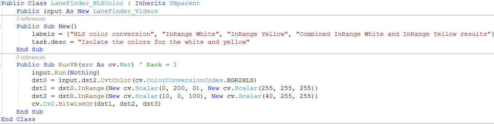

# OpenCVB – Lane-Finder with Snippets and Options

The introduction for OpenCVB includes the following phrase:

“Each algorithm is *just the algorithm* without baggage from a user interface or environment.”

This tutorial on OpenCVB demonstrates the meaning behind that phrase by taking a GitHub example of a lane-finding Python script and translating it into an OpenCVB algorithm. The original Python script and videos can be found here:

<https://github.com/mohamedameen93/Lane-lines-detection-using-Python-and-OpenCV>

# Getting Started – Snippets and Input Video

First add a new class to the VB_Classes project in OpenCVB and use the Snippets feature in Visual Studio to start coding an algorithm. A snippet is available with a right-click in the code. (See “[Building New Experiments with Snippets](https://github.com/bobdavies2000/OpenCVB)” for more on OpenCVB’s snippets.) In all the algorithms in OpenCVB, the New() constructor is invoked when the object is created and the “Run” function is invoked with every frame. Every algorithm can provide a task description and labels for the 4 images that will appear in the user interface.

Modify the name of the algorithm to “LaneFinder_Videos” and add options for selecting any of the 3 videos. There is a convenient snippet for adding radio buttons. OpenCVB will add the name of the algorithm “LaneFinder_Videos” to the user interface. This algorithm will use all 4 OpenCVB output images and the first 2 lines in the constructor below make that happen. The dst2 and dst3 images always appear in the output but dst0 and dst1 are normally the RGB and Depth images from the camera.

This algorithm relies on video input. The code will play the selected video and handle requests for the 3 different video. The “task.optionsChanged” variable will trigger loading a new video to test. The “task.optionsChanged” is a variable that is marked true any time any option in the user interface is updated. It is only true for the first frame after the change. It does not matter if the option is global or local to the algorithm. If it was updated, the algorithm will be presented a flag that indicates a change was made.

Once the video input is identified, the name is passed to another OpenCVB algorithm called “Video_Basics”. The video algorithm produces the next image in the video and places it in the dst2 for the Video algorithm. Moving the video.dst2 image into the local dst2 will automatically display it in the OpenCVB output.

When OpenCVB is run with the code above, the interface will include the following options:

The “Video_Basics” algorithm has an option for the name of the file and a slider that shows how much of the video has played. The options for “LaneFinder_Videos” at the bottom show the 3 different videos available. The videos were recorded as 1280x720 images and that will be the format used internally but for convenience, the output is automatically resized to the format of the OpenCVB application window.

The algorithm is now 25 lines of code and completes the context for the project and the user interface.

# Converting RGB to HLS and Isolating Colors

Start a new algorithm using a snippet as was done earlier and label this new algorithm “LaneFinder_HLSColor”. Only one line of code – defined below as “input’ – is needed to get the “LaneFinder_Videos” output. The next frame of the input video is available in the variable “input.dst2”.

The final lines in the code below do the following:

-   dst0 is loaded with the input.dst2 (the output of most algorithms appears in the dst2 for that algorithm.)
-   dst1 is loaded with the input image after isolating the white colors.
-   dst2 is loaded with the input image after isolating the yellow colors.
-   dst3 is loaded with the combined yellow and white masks to provide a single mask isolating the desired colors.

The labels for each image and the task description are the only concessions to a user interface. The rest of the algorithm is “just the algorithm”. Running the above algorithm will produce the following output:

The upper left image is the HLS version of the current frame (dst0). The upper right is the isolated white mask (dst1). The lower left is the isolated yellow mask (dst2). The lower right is the combined white and yellow masks (dst3). The algorithm looks like it is coming together and is now only 13 lines of debugged code.

# Finding Hough Lines

Start the next algorithm using a snippet as before and label this new algorithm “LaneFinder_Hough”. All of the previous code is included in this new algorithm with a single line that defines the “hls” variable. This variable will provide the images created with the LaneFinder_HLSColor.

The main complication in the code below is the mask to isolate the area in front of the car. That is the only area to be searched for lines. The output of “LaneFinder_Hough” includes an image of the mask.

This algorithm demonstrates how to share a variable that is not an image. In this case, the variable “segments” is used to provide the list of lines found in the image. By defining the variable as “Public” it is accessible to other algorithms. The mask is also marked as public so that it can be used by the final algorithm discussed in the next section.

The output of “LaneFinder_Hough” has the HLS format image in the upper left and the mask to isolate the lane lines in the upper right. The yellow and white masks are combined in the lower left and the Hough lines are drawn in yellow in the lower right. As before, the only concession to a user interface is to label the images and provide a description of the algorithm.

# Finding the Slope and Intercept

Start a new algorithm using a snippet as before and label this new algorithm “LaneFinder_SlopeIntercept”. All of the previous code described above is included in this new algorithm with a single line that defines the “hough” variable. The output of the previous work is put into this algorithm’s display by the statements that copy the hough output to the output of “LaneFinder_SlopeIntercept” – see the statement “dst0 = hough.dst0” and those that follow it below.

This algorithm uses the “segments” found in LaneFinder_Hough to define 2 lines for the left and right lane markers. The code creates an average slope for each line by weighting each line’s contribution by the length of each segment.

The only real complication involved is defining the right lane marker. The Y-axis value is zero at the top of the image instead of the typical math text that defines zero at the bottom.

The use of “setTrueText” toward the bottom shows how variable output can be printed in the user interface. The text may be placed anywhere in an image and will use Microsoft’s TrueType fonts.

The output of “LaneFinder_SlopeIntercept” shows the HLS image in the upper left and the image artifacts found for the lane markers in the upper right. The lower left shows the lines drawn using the OpenCV line function. The lower right image has no image output but is used by the “setTrueText” function to display the values for the instantaneous slope and intercept of the right and left lines.

# Performance Analysis

OpenCVB automatically includes a performance for all algorithms.

*“TreeView”: This view of the algorithm breaks down how the algorithm was constructed and what the costs are for each contributor.*

The tree view of the algorithm shows which algorithms are active. In the example output above, the “Video_Basics” algorithm is a general-purpose media input algorithm called by the “LaneFinder_Videos”. The “LaneFinder_Videos” is an algorithm that knows where the specific videos for lane-finding are located, reads each frame, and supplies the frame to the “LaneFinder_HLSColor”. The output of the “LaneFinder_HLSColor is provided to the “LaneFinder_Hough” to find the lines. The “LaneFinder_SlopeIntercept” is the final step in the algorithm and computes and depicts the lines for the edges of the lane.

The list of functions at the right of the image above shows where the time was spent in each algorithm. The costliest portion of the algorithm is the “LaneFinder_Hough” which finds all the lines in the input image. One key overhead is highlighted – “inputSyncWait” – and is the section of code that waits on the next buffer from the main OpenCVB task. If this entry is small as it is here, the algorithm task is processor-bound. Alternatively, when it is large, the gating factor is the next input image which indicates that the algorithm has plenty of spare cycles for additional work.

# Conclusion

The lane-finding algorithm is of limited utility as it does not show the lane curvature. It does not even use the depth camera support in OpenCVB. However, this example shows how to build a series of algorithms. Each algorithm can be run and debugged by itself and then included in other algorithms. The code here is not likely to be reused by other algorithms but it demonstrates how to build and share data among a group of algorithms.

To learn more about the specifics of the algorithm, there is more information at this location:

<https://github.com/mohamedameen93/Lane-lines-detection-using-Python-and-OpenCV>

All of the code above is in the LaneFinder.vb file included in VB_Classes that comes with OpenCVB. To run the tutorial, select “LaneFinder_SlopeIntercept” in the combo box at the top of the OpenCVB application.
