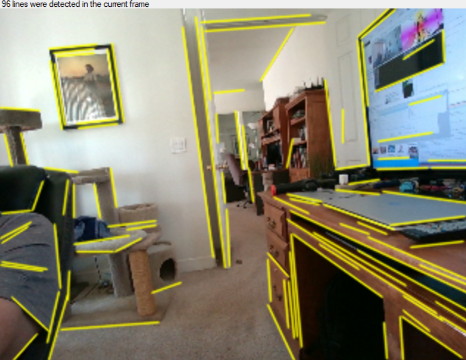
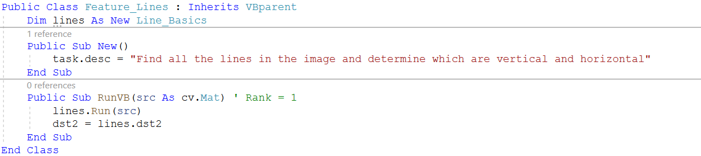
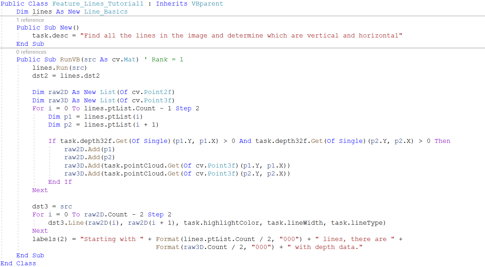
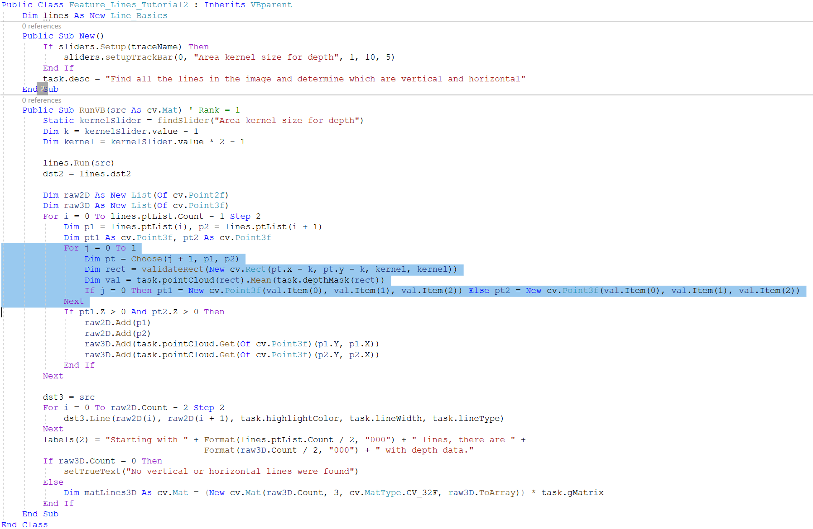
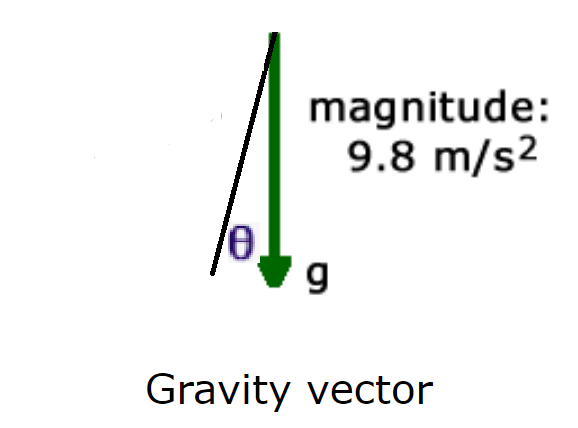
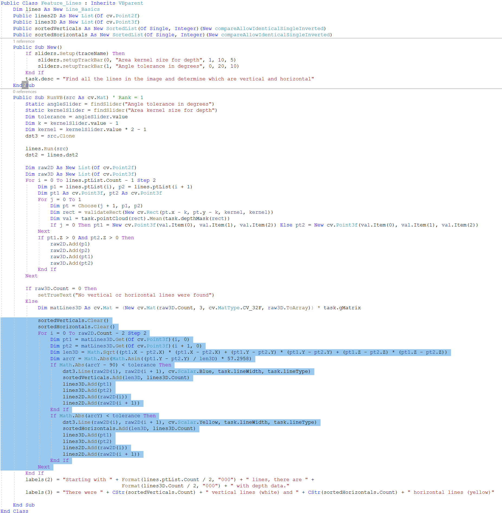
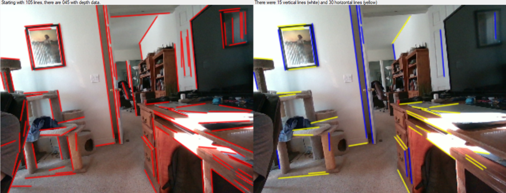
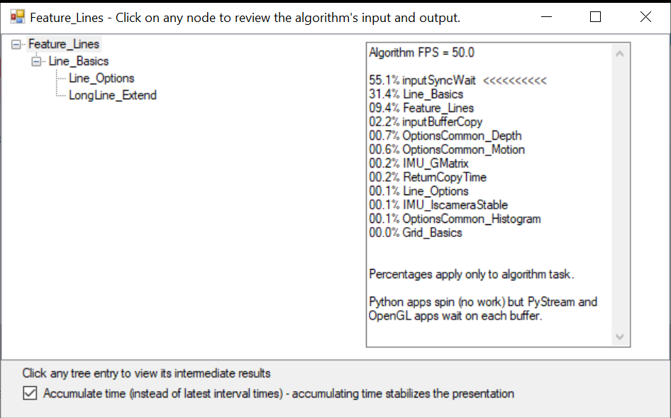

OpenCVB Tutorial – Detecting Vertical and Horizontal Lines
==========================================================

Detecting lines in an image is a first step in getting more understanding of the
content of an image. Edges are always interesting, but edges outlined by gravity
can be especially useful.

Start by Finding All the Lines 
===============================

The first step is to use an existing algorithm in OpenCVB called “Line_Basics”
to detect all the lines in the image using OpenCV’s “fastLineDetector” API.

*Line_Basics: All the lines in the image are detected.*

Since the lines are a feature of the image, the name of the new algorithm will
be “Feature_Lines” and placed in the “Feature.vb” module. Start the new
algorithm by selecting the OpenCVB snippet for a new algorithm. The “Tutorial –
Introduction” has instructions on how to get started using the OpenCVB snippets.
After adjusting the name and calling “Line_Basics”, the new algorithm should
look like this:

A description of the task is in the constructor and will appear in the user
interface in the top right corner. The algorithm simply invokes the
“Line_Basics” algorithm and displays the output in dst2. To make sure the
algorithm is generalized, the camera is deliberately tilted so that vertical
lines are not vertical.

Find 3D Lines
=============

For this algorithm, a vertical line is defined in 3D and requires depth. All the
cameras supported by OpenCVB support depth as well as RGB. The “Line_Basics”
algorithm provides each line as a pair of points in the 2D RGB image. To convert
the 2D endpoints to 3D, the task.depth32f image is used. The updated algorithm
looks like this:

The algorithm collects all the 3D lines into the “raw3D” variable where each
element is a cv.point3f, a point in 3D space. The first question is whether each
endpoint in the list will have depth data. A simple test avoids adding any lines
without 3D data. Some care must be taken to remove not just a point but the
*pair* of endpoints that define the line.

More Depth Data
===============

The above code is available in OpenCVB as “Feature_Line_Tutorial1”. Running the
code will show that a lot of lines are eliminated because the endpoint pixel had
no depth data. There may be a better solution in using a rectangle around the
endpoint to find the depth. The “Feature_Line_Tutorial2” includes a trackbar to
define the size of the rectangle.

The main change is highlighted above. A small rectangle around the endpoint of
the line is used to compute the depth. A mask called “task.depthMask” is used to
get only those pixels that have depth inside the rectangle. Also, the
constructor now includes a trackbar to define the size of the rectangle. It may
be set to 1 which should be identical to the lines found in
“Feature_Lines_Tutorial1”.

The rectangle size is controlled with a slider. The input value from the slider
is a value between 1 and 10 and is used to define a rectangle that is between 1
and 19 pixels. The number of lines found by the algorithm is improved. To
experiment further, try moving the slider back and forth to see the impact on
the number of lines found.

Finding Gravity
===============

Now that the depth is found for more lines, there is a bigger problem with the
resulting 3D lines: they don’t account for the angle and tilt of the camera.
Vertical lines will not be vertical in 3D unless the depth data or point cloud
has been adjusted for the pose of the camera. OpenCVB presents each algorithm
with the latest set of frames – RGB, point cloud, left and right images, and IMU
data – on each invocation. In addition, before each algorithm is run, the
translation matrix (labelled “task.gMatrix”) is prepared using the latest IMU
data. To study how the 3X3 translation matrix is built, look at the
“IMU_GMatrix” algorithm in OpenCVB.

The “Line_Basics” algorithm draws every line found, not just 3D lines. It is
shown in dst2 while the last loop draws a line in the dst3 image for each line
that has depth. The “labels(2)” string above the “dst2” output is updated with
the counts for those lines with and without 3D data.

The 3D line endpoints are in the “raw3D” list with the code above. To remove the
tilt and angle of the camera, the “matLines3D” Mat is multiplied by the
“task.gMatrix” 3X3 matrix. The following statement is all that is needed to
accomplish this:

The “Feature_Lines_Tutorial2” is now ready to figure out which of the lines in
“matLines3D” are vertical and which are horizontal. If it were necessary to
translate the entire point cloud, there is an algorithm called
“Depth_PointCloud_IMU” which performs the same operation on each element in the
point cloud. The advantage of finding the endpoints first is that it is
considerably less work to multiply just the endpoints rather than the entire
point cloud.

Finding Vertical and Horizontal 3D Lines
========================================

The method to find a vertical or horizontal line in this algorithm is to compute
the arc between the Y-axis and the gravity vector defined by the IMU.

The arc defined by theta above will be used to measure whether the angle from
gravity is within a reasonable range. Depth data collected by the camera is
approximate and needs a tolerance that won’t exclude too many of the desired
lines.

Another trackbar is needed: this one to set the angle tolerance. People discuss
angles in degrees so the interface for the slider asks for degrees (not
radians.) The tolerance is read from the trackbar before each frame is
processed. The arc is converted to degrees for use in determining whether it is
a vertical or horizontal line. The algorithm code looks like this after the
tolerance tests are added.

The highlighted code shows how each line can be classified as either vertical or
horizontal. The length of the line is needed to compute theta – the arc from the
line to the gravity vector. The length of the line is also used to sort the
lines because the longer the line the more accurately it will reflect gravity.
If the “arcY” variable is within the tolerance value from 90 degrees, then it is
a vertical line and if it is simply close to the tolerance value, it is a
horizontal line.

The output lines are drawn in dst3 with vertical lines in blue and horizontal
lines in yellow. From the picture below, it appears to be working and correct.

After using a small rectangle to compute the endpoints in 3D, the results
include more lines. The label above the right image (dst3) measures that
improvement. More important is that all the lines look correctly identified as
either vertical or horizontal. To validate that the camera pose does not impact
the results, pick up the camera and move it around. No matter how much the
camera is tilted or angled down, the vertical and horizontal lines are found.

Conclusion
==========

There are few vision algorithms that produce solid results without machine
learning, but this algorithm shows promise in finding lines and identifying them
as either vertical or horizontal. There is a some 3D geometry involved but the
algorithm is not costly. At the 320x240 resolution shown here, the algorithm is
producing 50 FPS. OpenCVB automatically analyzes the performance of every
algorithm and the “Feature_Lines” algorithm analysis is shown below:

The left side of the “TreeView” above shows what other OpenCVB algorithms
contributed to this algorithm. In this case, only the “Line_Basics” algorithm
was used directly. In turn, the “Line_Basics” algorithm uses 2 other algorithms
(not discussed above) that define options to the OpenCV “fastLineDetector” API
and how to extend lines to the edges of an image. The right side of the TreeView
shows the frame rate and breaks down where in OpenCVB the time was spent. The
key line is the first one showing “inputSyncWait” which measures the wait time
for the next frame. It shows that the algorithm was waiting 50% of the time for
each frame, indicating that there is still plenty of room for additional
analysis of the vertical and horizontal lines.

The “Feature_Lines” algorithm can be found in the Feature.vb file included with
OpenCVB in the “VB_Classes” project. Also, both of the intermediate “Tutorial”
algorithms are nearby in Feature.vb.

What can be done with these vertical and horizontal lines? That should be in a
future algorithm or tutorial.
