OpenCVB Tutorial – Finding and Tracking the Longest Line
========================================================

In the tutorial on lines, the process of finding and classifying each line in
RGB as vertical or horizontal was described. This second tutorial on lines will
describe how to use “Feature_Lines” to find the longest vertical line and track
it from frame to frame.

Start by Finding All the Lines 
===============================

The initial step in creating this algorithm is to use “Feature_Lines” to find
all the vertical and horizontal lines. All the cameras supported by OpenCVB have
both depth and an IMU so the resulting lines are robust and correctly classified
as either vertical or horizontal. After using the OpenCVB snippet to create a
new algorithm, the resulting code is placed in Feature.vb and is called
“Feature_LongestV_Tutorial1”.

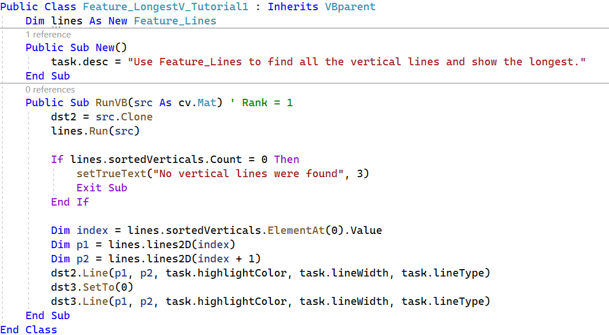

The output of this code should look something like this:

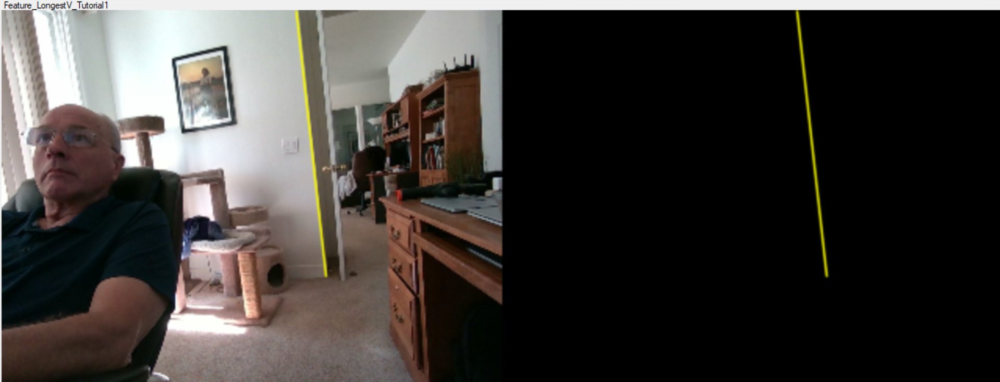

*Feature_LongestV_Tutorial1: All the vertical lines are found in Feature_Lines
(see Tutorials/(2) Lines.) Once all the vertical lines are sorted by length, the
longest is easily found.*

It looks like the algorithm is done, right? Well, no. While the longest vertical
line is showing in the left image, it may not be the longest in the next frame.
The longest vertical line can switch from several locations in the image
unexpectedly.

Retain the Longest Line with KNN
================================

One solution could be to use a KNN algorithm to find the set of points that are
nearest to the endpoints of the previous iteration. But there is a difference
here in that the KNN must strictly match both endpoints. The endpoints are
combined into a vector of 4 floating point values. The KNN_Basics4D was built
with cv.vec4f in mind so it can be easily added. The
“Feature_LongestV_Tutorial2” is the result. The line defining “knn” at the start
of the code below is all that is needed to bring in the KNN algorithm.

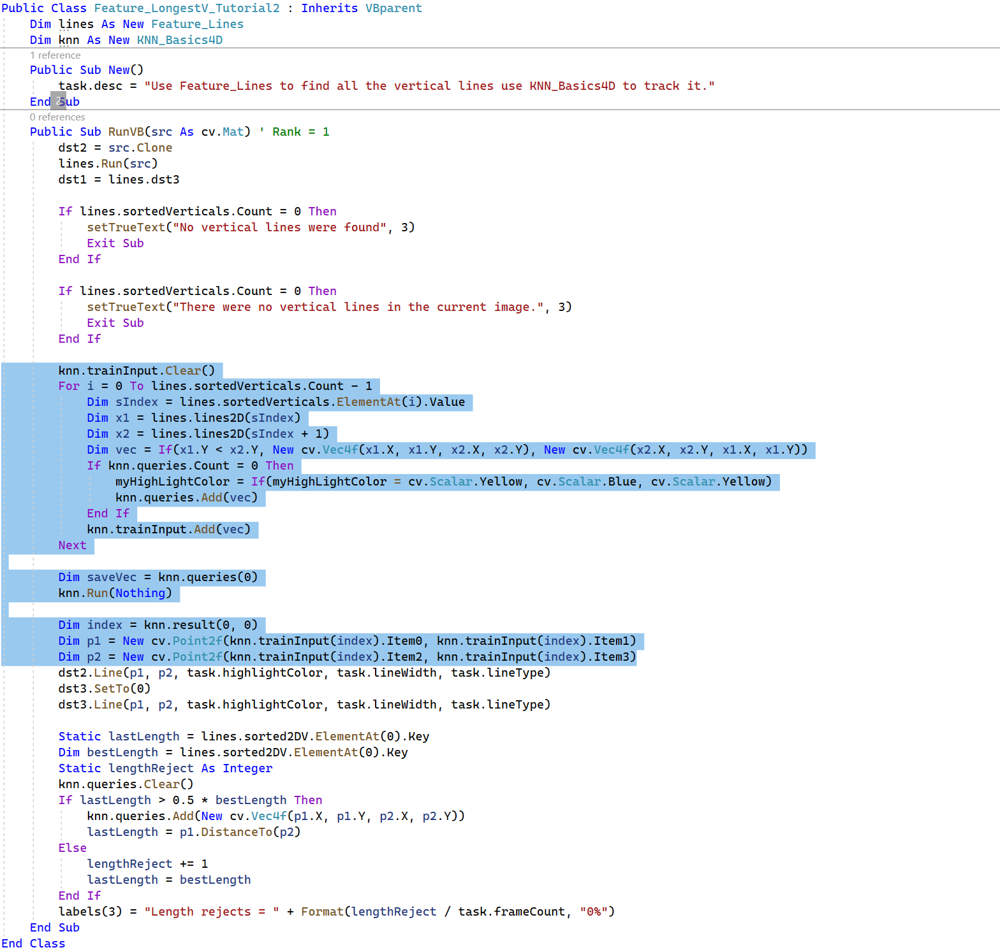

The added code is highlighted above. The KNN training input is updated with a
list that contains pairs of endpoints. To keep comparisons simple, the endpoint
with the lowest Y-coordinate is first in the pair. Also, there is only one query
for each KNN run – the resulting 2 endpoints from the previous iteration. The
first entry in the KNN output contains the index of the training vector that
most closely matches the query.

Test the Resulting Longest Line
===============================

After the line is drawn in the output, there is an additional check to see if
there is a much longer line available. The code to check for a longer line is
highlighted below:

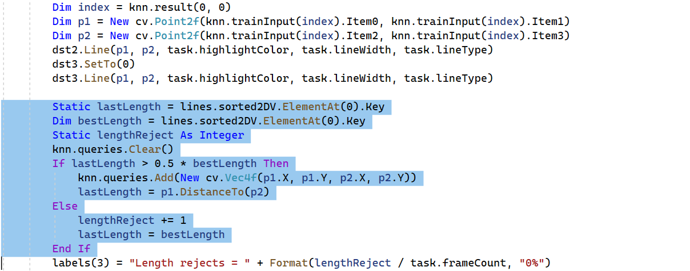

The test is to see if the current line is less than 50% of the length of the
best line in the list. If so, then the next iteration will select the longest
line and ignore the results from KNN. This prevents a short line that is
continuously present from appearing as the best vertical line when there are
better lines.

Visualize the Longest Line in OpenGL
====================================

How good is the resulting line? Will it be accurate? Visualizing the longest
line can answer these and other questions and the best way to visualize a 3D
line is OpenGL.

There are several OpenGL algorithms in OpenCVB and there is a snippet to
automate adding an OpenGL algorithm. After adding the snippet code and following
the instructions in the snippet, it is important to do the following to
incorporate the new OpenGL algorithm into OpenCVB:

-   Add the new OpenGL project to the dependency list of the OpenCVB project.

    -   This will ensure that the algorithm is compiled every time OpenCVB is
        run.

-   Select “Build/Configuration” and mark the new OpenGL project as “Release”
    (not likely to need much debugging.)

    -   There is a section below on debugging OpenGL algorithms in OpenCVB.

-   Set “OpenGLTitle” to the name of the OpenGL executable – typically,
    “OpenGL_All”.

-   When using OpenGL_All, set the OpenGL_Function to the case index of the
    switch statement in OpenGL_All

Troubleshooting tip: If there is any problem getting the right binary to run,
clear the OpenCVB/bin directory. Sometimes there is a debug version ahead of the
release version.

Here is the initial version of the algorithm to display the line in the OpenGL:

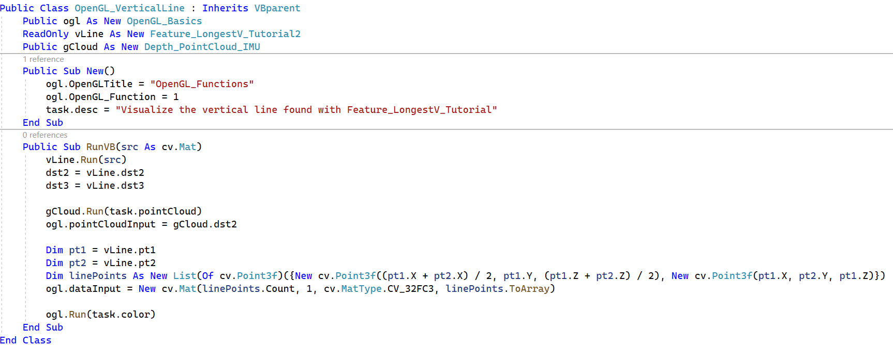

Getting the Line Data to OpenGL
===============================

OpenCVB sends the point cloud to OpenGL and it has the ability to include
additional data. In this example, the 3D coordinates of the line are placed in
the data buffer and the OpenGL code consumes them with this code:

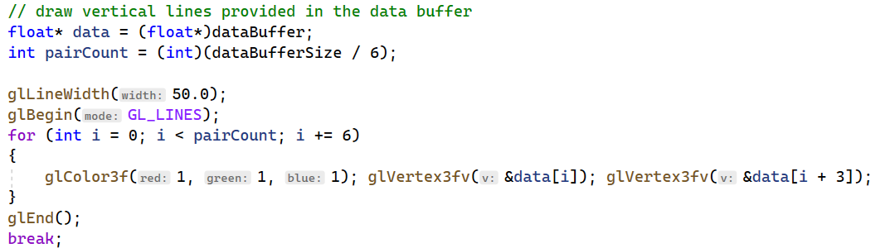

Here is what the OpenGL output looks like:

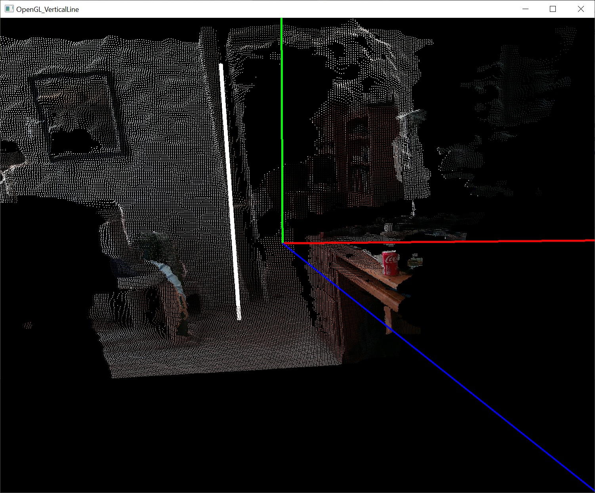

What is wrong? Well, it is clear that the line is not matching the wall. The
image in “dst2” for “OpenGL_VerticalLine” shows that the line does match the
wall:

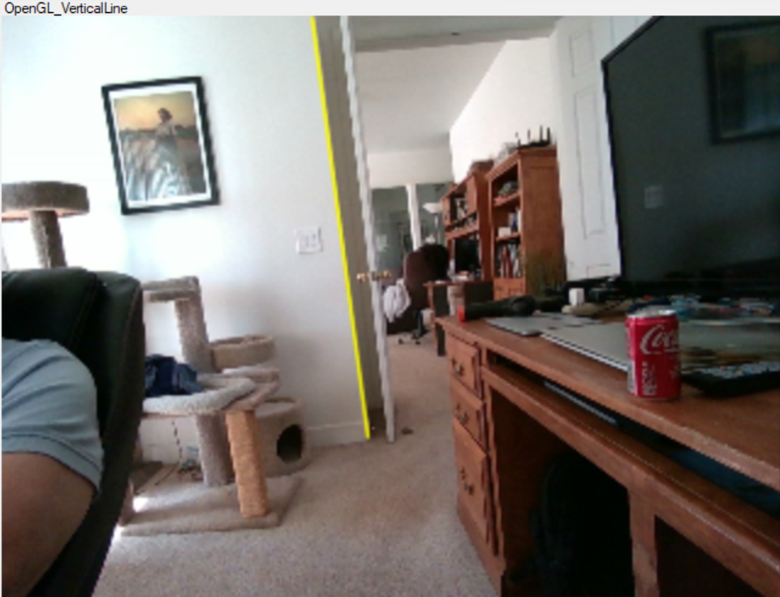

The vertical line is hugging the edge of the wall in the 2D representation –
unlike what is seen in the OpenGL output. The difference is that the OpenGL
image is displaying the raw point cloud – not one that has been oriented to
reflect gravity. Recall from the “Feature_Lines” discussion in the
“Tutorials/(2) Lines” that all the vertical lines had to be transformed as part
of the process of determining what was vertical.

The Gravity Transformation
==========================

The longest vertical line has been converted using the gravity transform while
the point cloud has not been. To see the gravity transform in action, look at
the output of “OpenGL_GravityTransform” and toggle between orienting to gravity
and manual control. There are radio buttons in the options for the “IMU_GMatrix"
algorithm and they look like this:

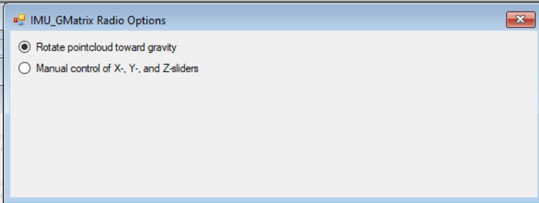

Click on the first radio button while running “OpenGL_GravityTransform” and the
point cloud will be rotate around the X-axis and the Z-axis. Try the second
radio button to see the raw point cloud without orienting it to gravity.

When finding all the vertical lines, the “Feature_Lines” algorithm rotated the
endpoints of each line using the gravity transformation. But only the endpoints
were rotated. The new OpenGL display requires that the entire point cloud be
rotated with the gravity transform in order to match the vertical line. Here are
the changes necessary to rotate the point cloud displayed in the
“OpenGL_VerticalLine”:

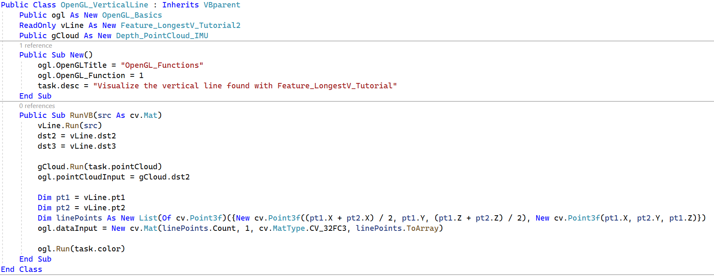

And here is what the properly oriented point cloud looks like when the vertical
line has been drawn:

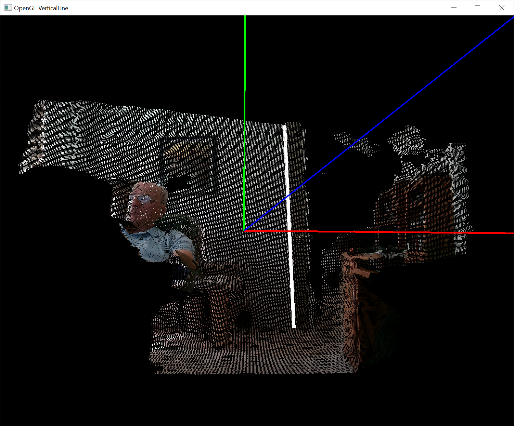

The resulting line looks correct and confirms that it was the point cloud that
needed to be rotated. Now pick up the camera and move it about to see if the
vertical line is still properly aligned with the wall. There are some radical
motions for the camera to lose the vertical line but for the most part, the line
is hugging the wall and the point cloud is shown oriented to gravity.

Debugging OpenGL Algorithms in OpenCVB
======================================

The snippet code for OpenGL algorithms covers a lot of ground in building an
OpenGL algorithm for use with OpenCVB. The snippet doesn’t cover all
requirements but the changes are expected to be relatively small. How does one
debug an OpenGL application inside OpenCVB. It is expected that any questions
that arise are simple enough to be answered by a printf in the OpenGL C++ code.

However, the default in OpenCVB is to turn off the console log where any printf
output would appear. To get the console back, update a checkbox in the OpenCVB
parameter labeled “Show Console Log for external processes”.

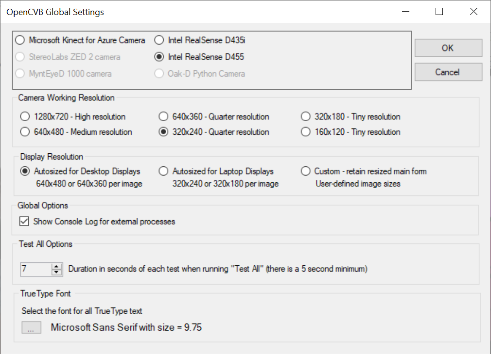

When this checkbox is set, printf output will appear and can hopefully be enough
to complete debugging the OpenGL application under OpenCVB.

Performance Analysis
====================

OpenCVB automatically runs a performance analysis of every algorithm. The
“TreeView” shows which algorithms are active and a percentage describing the
cost of each algorithm. Here is the output for the “Feature_LongestV_Tutorial2”:

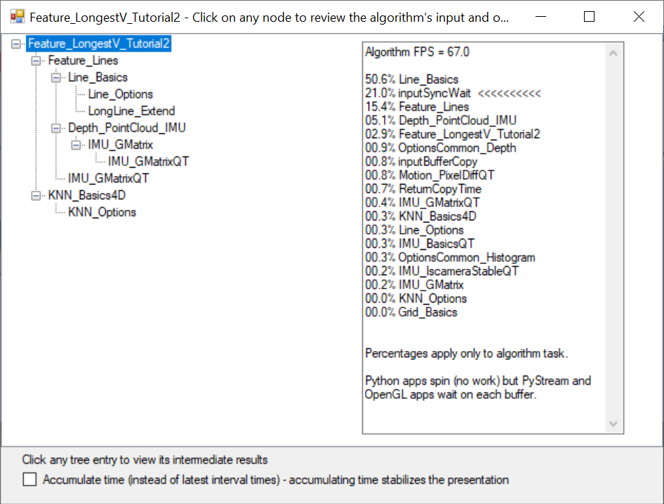

The analysis shows 67 frames per second are processed at the 320x240 resolution.
The main workload is in “Line_Basics” at over 50% of the time spent on each
frame. The “inputSyncWait” entry shows the processor is idle about 21% of the
time for each frame. If any portion of this algorithm is multi-threaded, then
more processors will be involved.

The TreeView on the left can be used to investigate the intermediate outputs.
For instance, click on the “Feature_Lines” entry in the tree and the output of
the “Feature_Lines” will show up in OpenCVB instead of the output of
“Feature_LongestV_Tutorial2”. This is helpful in reviewing and connecting
algorithms together.

Conclusion
==========

There were some interesting steps involved in finding this vertical line.
Starting with all the vertical lines, the list was pruned to just the longest
vertical line and then tracked with a 4-dimensional KNN algorithm. Visualizing
the longest vertical line in OpenGL demonstrated the value of an OpenGL snippet.
Only minimal changes were required to get the line displayed. The final version
of the OpenGL algorithm showed the value of the gravity transform and the IMU in
presenting a 3D representation.

The algorithms featured in this tutorial are best when run interactively. They
are all available in OpenCVB:

-   Feature_Lines

-   Feature_LongestV_Tutorial1

-   Feature_LongestV_Tutorial2

-   KNN_Basics4D

-   OpenGL_GravityTransform

-   OpenGL_VerticalLine

A good problem prompts more questions. The first question might be: was it
necessary to get only the longest line? Why not use all the vertical lines and a
weighted sum of their direction to determine the best vertical orientation? A
bigger question: how is the longest line useful?
