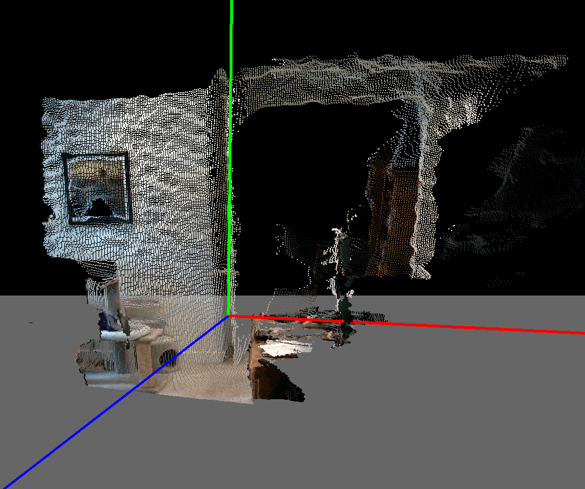
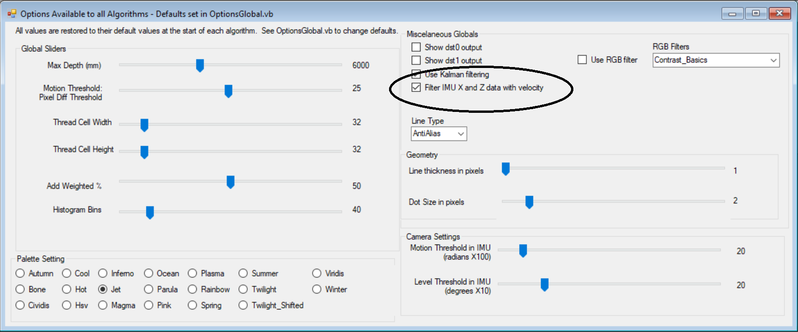
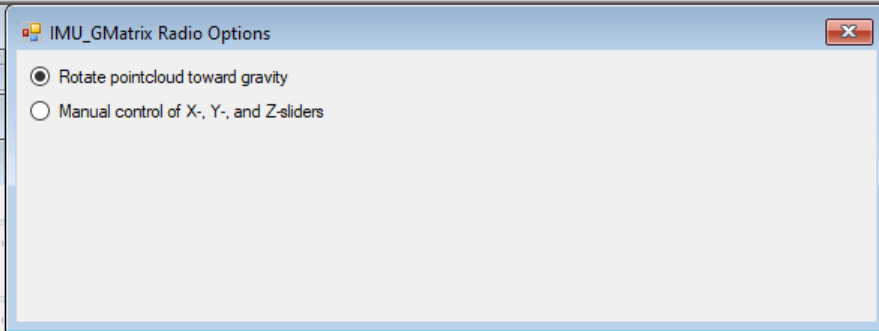
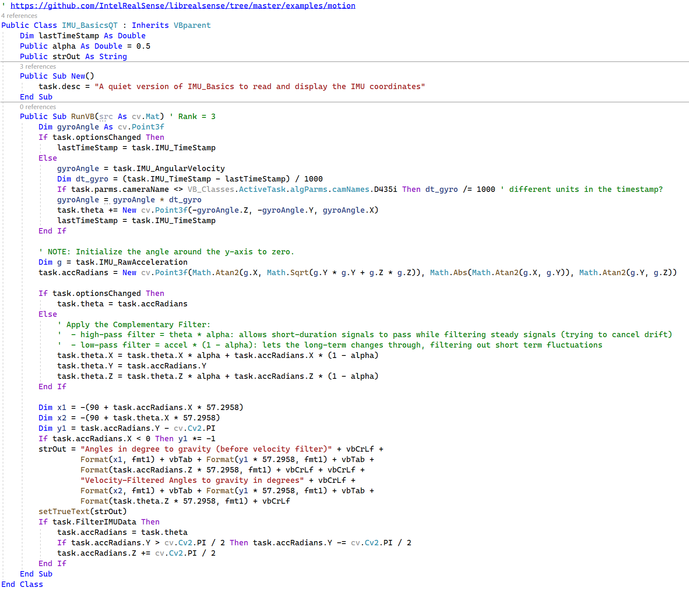
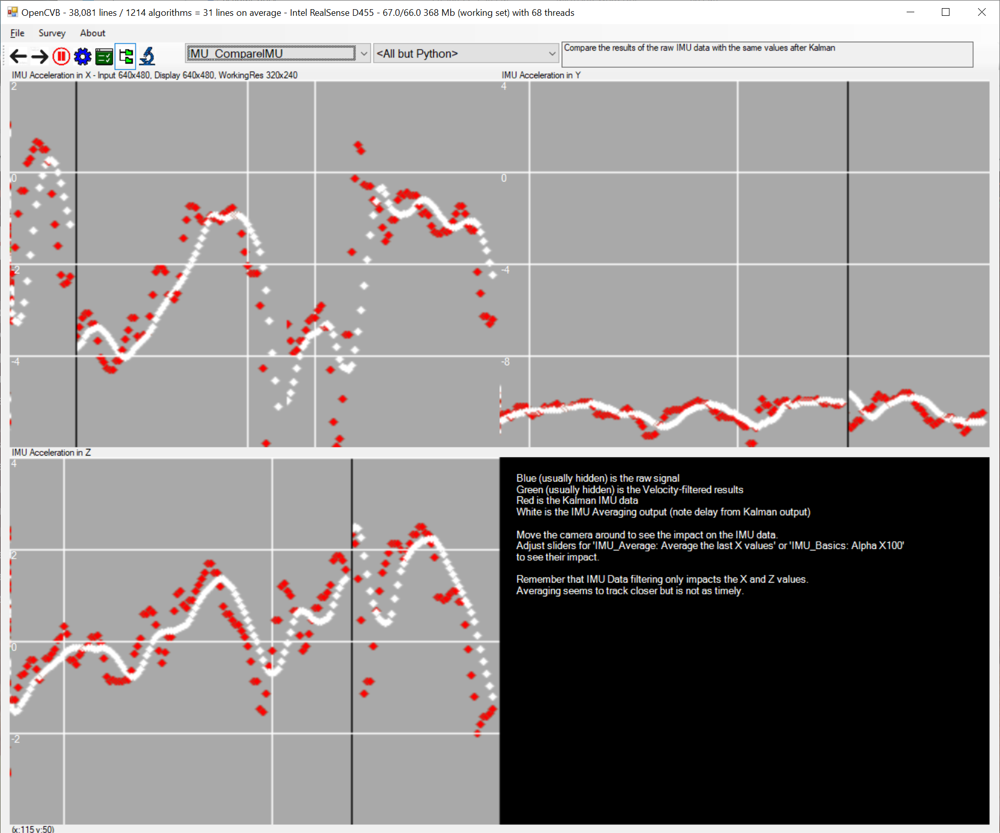
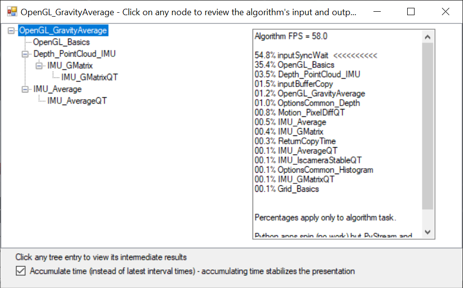

OpenCVB Tutorial – Inertial Measurement Unit (IMU) Alternatives
===============================================================

This tutorial is focused on what to do with the IMU that is included in every
camera supported by OpenCVB. It is a valuable tool to improve the presentation
of the point cloud in OpenGL. It is vital to this tutorial that OpenCVB be
available and running to see the impact of the IMU data on the output of OpenGL.
The MIT presentation (discussed next) presents an outline of how to handle the
IMU data. OpenCVB provides working examples for these alternatives.

IMU Velocity-Filtered Recommendation
====================================

This link is an MIT presentation that describes 4 methods of using the IMU data:

https://github.com/jcarrus/MakeMITSelfBalancingRobot/blob/master/segspecs/filter.pdf

The method recommended in that link uses the velocity data from the IMU to
stabilize the acceleration data coming from the IMU. The velocity data is used
in a high-pass and low-pass filter for the acceleration data. Intel Realsense
software ships with its own example using the “velocity-filtered” IMU data:

<https://github.com/IntelRealSense/librealsense/tree/master/examples/motion>

OpenCVB includes all 4 methods of using the IMU data and explores what it means
to OpenGL point clouds, even when avoiding the IMU data altogether.

Raw IMU Implementation
======================

The MIT presentation above accurately describes the pro’s and con’s of using the
raw IMU data: the problem is stability. The instability is obvious when using
the IMU data to present a point cloud in OpenGL and it is even more obvious if
the camera is picked up and moved around.

*OpenGL_GravityTransform: Running OpenGL with a point cloud is the best way to
show how the point cloud can be unstable when IMU data is applied.*

The simplest way to stabilize the OpenGL output is to ignore the IMU data. Of
course, this means that walls will not appear vertical, and their appearance
will depend on the angle of the camera. But the default for the
“OpenGL_GravityTransform” is to run with IMU acceleration data that has been
stabilized with the angular velocity data.

IMU Data Stabilized with Angular Velocity
=========================================

The recommended default is to stabilize the IMU data using the angular velocity.
The MIT presentation above describes how it is done. To toggle between raw and
the velocity-filtered IMU data, use OpenCVB’s global options form:

*Turn the velocity-filtered IMU data on and off while running
“OpenGL_GravityTransform” to see the impact. The point cloud is more stable when
enabled.*

To see the impact of running with and without the gravity transformation, there
is a set of options in the “IMU_GMatrix” algorithm that can help. It looks like
this:

*Run the “OpenGL_GravityTransform” and use the IMU_GMatrix options to rotate the
point cloud to orient it to gravity (default.) To have even more fun, try the
manual control of all 3 axes and swing the point cloud around using the matrix
multiply of the point cloud with the 3x3 gravity transform.*

Code for “Velocity-Filtered” IMU data
=====================================

The code to produce the “velocity-filtered” IMU data is below.

The comments in the code describe the impact of the velocity filters. The name
of the algorithm – ending with “QT” - also hints at a technique to reduce the
number of options forms present. The IMU data preparation is run for every
algorithm (the workload is trivial, and the data is often essential.) The “QT”
at the end of the name indicates that the options for the algorithm are NOT
present. The options are present in the algorithm with the nearly identical name
– simply remove the QT. The goal is to keep the number of options forms
manageable.

IMU Data with Kalman Filter
===========================

The MIT presentation at the top above suggests using a Kalman filter to smooth
the instability of the point cloud data. The algorithm to implement this is
called “IMU_Kalman” and is in the IMU.vb file of the VB_Classes project.

To test the IMU data with a Kalman filter, use the “OpenGL_GravityKalman”
algorithm. The bottom line: the results are comparable to the velocity-filtered
algorithm. The image is a little unstable but definitely more stable than the
raw IMU data – the same behavior seen with the “velocity-filtered” IMU data.

Averaging IMU Acceleration
==========================

The last method recommended in the MIT presentation is to average the values of
the IMU acceleration data over a specified number of frames. Surprisingly, this
produces the most stable version of the point cloud, but it comes with a
substantial caution: there will be a lag between the camera motion and the
averaged result.

To test the average method, run the “OpenGL_GravityAverage” algorithm and move
the camera around.

Comparing IMU Acceleration Values
=================================

The value of the averaging method becomes even clearer when plotting the
acceleration values of the 4 methods. The averaging results are in white below
and show reasonably continuous results moving smoothly from moment to moment.

*“IMU_CompareIMU”: while all 4 methods are present, the Kalman method in red and
the averaging method in white stand out when moving the camera around. The
Kalman result is nearly identical to the values of the raw and velocity-filtered
acceleration data but because the Kalman result is plotted last, it is the only
one that appears.*

The plots of acceleration in the X, Y, and Z direction are shown – upper left is
X, upper right is Y, and lower left is Z. Note that the Y-axis data (upper
right) is much less volatile than the X and Z data. The matrix multiply with the
transformation matrix does not impact Y-axis component.

The plot of the averaging data is shown in white and is clearly delayed from the
near-instantaneous values of the Kalman filter. The black vertical line is the
current output location of the plot.

Performance Analysis
====================

OpenCVB automatically includes a performance analysis for each algorithm.

*“TreeView”: The structure of the algorithm is displayed on the left and the
breakdown of CPU overhead are displayed on the right.*

There are several conclusions to be drawn from the costs of the algorithm above.
The “OpenGL_Basics” algorithm ships the OpenGL 3D data to the external OpenGL
application, and it is the most costly. The overhead of preparing the 3D point
cloud is relatively low with “Depth_PointCloud_IMU” at 3.5%. The
“Depth_PointCloud_IMU reorients the cloud data to gravity which is critical but
not costly. The creation of the 3X3 transformation matrix in “IMU_GMatrix” is
trivial at 0.4% as is the costs of the “IMU_AverageQT” which computes the
average over time of the IMU acceleration values.

Conclusion
==========

The list of algorithms used in this tutorial is long because many different
algorithms in OpenCVB use the IMU data. The ability to make the IMU data easily
accessible is a useful feature of OpenCVB.

-   IMU impact on the point cloud: OpenGL_GravityAverage / OpenGL_GravityKalman
    / OpenGL_GravityTransform

-   IMU values: IMU_Basics, IMU_BasicsQT, IMU_Average, IMU_AverageQT, IMU_Kalman

-   Plot IMU data: IMU_CompareIMU which uses IMU_AllMethods

Each of these algorithms is instructive. They are really just slight variations
on the basics of using IMU data. The introduction of the “QT” option helps to
make the user interface less cluttered without losing the options provided by
the non-QT version. It is likely to impact future algorithms as well.
