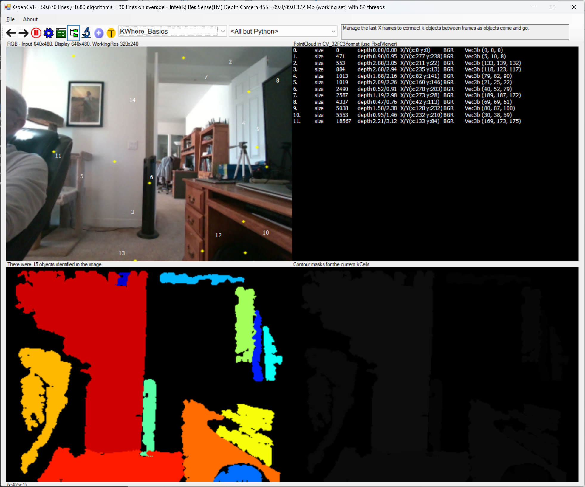
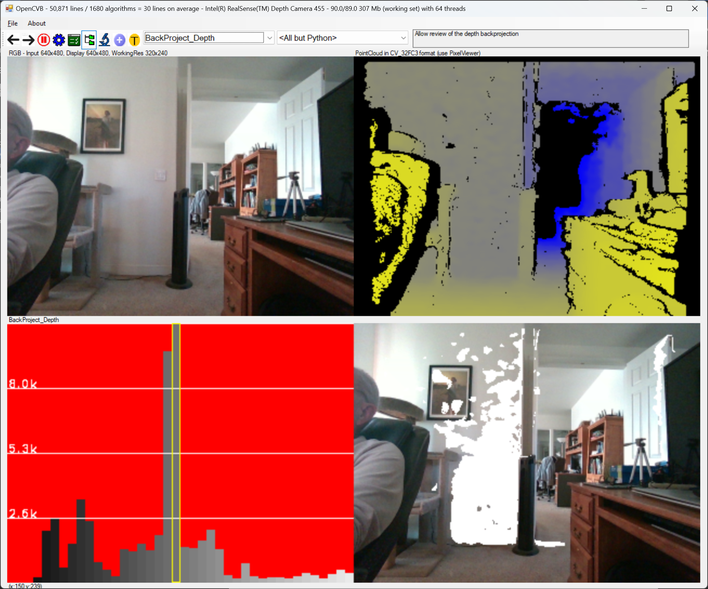
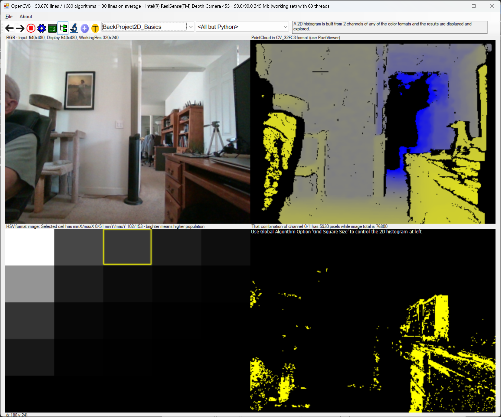
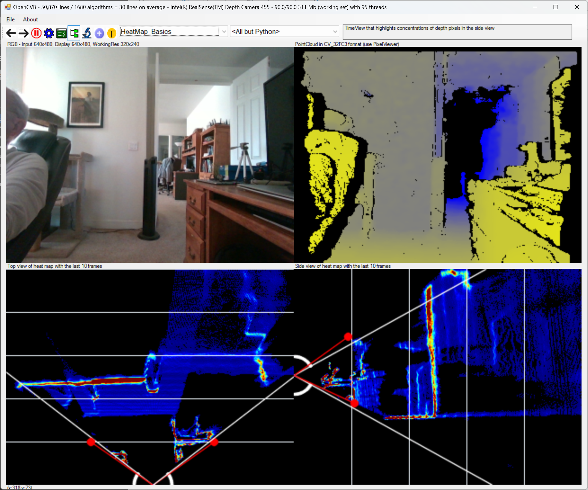
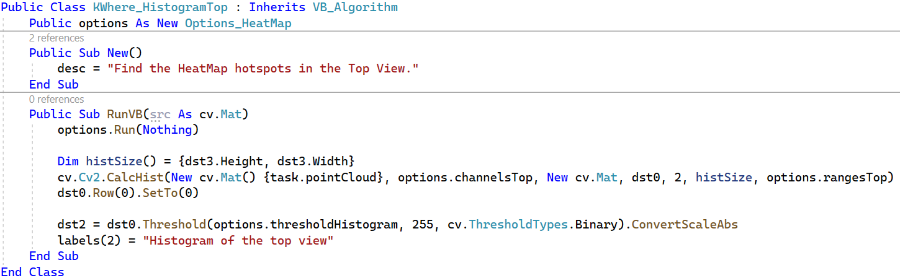
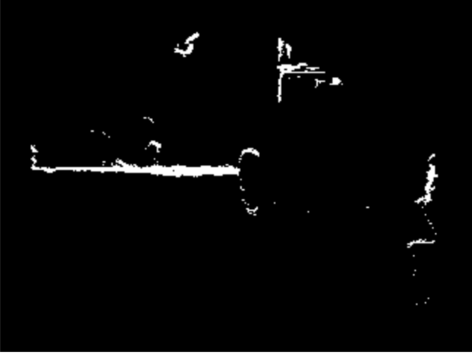
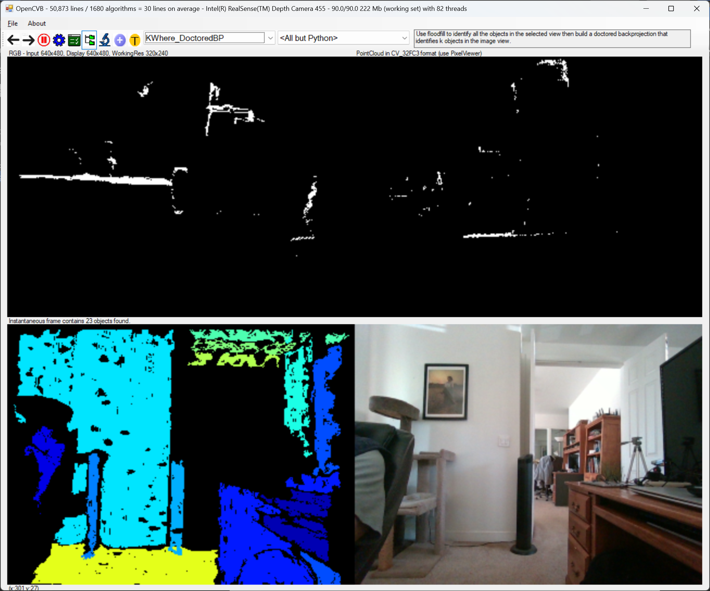

# OpenCVB Tutorial – “Finding K”

Semantic segmentation is a valuable tool for image segmentation. The technique uses a database of images and CNN’s (convolutional neural networks) to identify what the image contains. Each pixel in the image is then segmented based on that identification. For instance, detect that a cat is present and then segment each pixel in the image knowing where the cat is in the image.

This tutorial discusses how to segment the image without identifying anything in the image. The process involves 2 steps – identifying how many objects are in the image and secondly, where they are. There is no attempt to identify anything in the image beforehand and the output image is only a rough outline of objects in the image, but the results are an unexamined approach to image segmentation.

**KWhere_Basics:** *The lower left image identifies the objects in the scene using the point cloud produced by any of the 3D camera interfaces available in OpenCVB – such as Microsoft’s Kinect for Azure and Intel’s RealSense. The upper left image identifies a center point for each object and tags it with the numbers in the table in the upper right.*

# Histograms and Backprojection

Understanding histograms and their backprojections is a useful place to start and OpenCVB has numerous examples that should help. In OpenCVB’s “BackProject_Depth” example below, a 1-dimensional histogram of the depth data is shown with a backprojection of the selected bar in the histogram.

**BackProject_Depth:** *The lower left image is the histogram of the depth data from 0 to 5 meters. The height of each bar represents the number of points at that depth range. Moving the mouse in the histogram then backprojects a column’s data into the RGB image in the bottom right. The yellow highlight rectangle (lower left) is currently on the tallest column which is backprojected in white in the bottom right image. Naturally, there are large amounts of depth data at the distance of the wall.*

The 1-dimensional histogram is intuitive but 2-dimensional histograms are required here. OpenCVB’s “BackProject2D_Basics” algorithm creates a 2-dimensional histogram below from the HSV input and the backprojection of the selected cell.

# 

**BackProject2D_Basics:** *The lower left image is the 2D histogram of HSV (Hue/Saturation/Value) data of the RGB image in the upper left. Each rectangle in the lower left image represents a small range of Hue with a corresponding small range of Saturation data. Moving the mouse in the 2D histogram selects and backprojects pixels with those ranges into the image format representation in the lower right.*

# Top-Down and Side Views

Understanding the 2D histogram is essential to creating the top-down and side views of the point cloud data. Below both views appear as heat maps that highlight any concentration of point cloud data. It only takes a few lines of code to produce the images below because they are 2D histograms of the point cloud data. The top-down view is a 2D histogram of the point cloud’s Z channel on the vertical axis and the X channel on the horizontal axis. Similarly, the side view is a 2D histogram of the point cloud’s Y channel on the vertical axis and Z channel on the horizontal axis.

**HeatMap_Basics**: *the lower left image is the top-down view of the point cloud with the camera location at the bottom of the image. The lower right image is the side view of the point cloud with the camera located at the left side of the image. The red color in the heat maps represents a higher concentration of points while blue is low concentration. The horizontal and vertical lines represent 1-meter intervals in depth.*

The point cloud has been oriented to gravity in the example above to improve the concentration of red in the heat map when walls or vertical objects are present in the top-down view. Orienting to gravity also improves the concentration of red in the heat map for the side view when floors or ceilings or tabletops are present. While it is helpful to orient the point cloud to gravity, it is not essential and can be disabled in the user interface for OpenCVB (see the “Orient the point cloud to gravity” checkbox.)

Also in the bottom images above are indications of the frustrum for the camera with the white angled lines. There are 2 shorter red lines near the camera frustrum lines to represent the adjustment provided by orienting the point cloud to gravity. If the orientation to gravity is turned off, the red lines will align exactly with the white lines for the frustrum. In this example, the camera is nearly aligned with gravity.

When the point cloud is oriented to gravity, moving the camera around will show that the wall with the painting does not move much and more importantly, remains as a hotspot. Camera motion therefore has only a minimal impact on the identification of objects.

**Top-Down Histogram Code:** *The code above is all that is necessary to produce the top-down view of the point cloud data. The top-down view uses the point cloud’s first channel (X) and third channel (Z) to create the plot. The statement “dst0.Row(0).SetTo(0)” removes the count of point cloud pixels with zero for both X and Z – points with no depth. There are a lot of zero depth points so removing that count makes the heat map more textured and varied.*

# Finding K with a “Doctored BackProjection”

The red spots in a heat map are concentrated point cloud data. Thresholding a top-down heat map will remove blue points. The result is an image like the one below.

**Top-Down View:** *the hotspots in this top-down heat map are isolated by thresholding. The thresholded top-down and side views are the input to a floodfill operation.*

Because there is space between each of the objects in the image, the floodfill after thresholding can count the number of objects and identify each with a tag. The output of the floodfill is still in the shape of a top-down view but will contain the ID for each object instead of a histogram count. This “doctored” histogram is then input to a backprojection.

Backprojection normally takes the count in a cell and puts the count in the pixels represented in the ranges of that 2D histogram entry. By using the doctored histogram for the backprojection, the tag identifying the object will now appear in the “doctored backprojection” where that concentration of points occurred. The doctored backprojection is in the image format that is seen in the output of the “KWhere_DoctoredBP”.

**KWhere_DoctoredBP:** *The lower left image is the backprojection of the tags placed in the doctored histogram. Note that both the top-down and side-views have contributed to the image in the lower left. The vertical objects – wall and desk – were tagged in the top-down floodfill (upper left). The horizontal objects – floor and ceiling - were tagged using the side view floodfill.*

OpenCVB’s “KWhere_Basics” algorithm manages the output of the KWhere_DoctoredBP to create a small database of objects and identify them. The output of the “KWhere_Basics” is the first image in this tutorial.

# Conclusion

There is little use for this approach to image segmentation at this point, but it is certainly different from existing technology. It will be explored further in OpenCVB. The size, color, and depth of each object are now available as interesting features for future algorithms. It is important to understand that this technique is only possible because a point cloud of data is available. Without depth there can be no top-down or side view.

A truism among journalists is that they want to know “What, where, when, and why”. Semantic segmentation starts by identifying what but the KWhere algorithms start with where. KWhere’s name is a shorthand for finding the k objects in the image and where they are – until something better is available.
