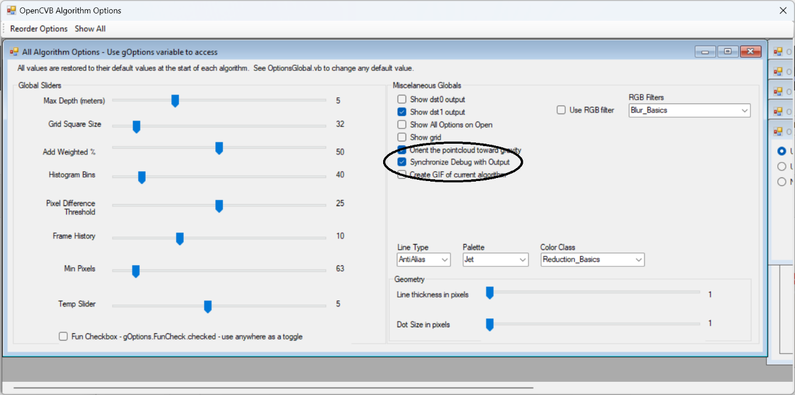
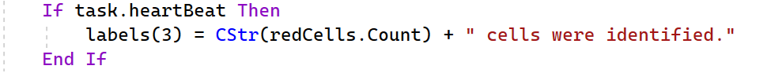
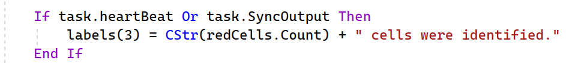
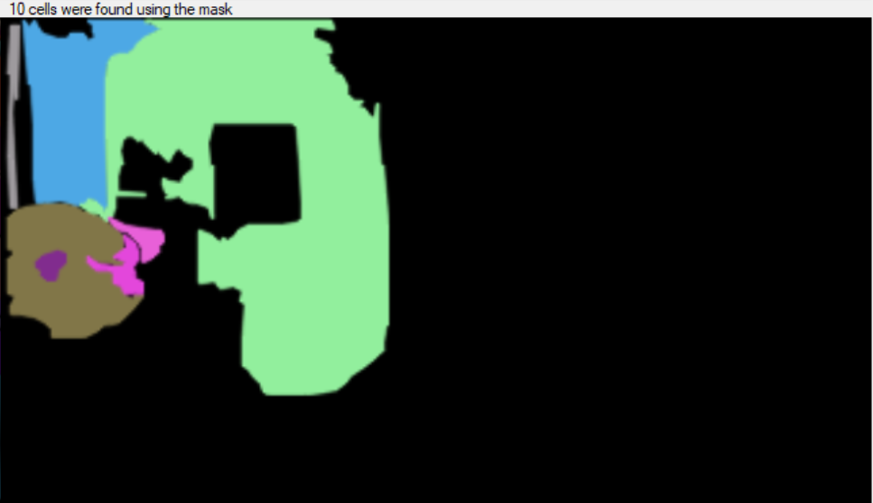
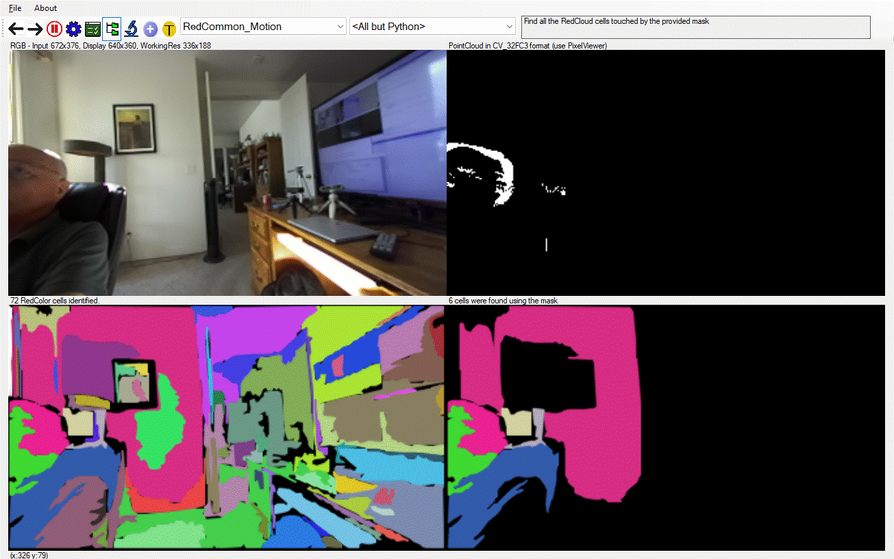

# OpenCVB Tutorial – “Synchronized Output”

It is a routine problem that most ignore but the output on the screen may not reflect the code that was just executed. OpenCVB is a multi-threaded application with threads for the main task, the camera, and the algorithm. The operating system adds even more complexity.

In the typical scenario, a breakpoint set in the algorithm is hit and some variables are reviewed. After hitting Continue, the images are sent to the screen but what is on the screen may not reflect what was just reviewed because the breakpoint is hit again before the other threads can send the image to the screen.

However, OpenCVB has solved this problem.

# “Synchronize Debug with Output” Option

There is a global option called “Synchronize Debug with Output”. If this option is selected, a 100-millisecond delay is inserted before the algorithm task returns and hits the breakpoint. This delay is enough time for the algorithm’s output images to work their way through the operating system and onto the screen. When the breakpoint is next hit, the images and labels on the screen will reflect what just happened in the algorithm.

This can be quite useful when the labels and the images agree with the variables in the debug session. There is no cost when the “Synchronize Debug with Output” is not selected. The default for the option is unchecked.

**OpenCVB Options:** *The global options for all OpenCVB algorithms are displayed by default in the OptionsAllAlgorithms.vb form. The algorithm-specific options are pushed to the right side in the form above. To bring the algorithm-specific options into view, click the menu item “Show All”. To restore the global options, click on the menu item “Reorder Options”.*

# Leveraging the Synchronize Option

Each image in OpenCVB has a label that describes the image contents. To allow the labels to be readable (they can change many times a second), they are often set on an OpenCVB heartbeat. A heartbeat is a task variable that is true about once a second. The code to do this might look like this:

OpenCVB’s heartbeat variable can be used to control any activity but is most often used to control the labels for the images. In this example, the label for dst3 is updated with the cell count on each iteration of the algorithm.

Adding the option to synchronize the debug output enhances the screen update to include the label for the image. The code to do this might look like this:  

The task.syncOutput variable (if checked) will update the label on each iteration. Each image update will then also include the label for that image.

There is more information on heartbeats in OpenCVB’s main ReadMe.md. Search for “heartbeat”. The heartbeat function now checks for both heartbeat and synchronized output. Because it is often valuable, the heartbeat function also checks for “task.optionsChanged” variable so that any options changes will immediately be reflected in the output.

# Results without Synchronized Output

When debugging an algorithm, it is easy to forget to use the “Synchronize Debug with Output” checkbox. This is what happens when it is forgotten.

**RedCommon_Motion:** *The label above was created without the “syncOutput” flag and is incorrect. The algorithm is highlighting those RedColor cells that contain motion. The image shows 7 cells but the label says 10.*

The label is correct even in each frame of a GIF presentation of the algorithm’s output.

**RedCommon_Motion:** *Each screen capture for the GIF file above shows the correct number of cells unlike the previous image. Use the “Pause” button in the GIF to verify.*

# Adding Text Output

Text messages associated with the latest image can also be synchronized to the image output. If using a “SetTrueText” call to display some text, the text will appear simultaneously with the image. Because of the delay before the next iteration, the text will appear on the screen in sync with the image. It is another, albeit small but informative, advantage provided by the synchronize option.

If text messages or image labels are hard to read because of the rapid updates, turning on the “Synchronize Output with Debug” option can slow things down enough to make most messages readable.

# Conclusion

The ability to synchronize the debug output with the screen is valuable in some debug sessions. Remembering to use it is the only real shortcoming. But it is only a single checkbox to take advantage of it.

# 
