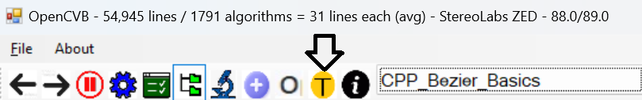
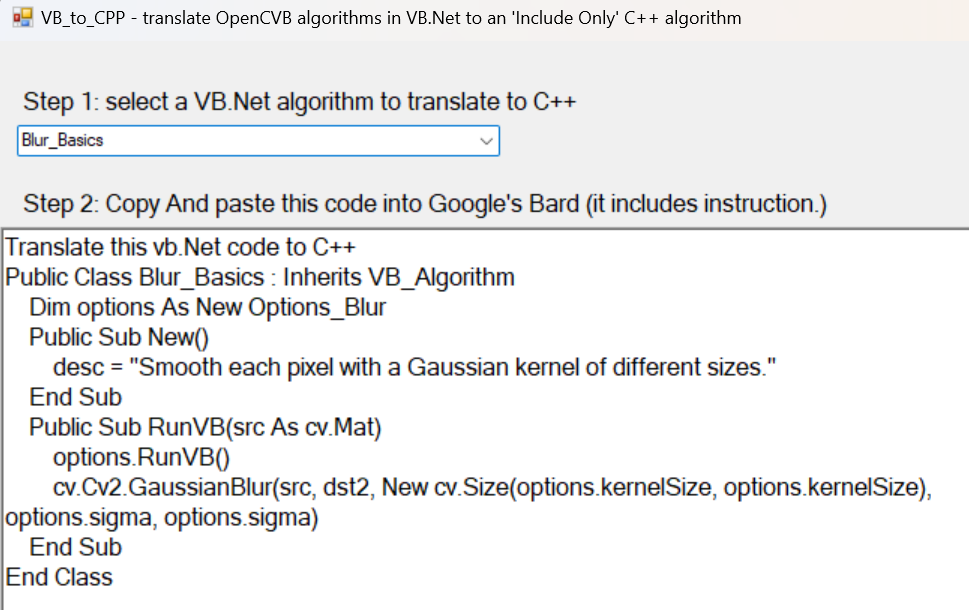
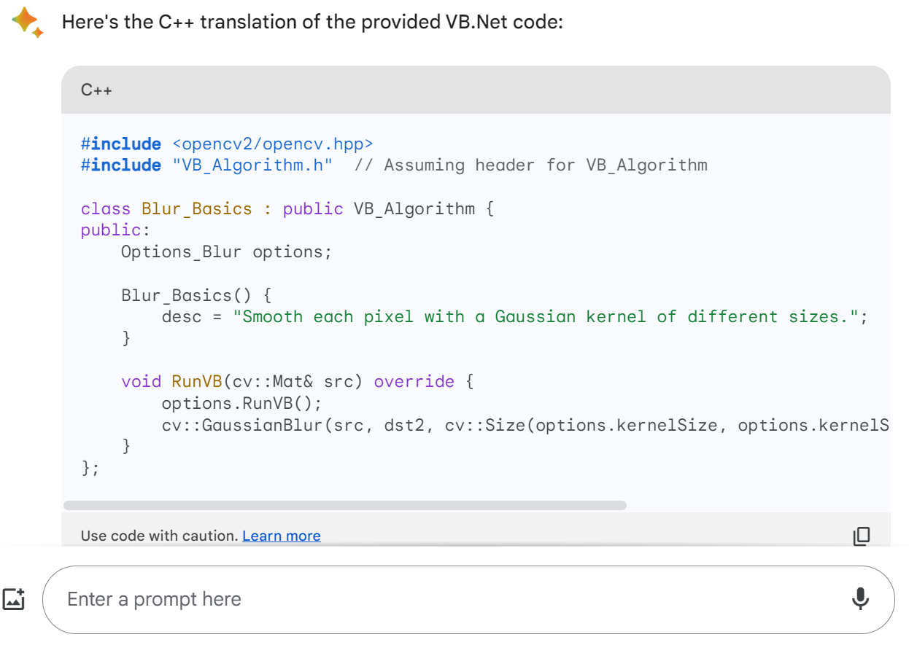
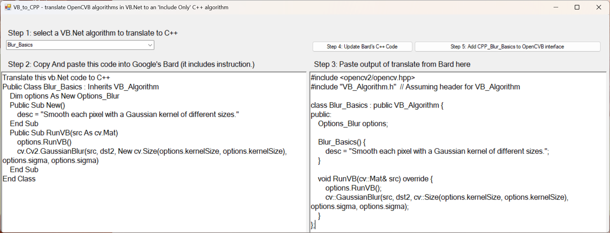
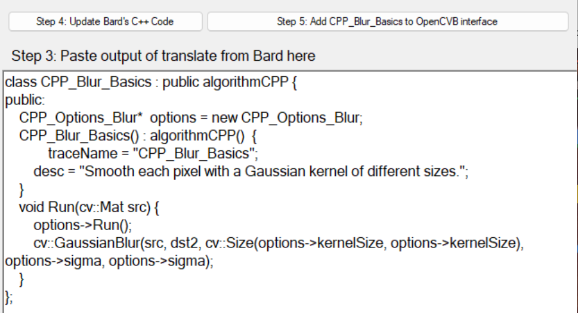
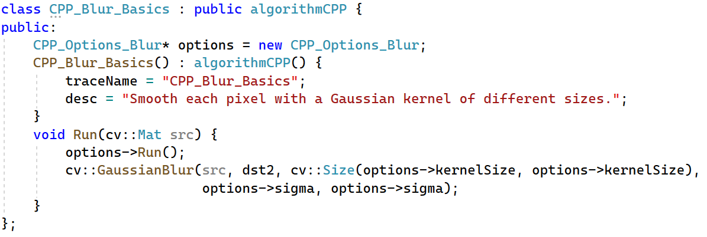

# OpenCVB Tutorial – “AI Generated C++”

The majority of the algorithms in OpenCVB are written in VB.Net. This tutorial will demonstrate how to convert any of these algorithms to C++ so that it may be used in other environments such as Python or Linux.

The real work involved in the translation is currently being done using Google’s Bard – see bard.google.com – but there are plenty of alternatives. Google has not released an official API interface to allow programs like OpenCVB to directly input commands to Bard and export output from Bard but a step-by-step procedure translates using just cut-and-paste into and out of Google’s user interface.

One key advantage is that there is no cost to perform the translation either (yet.)

The process of converting an algorithm is currently tailored to OpenCVB algorithms to C++. This effort is not intended as a general-purpose translator.

The algorithms in OpenCVB average about 30 lines each and this is small enough that the translation will work. The resulting C++ code is then pasted into the CPP_AI_Generated.cpp file. However, there are almost always touch-ups required to make the algorithms work.

As the VB.Net algorithms evolve, retranslating the algorithm is likely to be straightforward. The biggest stumbling block is the ability to test a variety of options like the VB.Net algorithms. However, the options code is there but with no ability to accept user input but only the default options are available to the C++ version.

# Step 1: Select an VB.Net Algorithm

All the AI-generated algorithms are available in OpenCVB with the prefix “CPP_”. Here is a partial list of some of the algorithms currently available.

CPP_Depth_Colorizer

CPP_RedCloud_Flood

CPP_Depth_PointCloud

The corresponding VB.Net algorithm name is the same but without the “CPP_” prefix.

The translator dialog is started from the OpenCVB interface. Here is the toolbar button to select:

**Start Translator:** *Start the translation process from the OpenCVB toolbar. Nothing will be automatically updated in the source so there is no harm in just exploring the process.*

Once the translator has been started, a dialog is presented independently of the OpenCVB process. Terminating OpenCVB will automatically terminate the translator. This form allows the user to select a VB.Net algorithm to translate.

**Step 1 – Select a VB.Net algorithm:** *In this partial display of the translator dialog, the combo box toward the top is used to select any of the VB.Net algorithms. The code for the algorithm appears in the text box along with instructions to Bard.*

# Step 2: Paste into Bard

Select all the text and copy it into the Bard text entry box at bard.google.com. It will accept multi-line input and interpret the first line’s instructions. The translated C++ code will appear in a few seconds.

**Step 2 – Paste into Bard:** *The translated algorithm shows up and can be copied to the clipboard using the copy box icon in the lower right corner of the output above.*

# Step 3: Paste Translated C++ into OpenCVB’s Translator

The C++ code from Bard is close but still requires some automated fixups before pasting this OpenCVB. Step 3 is simply to paste the translated code into the right side of the translator dialog box.

**Step 3 – Paste Bard Output:** *Above is the full dialog box for the translator showing the before and after versions of the algorithm. Step 3 is simply to paste the Bard output into the text box on the right.*

Bard always shows the \#include files which are not needed for each algorithm – they are already present in the OpenCVB CPP_AI_Generated.cpp module. There are other touch-ups that will be automatically applied to the Bard output as well.

The code to perform all of these steps is just a few pages and can be modified to support further improvements. It is under active development as more and more algorithms are translated.

# Step 4: Update Bard’s C++ Code

There are 2 buttons above the text box for the Bard output. The first labeled ‘Step 4: Update Bard’s C++ Code’ will remove the \#include statements and apply any automated touch-ups to the C++ code. The partial dialog box is easier to read below.

**Step 4: Update Bard’s C++ Code:** *In this partial display of the OpenCVB translator dialog, the last 3 steps are visible. Step 4 is to click on the top left button. In this output, the C++ code is shown after all the touch-ups.*

The C++ code in the text box can now be copied into the ‘CPP_AI_Generated.cpp’ module in the OpenCVB solution. If you compile the code there will be a few errors. As mentioned earlier, only the default settings for each option are currently available.

# Compiling the C++ Algorithm

In this example, the output of the CPP_Blur_Basics algorithm will not compile because the ‘Options_Blur’ form is not available to C++. After deleting lines involving the options form, the variables ‘options.kernelSize’ and ‘options.sigma’ show up as compile errors as they are not defined.

If text messages or image labels are hard to read because of the rapid updates, turning on the “Synchronize Output with Debug” option can slow things down enough to make most messages readable.

**Updated C++ Code:** *The translated algorithm is shown above.*

# Step 5: Enable the C++ Algorithm

To make the algorithm visible to OpenCVB’s user interface, click on the Step 5 button (see the partial dialog box for Step 4.) This button is the only step that updates OpenCVB’s code automatically. It is adding the algorithm to the list of available C++ algorithms (just 3 lines of code.) Hitting the button more than once is not a problem as it will check to make sure that the algorithm is already present in the user interface.

# Conclusion

Clearly, this example was simple and was translated easily. However, most algorithms require more attention because there may be infrastructure that is available in the VB.Net code but has not been translated yet. The VB_to_CPP project is where all the translation steps are implemented. It is often the case that translating an algorithm prompts additional improvements.

# 
